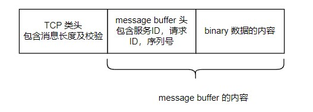

ERPC 将传统数据流的分析及处理的实现封装了起来，那么它的执行效率如何？

这里仅仅关注 ERPC 在收发方面的实现，而不深入整体架构。

依然是以[之前的 demo](http://kcmetercec.top/2021/12/18/framework_erpc_demo/)代码来分析，按照客户端和服务端的收发来顺藤摸瓜。

<!--more-->

# 客户端

## 客户端的创建

客户端创建的简单流程如下：

```cpp
auto transport = erpc_transport_tcp_init("127.0.0.1", 60901, false);
auto message_buffer_factory = erpc_mbf_dynamic_init();
erpc_client_init(transport, message_buffer_factory);
```

### transport

`transport`就是一个底层数据收发的具体实现。

在`erpc_transport_tcp_init`中，就是通过一个模板类来完成`transport`对象的创建及操作。

> 这里创建的是 TCP 对象，以及使用它来连接服务端。

查看`TCPTransport`类的实现，可以看到其继承关系如下图：

`Transport`是最顶层的基类，需要派生类来完成数据的收发操作。

而 `FramedTransport`则是完成了数据收发操作的框架实现，那么它的派生类的实现就会更加的简单，仅需要完成最基本的数据读写即可。

> 这便是`模板方法（Template Method）`的设计思想。

查看`FramedTransport`的收发步骤如下：

1. 接受的步骤
   - 使用`underlyingReceive`读取消息头，头中包含消息的长度以及 crc 校验值
   - 根据头中的消息长度，再次使用`underlyingReceive`读取消息内容
   - 对消息类型进行 crc 校验，看与头中的描述是否符合
2. 发送的步骤
   - 根据当前的消息，生成消息头，这里就填充了消息长度和 crc 校验值
   - 依次发送消息头，和消息内容

有了前面的框架，查看`TCPTransport`的收发步骤，就是简单的`read,write`操作了。

到这里，可以大胆假设，ERPC 框架会使用`Transport`基类指针，完成数据的收发。

### message buffer

`erpc_mbf_dynamic_init()`创建了一个用于存储消息的内存。

`MessageBuffer`类，则是对该申请的动态内存进行管理：

- 内存的地址
- 内存的容量
- 内存使用量
- 当前内存使用的指针

也可以大胆假设，ERPC 框架会对消息缓存进行多次读写，最后再调用底层`transport`实现。

> 因为这样的效率最高，相当于将 IO 缓存先准备好，然后再合并发送一样。 避免了频繁的系统 API 调用。

### client

`erpc_client_init()`完成了客户端对象的创建。

可以看到，它将前面创建的`transport`和`message buffer`都传递给了客户端，其大致步骤如下：

1. 为`transport`对象设定对应的`crc`算法，默认是`crc16`。
2. 将`transport`和`message buffer`都传递给客户端
3. 将`codec`的实例传递给客户端

这里的`Codec`类就是对`message buffer`操作的上层类，它将复杂的参数分解为了基本的数据然后依次写入`message buffer`中。

## 客户端的收发

接下来便是对`DemoHello`函数的调用：

```cpp
auto message = "Hello, this is client!\n";
binary_t cmd{(uint8_t*)message, (uint32_t)(std::strlen(message))};

binary_t *ret = DemoHello(&cmd);

std::cout << "Get message of server: " << ret->data << "\n";

if (ret->data) {
    erpc_free(ret->data);
}

if (ret) {
    erpc_free(ret);
}
```

那么就来看生成的`shim`代码是如何实现的：

```cpp
// DEMO interface DemoHello function client shim.
binary_t * DemoHello(const binary_t * val)
{
    erpc_status_t err = kErpcStatus_Success;

    binary_t * result = NULL;

    // Get a new request.
    RequestContext request = g_client->createRequest(false);

    // Encode the request.
    Codec * codec = request.getCodec();

    codec->startWriteMessage(kInvocationMessage, kDEMO_service_id, kDEMO_DemoHello_id, request.getSequence());

    write_binary_t_struct(codec, val);

    // Send message to server
    // Codec status is checked inside this function.
    g_client->performRequest(request);

    result = (binary_t *) erpc_malloc(sizeof(binary_t));
    if (result == NULL)
    {
        codec->updateStatus(kErpcStatus_MemoryError);
    }
    read_binary_t_struct(codec, result);

    err = codec->getStatus();

    // Dispose of the request.
    g_client->releaseRequest(request);

    // Invoke error handler callback function
    g_client->callErrorHandler(err, kDEMO_DemoHello_id);


    return result;
}
```

### createRequest

```cpp
RequestContext request = g_client->createRequest(false);
```

这里的`g_client`就是指向前面客户端对象的指针。

> 从这里也可以看出，目前的代码不支持创建多个 client

这个函数做了两件事：

1. 创建了一个 `codec` 和 `message buffer`，并将二者绑定起来
2. 创建一个`RequestContext`对象，主要用于返回创建的`codec`以及当前传输的序列号

这就是说，这是为传输申请的基本操作的内存，为后面做准备。

### startWriteMessage

`startWriteMessage`是将当前的消息类型、服务器 ID、请求 ID、发送序列号填充到了发送缓存中。

这就是 ERPC 的**消息内容包头**。

### write_binary_t_struct

这里就是写入这个函数参数的内容了，由于`binary_t`是 ERPC 的内置类型，所以`codec`便提供了对应的方法：

```cpp
void BasicCodec::writeBinary(uint32_t length, const uint8_t *value)
{
    // Write the blob length as a u32.
    write(length);

    writeData(value, length);
}
```

### performRequest

前面是对发送缓存做好了准备，那么下面就是执行具体的操作。

这里就包含了数据的读写，首先是数据的写：

```cpp
// Send invocation request to server.
if (request.getCodec()->isStatusOk() == true)
{
    err = m_transport->send(request.getCodec()->getBuffer());
    request.getCodec()->updateStatus(err);
}
```

果不其然，这里最终使用到了`transport`的发送方法。

> 通过虚指针指向`FramedTransport`的虚表，那么就调用对应的发送实现。进一步调用了`TCPTransport`的实现。

可以看到，当前的发送格式就是：

写完数据以后，再判断是否有返回，如果有返回则读取其内容：

```cpp
if (!request.isOneway())
{
    if (request.getCodec()->isStatusOk() == true)
    {
        // Receive reply.
        err = m_transport->receive(request.getCodec()->getBuffer());
        request.getCodec()->updateStatus(err);
    }

    // Check the reply.
    if (request.getCodec()->isStatusOk() == true)
    {
        verifyReply(request);
    }
}
```

可以看到，在接受完数据后，还要对数据进行校验。

而校验的方法，就是对消息头进行校验：

```cpp
// Extract the reply header.
request.getCodec()->startReadMessage(&msgType, &service, &requestNumber, &sequence);

if (request.getCodec()->isStatusOk() == true)
{
    // Verify that this is a reply to the request we just sent.
    if ((msgType != kReplyMessage) || (sequence != request.getSequence()))
    {
        request.getCodec()->updateStatus(kErpcStatus_ExpectedReply);
    }
}
```

这里就是对消息类型和序列号进行比对。

### read_binary_t_struct

`read_binary_t_struct`就是从消息缓存中读出内容。

### releaseRequest

这里就是将前面申请的消息缓存和`codec`进行释放。

# 服务端

观察服务端的实现，其实与客户端都是大同小异：

1. 创建服务端的`transport`，`message buffer`
2. 创建服务端并关联之前创建的对象
3. 服务端调用`transport`的读方法，获取数据
4. 根据获取消息的服务器ID得到服务器对象
5. 根据方法ID得到对应的调用方法
6. 根据方法的返回再次创建一个返回消息
7. 调用`transport`的发送方法将数据发送出去

# 总结

1. 传统的通过消息类型来调用对应处理函数的方式，在 ERPC 中则是通过方法 ID 来实现匹配。
2. 在发送消息先，都是先将内容在缓存中写好，才会调用底层的发送函数以提高效率。
3. 唯一对性能有较大影响的，就是对整个消息包的 crc 校验。

可以看到，根据不同情况可以将校验用其他简单的类来代替，便可以实现高效的通信。

总的来说，ERPC 是一个比较高效的通信框架。可以提高芯片间、多核、多进程间通信的开发效率。
如果没有因此而出现性能瓶颈，是完全没有必要来修改其核心代码的！
