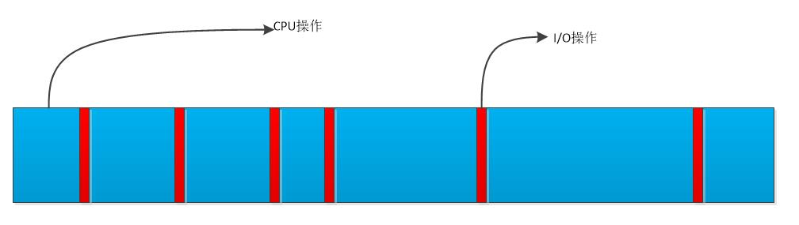

| kernel version | arch  |
| -------------- | ----- |
| v5.4.0         | arm32 |

<!--more-->


# 调度的目标

## 吞吐和响应

操作系统的主要目标是要在保持高的吞吐量的同时还要有高的响应速度。
- 吞吐量：整个系统在单位时间内做的有用功越多，吞吐量就越大
  + 进程的切换，代码的局部搬移都属于无用功
- 响应速度：当发生切换请求时，要以尽量快的完成切换，哪怕牺牲其他的任务为代价
  + 这其中就包含了进程环境切换，以及代码局部性处理的搬移

毫无疑问，这两个指标是互相矛盾的，只有选择一个侧重点。

在内核配置的 `Kernel Features -> Preemption Model` 中可以选择调度策略：
- No Forced Preemption(Server): 不能被抢占
- Voluntary Kernel Preemption(Desktop): kernel自愿让出
- Preemptible Kernle(Low-Latency Desktop):kernel可以被抢占(嵌入式系统一般都选择此项)

## CPU与I/O平衡

进程分为两种类型：
- I/O消耗型：更多的是I/O操作，对CPU的占用率低
  + 在I/O操作时，一般进程会阻塞的等待，CPU会被让出去
- CPU消耗型：更多的操作是在CPU的运算上

当以红蓝图来显示CPU的消耗如下图：



由此可以看出，在调度时，我们应该 **优先调度I/O消耗型** ，以让其尽快响应。
- I/O型的进程消耗时间绝大部分是在I/O设备上，所以其对CPU的性能要求并不高
  + ARM通过big.LITTLE架构来组成4小核和4大核，让小核来做I/O任务，大核做运算任务
    + 虽然小核处理能力弱，但其功耗低。而且从宏观上看其性能依然是8核的性能

# 调度算法

## 优先级

Linux的优先级从0~139，数值越低优先级越高。

- 在内核中，设置的值便与优先级一一对应
- 在用户空间中，设置的RT值通过公式 `99 - priority` 来计算真实的优先级
  + 所以在用户空间中，设置的值越小优先级反而越低

## 策略

其中0~99使用RT策略，100~139使用NICE策略。

- 关于内核、用户空间、top命令中的优先级显示，参看[此文章][https://mp.weixin.qq.com/s/44Gamu17Vkl77OGV2KkRmQ]

| 用户   |      内核 | Top         |
|--------|-----------|-------------|
| RT 50  | 49(99-RT) | -51(-1-RT)  |
| RT99   |         0 | rt          |
| NICE 5 |       125 | 25(20+NICE) |

### RT策略

RT策略分为 SCHED_FIFO 和 SCHED_RR:

- SCHED_FIFO:霸占CPU，除非自己主动让出
  + 在不同优先级的情况下，高优先级的对象先运行， **并且要等待此对象主动释放CPU，其他对象才能依次运行**
    + 在同优先级下，也是要等待主动释放，所以才称为FIFO(first in first out)策略
- SCHED_RR:高优先级的对象先运行，同等优先级轮转
  + 在不同优先级的情况下，高优先级的对象先运行， **并且要等待此对象主动释放CPU，其他对象才能依次运行**
    + 在同优先级下，对象轮转运行，所以才称为RR(round-robin)策略
      
可以看出，SCHED_FIFO和SCHED_RR在不同优先级的情况下策略是一样的，区别是在同等优先级的情况下。

### NICE策略

- 不同优先级下，高优先级 **可以抢占低优先级运行** ，但 **高优先级不会霸占CPU，而是会被调度器主动剥夺CPU使用权用于低优先级运行**
  + 虽然是轮转运行，但高优先级可以获得的时间片比低优先级要多
- nice值在 -20 ~ +19 对应优先级的 100 ~ 139
  + nice值越高其优先级越低，运行的时间片越少
  + 默认新建进程的Nice值为0

## 策略补丁

### RT门限

根据RT策略来讲如果 RT 里面的线程没有主动让出CPU，那 NICE 策略的进程就无法运行。
为此，linux 在 2.6 以后设置了 RT 门限，以设置 RT 策略的进程只能在一个周期里运行确定的时间。

在 `/proc/sys/kernel/` 下的 `sched_rt_period_us,sched_rt_runtime_us` 来设置 period和runtime。
- 也就是是在period的时间里，RT进程只能最多运行runtime时间。
- 可以通过命令 `chrt -f -a -p <prio> <pid>` 来改变进程的优先级

### CFS :完全公平调度(NICE策略优化)

- NICE策略下的进程都具有一个权重
``` c
  /*
   ,* Nice levels are multiplicative, with a gentle 10% change for every
   ,* nice level changed. I.e. when a CPU-bound task goes from nice 0 to
   ,* nice 1, it will get ~10% less CPU time than another CPU-bound task
   ,* that remained on nice 0.
   ,*
   ,* The "10% effect" is relative and cumulative: from _any_ nice level,
   ,* if you go up 1 level, it's -10% CPU usage, if you go down 1 level
   ,* it's +10% CPU usage. (to achieve that we use a multiplier of 1.25.
   ,* If a task goes up by ~10% and another task goes down by ~10% then
   ,* the relative distance between them is ~25%.)
   ,*/
  static const int prio_to_weight[40] = {
   /* -20 */     88761,     71755,     56483,     46273,     36291,
   /* -15 */     29154,     23254,     18705,     14949,     11916,
   /* -10 */      9548,      7620,      6100,      4904,      3906,
   /*  -5 */      3121,      2501,      1991,      1586,      1277,
   /*   0 */      1024,       820,       655,       526,       423,
   /*   5 */       335,       272,       215,       172,       137,
   /*  10 */       110,        87,        70,        56,        45,
   /*  15 */        36,        29,        23,        18,        15,
  };
```

- 虚拟运行时间通过公式计算： `vtime = ptime * 1024 / weight` (NICE值越大，权重越小，虚拟运行时间越高)
  + ptime : 实际运行时间
  + weight : 权重
  + 1024: 对应NICE为0的权重
- 将此虚拟运行时间挂在一颗红黑树上
- linux首先运行红黑树上值最小的节点，当节点运行其ptime会继续增加
  + 所有随着时间推移，该节点将不会是最小的节点

基于以上这个逻辑， **I/O型的ptime就比较小，所有它就会被优先调度** ，这就满足了优先运行I/O型进程的初衷。

- 可以通过 `renice -n <nice_value> -g <pid>` 来修改进程的nice值
- 可以通过 `nice <nice_value> <process>` 来启动一个进程并设置nice

## 设置API

| System Call              | Description          |
|--------------------------|----------------------|
| nice()                   | 设置进程的nice值     |
| sched_setscheduler()     | 设置调度策略         |
| sched_getscheduler()     | 获取调度策略         |
| sched_setparam()         | 设置RT策略优先级     |
| sched_getparam()         | 获取RT策略优先级     |
| sched_get_priority_max() | 得到RT策略最高优先级 |
| sched_get_priority_min() | 得到RT策略最低优先级 |
| sched_rr_get_interval()  | 得到RR策略时间片参数 |
| sched_setaffinity()      | 设置进程关系         |
| sched_getaffinity()      | 获取进程关系         |
| sched_yield()            | 主动让出CPU          |

在pthread库支持下，又封装了一次系统调用，通过 `pthread_attr_xxxx` 来实现设置。

# 负载均衡

## 概念

负载均衡是指：尽量让CPU各个核心都均摊处理任务，不能出现1核有难7核围观的情况。

- 每个核的处理调度都是以 `task_struct` 为基本单位的
- 核与核之间是通过 push 和 pull 操作来实现任务分配的，在实际运行时一个 `task_struct` 会在多个核间动态转移
  + 通过命令 `cat /proc/cpuinfo` 获取cpu相关具体信息
  + 也可以在 `top` 命令中按下 `1` 来获取cpu负载

## 关于运行时间

一个代码运行时间包括：
- real time: 用户所感受的运行时间
- user time: 代码在user space 运行时间
- kernel time: 代码陷入内核的运行时间，也就是计算通过系统调用所花费的时间

可以使用命令 `time <exec>` 来统计一个程序的时间，这个时间的计算依据是根据 **资源为单位** 计算的：
- 当一个程序 fork() 出一个进程，那么一共就有两个进程，对应两个 `task_struct` 的同时也对应两份资源，所以通过 time 来计算的real time 和 user time 是一致的
- 当一个程序 create() 出一个线程，那么一共对应两个 `task_struct` 但只有一份资源，那么在多核上跑时，通过 time 计算的 user time 是 real time 的两倍
- 在路径 `/proc/<pid>/task/` 下可以查看具体的 `task_struct` 信息

通过以下实例可以验证:
- 共享一份资源

``` c
#include <stdio.h>
#include <pthread.h>
#include <unistd.h>
#include <sys/syscall.h>

static pid_t gettid(void) {
  return syscall(__NR_gettid);
}

static void *thread_func(void *param) {
  printf("process pid = %d, thread pid = %d, thread_self = %d\n",
         getpid(), gettid(), pthread_self());
  while(1);
  return NULL;
}

int main(void) {
  pthread_t tid1, tid2;
  //pthread_self() 是用户空间库所创建的ID，内核不可见
  printf("process pid = %d, man thread pid = %d,man thread_self = %d\n",
         getpid(), gettid(), pthread_self());

  if(pthread_create(&tid1, NULL, thread_func, NULL) == -1) {
      perror("create thread failed:");
      return -1;
  }
  if(pthread_create(&tid1, NULL, thread_func, NULL) == -1) {
      perror("create thread failed:");
      return -1;
  }
  if(pthread_create(&tid1, NULL, thread_func, NULL) == -1) {
      perror("create thread failed:");
      return -1;
  }

  while(1);
  return 0;
}
```

- 每个 `task_struct` 对应一份资源

``` c
#include <stdio.h>
#include <unistd.h>
#include <sys/types.h>
#include <sys/wait.h>
#include <sys/prctl.h>
#include <signal.h>

void sig_handler(int num) {
    int status = 0;
    printf("get sig_handler = %d\n", num);

    if(waitpid(-1, &status, 0) == -1) {
        perror("wait signal failed!");
    }
    if(WIFEXITED(status)) {
        printf("The child was terminated normally!");
        printf("exit status = %d\n", WEXITSTATUS(status));
    }

    if(WIFSIGNALED(status)) {
        printf("The child was terminated by signal %d\n", WTERMSIG(status));
#ifdef WCOREDUMP
        if(WCOREDUMP(status)) {
            printf("The child produced a core dump!\n");
        }
#endif
    }

    if(WIFSTOPPED(status)) {
        printf("The chiild process was stopped by delivery of a signal %d\n",
                WSTOPSIG(status));
    }

    if(WIFCONTINUED(status)) {
        printf("The child process was resumed by delivery of SIGCONT\n");
    }
}

int main(void) {

    if(prctl(PR_SET_CHILD_SUBREAPER, 1) < 0) {
        perror("can not to be a subreaper!");
        return -1;
    }

    pid_t child_pid = fork();

    if(child_pid == -1) {
        perror("can not fork process:");
    } else if(child_pid == 0) {
        if(fork() == -1) {
            perror("can not fork process:");
        }
        while(1)
        {
            //printf("childl-> %d parent pid is %d\n",getpid(), getppid());
            //sleep(1);
        }
    } else {
        while(1) {
            //if(signal(SIGCHLD,sig_handler) == SIG_ERR)
            //{
                //perror("wait signal error:");
            //}
        }
    }

    return 0;
}
```

## 不同策略下的负载均衡

- RT策略下的负载均衡就按照其优先级依次分配到几个核心
- NICE策略下的负载均衡是在系统tick时动态分配到核心上
- 当一个核心空闲时，也会主动pull任务
- 当有上层调用，最终新建了 `task_struct` 后，内核也会根据CPU的负载情况主动分配到空闲核心上

## 主动修改负载

### API

``` c
int pthread_attr_setaffinity_np(pthread_attr_t *attr,
							  size_t cpusetsize, const cpu_set_t *cpuset);
int pthread_attr_getaffinity_np(const pthread_attr_t *attr,
							  size_t cpusetsize, cpu_set_t *cpuset);
int sched_setaffinity(pid_t pid, size_t cpusetsize,
					const cpu_set_t *mask);

int sched_getaffinity(pid_t pid, size_t cpusetsize,
					cpu_set_t *mask);
```

### shell

```shell
  #mask 即为CPU掩码，比如03(16进制)，代表运行于核心0和核心1
  taskset -a -p <mask> <pid>
```

## 中断负载均衡

除了 `task_struct` 任务会消耗CPU外，中断和软中断的执行也会消耗CPU，为了能够让多个核能够处理中断所以有时需要做负载均衡(比如将网卡多个fifo均衡到多个核上以提高吞吐量)。
- 其优先级为 中断 > 软中断 > 调度
- 通过命令 `cat /proc/interrupts` 可以查看硬中断全局概览
- 通过命令 `cat /proc/softirqs` 查看软中断概览
- 通过命令 `cat /proc/irq/<num>/smp_affinity` 查看对应 <num> 中断目前的均衡设置，然后以 `echo <mask> /proc/irq/<num>/smp_affinity` 来设置新的值

### 软中断负载均衡

当一个核中断发生后，其对应的软中断也必须由此核调用，但如果处理量太大则可以将此核的处理任务再次均分到其他核以快速处理提高吞吐量。
- 在网络上通过 `echo <mask> > /sys/class/net/eth1/queues/rx-0/rps_cpus` 来打开此功能

## cgroup

将 `task_struct` 进行分组为多个 group，Linux 再以 group 为单位对其进行均衡。

### 创建group操作流程

- 进入路径 `/sys/fs/cgroup/cpu`
- 新建组名文件 `mkdir <group name>`
  + 进入文件后发现有 `cgroup.procs` 用于存储组类成员的pid， `cpu.shares` 存储此组的权重
    + 修改权重可以修改此组的CPU占用率,越大占用率越高
- 使用 `echo <pid> > cgroup.procs` 加入成员到组

### 限制cpu使用率(配额)操作流程

- 基于上面的基础上，进入此组，先 `cat cpu.cfs_periods_us` 查看设置的 period 时间
- 然后 `echo <value> cpu.cfs_quota_us` 来设置其在period中的占空比
  + 当 `cfs_quota_us` 的值大于 `cfs_periods_us` 时，内核会分配多于的CPU来处理此任务

# 实时性

硬实时操作系统需要：无论当前系统在做什么事，调度器 **都可以在要求的时间内完成任务切换，这一切都是可以预期的。**

而Linux内核在中断，软中断，spinlock等情况下都无法完成调度切换，这个时间是无法预期的，所以其是一个软实时系统。
也就是说，系统只保证尽快的完成切换而已。

## 实时补丁

在 [][https://wiki.linuxfoundation.org/realtime/start] 给出了实时补丁（需要手动merge到代码中,然后在menuconfig 中配置）。

此补丁做了如下改动：
- 将中断和软中断都修改为线程
- 将不可调度锁修改为可调度锁

这样系统在任何时候都是可以调度的，以此来提高切换速度。

替代方案： rt thread + linux
