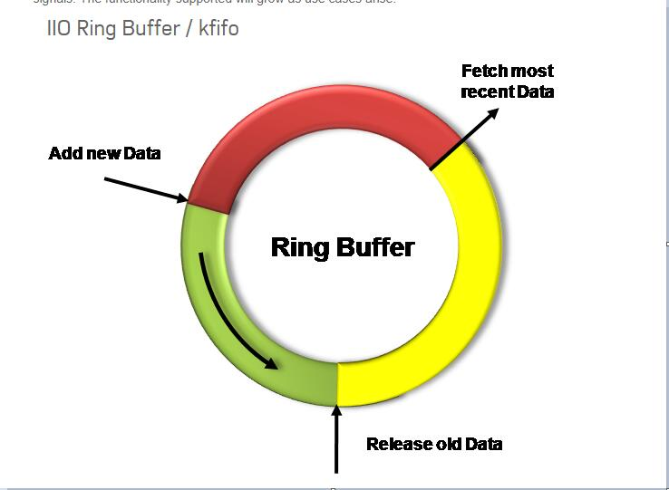
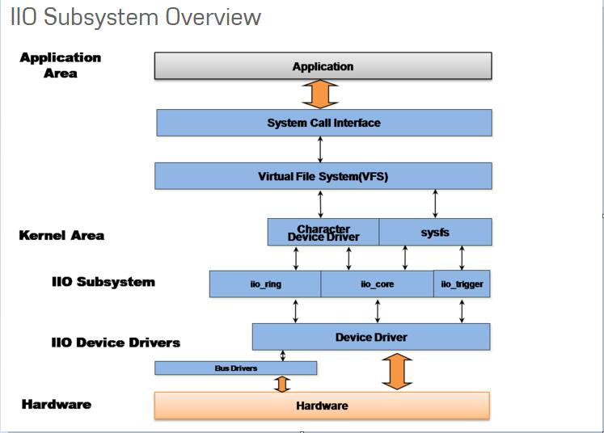

- kernel version : v6.1.x (lts)

参考网站: [Analog](https://wiki.analog.com/software/linux/docs/iio/iio)，[the-backbone-of-a-linux-industrial-i-o-driver](https://bootlin.com/blog/the-backbone-of-a-linux-industrial-i-o-driver/)

参考文档: `Documentation/iio/`     `Documentation/ABI/testing/sysfs-bus-iio*`

参考代码: `drivers/iio/**`

<!--more-->

# 概览

## 基本概念

IIO 子系统主要包含一些传感器，AD，DA 等器件的操作。
此系统的目的是为了填补hwmon 和 input 子系统之间的空隙。

一般此子系统下的设备是通过 SPI 或者 I2C 通信。

- hwmon(硬件监视) : 主要用于低速的设备监视
- input(输入子系统): 主要专注于与用户交互的设备(比如: 按键, 鼠标, 触摸等)

此子系统为这类设备提供了统一的函数接口和数据结构, 这些的具体实现位置是 `drivers/iio/industrialio-xxx.c`。

包含以下种类:

- ADC 以及 DAC
- 加速度计
- 陀螺仪
- 惯性测量仪
- 电容-数字转换器
- 气压计
- 颜色，光，距离传感器
- 温度传感器
- 磁力计
- 直接数字合成器(DDS)
- 锁相环(PLL)
- 可变/可编程增益放大器(VGA, PGA)
- FPGA外设
- 由DMA传输的高速串口或并口

包含以下功能:

- 设备的注册及处理操作.
- 可以通过 `sysfs` 来访问设备
- 事件机制: 将设备的一些事件发送给用户空间。
- 支持硬件环形队列
- ring buffer 存储事件，可以查看 buffer 填充状态

这些设备都有一些共同点：

- 在采集数据前，需要先对采集进行配置
- 部分设备还具备采集的触发机制
- 采集到的数据通过统一的机制发送给用户空间

### ring buffer

环形队列缓存，也就是先进先出缓存，从尾部写入，从头部读出。iio 使用 `kfifo` 来实现，以应对生产者消费者模型。



### event

可以认为是一些标识，以向用户表示一些状态发生了。

### trigger

一个引导信号，只要此信号产生后便会导致另一些处理程序的运行(类似于中断)，比如产生一个事件标志。

有如下几种 trigger：

- 数据已准备好
- GPIO触发
  + iio中使用 `iio-trig-gpio` 来完成此支持
- 内部周期性触发
  + iio中使用 `iio-trig-rtc` 来完成此支持
- 用户空间读取特定文件的触发
  + iio中使用 `iio-trig-sysfs` 来完成此支持

IIO中使用 trigger 来填充ring buffer。

### channel

一个通道，代表一种信号(数据)。比如气压计具有测量气压和温度的功能，则它具有一个气压通道和一个温度通道。

## 构架



根据设备驱动思想以及上面的说明可以知道需要以下软件的支持才能使用此子系统:

- 总线控制器驱动及设备树
- 芯片驱动(总线客户端驱动)及设备树
- IIO子系统的接口填充

一般来讲，`BUS Driver` 的驱动都有芯片厂商提供，用户需要：

- 在设备树中对应总线方式增加设备节点
- 实现设备驱动
- 在设备驱动中使用 iio 提供的接口将配置映射到字符设备和 `sysfs` 中

# 使用

在驱动正常的情况下，子系统会将设备映射到 :

1. `sysfs` 下，用于配置设备以及读取原始数据。
2. 字符设备，用于访问内核缓存事件等

## sysfs

路径位于: `/sys/bus/iio/devices/iio:deviceX` ，其目录下具有以下文件:

- name: 设备号
- dev: 设备节点(major:minor)
- device configuration attributes (sampling_frequency_avaliables)
- data channel access attributes(in_resistance_raw)
- buffer/，events/，trigger/，scan_elements/

通过读取 `iio:deviceX` 中的对应文件，其实会对应调用设备的回调函数

(比如读取 "xxx_raw" 文件, 会调用 read_raw 函数).

## character device

路径位于: `/dev/iio:deviceX`

# 分析

## 驱动编写步骤

驱动的编写步骤为:

1. 根据设备所属的通信总线，实现其总线驱动，以及对应的设备树节点。

2. 创建 `struct iio_dev` 结构（通过 `devm_iio_device_alloc`申请），并填充其内容
   
   - 设备名称
   
   - 私有数据填充
   
   - 设备 `iio_info` 结构体填充
   
   - 设备 `channel` 结构体填充
   
   - 设备所支持的模式
   
   - 如果设备只有特定的通道能用，则需要初始化`available_scan_masks`，在实际工作中，当前正在获取的通道会在`active_scan_mask`中表示
   
   - 初始化设备的每个通道的类型，比如（`IIO_VOLTAGE`，`IIO_TEMPERATURE`）

3. 使用 `devm_iio_device_register` 将此设备注册至IIO框架.

4. 完成对应的卸载功能函数

## iio_dev

`iio_dev` 是最主要的结构体，用于设备驱动，主要提供一些信息和操作函数:

- 该设备有多少通道可用
- 此设置支持哪些操作模式
- 此驱动支持的一些回调函数

```c
/**
 * @brief struct iio_dev - industrial I/O device
 * @param modes: 此设备支持的模式
 * @param dev: 设备结构体，说明 iio_dev 继承自 struct device
 * @param buffer: 当前设备的数据缓存
 * @param scan_bytes: 被捕获的字节数
 * @param mlock: 用于互斥操作的锁
 * @param available_scan_masks: 允许的通道 mask
 * @param masklength: mask长度
 * @param active_scan_mask: 缓存所需要的mask
 * @param scan_timestamp: 缓存与时间戳
 * @param trig: 当前设备的触发设置
 * @param pollfunc: 触发被接收到后, 用于运行的功能
 * @param pollfunc_event: 当事件触发被接收到后, 运行
 * @param channels: 对通道的定义
 * @param num_channels: 定义的通道数
 * @param name: 设备的名称
 * @param label : 标识设备的唯一名称
 * @param info: 驱动的回调和固定信息
 * @param setup_ops: 在缓存使能和关闭时的回调
 * @param priv: 每个驱动的私有数据结构的指针，通过 iio_priv 获取
 */
struct iio_dev {
    int                modes;
    struct device            dev;

    struct iio_buffer        *buffer;
    int                scan_bytes;
    struct mutex            mlock;

    const unsigned long        *available_scan_masks;
    unsigned            masklength;
    const unsigned long        *active_scan_mask;
    bool                scan_timestamp;
    struct iio_trigger        *trig;
    struct iio_poll_func        *pollfunc;
    struct iio_poll_func        *pollfunc_event;

    struct iio_chan_spec const    *channels;
    int                num_channels;

    const char            *name;
    const char            *label;
    const struct iio_info        *info;
    const struct iio_buffer_setup_ops    *setup_ops;

    void                *priv;
};

/**
 * @brief chardev interface for an event lines
 * @param wait : 阻塞读取队列
 * @param det_events: 已经检测到的事件链表
 * @param dev_attr_list: 属性链表
 * @param flags:相应的文件操作标记
 * @param group: 属性组
 */
struct iio_event_interface{
        wait_queue_head_t wait;
        DECLARE_KFIFO(det_events, struct iio_event_data, 16);
        struct list_head dev_attr_list;
        unsigend long flags;
        struct attribute_group group;
        struct mutex read_lock;
};
```

## 设备的通道

通道的描述用 `channel` 结构体来完成：

```c
  /**
   * @brief 定义一个通道
   * @param info_mask_separate : 对于当前通道，在 sysfs 中的展现信息 
   * @param scan_type : 指定当前通道的数据类型
   */
struct iio_chan_spec {
    enum iio_chan_type    type;
    int            channel;
    int            channel2;
    unsigned long        address;
    int            scan_index;
    struct {
        char    sign;
        u8    realbits;
        u8    storagebits;
        u8    shift;
        u8    repeat;
        enum iio_endian endianness;
    } scan_type;
    long            info_mask_separate;
    long            info_mask_separate_available;
    long            info_mask_shared_by_type;
    long            info_mask_shared_by_type_available;
    long            info_mask_shared_by_dir;
    long            info_mask_shared_by_dir_available;
    long            info_mask_shared_by_all;
    long            info_mask_shared_by_all_available;
    const struct iio_event_spec *event_spec;
    unsigned int        num_event_specs;
    const struct iio_chan_spec_ext_info *ext_info;
    const char        *extend_name;
    const char        *datasheet_name;
    unsigned        modified:1;
    unsigned        indexed:1;
    unsigned        output:1;
    unsigned        differential:1;
};
// 这里初始化了 ms5611 的气压和温度通道
static const struct iio_chan_spec ms5611_channels[] = {
    {
        .type = IIO_PRESSURE,
        .info_mask_separate = BIT(IIO_CHAN_INFO_PROCESSED) |
            BIT(IIO_CHAN_INFO_SCALE) |
            BIT(IIO_CHAN_INFO_OVERSAMPLING_RATIO),
        .scan_index = 0,
        .scan_type = {
            .sign = 's',
            .realbits = 32,
            .storagebits = 32,
            .endianness = IIO_CPU,
        },
    },
    {
        .type = IIO_TEMP,
        .info_mask_separate = BIT(IIO_CHAN_INFO_PROCESSED) |
            BIT(IIO_CHAN_INFO_SCALE) |
            BIT(IIO_CHAN_INFO_OVERSAMPLING_RATIO),
        .scan_index = 1,
        .scan_type = {
            .sign = 's',
            .realbits = 32,
            .storagebits = 32,
            .endianness = IIO_CPU,
        },
    },
    IIO_CHAN_SOFT_TIMESTAMP(2),
};
```

当具有多个通道的时候, 有两种方式来生成不同的通道:

- 设置 `.modified` 值为1, 对应的设置 `.channel2` 来区分不同的通道.

```c
static const struct iio_chan_spec light_channels[]=
{
        {
                .type = IIO_INTENSITY,
                .modified = 1,
                .channel2 = IIO_MOD_LIGHT_IR,
                .info_mask_separate = BIT(IIO_CHAN_INFO_RAW),
                .info_mask_shared_by_all = BIT(IIO_CHAN_INFO_SAMP_FREQ),
        }.
        {
                .type = IIO_INTENSITY,
                .modified = 1,
                .channel2 = IIO_MOD_LIGHT_BOTH,
                .info_mask_separate = BIT(IIO_CHAN_INFO_RAW),
                .info_mask_shared_by_all = BIT(IIO_CHAN_INFO_SAMP_FREQ),
        }.
        {
                .type = IIO_LIGHT,
                .info_mask_separate = BIT(IIO_CHAN_INFO_PROCESSED),
                .info_mask_shared_by_all = BIT(IIO_CHAN_INFO_SAMP_FREQ),
        }.
};
```

使用上面的配置,得到的 `sysfs` 文件为:

```shell
 /sys/bus/iio/device/iio:deviceX/in_intensity_ir_raw 

 /sys/bus/iio/device/iio:deviceX/in_intensity_both_raw

 /sys/bus/iio/device/iio:deviceX/in_illuminance_input 

 /sys/bus/iio/device/iio:deviceX/sampling_frequency 
```

- 设置 `.indexed` 值为1, 对应的设置 `.channel` 来区分不同的通道

```c
static const struct iio_chan_spec light_channels[] =
{
        {
                .type = IIO_VOLTAGE,
                .indexed = 1,
                .channel = 0,
                .info_mask_separate = BIT(IIO_CHAN_INFO_RAW),
        },
        {
                .type = IIO_VOLTAGE,
                .indexed = 1,
                .channel = 1,
                .info_mask_separate = BIT(IIO_CHAN_INFO_RAW),
        },
};
```

使用上面的配置, 得到的 `sysfs` 文件为:

```shell
 /sys/bus/iio/devices/iio:deviceX/in_voltage0_raw,

 /sys/bus/iio/devices/iio:deviceX/in_voltage1_raw,
```

## 缩放因子

当在`sysfs`中读取 raw 或 scale 的值时，内核回调函数`int (*read_raw)(struct iio_dev *indio_dev, struct iio_chan_spec const *chan, int *val, int *val2, long mask)`将会被调用。

对于`info_mask_separate`是`IIO_CHAN_INFO_RAW`的通道，就会直接返回原始数据。而对于`IIO_CHAN_INFO_SCALE`的通道，会返回原始数据和缩放因子。

IIO 驱动的内核则会除以该缩放因子，得到最终的值返回给用户空间。

## 采样

采样的值可以简单粗暴的通过读`/sys/bus/devices/iio:device/in_<type><index>_raw`，对应到驱动的`read_raw()`回调来完成。这种读取就是单次的读数据。

也可以通过触发的方式，来获取数据。

## 设备缓存

当使用缓存时, 会在 `sysfs` 下建立文件夹 `/sys/bus/iio/device/iio:deviceX/buffer/` , 此目录下具有文件:

- length : 缓存的大小
- enable : 使能 buffer 捕捉事件

一个通道读取原始数据以后, 放在缓存中, 称为 `scan element`, 此属性在 `iio_chan_spec` 的 `scan_type` 中设置.

```c
static struct iio_chan_spec accel_channels[]=
{
        .type = IIO_ACCEL,
        .modified = 1,
        .channel2 = IIO_MOD_X,
        /// 指定此通道的优先级,越低优先级越高, 为 -1 代表不支持放入buffer
        .scan_index = 0,
        .scan_type = {
                .sign = 's',
                .realbits = 13,
                .storgebits = 16,
                .shift = 4,
                .endianness = IIO_LE,
        },
};
```

设置 `scan element` 的对应文件位于 `sys/bus/iio/device/iio:deviceX/scan_elements/`, 具有以下文件:

- enable : 用于使能一个通道, 此值不为 0 时则存入捕获的结果
- type : 用于表述数据的类型,格式为 `[be/le]:[s/u]bits/storagebitsRepeat[>>shift]`.
  + be -> 大端模式, le -> 小端模式
  + s -> 有符号型, u -> 无符号型
  + bits -> 有效数据位数
  + storagebits -> 一个数据以多少位来表示
  + repeat -> 指定数据重复次数
  + shift -> 数据 **需要偏移的位数以得到正确的数据**.

```c
/**
 * @brief buffer 用于存储接收到的数据, 用户通过 /dev/iio:deviceX 来读取即可
 */
struct iio_buffer{
        int                         length;
        int                         bytes_per_datum;
        struct attribute_group      *scan_el_attrs;
        long                        *scan_mask;
        bool                        scan_timestamp;
        const struct iio_buffer_access_funcs *access;
        struct list_head            scan_el_dev_attr_list;
        struct attribute_group      buffer_group;
        struct attribute_group      scan_el_group;
        wait_queue_head_t           pollq;
        bool                        stufftoread;
        const struct attribute      *attrs;
        struct list_head            demux_list;
        void                        *demux_bounce;
        struct list_head            buffer_list;
        struct kref                 ref;
        unsigned int                waitermark;
};
```

## 设备触发

通过触发来存储数据，比用轮询的方式更加科学。

触发对应的 `sysfs` 文件夹有两个位置:

- `/sys/bus/iio/devices/triggerY` : 当 IIO 触发使用了注册函数后, 此文件夹便建立了, 具有以下两个属性文件。
  + name --> 触发的名称
  + sampling_frequency --> 基于定时器的触发， 具有扫瞄频率
- `/sys/bus/iio/devices/iio:deviceX/trigger/` : 当一个设备支持触发时, 此文件夹便出现。为了将设备与触发连接起来， 在 `current_trigger` 文件中写入触发名称即可。

```c
struct iio_trigger {
    const struct iio_trigger_ops    *ops;
    struct module            *owner;
    int                id;
    const char            *name;
    struct device            dev;

    struct list_head        list;
    struct list_head        alloc_list;
    atomic_t            use_count;

    struct irq_chip            subirq_chip;
    int                subirq_base;

    struct iio_subirq subirqs[CONFIG_IIO_CONSUMERS_PER_TRIGGER];
    unsigned long pool[BITS_TO_LONGS(CONFIG_IIO_CONSUMERS_PER_TRIGGER)];
    struct mutex            pool_lock;
    bool                attached_own_device;
    struct work_struct        reenable_work;
};

static const struct iio_trigger_ops zpa2326_trigger_ops = {
    .set_trigger_state = zpa2326_set_trigger_state,
};

static int zpa2326_init_managed_trigger(struct device          *parent,
                    struct iio_dev         *indio_dev,
                    struct zpa2326_private *private,
                    int                     irq)
{
    struct iio_trigger *trigger;
    int                 ret;

    if (irq <= 0)
        return 0;

    trigger = devm_iio_trigger_alloc(parent, "%s-dev%d",
                     indio_dev->name,
                     iio_device_id(indio_dev));
    if (!trigger)
        return -ENOMEM;

    /* Basic setup. */
    trigger->ops = &zpa2326_trigger_ops;

    private->trigger = trigger;

    /* Register to triggers space. */
    ret = devm_iio_trigger_register(parent, trigger);
    if (ret)
        dev_err(parent, "failed to register hardware trigger (%d)",
            ret);

    return ret;
}
```

## 触发与缓存连接

```c
/**
 ,* @note 用于在 buffer 在使能和失能前后的操作
 ,*/
static const struct iio_buffer_setup_ops zpa2326_buffer_setup_ops = {
	.preenable   = zpa2326_preenable_buffer,
	.postenable  = zpa2326_postenable_buffer,
	.postdisable = zpa2326_postdisable_buffer
};


/**
 ,* @note 用于中断的底半处理, 用于将设备的数据存入缓存, 并且还有此数据的时间标记
 ,*/
static irqreturn_t zpa2326_trigger_handler(int irq, void *data)
{
	struct iio_dev         *indio_dev = ((struct iio_poll_func *)
					     data)->indio_dev;
	struct zpa2326_private *priv = iio_priv(indio_dev);
	bool                    cont;

	/*
	 * We have been dispatched, meaning we are in triggered buffer mode.
	 * Using our own internal trigger implies we are currently in continuous
	 * hardware sampling mode.
	 */
	cont = iio_trigger_using_own(indio_dev);

	if (!cont) {
		/* On demand sampling : start a one shot cycle. */
		if (zpa2326_start_oneshot(indio_dev))
			goto out;

		/* Wait for sampling cycle to complete. */
		if (priv->irq <= 0) {
			/* No interrupt available: poll for completion. */
			if (zpa2326_poll_oneshot_completion(indio_dev))
				goto out;

			/* Only timestamp sample once it is ready. */
			priv->timestamp = iio_get_time_ns(indio_dev);
		} else {
			/* Interrupt handlers will timestamp for us. */
			if (zpa2326_wait_oneshot_completion(indio_dev, priv))
				goto out;
		}
	}

	/* Enqueue to IIO buffer / userspace. */
	zpa2326_fill_sample_buffer(indio_dev, priv);

out:
	if (!cont)
		/* Don't switch to low power if sampling continuously. */
		zpa2326_sleep(indio_dev);

	/* Inform attached trigger we are done. */
	iio_trigger_notify_done(indio_dev->trig);

	return IRQ_HANDLED;
}
/*setup triggered buffer, usually in probe function */
err = devm_iio_triggered_buffer_setup(parent, indio_dev, NULL,
					      zpa2326_trigger_handler,
					      &zpa2326_buffer_setup_ops)
```

## 设备的具体操作

设备的操作便是接收一个触发信号, 然后调用自己定义的回调函数, 回调函数通过 `iio_info` 来提供给框架.

```c
/**
 ,* @brief 关于设备的信息
 ,* @param read_raw: 从设备获取一个值, mask 用于指明读取那个数值, 函数返回值的类型
 ,* @param read_raw_multi: 读取一些值
 ,* @param write_raw: 写一个值
 ,* @param write_raw_get_fmt: 查询可以写入的格式
 ,* @param read_event_config: 查看是否事件已经使能
 ,* @param write_event_config: 设置事件使能
 ,* @param read_event_value: 读取一个事件的配置
 ,* @param write_event_value: 写入一个事件的配置
 ,* @param validate_trigger: 确认有触发产生
 ,* @param update_scan_mode: 配置设备和扫描缓存
 ,* @param debugfs_reg_access: 读写设备的寄存器值
 ,* @param of_xlate: 获取对应通道的索引
 ,* @param 
 ,*/
struct iio_info{
        struct module                   *driver_module;
        struct attribute_group          *event_attrs;
        const struct attribute_group    *attrs;

        int (*read_raw)(struct iio_dev *indio_dev,
                        struct iio_chan_spec const *chan,
                        int *val,
                        int *val2,
                        long mask);
        int (*read_raw_multi)(struct iio_dev *indio_dev,
                              struct iio_chan_spec const *chan,
                              int max_len,
                              int *vals,
                              int *val_len,
                              long mask);
        int(*write_raw)(struct iio_dev *indio_dev,
                        struct iio_chan_spec const *chan,
                        int val,
                        int val2,
                        long mask);
        int(*write_raw_get_fmt)(struct iio_dev *indio_dev,
                                struct iio_chan_spec const *chan,
                                long mask);
        int(*read_event_config)(struct iio_dev *indio_dev,
                                const struct iio_chan_spec *chan,
                                enum iio_event_type type,
                                enum iio_event_direction dir);
        int(*write_event_config)(struct iio_dev *indio_dev,
                                 const struct iio_chan_spec *chan,
                                 enum iio_event_type type,
                                 enum iio_event_direction dir,
                                 int state);

        int(*read_event_value)(struct iio_dev *indio_dev,
                                 const struct iio_chan_spec *chan,
                                 enum iio_event_type type,
                                 enum iio_event_direction dir,
                                 enum iio_event_info info,
                               int *val, int *val2);
        int(*write_event_value)(struct iio_dev *indio_dev,
                                 const struct iio_chan_spec *chan,
                                 enum iio_event_type type,
                                 enum iio_event_direction dir,
                                 enum iio_event_info info,
                               int *val, int *val2);
        int(*validate_trigger)(struct iio_dev *indio_dev,
                               struct iio_trigger *trig);
        int(*update_scan_mode)(struct iio_dev *indio_dev,
                               const unsigned long *scan_mask);
        int(*debugfs_reg_access)(struct iio_dev *indio_dev,
                                 unsigned reg, unsigned writeval,
                                 unsigned *readval);
        int(*of_xlate)(struct iio_dev *indio_dev,
                       const struct of_phandle_args *iiospec);
        int(*hwfifo_set_watermark)(struct iio_dev *indio_dev, unsigned val);
        int (*hwfifo_flush_to_buffer)(struct iio_dev *indio_dev, unsigned count);

};

static const sturct iio_info ms5611_info = 
{
    .read_raw = &ms5611_read_raw,
    .driver_module = THIS_MODULE,
};
```

## 设备模式

在 `linux/iio/iio.h` 中列出了设备所支持的模式:

```shell
#+BEGIN_SRC c
//设备可用于软件触发
#define INDIO_DIRECT_MODE          0X01
//设备可用于硬件触发
#define INDIO_BUFFER_TRIGGERED     0X02
//设备使用软件缓存
#define INDIO_BUFFER_SOFTWARE      0X04
//设备使用硬件缓存
#define INDIO_BUFFER_HARDWARE      0X08
//设备使用事件触发机制
#define INDIO_EVENT_TEIGGERED      0X10

#define INDIO_ALL_BUFFER_MODES \
        (INDIO_BUFFER_TRIGGERED | INDIO_BUFFER_HARDWARE | INDIO_BUFFER_SOFTWARE)
```

## 申请一个设备

申请设备时,就需要申请一个 `iio_dev` 结构并存放其私有数据, 用于代表此设备,然后调用注册函数.

```c
/**
 ,* @brief 申请并管理IIO申请的设备内存(可以在驱动退出时自动卸载)
 ,* @param sizeof_priv: 私有数据的大小
 ,*/
struct iio_dev *devm_iio_device_alloc(struct device *dev, int sizeof_priv);

/**
 ,* @brief 注册设备到IIO子系统中
 ,*/
int devm_iio_device_register(struct device *dev, struct iio_dev *indio_dev);

/**
 ,* @brief 示例
 ,*/
static int ms5611_i2c_probe(struct i2c_client *client, const struct i2c_device_id *id)
{
    struct ms5611_state *st;
    struct iio_dev *indio_dev;

    ........

    indio_dev = devm_iio_device_alloc(&client->dev, sizeof(*st));
    if(!indio_dev)
            return -ENOMEM;
    st = iio_priv(indio_dev);
    st->reset = ms5611_i2c_reset;
    st->read_prom_word = ms5611_i2c_read_prom_word;
    .....
    st->client = client;

    return ms5611_probe(indio_dev, &client->dev, id->driver_data);
}

int ms5611_probe(struct iio_dev *indio_dev, struct device *dev, int type)
{
        int ret;
        struct ms5611_state *st = iio_priv(indio_dev);

        st->chip_info = &chip_info_tbl[type];
        indio_dev->dev.parent = dev;

        .......
        indio_dev->modes = INDIO_DIRECT_MODE;
        indio_dev->channels = &ms5611_channels;
        indio_dev->num_channels = ARRAY_SIZE(ms5611_channels);
        indio_dev->info = &ms5611_info;

        ret = ms5611_init(indio_dev);
        if(ret < 0)
                return ret;
        return devm_iio_device_register(dev, indio_dev);
}
```
