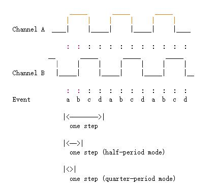

- kernel 版本：v5.4
- 参考文档： /Documentation/input/devices/rotary-encoder.rst

分析 Linux kernel 中编码器驱动的实现，从而应用到单片机上。

> 此处所指的旋转编码器，是用手拧的那种编码器。

<!--more-->

# 波形与判断



驱动文档上指出了编码器的一个完整周期的正转的波形输出，可以理解为 A 超前 B 90°，当反转时就是 A 滞后 B 90°。

## 简易判断方法

以前做单片机的时候，用的是简易判断方法：

1. 配置 AB 管脚为输入模式，且仅 A 为上升沿触发中断
2. 当进入中断后进行一段时间的循环判断(这个时间要先根据示波器观察编码器周期长短来确定)
   + 判断逻辑为：只要在这段时间 A 电平为低则退出处理函数，判断为误触发
3. 在中断中读取 AB 的电平，当 A 和 B 都为高时代表正转，当 A 为高 B 为低时代表反转

以上这种判断方式有以下缺陷：

1. 由于在中断中还需要一段循环判断，导致占用中断时间过长，系统吞吐量会下降
2. 判断逻辑只判断了半个周期，并没有判断一个完整的周期，所以误触发的概率相对较大
3. 延时的时间根据编码器而不同，无法通用

## 驱动中的判断逻辑

驱动则是利用了 A 和 B 的边沿触发中断，且判断了整个周期。

根据 AB 波形时序可以得出其组合值为：

- 正转：0b10(0x2) -> 0b11(0x3) -> 0b01(0x1) -> 0b00(0x0)
- 反转：0b01(0x1) -> 0b11(0x3) -> 0b10(0x2) -> 0b00(0x0) 

驱动的逻辑为：

- 将 AB 脚都配置为双边沿触发
- 进入中断以后驱动先后读取 AB 的值，A 放在第1位与 B 的值或。
- 根据上面的正反转做成状态机，当进入到状态 0b00 时确认已完成一个周期，即可向上层反应方向

> 有个疑问：这里为什么没有消抖处理，是默认硬件上以并电容的方式处理的吗？

具体流程看代码（位于`/drivers/input/misc/rotary_encoder.c`）

```c
static unsigned int rotary_encoder_get_state(struct rotary_encoder *encoder)
{
    int i;
    unsigned int ret = 0;

    for (i = 0; i < encoder->gpios->ndescs; ++i) {
        int val = gpiod_get_value_cansleep(encoder->gpios->desc[i]);

        /* convert from gray encoding to normal */
        if (encoder->encoding == ROTENC_GRAY && ret & 1)
            val = !val;

        // 将 IO 口逻辑电平组合为数值
        ret = ret << 1 | val;
    }

    return ret & 3;
}

static void rotary_encoder_report_event(struct rotary_encoder *encoder)
{
    if (encoder->relative_axis) {
        // 如果是增量式编码器，则直接返回方向
        input_report_rel(encoder->input,
                 encoder->axis, encoder->dir);
    } else {
        // 如果是绝对式编码器，则计算绝对位置
        unsigned int pos = encoder->pos;

        if (encoder->dir < 0) {
            /* turning counter-clockwise */
            if (encoder->rollover)
                pos += encoder->steps;
            if (pos)
                pos--;
        } else {
            /* turning clockwise */
            if (encoder->rollover || pos < encoder->steps)
                pos++;
        }

        if (encoder->rollover)
            pos %= encoder->steps;

        encoder->pos = pos;
        input_report_abs(encoder->input, encoder->axis, encoder->pos);
    }

    input_sync(encoder->input);
}

static irqreturn_t rotary_encoder_irq(int irq, void *dev_id)
{
    struct rotary_encoder *encoder = dev_id;
    unsigned int state;

    mutex_lock(&encoder->access_mutex);

    state = rotary_encoder_get_state(encoder);

    switch (state) {
    case 0x0:
        // 如果进入 0x0 状态且之前已进入过 0x2 状态，则发送结果
        // 如果先进入 0x2 然后立马进入 0x0，则是反转
        if (encoder->armed) {
            rotary_encoder_report_event(encoder);
            encoder->armed = false;
        }
        break;

    case 0x1:
    case 0x3:
        // 如果先进入 0x2 再进入 0x3，则是正转
        // 如果先进入 0x2 再进入 0x1，则是反转
        if (encoder->armed)
            encoder->dir = 2 - state;
        break;

    case 0x2:
        encoder->armed = true;
        break;
    }

    mutex_unlock(&encoder->access_mutex);

    return IRQ_HANDLED;
}
```

从上面代码逻辑就可以看出，主要是根据进入 0x2 状态之后再进入的状态来判断正反转。

# 驱动的使用

## 使用前的确认

  在使用此驱动前需要确保：

1. GPIO驱动已经正确加载
2. GPIO相关中断控制器能正常工作且能接收双边沿触发

## 配置设备树

参考文档 `Documentation/devicetree/bindings/input/rotary-encoder.txt` 可以知道其典型设备树为：

```shell
rotary@0 {
    compatible = "rotary-encoder";
    gpios = <&gpio 19 1>, <&gpio 20 0>; /* GPIO19 is inverted */
    linux,axis = <0>; /* REL_X */
    rotary-encoder,encoding = "gray";
    rotary-encoder,relative-axis;
};
```

## 加入编译选项

位于 `Device Dervers->Input device support->Generic input layer -> Miscellaneous devices ::Rotary encoders connected to GPIO pins`

## 用户空间使用

```c
#include <sys/file.h>
#include <stdio.h>
#include <string.h>
#include <linux/input.h>

int main(int argc, char *argv[]) {
    struct input_event ev;
    int fd, rd;

    if ((fd = open ("/dev/input/event0", O_RDONLY|O_NONBLOCK)) == -1) {
        perror("Can not open device!");
        return -1;
    }

    while (1) {
        memset((void*)&ev, 0, sizeof(ev));

        if ((rd = read(fd, (void*)&ev, sizeof(ev))) > 0) {
            printf("value: %d\n", ev.value);
        }
    }

    return 0;
}
```

通过上面程序验证可以发现event只返回 1，-1 两个方向，而无法判断出速度。
而关于速度的判断，可以通过状态机的方式在应用代码中实现(在一定时间内判断单一方向上数据增加的个数来区分速度)。

- 在用户空间通过 poll 来查询编码器输入，并计数
- 在每次 poll **第一次触发** 开始后，通过信号量唤醒另一个线程计算在一段时间内的计数值

**需要注意的是**： 编码器输出一般会并一个电容，一般在 1nF～10nF，具体的取值以示波器观察波形是否失真为准。

# 实际应用的调整

如果编码器是无源的，那触发引脚则需要接入上拉电阻，那么这个时候周期时序就会发生变化：

- 正转：0b01(0x1) -> 0b00(0x0) -> 0b10(0x2) -> 0b11(0x3)
- 反转：0b10(0x2) -> 0b00(0x0) -> 0b01(0x1) -> 0b11(0x3)

这种情况下，就需要：

1. 以 0x3 作为最后的发送条件，而 0x0 作为`armed`标记触发点
2. 如果进入 0x0 后进入 0x2，则为正转。如果进入 0x0 后进入 0x1，则为反转

总之都是对周期状态进行正反判断，同样的半周期和四分之一周期都可以用类似的方式（状态机）来完成判断。
