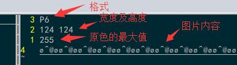
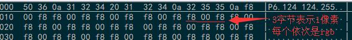

整理logo显示的理论。

<!--more-->

# logo的格式

## pnm(portable any map)

查看网上的说明，一般我们需要将事先准备好的 logo 图片转换为 pnm 格式，比如:

```shell
  bmptopnm logo.bmp > logo.pnm
```

工具 `bmptopnm` 会根据bmp的分辨率转换为对应格式:

- 当只有黑白色时，输出PBM格式
- 当有黑白灰时，输出PGM格式
- 其他情况会输出PPM格式

**注意:** 部分bmp图片含有带透明的 delta 部分，此时 `bmptopnm` 将会报错。

三种格式其实都大同小异，以可以显示彩色的ppm(Portable Pixel Map)为格式说明：

1. 开头是ASCII码 `P6` 以表示文件格式为 ppm，后面一般跟一个换行符
2. 接着下一行是ASCII码表示的宽度和高度，中间以空白分隔，行尾加换行符
3. 接着下一行是 **原色的最大值** ，以ASCII表示，最大为65536, 行尾加换行符
4. 接着便是图像内容，以 **二进制表示** ， 从左到右，从上到下。
   - 每一个像素以rgb表示，其中的三原色分别占1或2字节

如下图所示:





## 颜色压缩和ASCII输出

```shell
  pnmquant 224 logo.pnm > logo224.pnm
```

此工具检查原始的pnm文件中颜色的种数，然后将其进行量化为仅有224种颜色的格式。

- 为什么会是224种颜色? 猜测这个是linux内部存储配色表的大小限制

```shell
  pnmtoplainpnm logo224.pnm > logo_linux_clut224.ppm
```

此工具将 224 种色的 pnm 图片转换为简易的 `plainppm` 。

plainppm格式比原先的ppm格式更易于阅读，不同之处在于:

- 一个文件仅表示一张图片
- 图片标识由 `P6` 变为 `P3` 
- 以ASCII的形式显示图片的内容（原来是二进制形式）
- 每个像素之间以空格分隔，一行不超过70个ASCII字符

如下:

```shell
  P3
  # feep.ppm
  4 4
  15
   0  0  0    0  0  0    0  0  0   15  0 15
   0  0  0    0 15  7    0  0  0    0  0  0
   0  0  0    0  0  0    0 15  7    0  0  0
  15  0 15    0  0  0    0  0  0    0  0  0
```

# logo的生成

前面生成的 ppm 文件将会放在 `drivers/video/logo/` 文件夹下，此Makefile会在构建过程中调用工具 `pnmtologo` 进行转换。

工具源码位于 `scripts/pnmtologo.c` ，它会将生成对应名称的 c 文件，通过查看 build 目录下的文件可以看到输出文件格式。

- 以伪彩色的形式保存图片，包含颜色索引、配色表、图片描述结构体。
- 索引中的值减去32就为颜色表中其对应的颜色。
  - **对于224色来说，颜色表每3字节代表一个像素。**

此源码中有宏:

```c
  #define MAX_LINUX_LOGO_COLORS 224
```

这也佐证了为什么 linux 会限制使用 224 色作为 logo。

- 如果要增加色彩的分辨率，增加此值即可。

# logo的显示

## 准备

在进行logo显示前，需要 frambuffer 驱动加载且液晶已完成初始化。

选中以下选项:

```shell
Device Drivers -> Graphics support -> Bootup logo -> Standard 224-color Linux logo
```

## 刷图

进行刷新logo的核心函数就是 `fb_prepare_logo, fb_show_logo_line` .

按照上面编译后的格式，只需要通过索引减去32取颜色显示即可，但linux要兼容众多设备，需要考虑更多情况。
如果是为了简便，完全可以在使用 `fb_find_logo` 之后，便自己实现缓存的填充即可。
