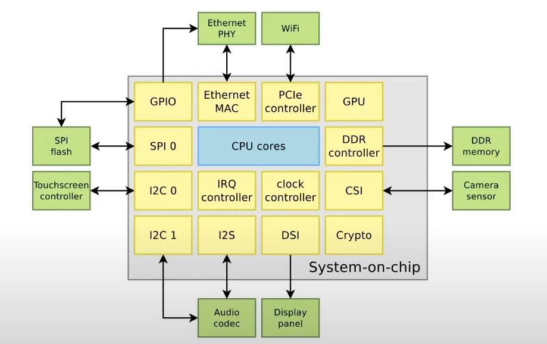
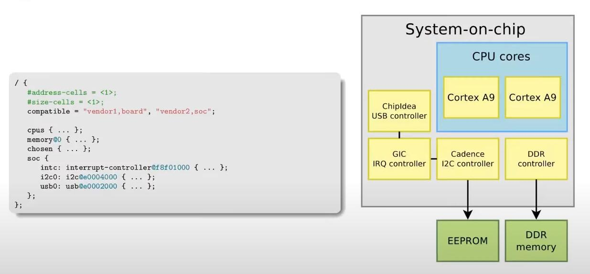
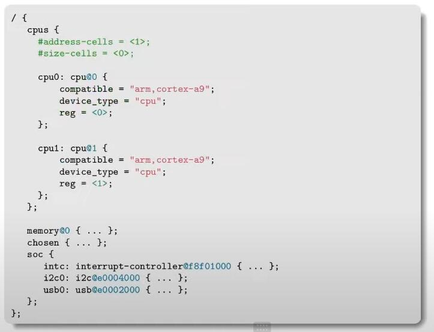
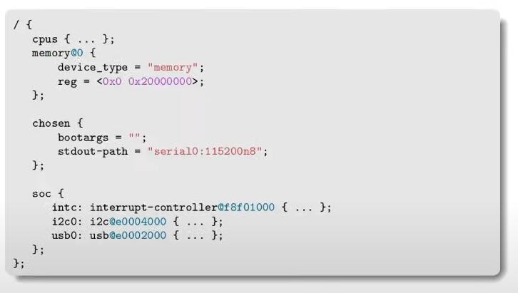
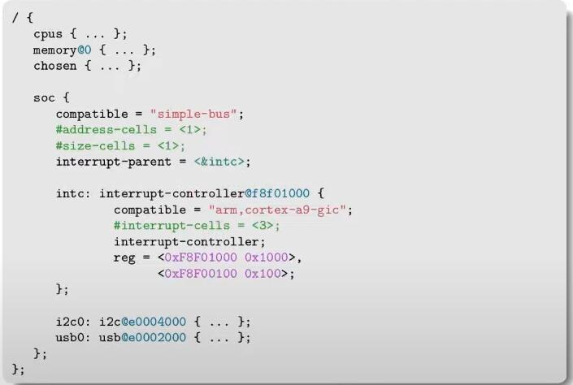
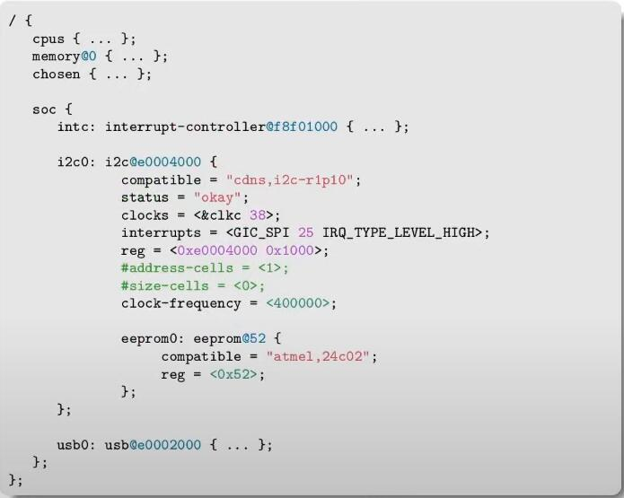
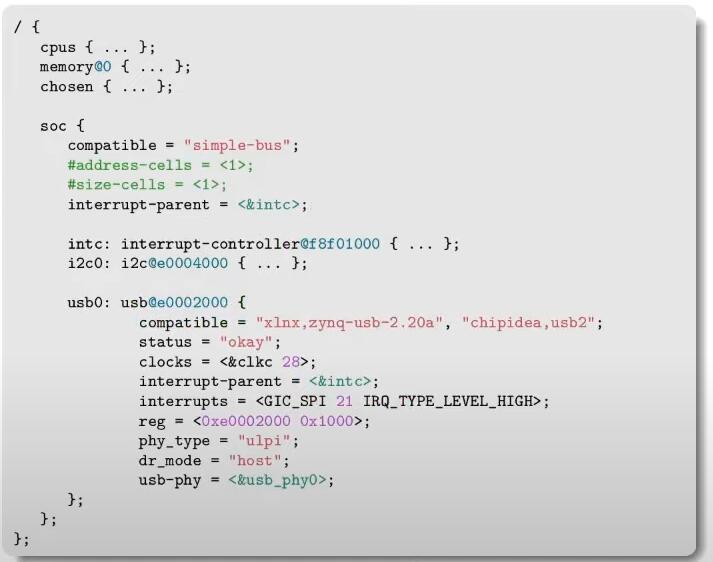
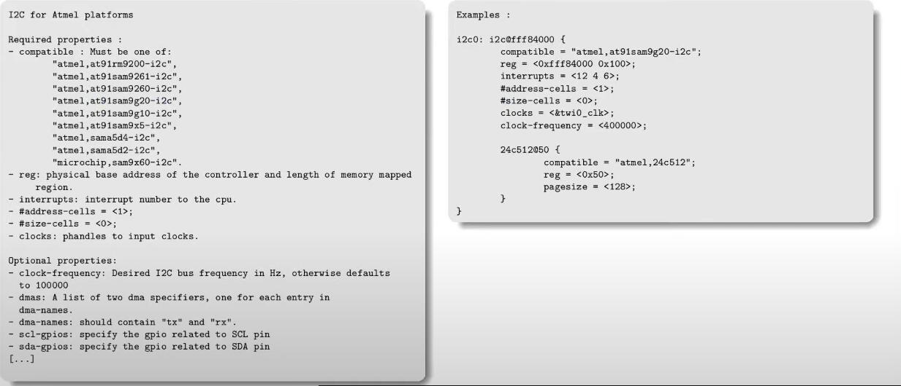
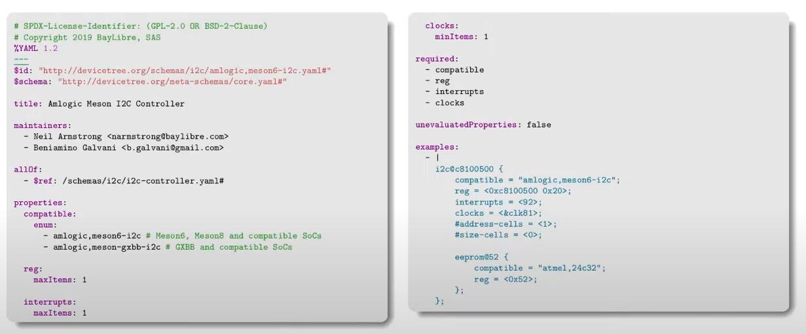
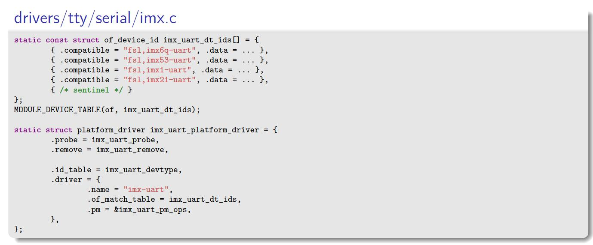

设备树平时用得很多，但总感觉对它缺乏一个系统性的认识。

偶然间刷到了 bootlin 的 [视频](https://www.youtube.com/watch?v=Nz6aBffv-Ek) 那就再来过一次。

<!--more-->

# Overview



以上是一个典型的嵌入式系统所具备的控制器及外设，如何简易的告诉给 Linux？设备树便是一个很好的配置文件格式。

需要明白的是，并不是所有的硬件信息都需要写入设备树中。因为有些硬件具备了设备发现机制，比如 USB、PCIE 这种当设备插入后会启动枚举机制来获取设备信息，然后与对应的驱动联系起来。

有些不具备发现机制的（比如 I2C、SPI）则需要在设备树中注明与之相连接的外设。

所以在设备树中一般需要包含的信息从内到外有：

- 当前 SOC 有多少核心
- 在内存总线上可以访问的控制器，该控制器对应的物理地址、中断号
- 当前 SOC 所具备的外围与那个控制器连接，它具备的地址等

使用设备树的流程为：

1. 由开发人员编写设备树源码`.dts`文件
2. 由设备树编译器`dtc`将 `.dts` 文件编译为 `.dtb` 文件
3. 对于 U-Boot、Barebox 而言，可以将 `.dtb`文件链接到可执行文件中。对于 Linux 而言通常由 boot loader 告知。

> 比如对于 U-Boot 而言：bootz <kernel-addr> - <dtb-addr>

# 基本语法


以上便是一个基本的设备树语法，理解起来还是比较直观。

> dtc 只进行语法检查，不会进行语义检查！

## 示例


如上图的右侧所示，硬件描述为：

- 该 SOC 具有两个 Cortex A9 内核
- 与该内核通信总线上具备有 USB 控制器、中断控制器、I2C 控制器、DDR 控制器
- I2C 总线上被挂载了 EEPROM 设备，DDR 控制器外接了 DDR 内存芯片

上图左侧的根设备树也很清楚的描述了以上硬件：

- cpus 节点描述内核
- memory 节点描述内存
- chosen 节点描述要发送给系统的配置命令
- soc 节点描述通信总线上的控制器



上图便是描述 cpus 节点的详细信息，此处便描述了内核类型，以及内核数量。



上图分别描述了：

- memory 节点描述内存从物理地址 0x00 开始，具备大小为 512MB 。
- chosen 节点描述启动参数为空，标准输出为 serial0，波特率 115200，8 位且无停止位



上图描述了中断控制器的两段物理地址及其可被访问的范围。



上图描述了 I2C 控制器的：

- 物理地址、其可以被访问的范围、中断号以及时钟源和时钟频率
- 该总线上还挂载了 24c02 这种 EEPROM，该 EEPROM 的地址为 0x52



上图描述了 USB 控制器的：

- 物理地址、其可被访问的范围、中断号以及时钟源
- 与该 USB 控制器连接的 PHY 的 phandle

## 设备树的组织方式

设备树可以被分为多个文件：

- `.dtsi` 文件一般是当前该 SOC 的通用设备树配置，描述了该 SOC 的内核以及控制器。所以它一般会被其他的 `.dts` 文件所包含。
- `.dts` 文件通常是会以 phandle 的方式来扩展对 `.dtsi` 文件的描述，以完整的描述控制器的参数和外接设备

`.dts` 可以包含 `.dtsi` 和 `.h` 文件，通过 `#include` 语法来实现（就和 c 语言一样的）：

```cpp
// 表示 DTS 的版本
/dts-v1/;

#include "zynqmp.dtsi"
#include "zynqmp-clk-ccf.dtsi"
// 包含源码头文件，以便于引用宏
#include <dt-bindings/input/input.h>
#include <dt-bindings/gpio/gpio.h>
#include <dt-bindings/pinctrl/pinctrl-zynqmp.h>
#include <dt-bindings/phy/phy.h>
```


以上表示了`.dts` 文件对 `.dtsi`文件的增加和改写，最终在 `.dtb`文件中会合并为最终的信息。


如上图所示，`.dts` 文件增加或改写 `.dtsi` 文件有两种方式：

1. 直接描述层级以及节点的名称和地址，在里面加上需要增加或改动的属性及值
2. 通过 phandle 的方式来引用节点

> 方法 2 明显优于方法 1

# 构建设备树

对于 ARM/ARM64 而言，`.dts` 的存在路径为：`arch/<ARCH>/boot/dts/` 或者 `arch/<ARCH>/boot/dts/<vendor>/` 目录下。

该目录下的 Makefile 就描述了对应要编译的 `.dts` 文件：

```cpp
dtb-$(CONFIG_ARCH_ZYNQMP) += avnet-ultra96-rev1.dtb
dtb-$(CONFIG_ARCH_ZYNQMP) += zynqmp-zc1232-revA.dtb
dtb-$(CONFIG_ARCH_ZYNQMP) += zynqmp-zc1254-revA.dtb
dtb-$(CONFIG_ARCH_ZYNQMP) += zynqmp-zc1275-revA.dtb
```
在编译内核或 U-Boot 的时候，如果执行 `make` 命令就会顺带的编译对应的设备树。

当然也可以单独编译设备树：

```powershell
make dtbs
```

除了构建设备树外，还可以使用以下方式对设备树进行语义检查：

- `make dt_bindings_check` ：检查 YAML 绑定是否合理
- `make dtbs_check` ：对 YAML 绑定进行验证

# 调试设备树

当 linux 启动后，可以在路径 `/sys/firmware/devicetree/base` 中浏览设备树的层级以及内容。

这种方式就可以检查设备树的配置是否与设定的一致。

> 如果在目标板上还有 `dtc` 工具，那可以通过 `dtc -I fs /sys/firmware/devicetree/base` 来以 txt 的方式解析设备树。

除此之外，在内核启动之前，U-Boot 可以通过 `fdt` 命令 `fdt set`,`fdt mknode`,`fdt rm` 来完成对设备树的编辑。

一般要新增一个设备时，首先需要在 `Document/devicetree/bindings` 目录下查看对应的说明，这样可以少走很多弯路。

该文档中的描述有两种风格，传统风格和 YAML 风格：






# 设备树 overlays

当硬件的外设灵活变化时，还可以通过对设备树打补丁的方式来完成设备树的更新，以提高灵活性。

也就是将各种不同的组合以相加的方式替代了相乘的方式，以减小设备树文件的数量。

比如下面这样：

```cpp
/dts-v1/;
/plugin/;

/* Pi3 uses a GPIO expander to drive the LEDs which can only be accessed
   from the VPU. There is a special driver for this with a separate DT node,
   which has the unfortunate consequence of breaking the act_led_gpio and
   act_led_activelow dtparams.

   This overlay changes the GPIO controller back to the standard one and
   restores the dtparams.
*/

/{
	compatible = "brcm,bcm2835";

	fragment@0 {
		target = <&act_led>;
		frag0: __overlay__ {
			gpios = <&gpio 0 0>;
		};
	};

	__overrides__ {
		gpio = <&frag0>,"gpios:4";
		activelow = <&frag0>,"gpios:8";
	};
};
```
# 设备树的设计理念

1. 完整的描述硬件，而不是具体该如何使用硬件
2. 设备树应该与系统无关，无论是裸机还是操作系统都可以使用同一份设备树（操作系统的升级也不应该需要修改设备树）
3. 描述硬件的组成，而不是描述硬件的内部结构

# 设备树中的属性

## compatible

`compatible` 用于将设备和驱动进行匹配，其通常是以 `vendor, model` 的方式来表示：

```cpp
compatible = "arm,armv8-timer";
compatible = "actions,s900-uart", "actions,owl-uart";
compatible = "regulator-fixed";
compatible = "gpio-keys";
```

该值就与驱动中的 `of_device_id` 相匹配：



## 通用属性
- reg
  + 对于内存映射的设备，用于描述其基地址以及该设备可被访问的范围
  + 对于 I2C 类设备，用于表示该设备的地址
  + 对于 SPI 类设备，用于表示该设备的片选地址

- interrupts,interrupt-parent,interrupts-extended : 描述中断号，以及与其关联的中断控制器
- clocks : 描述该设备所使用的对应的时钟控制器
- dmas : 描述该设备使用的 DMA 控制器以及其 DMA 通道号
- status: `status: okay` 描述该设备被使能，如果是其他值则该设备被 disable
- pinctrl-x: 描述该设备需要的 GPIO

## 值与范围

属性的值可以使用 10 进制、16 进制来表示：

```cpp
soc {
    /* This property has 1 cell */
    foo = <0xdeadbeef>;
};
```

以上描述的是 32 位的值，对于 64 位的值使用两个 32 位的值来表示：

```cpp
soc {
    /* This property has 2 cells */
    foo = <0xdeadbeef 0xbadcafe>;
};
```

规定值与范围的，是通过 `#address-cells` 和 `#size-cells` 来设定的：

```cpp
soc {
    compatible = "simple-bus";
    // 以下属性使用一个 cell 表示地址，一个 cell 表示范围
    #address-cells = <1>;
    #size-cells = <1>;
    i2c@f1001000 {
        reg = <0xf1001000 0x1000>;
        // 以下的属性使用一个 cell 表示地址且没有范围
        #address-cells = <1>;
        #size-cells = <0>;
        eeprom@52 {
            reg = <0x52>;
        };
    };
};
```

同理，`#interrupts-cells` 表示用多少 cell 表示设备使用的中断号：

```cpp
soc {
    intc: interrupt-controller@f1002000 {
        compatible = "foo,bar-intc";
        reg = <0xf1002000 0x1000>;
        interrupt-controller;
        // 该中断控制器需要两个 cell 来描述设备与它的连接关系
        #interrupt-cells = <2>;
    };
    i2c@f1001000 {
        interrupt-parent = <&intc>;
        /* Must have two cells */
        interrupts = <12 24>;
    };
};
```

有了上面的理解，那么`#clock-cells`，`#gpio-cells`，`#phy-cells`都可以以此类推：

```cpp
soc {
    clkc: clock@f1003000 {
    compatible = "foo,bar-clock";
    reg = <0xf1003000 0x1000>;
    #clock-cells = <3>;
    };
    i2c@f1001000 {
    /* Must have three cells */
    clocks = <&clkc 12 24 32>;
    };
};
```

## -names

可以通过 `<prop>-names`将当前属性与名字匹配，更易于理解：

```cpp
interrupts = <0 59 0>, <0 70 0>;
interrupt-names = "macirq", "macpmt";
clocks = <&car 39>, <&car 45>, <&car 86>, <&car 87>;
clock-names = "gnssm_rgmii", "gnssm_gmac", "rgmii", "gmac";
```

那么在驱动中就可以这么使用：

```cpp
platform_get_irq_byname(pdev, "macirq");
```


