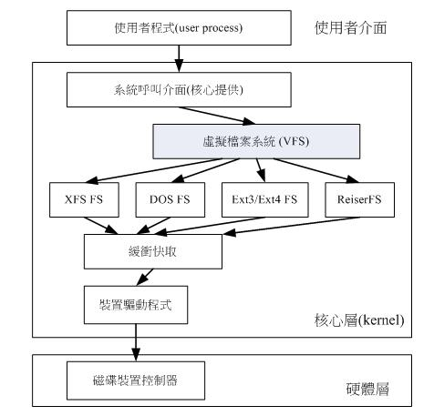
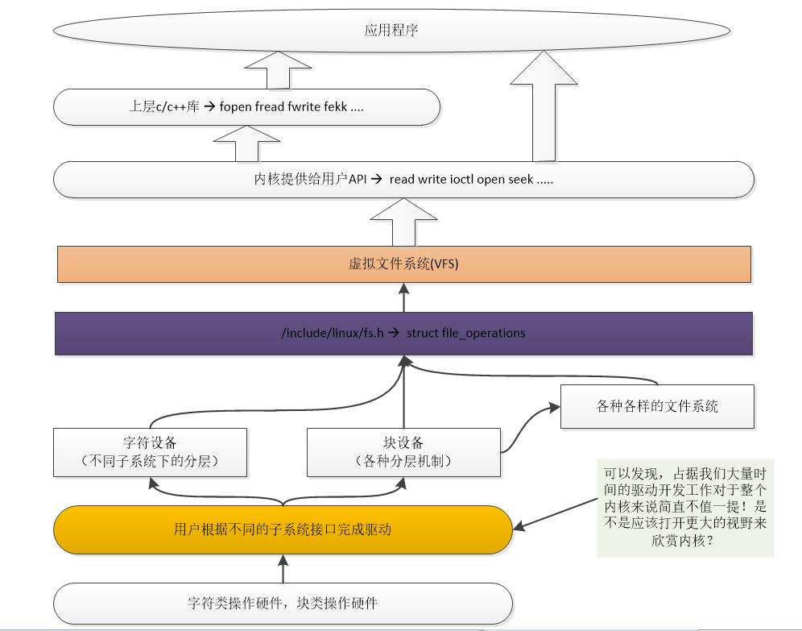
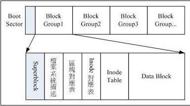
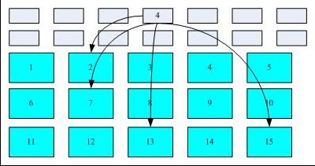
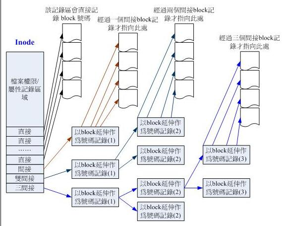
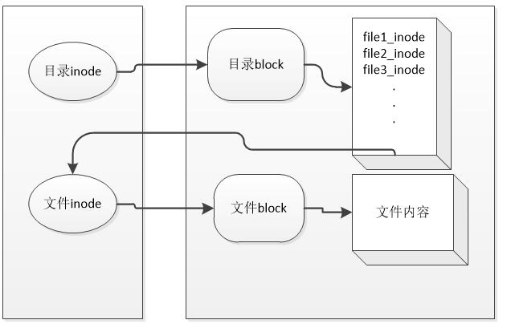
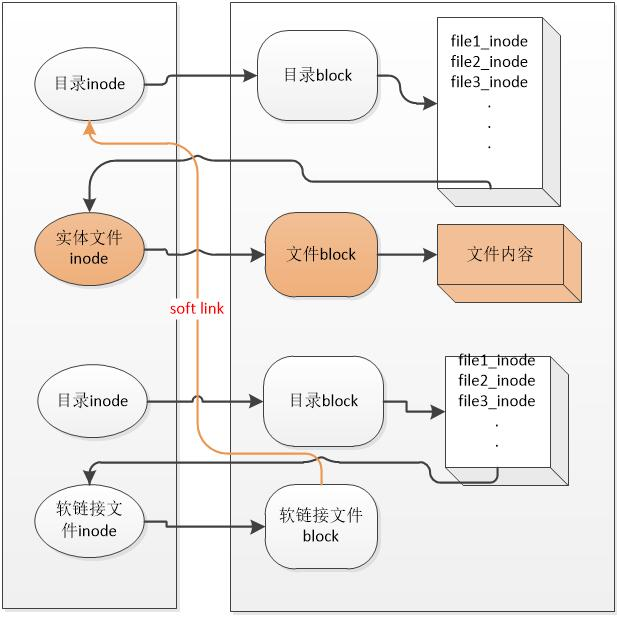
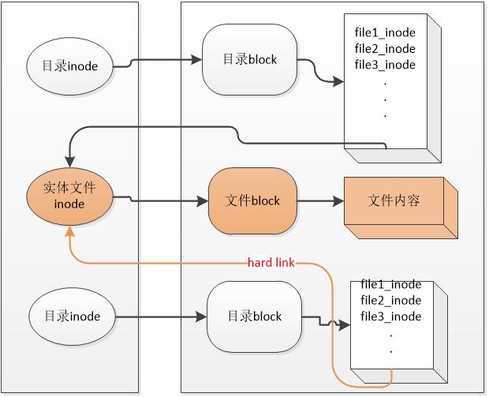

---
title: Linux文件系统结构概览
tags: 
- linux
categories:
- linux
- fs
- overview
date: 2024/9/8
updated: 2024/9/8
layout: true
comments: true
---

| kernel version | arch  |
| -------------- | ----- |
| v5.4.0         | arm32 |

复习网站： [鸟哥私房菜](http://linux.vbird.org/linux_basic/0230filesystem.php#)

重温文件系统(ext)的相关操作并做整理，不然我这尿记性要不了多久又会忘。。。

<!--more-->

# 文件系统的组成

## 概览

在Linux中，一个磁盘可以分为多个区，每个区可以格式化为不同的文件系统，
最终通过虚拟文件系统VFS将这些抽象给上层统一的函数接口操作。



- 在驱动中，无论是字符设备、块设备、还是其他文件系统，与VFS所接口的都是填充 `struct file_operations` 结构体



一个ext文件系统的组成部分如下图：



### Boot Sector

此部分通过MBR跳转过来，用于显示关于此部分系统的启动界面以及引导系统启动，以达到多重启动的目的。 [wiki上有很详细的解释](https://en.wikipedia.org/wiki/Boot_sector)

### Block Group

Block Group 用于将文件系统分为几个块，便于管理。

### Superblock

此部分描述整个文件系统信息，是此分区文件系统的全部概览。 

**一个文件系统只能有一个Superblock,其他BlockGroup中可能会具有Superblock的备份，用于备用恢复。**

### 文件系统描述

此部分是描述当前block group的相关信息。

### 区块对照表(block bitmap)

此表用于查询文件系统中的block的使用情况，以反应出block的全局概览。

### inode对照表(inode bitmap)

此表用于查询文件系统中的inode的使用情况，以反应出inode的全局概览。

### inode table

用于存储该部分的inode的具体内容，一个文件对应一个inode。

inode用于描述文件权限、群组关系、容量、时间、链接的block等等相关信息，它不包含文件的实际内容。

inode中存储了包含文件内容的block索引，系统可以根据此索引预读文件内容，如下图：



一个inode的大小是有限制的，如果一个文件很大，就会需要很多的block。
那么一个inode就无法存储这么多地址，所以文件系统使用一部分block来存储inode，如下图：



ext2/3 的inode可以直接寻址的block为12个，间接寻址、双间接寻址、三间接寻址各一个。

- 一个block的地址为4字节，当block为4k时那么它就可以存储1024个block地址
- 所以一个直接寻址的总共block大小为 `12 * 4k = 48k (block_size * num)`
- 间接寻址 :`1024 * 4k = 4M  [(block_size / 4) ^ 1] * block_size`
- 双间接寻址: `1024 * 1024 * 4k = 4GB  [(block_size / 4) ^ 2] * block_size`
- 三间接寻址为: `1024 * 1024 * 1024 * 4k = 4TB [(block_size / 4) ^ 3] * block_size`

ext4在此基础上做了优化:

```shell
本来的ext2/3中inode以1个4字节对应一个block，如果一个文件占用了1000个block，
那对应的inode中需要分配block来对应存储这1000个block的索引。

但如果这1000个block地址是连续的，那就没有必要一一存储，可以在inode中存储一个结构体
以表示block索引的起始地址和结束地址。这样就大大减少了inode的存储空间。

也就是说同样大小的文件，ext4中对应inode此文件的inode占用空间更小，
那么ext4中的inode能表示的文件大小范围也更大。
```

### data block

data block 用于存储文件的实际内容，在格式化的时候一个block的大小就规定好了，此为最小的存储单位。
也就是说当一个文件内容不足一个block也会占用一个block。

## superblock 查看与理解

- 首先使用命令 `sudo blkid` 查看当前已经被格式化过的且已挂载的分区以及对应的文件系统
- 然后使用命令 `sudo dumpe2fs -h <partition>` 用于查看文件系统的全局概览。
  + 当不加 h 选项时还会输出 block group 的信息。
    通过下面这个输出就可以看出一个 superblock 中可以看到的文件系统信息：

```shell
#文件系统名称
Filesystem volume name:   <none>
#上一次的挂载点
Last mounted on:          /
Filesystem UUID:          db4b4bdb-ebff-4928-b154-786622f8438f
Filesystem magic number:  0xEF53
Filesystem revision #:    1 (dynamic)
#文件系统特征
Filesystem features:      has_journal ext_attr resize_inode dir_index filetype needs_recovery extent flex_bg sparse_super large_file huge_file uninit_bg dir_nlink extra_isize
Filesystem flags:         signed_directory_hash
#默认挂载选项
Default mount options:    user_xattr acl
#文件系统状态
Filesystem state:         clean
Errors behavior:          Continue
Filesystem OS type:       Linux
#总共的inode数量
Inode count:              8126464
#总共的block数量
Block count:              32505600
#保留的block数量
Reserved block count:     1625280
#还剩余多少blocks和inodes可用
Free blocks:              28442724
Free inodes:              7560146
#第一个block的起始索引
First block:              0
#block 大小
Block size:               4096
Fragment size:            4096
Reserved GDT blocks:      1016
#每个group的block数量
Blocks per group:         32768
Fragments per group:      32768
#每个group的inode数量
Inodes per group:         8192
#每个group可用多少个block来表示inode
Inode blocks per group:   512
Flex block group size:    16
#时间信息
Filesystem created:       Tue Apr 18 22:27:06 2017
Last mount time:          Thu Apr 26 09:20:42 2018
Last write time:          Thu Apr 26 09:20:38 2018
Mount count:              280
Maximum mount count:      -1
Last checked:             Tue Apr 18 22:27:06 2017
Check interval:           0 (<none>)
Lifetime writes:          137 GB
Reserved blocks uid:      0 (user root)
Reserved blocks gid:      0 (group root)
First inode:              11
#inode大小
Inode size:               256
Required extra isize:     28
Desired extra isize:      28
#日志系统的inode号码
Journal inode:            8
First orphan inode:       3538974
Default directory hash:   half_md4
Directory Hash Seed:      7deaec65-123c-4de8-aab7-9ca8dd458823
Journal backup:           inode blocks
Journal features:         journal_incompat_revoke
#文件日志可用大小
Journal size:             128M
Journal length:           32768
Journal sequence:         0x00042c45
Journal start:            16552


#第一个group的block索引范围
Group 0: (Blocks 0-32767) [ITABLE_ZEROED]
  Checksum 0x5c5a, unused inodes 8175
  #主superblock在0号block里面，group描述符在1-8号block里面
  Primary superblock at 0, Group descriptors at 1-8
  Reserved GDT blocks at 9-1024
  #block位图地址与inode位图地址
  Block bitmap at 1025 (+1025), Inode bitmap at 1041 (+1041)
  #Inode Table地址
  Inode table at 1057-1568 (+1057)
  #剩余可用inode和block
  22550 free blocks, 8176 free inodes, 2 directories, 8175 unused inodes
  #具体剩余索引
  Free blocks: 9255-9309, 9366-9402, 10310-32767
  Free inodes: 16, 18-8192
```

上面信息中说每个group有8192个inode可用，其 计算公式为：

- Inode Table 占用的block数量为 `1568 - 1057 + 1 = 512`
- 由于一个block大小为4096字节，所以inode table 总共占用 `512 * 4096 = 2097152` 字节
- 由于一个inode的大小为256字节，所以一个inode table可用容纳 `2097152 / 256 = 8192` 个inode

根据文件系统的结构来看，可以知道新增一个档案的流程为：

1. 确定使用者是否有 wx 权限，有权限才能新增
2. 从inode bitmap 中取出一个空闲的inode号码 ,并将权限写入此inode
3. 从block bitmap 中根据文件大小取出对应个数的block并将文件内容写入block
4. 将文件对应的block号码写入其对应的inode,如果block太多还需要申请更多的block来存储inode
5. 将新写入的inode和block同步到inode bitmap,block bitmap, superblock 中

对应的删除一个档案的流程为：

1. 确定使用者具有wx权限
2. 将对应的block 和 inode 置为空闲并同步到 inode bitmap , block bitmap ,superblock 中
   + 这里仅仅是猜测文件系统为了效率是不会实际删除内容的，而是清除其标志即可。待后面分析其代码再回头来梳理

## 目录与文件的关系

通过inode与block的关系可以知道目录肯定有其自己的inode与block，其block链接至其他的文件，如下图：



- 使用命令 `ls -li` 可以列出当前目录下存储文档的inode 

需要注意的是：inode并不保存文件名，文件名是保存在目录的block中的， **所以文件的读取都是要先经过目录的**

其流程为：

1. 根据文件系统挂载点得知起始目录的inode
2. 读取目录inode权限确认可以访问对应block中的内容
3. 读取目录block中的内容，并根据文件名匹配到对应的inode
4. 根据文件的inode进行权限确认是否可以访问文件block
5. 读取block中的内容...

## 日志档案系统的作用

当在文件的增删过程中如果出现意外(比如文件内容已经写入但是inode bitmap, block bitmap, superblock没有得到同步)，
这就会出现内容与描述不一致的情况，系统为了还原此描述就需要扫描整个文件系统内容来同步修复，这个效率显然是很低下的。

日志文件系统就是记录文件的修改过程，当出现不一致时系统直接来比对日志即可，这样效率就提高了不少。

## VFS

- 通过命令 `ls -al /lib/modules/$(uname -r)/kernel/fs` 可以看到系统所支持的文件系统种类
- 通过命令 `cat /proc/filesystems` 可以查看已经载入到RAM中的文件系统

# 文件系统的操作

## 查看目录与硬盘容量

```shell
#列出当前系统已经挂载的文件系统，显示其使用率，挂载点等信息
#当只是简单查看时，可以不用加 'a' 选项
df -aTh
#显示当前系统中已挂载文件系统inode的使用率
df -ih

#列出当前目录及其子目录占用总容量
du -sh
```

## 软链接与硬链接

### 软链接

软链接：新建一个文件，此文件的内容(block)指向的是被链接的文件名(由被链接文件的目录inode间接找到此文件名)

- 使用 `ln -s <src> <dst>` 建立软链接
- 通过 `df -i` 可以看到 inode数量变化，以及通过 `ll -i` 可以看到新建文件指向的inode不一致



软链接优点：

1. 可以跨文件系统
2. 可以链接目录
   - 对链接目录的软链接文件使用 `rm -rf soft_link_file` **并不会删除对应目录，而仅仅是删除此软链接文件**

软链接缺点：

1. 会新建一个文件从而占用一个 inode和block
2. 被链接的文件在其目录被删除后，无法通过链接文件访问文件内容

### 硬链接

硬链接：在目录的内容(block)中新建立一个指向被链接文件名的inode的映射关系

- 使用 `ln <src> <dst>` 建立硬链接
- 通过 `df -i` 可以看到 inode数量不变，以及通过 `ll -i` 可以看到新建文件指向的inode一致,此时inode被链接数也会增加
- 新建的目录默认链接数是2(包括 “dir” 和 “dir/.”)而上层目录的链接数会加1(因为 “dir/..”) 会指向此目录



硬链接的优点：

1. 仅仅是在目录block中建立映射关系，所以不会消耗更多的inode和block
   + 除非目录block已经满了，则还需要新增加一个block来存储
2. 当被链接文件在其目录中的对应关系被删除后，在当前文件依然可以访问文件内容

硬链接的缺点：

1. 不能跨文件系统
2. 不能链接目录

## 分区、格式化、挂载

### 查看磁盘分区状态

- 使用命令 `lsblk` 可以查看当前系统磁盘以及其分区状态
  + 使用 `-f` 选项可以查看对应的UUID
- 使用命令 `parted /dev/xxx print` 查看某个磁盘具体分区情况
  + 其中 `Partiton Table` 指出了磁盘使用的分割表

### 磁盘分割

- 使用 `fdisk /dev/xxx` 对使用MBR分割表的磁盘进行分割
- 使用 `gdisk /dev/xxx` 对使用GPT分割表的磁盘进行分割
- 分割完成后，使用 `partprobe -s` 来更新分区表

嵌入式批量出厂时， 可以在 `sed` 的帮助下完成自动化的分割，来源于 [[wiki上有很详细的解释]](https://superuser.com/questions/332252/how-to-create-and-format-a-partition-using-a-bash-script)

```shell
# to create the partitions programatically (rather than manually)
# we're going to simulate the manual input to fdisk
# The sed script strips off all the comments so that we can
# document what we're doing in-line with the actual commands
# Note that a blank line (commented as "default" will send a empty
# line terminated with a newline to take the fdisk default.
sed -e 's/\s*\([\+0-9a-zA-Z]*\).*/\1/' << EOF | fdisk ${TGTDEV}
  o # clear the in memory partition table
  n # new partition
  p # primary partition
  1 # partition number 1
  # default - start at beginning of disk
  +100M # 100 MB boot parttion
  n # new partition
  p # primary partition
  2 # partion number 2
  # default, start immediately after preceding partition
  # default, extend partition to end of disk
  a # make a partition bootable
  1 # bootable partition is partition 1 -- /dev/sda1
  p # print the in-memory partition table
  w # write the partition table
  q # and we're done
  EOF
```

### 磁盘格式化

- 使用命令 `mkfs.ext4 /dev/xxxn` 来格式化对应分区

### 文件系统的检验

- 使用命令 `fsck.ext4` 可以完成ext4 文件系统的检查

### 挂载与卸载

在挂载前需要注意的是：

1. 单一目录不应该重复挂载多个文件系统

2. 要作为挂载点的目录需要是空目录
- 首先使用 `mkdir <new dir>` 新建空目录

- 然后使用 `mount /dev/xxxn <new dir>` 将分区挂载到空目录上

- 使用 `unmount <dir>` 来卸载分区

### 开机挂载

开机挂载规则存储于文件 `/etc/fstab` 中，如果需要增加挂载规则，那么在后面继续加入即可。

```shell
# /etc/fstab: static file system information.
#
# Use 'blkid' to print the universally unique identifier for a
# device; this may be used with UUID= as a more robust way to name devices
# that works even if disks are added and removed. See fstab(5).
#
# <file system> <mount point>   <type>  <options>       <dump>  <pass>
# / was on /dev/sda1 during installation
UUID=db4b4bdb-ebff-4928-b154-786622f8438f /               ext4    errors=remount-ro 0       1
# swap was on /dev/sda5 during installation
UUID=25fea792-68fb-4dcc-a793-c96933dd39a1 none            swap    sw              0       0
```

其规则从左到右依次为：

- UUID : 分区的唯一ID
- mount point: 挂载的目录路径
- type : 文件系统类型
- options : 文件系统参数

| 参数          | 意义                                                 |
| ----------- | -------------------------------------------------- |
| async/sync  | 是否以同步方式操作，一般为async                                 |
| auto/noauto | 当使用 mount -a 时，此文件系统是否会被主动测试挂载，默认为auto             |
| rw/ro       | 整个文件系统的读写权限                                        |
| exec/noexec | 此文件系统中的档案是否可执行                                     |
| user/nouser | 是否允许普通用户可以挂载该文件系统，默认为nouser(不允许)                   |
| suid/nosuid | 文件系统中的文件是否允许SUID的存在                                |
| default     | 默认:rw,suid,dev,exec,auto,nouser,async, 所以一般使用此参数即可 |

- dump : 是否能被 dump 备份指定使用，一般设为 0
- pass : 是否在开机是进行文件系统检查，为1代表需要检查 

```shell
当 fstab 文件写入有误导致开机失败，那么可以进入维护模式然后使用命令  "mount -n -o remount,rw /"
```