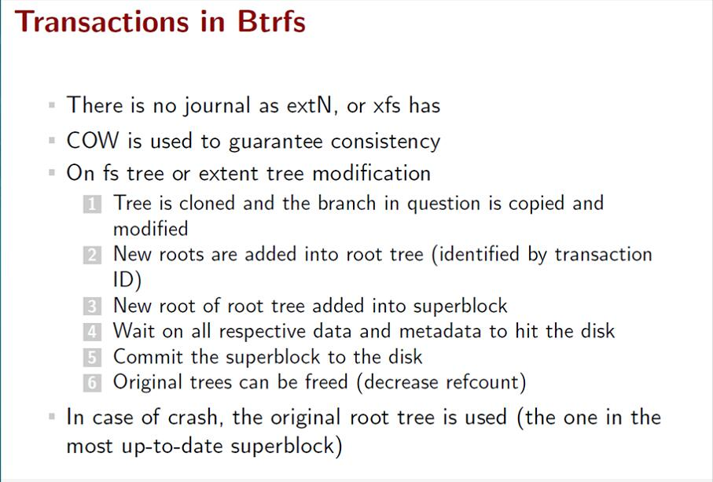

| kernel version | arch  |
| -------------- | ----- |
| v5.4.0         | arm32 |

继续深入理解文件系统的实现。

<!--more-->

# 文件系统的一致性

根据前面的了解，可以知道当新建一个文件时，需要修改以下部分：

- 从inode bitmap 中找到空闲位
- 从block bitmap 中找到空闲位
- 填充此新文件的数据内容到block中
- 填充此新文件的inode内容到inode table中
- 在包含此文件的目录的block中增加新文件的条目
  + 如果已经超过了一个block，则还需要申请新block并填充
- 更新目录的inode内容
- 更新superblock的inode和block记录信息

以上这么多步操作显然就不是原子性的，如果在操作过程中系统崩溃或者硬件掉电，都会造成元数据和数据不一致的问题。

```shell
  这里其实还有会安全性的问题，因为文件系统在删除一个文件时，
  为了提高处理速度一般是不会去真的删除block中的内容的，一般是直接删除其元数据即可。

  那么当为一个文件增加一个block时，如果在写完元数据后真正的block还没有被写入时发生了掉电，
  那么下次启动时，这个文件下一个block的内容其实是上次被删除文件的内容!
```

## 实例模拟掉电过程

### 格式化硬盘

```shell
  #创建一个虚拟硬盘
  dd if=/dev/zero of=image bs=4096 count=1024
  #格式化
  mkfs.ext4 -b 4096 image
```

### 查看元数据

```shell
  #查看super block 的具体描述
  dumpe2fs image

  #...
  #First inode:              11
  #...
  #Block bitmap at 2 (+2), Inode bitmap at 18 (+18)
  #Inode table at 34-65 (+34)
```

由上面输出可以看到其 inode bitmap 起始块为18，block bitmap 起始块为2，inode table 起始块为34

- 查看bitmap内容

```shell
  #-C 以16进制显示
  #-n 32 只显示前32个数
  dd if=image bs=4096 skip=18 | hexdump -C -n 32
```

可以看到其输出的 bitmap，前面的 `ff 07` 正好是11位，和前面的 `First inode: 11` 遥相呼应。

```
  00000000  ff 07 00 00 00 00 00 00  00 00 00 00 00 00 00 00  |................|
  00000010  00 00 00 00 00 00 00 00  00 00 00 00 00 00 00 00  |................|
  00000020
```

### 增加文件再次查看元数据

```shell
  mkdir hello
  #文件模拟的硬盘需要 "-o loop" 命令
  mount -o loop image hello
  #新建文件
  cd hello
  echo "hello" > world
  #再次查看inode bitmap
  cd ../
  dd if=image bs=4096 skip=18 | hexdump -C -n 32
```

查看其输出，发现第12位被置位了。

```shell
  00000000  ff 0f 00 00 00 00 00 00  00 00 00 00 00 00 00 00  |................|
  00000010  00 00 00 00 00 00 00 00  00 00 00 00 00 00 00 00  |................|
  00000020
```

### 破坏inode bitmap

下面再来将其12位清零，以造成数据不一致的错误。

```shell
  #先卸载挂载
  umount hello
  vim image
  #转为16进制显示
  #:%!xxd
  #计算其inode bitmap起始地址为 0x12000
  #修改对应 0f 为 07
  #保存后还原为二进制
  #:%!xxd -r
  dd if=image bs=4096 skip=18 | hexdump -C -n 32
```

通过以上操作可以发现其12位已经被清零了，并且此时使用 `fsck.ext4 image` 并无法检查出此错误。

重新 `mount` 依然可以看到文件的inode还是12（因为此记录依然保存在文件夹的block中）。

但如果此时再新建一个文件，便会报错 `Input/output erro` ,此时通过 `dmesg` 可以看到错误提示。

再次使用 `fsck.ext4 image` 即可检查出问题并修复

### 破坏block bitmap

再次使用 `dumpe2fs image` 查看其super block:

```shell
  Group 0: (Blocks 0-1023) [ITABLE_ZEROED]
    Checksum 0xf4d9, unused inodes 1012
    Primary superblock at 0, Group descriptors at 1-1
    Block bitmap at 2 (+2), Inode bitmap at 18 (+18)
    Inode table at 34-65 (+34)
    981 free blocks, 1012 free inodes, 2 directories, 1012 unused inodes
    Free blocks: 8-17, 20-33, 67-1023
    Free inodes: 13-1024
```

通过其free blocks 输出，猜测其block bitmap 的前9字节应该是(小端模式16进制): ff 00 0c 00 fc ff ff ff 07

然后通过 `dd if=image bs=4096 skip=2 | hexdump -C -n 32` 来查看输出，果然如此。

```shell
  00000000  ff 00 0c 00 fc ff ff ff  07 00 00 00 00 00 00 00  |................|
  00000010  00 00 00 00 00 00 00 00  00 00 00 00 00 00 00 00  |................|
  00000020
```

新建文件然后查看其block bitmap:

```shell
  mount -o loop image hello/
  echo "haha" > hello/123
  dd if=image bs=4096 skip=2 | hexdump -C -n 32
  #00000000  ff 00 0c 00 fc ff ff ff  0f 00 00 00 00 00 00 00  |................|
  #00000010  00 00 00 00 00 00 00 00  00 00 00 00 00 00 00 00  |................|
  #00000020
  dd if=image bs=4096 skip=18 | hexdump -C -n 32
  #00000000  ff 1f 00 00 00 00 00 00  00 00 00 00 00 00 00 00  |................|
  #00000010  00 00 00 00 00 00 00 00  00 00 00 00 00 00 00 00  |................|
  #00000020
```

然后按照之前类似步骤将 block bitmap的 `0f` 修改为 `07` , 如果此时再来新建文件却并不会报错。
然后通过 `fsck.ext4 image` 可以检测block bitmap错误，但同时新建文件的内容则为空。

### fsck 缺点

fsck 由于是进行全部元数据的对比扫描所以及执行速度比较慢，转而的替代方案则是日志文件系统。

## 日志文件系统

### 问题

由上面的掉电过程可以知道：在操作文件系统的任何时刻掉电都会造成数据不一致的问题，
而如果在检查文件系统时通过遍历的方法显然是低效的。

### 解决方案

为了提高操作效率，我们完全可以将文件系统的操作过程来做一次记录，那么下次就可以直接检查最后一次记录的完整性：

- 如果记录完整则代表上层操作已操作完毕
- 如果不完整则根据最后一次记录的进度，要么将此次操作撤销，要么主动完成此次操作。

transaction(事务): 保证数据操作一致性

日志文件系统就以 transaction 为基础，来记录对文件系统的操作，其日志分4个阶段：

1. journal write: 将要对文件系统的操作步骤写入 transaction 
2. journal commit: 将此 transaction 写入存储日志内容的block中
3. checkpoint: 此步才是真正来执行文件系统的操作
4. Free： 此步若完成，则更新日志的 superblock以表示完成，并释放 transaction 在block中的空间

分析以上步骤：

- 假设在 jounral write 或 jounral commit 步骤掉电了，那么对日志来说用户什么都没有做
- 假设在 checkpoint 步骤中掉电了，那么日志已经记录了此操作，但用户真正操作还没有完成，那将由日志来主动完成。

所以对文件系统的一致性就简化为两种状态：

- 要么什么都没有做
- 要么没有做完，那么从新做一次

### 优化

上面的日志系统的transaction是要保存文件系统操作的每个步骤，那在对block的操作中所消耗的空间和时间都比较大，
为了能够提高效率，可以仅需要对其元数据做 transaction 即可。

进而演化出了 Metadata 日志阶段：

1. Data write : 写文件数据到block
   + 此部分有几个选项 data=writeback,data=ordered
     + writeback: 不用等待此步骤完成，而是并行的开始后面的步骤
     + ordered: 需要等待此步骤完成才能进行后面的步骤
2. Journal metadata write: 将要操作的文件的元数据过程写入到transaction
3. Journal commit: 将此transaction 写入存储日志内容的block中
4. checkpoint metadata: 真正执行文件的元数据操作
5. Free: 更新日志superblock 并释放transaction 在block中的空间

分析以上步骤：

- 当以 ordered 形式操作，如果在commit以以前的步骤掉电了则就等于什么都没有做
- 当以writeback形式操作，则可能出现 metadata已经checkpoint，但block还未写完的现象

在实际格式化磁盘时，就可以给文件系统选项以让日志工作在什么模式：

- `data=journal` : 传统日志方式，所有操作都做日志
- `data=ordered` : 等待block写完
- `data=writeback` : 并行写block和日志

## COW(读拷贝更新)文件系统

COW的基本思路是：在更改磁盘时，先对要更改的对象创造一个副本，然后去修改这个副本。
当副本操作完成后，将副本与之前的节点链接起来为一个新树，最后再将superblock 指向新树的树顶。

由于 **最后的superblock指针的操作** 是原子性的，所以这种文件系统也只有两种状态：

1. 在指针操作之前断电，那相当于什么都没有发生，依然使用之前的树
2. 在指针操作后断电，所有操作也都完成了，使用新树

这种操作系统就不需要日志系统了。

Btrfs就是使用这种技术的文件系统：



### 体验

- 格式化并挂载

```shell
  //申请的磁盘空间不能太小，否则会出现警告 "no space to alloc data/metadata chunk"
  dd if=/dev/zero of=image bs=4096 count=102400
  mkfs.btrfs image
  mkdir hello
  mount -o loop image hello
```

- 创建当前文件系统的快照和子卷
  + 快照相当于对当前文件系统做了一个备份。
  + 子卷相当于做了一个小分区

```shell
  cd hello
  echo "Hello world" > hello
  #为当前文件创建一个名为 snapshot1 的快照
  #此时snapshot1 中的内容和当前目录一样，但其实是指针指向了同一个树，并没有复制内容
  #当文件系统根目录修改时，它会为止使用COW技术来生成一个新的树。
  btrfs subvolume snapshot . snapshot1

  #创建一个名为 sub1 的子卷
  btrfs subvolume create sub1

  #查看文件系统子卷信息
  btrfs subvolume list .

  #ID 256 gen 9 top level 5 path snapshot1
  #ID 257 gen 13 top level 5 path sub1
```

- 直接挂载子卷的内容

```shell
  cd ../
  umount hello

  #根据前面的ID号来mount子卷
  mount image -o subvolid=257 hello
```

# 文件系统inode和block互查

## 通过文件查看其inode内容

- 使用命令 `stat <file_name>` 来查看简易版的inode
- 使用命令 `debugfs` 来查看文件详细的inode内容：

```shell
  # file_path 绝对文件路径
  # device_partition 设备分区路径
  debugfs -R 'stat <file_path>' <device_partition>
```

比如在之前的 `simplefs` 中查看 `simple.c` 的 inode : 

- debugfs -R 'stat /home/baohua/github/simplefs-master/simple.c' /dev/sda1

```shell
  #inode号        档案类型         权限
  Inode: 441161   Type: regular    Mode:  0664   Flags: 0x80000
  Generation: 2565248354    Version: 0x00000000:00000001
  #user id      group id        文件内容大小
  User:  1000   Group:  1000   Size: 27049
  File ACL: 0    Directory ACL: 0
  #链接数
  Links: 1   Blockcount: 56
  Fragment:  Address: 0    Number: 0    Size: 0
  #使用 stat <file_name> 来显示文件所有相关时间
  #最后改变文件属性的时间
   ctime: 0x5afce24b:a4380e4c -- Thu May 17 10:00:43 2018
  #最后访问时间
   atime: 0x5afce251:0dda0cac -- Thu May 17 10:00:49 2018
  #最后修改文件内容的时间，命令 ls -al 默认显示此时间
   mtime: 0x5afce24b:a3be0bec -- Thu May 17 10:00:43 2018
  #创建时间
  crtime: 0x5afce24b:a3be0bec -- Thu May 17 10:00:43 2018
  Size of extra inode fields: 28
  EXTENTS:#block 位置
  (0-6):1537640-1537646
```

## 根据 block 查看其inode

同样通过 `debugfs` 可以反算出inode号:

```shell
  debugfs -R 'icheck <block_num>' <device_partition>
```

继续上面的例子(block号取其中任意一个都可以算出其inode)：

- debugfs -R 'icheck 1537640' /dev/sda1
  
  ```shell
  debugfs 1.42.9 (4-Feb-2014)
  Block    Inode number
  1537640    441161
  ```

继续通过 inode 得出其文件

```shell
   debugfs -R 'ncheck <inode_num>' <device_partition>
```

输出：

```shell
  debugfs 1.42.9 (4-Feb-2014)
  Inode    Pathname
  441161    /home/baohua/github/simplefs-master/simple.c
```

## 低级方式查看block中的内容

使用 `blkcat` 来直接读取block中的内容:

```shell
  blkcat <device_partition> <block_num>
```

依然以 `simple.c` 的block `1537640` 来读取其一部分代码:

- blkcat /dev/sda1 1537640

还可以使用 `dd` 命令来以扇区为偏移读取block的内容：

- 首先使用 `fdisk -l /dev/sda1` 来查看磁盘的扇区
  
  ```shell
  Disk /dev/sda1: 16.6 GB, 16641949696 bytes
  255 heads, 63 sectors/track, 2023 cylinders, total 32503808 sectors
  Units = sectors of 1 * 512 = 512 bytes
  Sector size (logical/physical): 512 bytes / 512 bytes
  I/O size (minimum/optimal): 512 bytes / 512 bytes
  Disk identifier: 0x00000000
  ```
  
  可以看出其扇区为512字节，当前文件系统的block为4096字节，那么一个block由8个扇区组成。

然后可以使用 dd 来查看block的一个扇区:

```shell
  dd if=/dev/sda1 of=sector skip=$((1537640*8)) bs=512c count=1
```

然后就可以在文件 `sector` 中查看其一个扇区的内容了。

当要从磁盘最开始查找的话，还需要计算 `/dev/sda1` 分区的起始扇区，这可以通过 `fdisk /dev/sda` 使用 `p` 查看

比如查看当前偏移是2048个扇区，那么命令就可以修改为

```shell
  dd if=/dev/sda1 of=sector skip=$((1537640*8 + 2048)) bs=512c count=1
```
