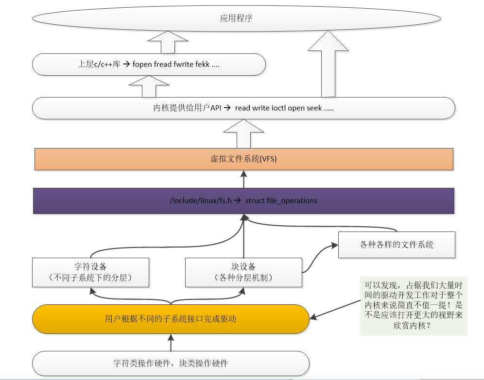
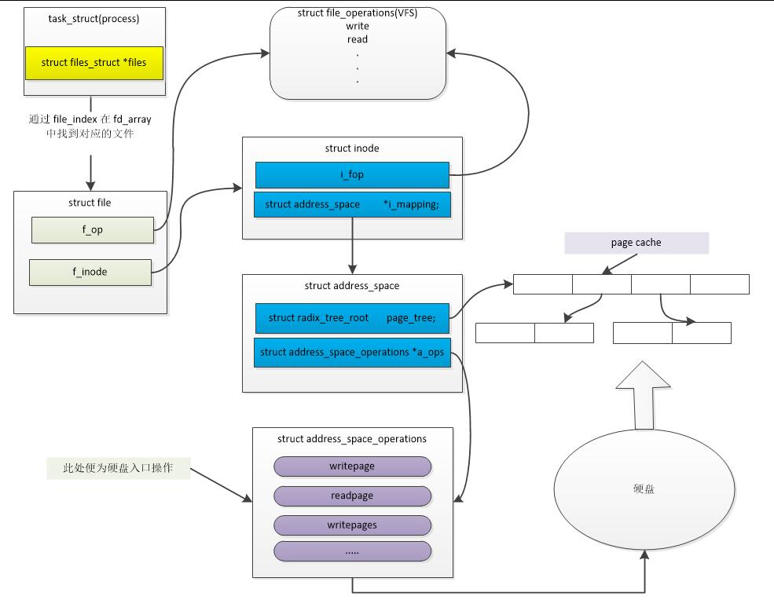
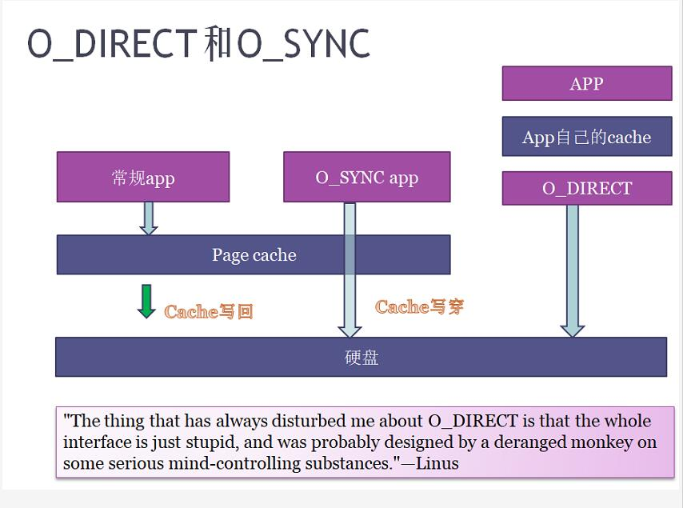
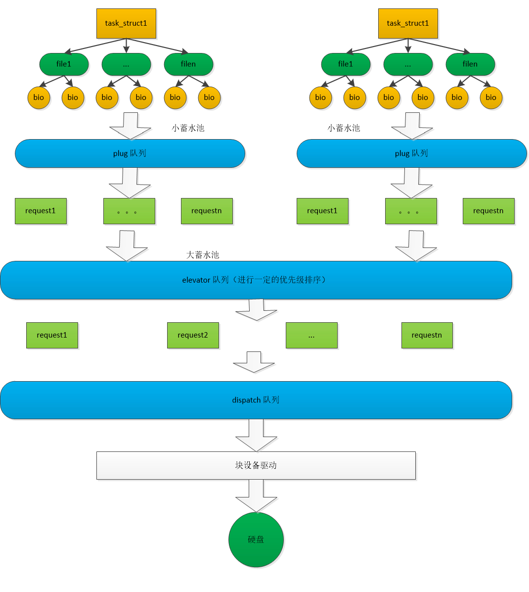

梳理其底层流程，理解最后是如何访问到硬盘的。

<!--more-->



# 访问硬盘整体视野

由上图可以看出，虚拟文件系统抽象了各种文件系统的操作为一个 `struct file_operations` 结构体中，至于这个 `file_operations` 如何访问到硬盘呢？

具体流程如下图所示：



## 由进程到inode

- 进程在内核中是以 `task_struct` 来体现的，当一个进程打开一个文件时，其会获取此文件的资源，并且返回文件对应的索引。
- 通过此索引，就可以在 `fd_arrary` 中获取一个文件的 `struct file` 整体描述，此结构体中就得到了与此文件所对应的 `inode` 。
- inode中就有文件系统所填充好的 `file_operations` ，此时就可以映射到 VFS 的 file_operations 操作

## 由inode到硬盘

- 当应用层调用文件操作接口时，首先从 `inode` 的 `page cache` 中寻找其要读的部分是否已经被缓存，如果缓存命中，则读取缓存并返回。在写过程中，如果写是以异步方式执行的话，也是先写入 `page cache` ，然后内核再在合适的时机同步到硬盘。
  + 此部如果正确执行，那就不会访问硬盘
- 当缓存不命中，再调用 `address_space_operations` 来对硬盘进行真正的读写操作。并将其对应的 `page` 写入 `page cache` 中
  + 这个过程和CPU的数据缓存和指令缓存类似

## 关于page cache 与 block 与 sector

- page cache 是内存管理的基本单元，而 block 是文件系统存储的基本单元，这两个都是逻辑单元 ，硬盘上的 sector 是由其硬件而决定的物理存储单元
- 所以根据大小不同，一个 page cache 可能对应多个 block，而一个block一般对应硬盘上的多个 sector

使用命令 `free -w` 可以看到其中有 `buffers,cached` 两项，其值对应于内核函数 `void si_meminfo(struct sysinfo *val)` 。

```c
  void si_meminfo(struct sysinfo *val)
  {
    val->totalram = totalram_pages;
    val->sharedram = global_page_state(NR_SHMEM);
    val->freeram = global_page_state(NR_FREE_PAGES);
    val->bufferram = nr_blockdev_pages();
    val->totalhigh = totalhigh_pages;
    val->freehigh = nr_free_highpages();
    val->mem_unit = PAGE_SIZE;
  }
  long nr_blockdev_pages(void)
  {
    struct block_device *bdev;
    long ret = 0;
    spin_lock(&bdev_lock);
    //从所有的块设备中，获取已经进入page cache的数量
    list_for_each_entry(bdev, &all_bdevs, bd_list) {
      ret += bdev->bd_inode->i_mapping->nrpages;
    }
    spin_unlock(&bdev_lock);
    return ret;
  }
```

- buffers 是站在硬盘的角度来看 cache 的个数，与文件系统无关
- cached 是站在文件系统的角度来看 page cache 的个数

## O_DIRECT 与 O_SYNC 的区别



- 普通方式下，数据读写都是暂存在 cache 中的
- 当设置为 `O_SYNC` 方式时，数据会同时写到 cache 与硬盘中
- 当设置为 `O_DIRECT` 方式时，取消了硬盘的 cache 直接对硬盘写入
  + 这种方式不推荐

以上这些概念和在硬件层次的 CPU cache 类似，只是一个是站在硬件角度，一个是在软件抽象角度。

# 访问硬盘的细节

 前面的图可以看出，最终访问硬盘的接口都是通过操作 `address_space_operations` 里的方法来实现的。

在从操作函数到最终访问到硬盘这中间经过了多次排序打包(都是为了尽量批量化、整块的操作I/O,以提高吞吐量)：

1. 单次读写文件时，将要访问的数据转换为对应的block并缓存到 plug 队列
   + 内存中的 page cache 与 block 的对应关系通过 bio(block io) 来实现，它链接了硬盘的block和内存的page cache
     + 如果对应的block不连续，那么会生成多个bio来实现多个小块
2. 将此进程的读写数据的 plug 队列中的 bio 尽量拼接为多个连续的块
   + 此时会将多个 bio 合并为多个 request
3. 将多个进程多个连续的块再次拼接为多个大块
   + 将多个 request 再次排序是由电梯调度算法来完成的
4. 最后将排序后的 request 放入 dispatch 队列生成数据包
5. 块设备驱动取出数据包写入硬盘

如下图所示：



## 使用 ftrace 捕捉访问硬盘的函数流程

### 准备工作

- 准备带有内容的文件 `file` 

- 编写读代码，并将其编译为名称是 `read` 的可执行文件

```c
  #include <unistd.h>
  #include <fcntl.h>
  #include <stdio.h>

  #define READ_SIZE 4096
  int main(void)
  {
    int fd = 0;
    char buf[READ_SIZE];

    sleep(30); //waiting for run ftrace shell
    if((fd = open("./file", O_RDONLY)) == -1)
    {
      perror("can not open file:");
    }

    read(fd, buf, READ_SIZE);
    read(fd, buf, READ_SIZE);

    return 0;
  }
```

- 编写 ftrace 脚本：

```sh
  #! /bin/bash

  debugfs=/sys/kernel/debug

  echo nop > ${debugfs}/tracing/current_tracer
  echo 0 > ${debugfs}/tracing/tracing_on
  echo `pidof read` > ${debugfs}/tracing/set_ftrace_pid
  echo function_graph > ${debugfs}/tracing/current_tracer
  echo vfs_read > ${debugfs}/tracing/set_graph_function
  echo 1 > ${debugfs}/tracing/tracing_on
```

### 运行

- 首先运行 read : `./read` 
- 然后使用 root 身份启动脚本 `./ftrace.sh` 
- 待 read 退出后，将捕捉到的结果存入文件： `cat /sys/kernel/debug/tracing/trace > result`

### 最终如下所示

```shell
# tracer: function_graph

# 

# CPU  DURATION                  FUNCTION CALLS

# |     |   |                     |   |   |   |

2)         |  vfs_read() {
3)         |    rw_verify_area() {
4)         |      security_file_permission() {
5)         |        apparmor_file_permission() {
6)         |          common_file_perm() {
7) 0.270 us    |            aa_file_perm();
8) 1.821 us    |          }
9) 2.813 us    |        }
10)         |        __fsnotify_parent() {
11) 0.221 us    |          dget_parent();
12)         |          dput() {
13) 0.124 us    |            _cond_resched();
14) 1.166 us    |          }
15) 3.238 us    |        }
16) 0.190 us    |        fsnotify();
17) 9.296 us    |      }
18) + 10.466 us   |    }
19)         |    __vfs_read() {
20)         |      new_sync_read() {
21)         |        ext4_file_read_iter() {
22)         |          generic_file_read_iter() {
23) 0.125 us    |            _cond_resched();
24)         |            pagecache_get_page() {
25) 0.966 us    |              find_get_entry();
26) 2.109 us    |            }
27)         |            mark_page_accessed() {
28) 0.368 us    |              activate_page();
29) 0.699 us    |              workingset_activation();
30) 3.181 us    |            }
31) 0.120 us    |            _cond_resched();
32) 0.130 us    |            _cond_resched();
33)         |            pagecache_get_page() {
34) 0.180 us    |              find_get_entry();
35) 1.072 us    |            }
36)         |            touch_atime() {
37)         |              __atime_needs_update() {
38)         |                current_time() {
39) 0.203 us    |                  current_kernel_time64();
40) 0.120 us    |                  timespec_trunc();
41) 2.380 us    |                }
42) 3.742 us    |              }
43) 0.307 us    |              __sb_start_write();
44)         |              __mnt_want_write() {
45) 0.106 us    |                __mnt_is_readonly.part.10();
46) 1.453 us    |              }
47)         |              current_time() {
48) 0.117 us    |                current_kernel_time64();
49) 0.120 us    |                timespec_trunc();
50) 2.082 us    |              }
51)         |              generic_update_time() {
52)         |                __mark_inode_dirty() {
53)         |                  ext4_dirty_inode() {
54)         |                    __ext4_journal_start_sb() {
55)         |                      ext4_journal_check_start() {
56) 0.108 us    |                        _cond_resched();
57) 1.427 us    |                      }
58)         |                      jbd2__journal_start() {
59)         |                        kmem_cache_alloc() {
60) 0.114 us    |                          _cond_resched();
61) 0.188 us    |                          memcg_kmem_put_cache();
62) 2.576 us    |                        }
63)         |                        start_this_handle() {
64)         |                          kmem_cache_alloc() {
65) 0.117 us    |                            _cond_resched();
66)         |                            __slab_alloc() {
67) 1.082 us    |                              ___slab_alloc();
68) 2.228 us    |                            }
69) 0.186 us    |                            memcg_kmem_put_cache();
70) 5.606 us    |                          }
71) 0.154 us    |                          _raw_read_lock();
72) 0.144 us    |                          _raw_write_lock();
73) 0.227 us    |                          ktime_get();
74) 0.107 us    |                          round_jiffies_up();
75)         |                          add_timer() {
76)         |                            lock_timer_base() {
77) 0.120 us    |                              _raw_spin_lock_irqsave();
78) 1.260 us    |                            }
79) 0.127 us    |                            detach_if_pending();
80) 0.217 us    |                            get_nohz_timer_target();
81) 0.118 us    |                            _raw_spin_lock();
82)         |                            __internal_add_timer() {
83) 0.164 us    |                              calc_wheel_index();
84) 1.387 us    |                            }
85) 0.168 us    |                            trigger_dyntick_cpu.isra.34();
86) 0.168 us    |                            _raw_spin_unlock_irqrestore();
87) + 10.763 us   |                          }
88) 0.116 us    |                          _raw_read_lock();
89) 0.321 us    |                          add_transaction_credits();
90) + 25.502 us   |                        }
91) + 30.493 us   |                      }
92) + 33.955 us   |                    }
93)         |                    ext4_mark_inode_dirty() {
94) 0.114 us    |                      _cond_resched();
95)         |                      ext4_reserve_inode_write() {
96)         |                        __ext4_get_inode_loc() {
97) 0.578 us    |                          ext4_get_group_desc();
98) 0.194 us    |                          ext4_inode_table();
99)         |                          __getblk_gfp() {
100)         |                            __find_get_block() {
101)         |                              pagecache_get_page() {
102) 1.988 us    |                                find_get_entry();
103) 0.148 us    |                                mark_page_accessed();
104) 4.000 us    |                              }
105) 0.221 us    |                              _raw_spin_lock();
106) 0.241 us    |                              __brelse();
107) 8.981 us    |                            }
108) 0.111 us    |                            _cond_resched();
109) + 10.986 us   |                          }
110) + 15.584 us   |                        }
111)         |                        __ext4_journal_get_write_access() {
112) 0.110 us    |                          _cond_resched();
113)         |                          jbd2_journal_get_write_access() {
114) 0.555 us    |                            jbd2_write_access_granted.part.9();
115) 0.367 us    |                            jbd2_journal_add_journal_head();
116)         |                            do_get_write_access() {
117) 0.114 us    |                              _cond_resched();
118)         |                              unlock_buffer() {
119)         |                                wake_up_bit() {
120) 0.287 us    |                                  __wake_up_bit();
121) 1.353 us    |                                }
122) 2.439 us    |                              }
123) 0.121 us    |                              _raw_spin_lock();
124)         |                              __jbd2_journal_file_buffer() {
125) 0.178 us    |                                jbd2_journal_grab_journal_head();
126) 1.533 us    |                              }
127) 0.250 us    |                              jbd2_journal_cancel_revoke();
128) 9.387 us    |                            }
129) 0.177 us    |                            jbd2_journal_put_journal_head();
130) + 14.261 us   |                          }
131) + 16.562 us   |                        }
132) + 34.309 us   |                      }
133)         |                      ext4_mark_iloc_dirty() {
134)         |                        ext4_do_update_inode() {
135) 0.110 us    |                          _raw_spin_lock();
136) 0.307 us    |                          from_kuid();
137) 0.287 us    |                          from_kgid();
138) 0.287 us    |                          from_kprojid();
139) 0.124 us    |                          ext4_inode_csum_set();
140)         |                          __ext4_handle_dirty_metadata() {
141) 0.117 us    |                            _cond_resched();
142)         |                            jbd2_journal_dirty_metadata() {
143) 0.117 us    |                              _raw_spin_lock();
144)         |                              __jbd2_journal_file_buffer() {
145) 0.334 us    |                                __jbd2_journal_temp_unlink_buffer();
146) 1.564 us    |                              }
147) 3.876 us    |                            }
148) 5.908 us    |                          }
149) 0.110 us    |                          __brelse();
150) + 14.648 us   |                        }
151) + 15.784 us   |                      }
152) + 53.235 us   |                    }
153)         |                    __ext4_journal_stop() {
154)         |                      jbd2_journal_stop() {
155)         |                        __wake_up() {
156) 0.227 us    |                          _raw_spin_lock_irqsave();
157) 0.138 us    |                          __wake_up_common();
158) 0.164 us    |                          _raw_spin_unlock_irqrestore();
159) 3.204 us    |                        }
160) 0.254 us    |                        kmem_cache_free();
161) 5.818 us    |                      }
162) 6.960 us    |                    }
163) + 97.127 us   |                  }
164) 0.113 us    |                  _raw_spin_lock();
165)         |                  locked_inode_to_wb_and_lock_list() {
166) 0.224 us    |                    _raw_spin_lock();
167) 1.363 us    |                  }
168)         |                  inode_io_list_move_locked() {
169) 0.237 us    |                    wb_io_lists_populated.part.53();
170) 1.461 us    |                  }
171)         |                  wb_wakeup_delayed() {
172) 0.127 us    |                    __msecs_to_jiffies();
173) 0.197 us    |                    _raw_spin_lock_bh();
174)         |                    queue_delayed_work_on() {
175)         |                      __queue_delayed_work() {
176)         |                        add_timer() {
177)         |                          lock_timer_base() {
178) 0.121 us    |                            _raw_spin_lock_irqsave();
179) 1.096 us    |                          }
180) 0.114 us    |                          detach_if_pending();
181) 0.113 us    |                          get_nohz_timer_target();
182) 0.117 us    |                          _raw_spin_lock();
183)         |                          __internal_add_timer() {
184) 0.113 us    |                            calc_wheel_index();
185) 0.988 us    |                          }
186) 0.138 us    |                          trigger_dyntick_cpu.isra.34();
187) 0.160 us    |                          _raw_spin_unlock_irqrestore();
188) 8.363 us    |                        }
189) 9.550 us    |                      }
190) + 10.489 us   |                    }
191)         |                    _raw_spin_unlock_bh() {
192) 0.188 us    |                      __local_bh_enable_ip();
193) 1.213 us    |                    }
194) + 15.785 us   |                  }
195) ! 122.297 us  |                }
196) ! 123.500 us  |              }
197) 0.127 us    |              __mnt_drop_write();
198) 0.160 us    |              __sb_end_write();
199) ! 138.075 us  |            }
200) ! 153.201 us  |          }
201) ! 154.442 us  |        }
202) ! 155.671 us  |      }
203) ! 156.784 us  |    }
204)         |    __fsnotify_parent() {
205) 0.170 us    |      dget_parent();
206)         |      dput() {
207) 0.111 us    |        _cond_resched();
208) 1.090 us    |      }
209) 3.040 us    |    }
210) 0.184 us    |    fsnotify();
211) ! 174.753 us  |  }
212)         |  vfs_read() {
213)         |    rw_verify_area() {
214)         |      security_file_permission() {
215)         |        apparmor_file_permission() {
216)         |          common_file_perm() {
217) 0.221 us    |            aa_file_perm();
218) 1.180 us    |          }
219) 2.028 us    |        }
220)         |        __fsnotify_parent() {
221) 0.196 us    |          dget_parent();
222)         |          dput() {
223) 0.170 us    |            _cond_resched();
224) 1.159 us    |          }
225) 3.187 us    |        }
226) 0.198 us    |        fsnotify();
227) 8.079 us    |      }
228) 9.001 us    |    }
229)         |    __vfs_read() {
230)         |      new_sync_read() {
231)         |        ext4_file_read_iter() {
232)         |          generic_file_read_iter() {
233) 0.123 us    |            _cond_resched();
234)         |            pagecache_get_page() {
235) 0.298 us    |              find_get_entry();
236) 1.280 us    |            }
237)         |            touch_atime() {
238)         |              __atime_needs_update() {
239)         |                current_time() {
240) 0.123 us    |                  current_kernel_time64();
241) 0.114 us    |                  timespec_trunc();
242) 1.988 us    |                }
243) 3.053 us    |              }
244) 4.029 us    |            }
245) 8.182 us    |          }
246) 9.162 us    |        }
247) + 10.298 us   |      }
248) + 11.295 us   |    }
249) + 22.191 us   |  }
```

可以发现：第一次读所花的时间比第二次多得多，因为第一次内存并没有此文件的 cache，所以需要到硬盘读取，而第二次直接从内存读取了。

## 使用blktrace(捕捉),blkparse(分析) blk io操作流程

- 使用 `blktrace -d /dev/sda1 -o - |blkparse -i - > 1.trace`来监视 `/dev/sda1` 
- 在这个分区中的路径中使用命令 :

```shell
#使用sync方式写入 barry 文件，这样保证硬盘确实被访问到了
dd if=read.c of=barry oflag=sync
```

- 停止 `blktrace` 后查看文件 `1.trace`
- 发现与 `dd` 命令相关的有这么一行:

```shell
//dd 命令将数据写入到了 181857104扇区，前面知道器扇区是512字节，那么block也就是 22732138
8,0    2        9    42.366779547  7055  A  WS 181859152 + 8 <- (8,1) 181857104
8,1    2       10    42.366782026  7055  Q  WS 181859152 + 8 [dd]
```

使用 `blkcat` 就可以查出其文件内容。

## 电梯调度算法

常用的电梯调度算法包括：

- Noop : 最简单的调度器，把邻近的bio进行了合并处理
- Deadline: 保证读优先的前提下，写不会饿死
- CFQ: 考虑进程被公平调度
  + 通过指定NICE值确定优先级，与进程调度策略一致

### 体验

- 查看当前算法,并将其修改为cfq

```shell
  cat /sys/block/sda/queue/scheduler
  #使用 echo noop/deadline/cfg > scheduler 来改变其调度算法
```

- 使用 ionice 命令来启动两个优先级不同的进程

```shell
  ionice -c 2 -n 0 cat /dev/sda > /dev/null &
  ionice -c 2 -n 7 cat /dev/sda > /dev/null &
```

- 使用 iotop 来查看io占用,可以看到高优先级的占用磁盘量会大一点
  + 如果将io设为 rt 模式，那么rt占用会更大。

### cgroup -> 用于CFQ调度算法

与进程调度中的概念类似，使用 cgroup 来将多个进程加入一个群组以从整体上限制群组使用率。

与 IO 相关的 group 位于路径 `/sys/fs/cgroup/blkio` ,在此目录下每新建一个文件夹就代表新建了一个组。

- 修改权重使用 `echo <num> > blkio.weight`
- 为进程分配IO组使用 `cgexec -g blkio:<group_name> <process>`

```shell
  #在 /sys/fs/cgroup/blkio 中新建组 A 和 B
  mkdir A
  mkdir B
  #修改A的权重为100，B的权重为10
  echo 100 > A/blkio.weight
  echo 10 > B/blkio.weight
  #启动两个进程
  cgexec -g blkio:A dd if=/dev/sda of=/dev/null &
  cgexec -g blkio:B dd if=/dev/sda of=/dev/null &
  #通过iotop可以观察到权重高的io进程硬盘占有率更高
```

- 限制读硬盘的速度使用 `echo "<device_num> <speed>" blkio.throttle.read_bps_device`
- 限制写硬盘的速度使用 `echo "<device_num> <speed>" blkio.throttle.write_bps_device`

```shell
  #限制A group 对硬盘 /dev/sda 的读写速度为1M字节每秒
  #8:0 代表设备号
  echo "8:0 1048576" >  blkio.throttle.read_bps_device 
  #cgroup v1 写限制只能限制direct模式，cgroup v2 写限制通过观察dirty pages以得到write back速度来限制
  echo "8:0 1048576" >  blkio.throttle.write_bps_device 
```

## 观察硬盘状态

使用 `iostat` 观察硬盘的全局状态。
