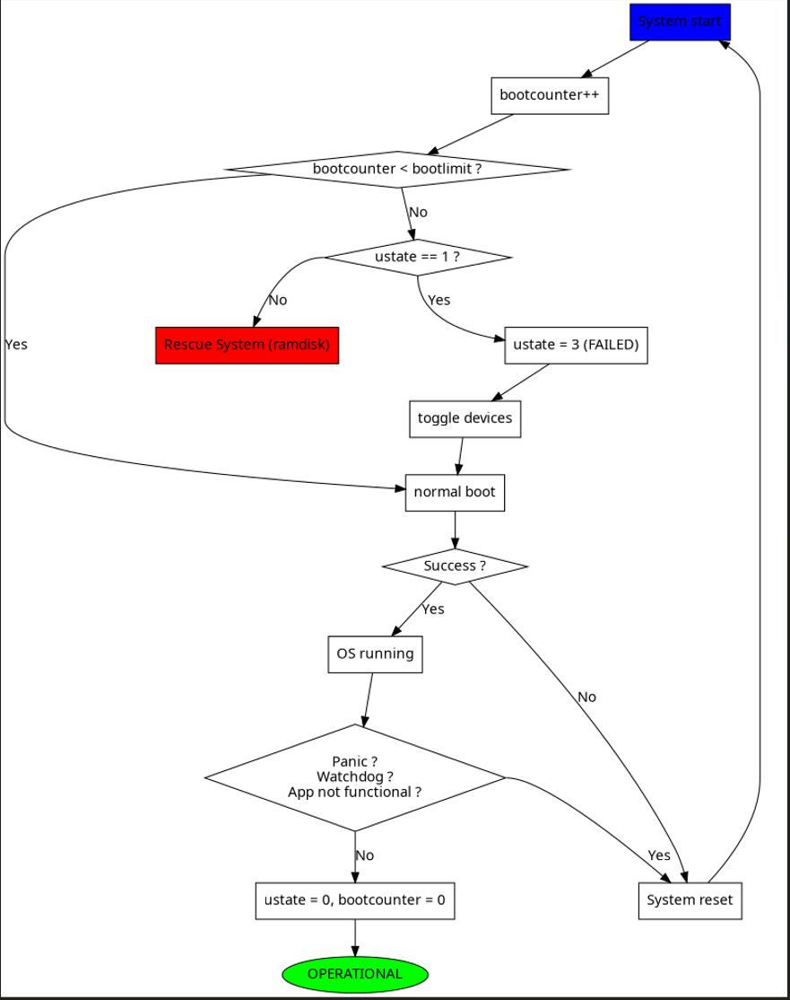

这里记录 Swupdate 的简易使用说明。

<!--more-->

# 初识

## 流程

SWUpdate 是位于用户空间的应用程序，用于升级嵌入式系统（不包含 bootloader）。

它以事务的方式标识整个升级过程，事务的标识会写入到 bootloader 中，bootloader 会根据事务标记的值来确认当前升级是否成功。

比如 SWUpdate 通过设置环境变量`recovery_status`，来表示升级过程：

1. 开始升级时，其值为`progress`

2. 升级成功后，其值会被擦除

3. 升级失败，其值为`failed`

bootloader 通过查看其值为`progress`或`failed`则代表其升级未完成：

- 如果当前为`single-copy`模式，则会再次启动升级流程

- 如果当前为`double-copy`模式，则会启动上一个版本的程序

## 文件格式


上图为其打包后的文件版本，主要是`sw-description`来实现多个镜像文件的描述。

可以看到它是将多个文件打包为一个`cpio`文件，那么这里再来复习一下`cpio`工具的操作：

```shell
### 打包
# 创建打包：通过 find 遍历当前文件及文件夹输出给 cpio
find . -depth -print | cpio -o > /path/archive.cpio


### 解包
# 可以解包所有文件
cpio -i -vd < archive.cpio
# 也可以只提取指定文件
cpio -i -d /etc/fstab < archive.cpio


### 查看
# 仅查看内容不解包
cpio -t < archive.cpio
```

**需要注意的是：** cpio 打包后的文件大小不能超过 4GB.

## 编译

在 `buildroot`中只需要搜`swupdate`就可以找到该包并使能，如果想要更细致的配置，可以通过以下命令配置：

```shell
make swupdate-menuconfig
```

在输出路径`output/build/swupdate/tools`中有文件`swupdate-progress.c`可以作为很好的参考，用于与`swupdate`交互获取当前的状态。

## 使用

`swupdate`的一般流程如下：

1. 提取`sw-description`并校验，如果还使能了签名验证，还会提取`sw-description.sig` 文件进行签名验证。

2. 根据`sw-description`中提供的信息，读取当前设备的硬件版本，来验证是否有兼容该硬件版本的软件包。

3. 根据`sw-description`中的信息识别哪些软件包需要被安装，如果具有`embedded-script`则会在解析这些软件包前执行这些脚本，如果具有`hooks`则会在解析软件包时执行（即使这些软件包会被跳过）。最终生成一张执行列表和对应的哪些`handler`需要被调用。

4. 如果有`pre update command`，则先执行这些命令

5. 如果有分区的必要，则执行`partition handlers`

6. 依次从`cpio`文件中提取需要安装的软件包，在读取软件包时还会进行内容校验，如果检验失败则报错。

7. 在安装软件包之前，如果具有`pre-install`脚本，则会先执行这些脚本

8. 执行对应软件包的`handler`来安装软件包

9. 安装完成后，如果具有`post-install`脚本，则会执行这些脚本

10. 更新 bootloader 的环境变量

11. 向外部接口输出升级状态

12. 如果具有`post update command`则执行这些命令

使用`swupdate`执行升级命令为：

```shell
swupdate -i <filename>
```

也可以启动一个网络服务，通过网页来升级：

```shell
# 启动后就可以通过 http://<target_ip>:8080 来访问
swupdate -w "--document-root ./www --port 8080"
```

## 改变 U-BOOT

`U-BOOT`可以保存两份环境变量，便于保证在更新环境变量时的安全性，要使能这个特性，需要配置`CONFIG_ENV_OFFSET_REDUND`或`CONFIG_ENV_ADDR_REDUND`。

除此之外，还可以在`U-BOOT`中增加一个启动计数器，如果计数器没有正确的被应用程序清零则意味着这个版本升级的应用没有正常运行，然后可以切换到之前备份的应用。

## 构建升级包

升级包需要`sw-updescription`是第一个文件，其余的镜像可以依次往后放即可。使用类似下面的脚本就可以打包：

```shell
CONTAINER_VER="1.0"
PRODUCT_NAME="my-software"
FILES="sw-description image1.ubifs  \
       image2.gz.u-boot uImage.bin myfile sdcard.img"
for i in $FILES;do
        echo $i;done | cpio -ov -H crc >  ${PRODUCT_NAME}_${CONTAINER_VER}.swu
```

也可以通过[GitHub - sbabic/swugenerator: A host tool to generate SWU update package for SWUpdate](https://github.com/sbabic/swugenerator/)来打包生成升级包。

升级包的查看可以通过下面的命令完成：

```shell
swupdate -c -i my-software_1.0.swu
```

# 升级策略

## single copy


正常情况下，bootloader 直接启动用户的内核，进入文件系统运行应用程序。

当需要升级时：

1. 通知 bootloader 需要启动`swupdate`，然后重启系统
   
   - 通知的方式多种多样，比如通过环境变量、GPIO等

2. bootloader 启动带 swupdate 的内核和 RAMFS

3. 在 RAMFS 中启动`swupdate`分析升级包并升级

如果升级过程失败，应用程序无法正确清空 bootloader 的启动计数器，则 bootloader 会主动进入升级系统。

## double copy


bootloader 交替的启动切换最新的软件，`swupdate`则升级那个未被启动的软件分区。

当当前应用程序没有正确清空 bootloader 的启动计数器时，bootloader 会主动切换回上一个版本的应用程序。

bootloader 根据变量`ustate`的值为1，来确认目前有新的软件被安装，那么就需要通过计数器来测试该软件是否安装正确。当测试失败，bootloader 也可以修改`ustate`的值为 3，来通知应用程序升级是否成功。

- 当`ustate=0`，则表示当前无新升级，bootloader 正常引导

- 当`ustate=1`，表示有新软件被安装，需要测试
  
  - 测试失败，由 bootloader 将值设置为 3
  
  - 测试成功，由应用程序将值设置为 0



## double-copy with rescue system


在`double-copy`的基础上，还可以增加一个救援系统，这样当两个版本都无法正确运行（或那个硬盘损坏）的情况下，仍然可以启动救援系统来重新格式化、更新系统。

> 这个救援系统也是可以被更新的

# 语法

## 示例

一个典型的`sw-description`文件内容如下：

```shell
software =
{
        version = "0.1.0";
        description = "Firmware update for XXXXX Project";

        hardware-compatibility: [ "1.0", "1.2", "1.3"];

        /* partitions tag is used to resize UBI partitions */
        partitions: ( /* UBI Volumes */
                {
                        name = "rootfs";
                        device = "mtd4";
                        size = 104896512; /* in bytes */
                },
                {
                        name = "data";
                        device = "mtd5";
                        size = 50448384; /* in bytes */
                }
        );


        images: (
                {
                        filename = "rootfs.ubifs";
                        volume = "rootfs";
                },
                {
                        filename = "swupdate.ext3.gz.u-boot";
                        volume = "fs_recovery";
                },
                {
                        filename = "sdcard.ext3.gz";
                        device = "/dev/mmcblk0p1";
                        compressed = "zlib";
                },
                {
                        filename = "bootlogo.bmp";
                        volume = "splash";
                },
                {
                        filename = "uImage.bin";
                        volume = "kernel";
                },
                {
                        filename = "fpga.txt";
                        type = "fpga";
                },
                {
                        filename = "bootloader-env";
                        type = "bootloader";
                }
        );

        files: (
                {
                        filename = "README";
                        path = "/README";
                        device = "/dev/mmcblk0p1";
                        filesystem = "vfat"
                }
        );

        scripts: (
                {
                        filename = "erase_at_end";
                        type = "lua";
                },
                {
                        filename = "display_info";
                        type = "lua";
                }
        );

        bootenv: (
                {
                        name = "vram";
                        value = "4M";
                },
                {
                        name = "addfb";
                        value = "setenv bootargs ${bootargs} omapfb.vram=1:2M,2:2M,3:2M omapdss.def_disp=lcd"
                }
        );
}
```

以`software`tag为顶层描述，下面的就是为各个镜像的单独说明。

上面中的`hardware-compatib`是为了软件与硬件的兼容，而硬件的信息则存储于`/etc/hwrevision`中，其格式为：

```shell
# boardname：设备名称，为了便于一个升级包还可以升级多种不同设备
# revision：设备的硬件版本
<boardname> <revision>
```

对于 double copy 的升级策略，一个升级包可能会对应两个分区，那么配置文件应该这样描述：

```shell
software =
{
        version = "0.1.0";

        stable = {
                copy-1: {
                        images: (
                        {
                                device = "/dev/mtd4"
                                ...
                        }
                        );
                }
                copy-2: {
                        images: (
                        {
                                device = "/dev/mtd5"
                                ...
                        }
                        );
                }
        };
}
```

在实际升级时，到底应该是选择哪个分区，则是由应用程序来区分（比如查看当前程序是挂载在哪个分区），然后给`swupdate`发送消息。

> 这个消息是要在 `swupdate`启动前就确认要升级哪个分区，然后通过`-e <selection,mode>`来告知`swupdate`。
> 
> 也可以在启动前创建一个连接文件`/dev/standby`指向需要被升级的分区。
> 
> 如果要在运行时来区分，就要在`sw-description`中编写嵌入式脚本来区分，Lua 脚本使用`getroot()`函数获取当前文件系统挂载的分区。

## 硬件兼容性

一个软件包可以兼容多个版本的硬件，则可以像前面一样，在文件内容开始一次性给出。但也有可能在不同的硬件版本下的文件会略有不同，那么还可以再进一步说明：

```shell
software =
{
        version = "0.1.0";

        myboard = {
            stable = {

                hardware-compatibility: ["1.0", "1.2", "2.0", "1.3", "3.0", "3.1"];
                rev-1.0: {
                        images: (
                                ...
                        );
                        scripts: (
                                ...
                        );
                }
                rev-1.2: {
                        hardware-compatibility: ["1.2"];
                        images: (
                                ...
                        );
                        scripts: (
                                ...
                        );
                }
                rev-2.0: {
                        hardware-compatibility: ["2.0"];
                        images: (
                                ...
                        );
                        scripts: (
                           ...
                        );
                }
                rev-1.3: {
                        hardware-compatibility: ["1.3"];
                        images: (
                            ...
                        );
                        scripts: (
                            ...
                        );
                }

                rev-3.0:
                {
                        hardware-compatibility: ["3.0"];
                        images: (
                                ...
                        );
                        scripts: (
                                ...
                        );
                }
                rev-3.1:
                {
                        hardware-compatibility: ["3.1"];
                        images: (
                                ...
                        );
                        scripts: (
                                ...
                        );
                }
             }
        }
}
```

如果其中有部分版本完全一致，那么还可以使用引用的方式：

```shell
software =
 {
         version = "0.1.0";

         myboard = {
             stable = {

                 hardware-compatibility: ["1.0", "1.2", "2.0", "1.3", "3.0", "3.1"];
                 rev-1x: {
                         images: (
                            ...
                         );
                         scripts: (
                             ...
                         );
                 }
                 rev1.0 = {
                         ref = "#./rev-1x";
                 }
                 rev1.2 = {
                         ref = "#./rev-1x";
                 }
                 rev1.3 = {
                         ref = "#./rev-1x";
                 }
                 rev-2x: {
                         images: (
                              ...
                         );
                         scripts: (
                              ...
                         );
                 }
                 rev2.0 = {
                         ref = "#./rev-2x";
                 }

                 rev-3x: {
                         images: (
                              ...
                         );
                         scripts: (
                               ...
                         );
                 }
                 rev3.0 = {
                         ref = "#./rev-3x";
                 }
                 rev3.1 = {
                         ref = "#./rev-3x";
                 }
              }
         }
}
```

`ref`是表示引用的关键字，后面的`#`是必须的。可以用`./`表示当前层级，用`../`表示上一个层级。

`swupdate`获取版本号是在`/etc/hwrevision`文件中，但是这个文件的内容则可以在应用程序启动时通过各种方式进行更新，比如读取当前硬件上的 EEPROM 获取版本号等。

## images

`images`标识表示要更新到系统中的镜像文件，其语法为：

```shell
images: (
        {
                filename[mandatory] = <Name in CPIO Archive>;
                volume[optional] = <destination volume>;
                device[optional] = <destination volume>;
                mtdname[optional] = <destination mtd name>;
                type[optional] = <handler>;
                /* optionally, the image can be copied at a specific offset */
                offset[optional] = <offset>;
                /* optionally, the image can be compressed if it is in raw mode */
                compressed;
        },
        /* Next Image */
        .....
);
```

对于 emmc 而言，其内容大体如下：

```shell
{
        filename = "core-image-base.ext3";
        device = "/dev/mmcblk0p1";
}
```

对于 flash 而言，其内容大体如下：

```shell
{
        filename = "u-boot.bin";
        device = "/dev/mmcblk0p1";
        offset = "16K";
}
```

## Files

`files`标识用于拷贝文件到系统，其语法如下：

```shell
files: (
        {
                filename = <Name in CPIO Archive>;
                path = <path in filesystem>;
                device[optional] = <device node >;
                filesystem[optional] = <filesystem for mount>;
                properties[optional] = {create-destination = "true";}
        }
);
```

主要就是将文件拷贝到对应路径。

## scripts

`scripts`标记用于执行一系列的脚本，默认情况下如果没有标注脚本的类型，`swupdate`会认为是`lua`脚本。

### lua

```shell
scripts: (
        {
                filename = <Name in CPIO Archive>;
                type = "lua";
        }
);
```

lua 脚本必须至少包含 3 个函数：

- `function preinst()`：安装镜像前会被执行

- `function postinst()`：安装镜像后会被执行

- `function postfailure()`：升级失败后会被执行

### shellscript

```shell
scripts: (
        {
                filename = <Name in CPIO Archive>;
                type = "shellscript";
        }
);
```

`swupdate`会在镜像安装前后执行脚本，在执行时会传入参数"preinst"、"postinst"或"postfailure"，脚本可以依据这些参数进行不同的操作。

除此之外，也可以单独编写`preinstall`和`postinstall`脚本：

```shell
scripts: (
        {
                filename = <Name in CPIO Archive>;
                type = "preinstall";
        }
);
```

```shell
scripts: (
        {
                filename = <Name in CPIO Archive>;
                type = "postinstall";
        }
);
```

## 升级过程中的标记状态

默认情况下`swupdate`通过设置 bootloader 的环境变量`recovery_status`来表示升级的过程，其值有以下几种情况：

- `in_progress`：正在升级过程中

- 值被清空：升级成功

- `failed`：升级失败

如果想关闭这些状态记录，可以在配置文件中设置：

```shell
software =
{
        version = "0.1.0";
        bootloader_transaction_marker = false;
        ...
```

除了这种字符串标记外，还有将 bootloader 的环境变量`ustate`来设数值方式：

- `1`：安装成功

- `3`：安装失败

关闭`ustate`也是在配置文件中设置：

```shell
software =
{
        version = "0.1.0";
        bootloader_state_markerer = false;
```

## 更新 bootloader 的环境变量

有两种方式可以更新 bootloader 的环境变量，一种方式是将变量写在文件中，然后将此文件在配置文件中标注一下：

```shell
images: (
        {
                filename = "bootloader-env";
                type = "bootloader";
        }
)
```

文件中变量赋值的格式为：`<name of variable>=<value>`，如果值不设置，则该变量会被清除掉。

就像下面这样：

```shell
# Default variables
bootslot=0
board_name=myboard
baudrate=115200

## Board Revision dependent
board_revision=1.0
```

另一种方式是直接在配置文件中就写变量：

```shell
bootenv: (
        {
                name = <Variable name>;
                value = <Variable value>;
        }
)
```

## 版本管理

`swupdate`可以进行版本号比较，默认格式为：`<major>.<minor>.<revision>.<build>`

每个小段都是由数值组成的，其值为 0~65535，4 个 16 位组合成 64 位进行大小比较。

在启动`swupdate`之前，应用软件需要更新`/etc/sw-versions`来保存各个软件包的版本，然后再来启动`swupdate`进行版本管理，文件内容格式为：

```shell
<name of component>     <version>
```

## 嵌入式脚本(Embedded Script)

嵌入式脚本指的是在`sw-description`中嵌入脚本，该脚本是对配置文件全局可见的。

```shell
embedded-script = "<Lua code>"
```

在编写脚本时需要注意：双引号应该使用转义字符进行转义，以避免影响脚本的解析。

比如：

```shell
print (\"Test\")
```

在配置文件中的镜像文件或普通文件类型都可以调用一个嵌入式脚本的函数，通过`hook`标记函数名：

```shell
files: (
        {
                filename = "examples.tar";
                type = "archive";
                path = "/tmp/test";
                hook = "set_version";
                preserve-attributes = true;
        }
);
```

一个脚本的示例如下：

```lua
function set_version(image)
        print (\"RECOVERY_STATUS.RUN: \".. swupdate.RECOVERY_STATUS.RUN)
        for k,l in pairs(image) do
                swupdate.trace(\"image[\" .. tostring(k) .. \"] = \" .. tostring(l))
        end
        image.version = \"1.0\"
        image.install_if_different = true
        return true, image
end
```

上述的`image`则为传入的参数列表，该脚本设置了版本和安装属性然后返回。

`swupdate`提供了一些函数便于调用，在脚本前需要写入：

```lua
require ('swupdate')
```

# 验证与签名

## 基本逻辑

`swupdate`的逻辑为：

1. 对`sw-description`进行签名验证，确保该文件未被篡改

2. 在`sw-description`中包含各个独立镜像文件的哈希校验，确认这些镜像文件的正确性

`swupdate`可以通过`menuconfig`来配置签名验证使用的算法

- RSA 公钥/私钥验证：私钥存放在构建主机中，公钥存放在目标设备上

- CMS 用于证书

- GPG 用于签名

## 生成密钥和证书

对于`RSA`和`CMS`算法，OpenSSL 用来生成密钥，对于`GPG`，gpg 用于生成密钥和对镜像文件签名。

### 使用 RSA

生成公钥和私钥：

```shell
# 先生成私钥
openssl genrsa -aes256 -out priv.pem
# 再生成公钥
openssl rsa -in priv.pem -out public.pem -outform PEM -pubout
```

使用 RSA 生成签名：

```shell
# 对 sw-description 生成 rsa-pkcs#1.5 签名
openssl dgst -sha256 -sign priv.pem sw-description > sw-description.sig


# 也可以生成 rsa-pss 签名
openssl dgst -sha256 -sign priv.pem -sigopt rsa_padding_mode:pss \
    -sigopt rsa_pss_saltlen:-2 sw-description > sw-description.sig
```

### 证书生成

```shell
openssl req -x509 -newkey rsa:4096 -nodes -keyout mycert.key.pem \
    -out mycert.cert.pem -subj "/O=SWUpdate /CN=target"
```

- `mycert.key.pem`用于保存在构建主机上

- `mycert.cert.pe`用于保存在目标设备机上

### 使用 CMS 进行签名

```shell
openssl cms -sign -in  sw-description -out sw-description.sig -signer mycert.cert.pem \
        -inkey mycert.key.pem -outform DER -nosmimecap -binary
```

## 使用签名和验证

对于签名而言，配置文件`sw-description`和`sw-description.sig`结合使用，签名文件跟在配置文件之后。

在配置文件中的镜像都需要包含属性`sha256`，代表该镜像文件的校验和。

下面的脚本演示了如何打包：

```shell
#!/bin/bash

MODE="RSA-PKCS-1.5"
PRODUCT_NAME="myproduct"
CONTAINER_VER="1.0"
IMAGES="rootfs kernel"
FILES="sw-description sw-description.sig $IMAGES"

#if you use RSA
if [ x"$MODE" == "xRSA-PKCS-1.5" ]; then
    openssl dgst -sha256 -sign priv.pem sw-description > sw-description.sig
elif if [ x"$MODE" == "xRSA-PSS" ]; then
    openssl dgst -sha256 -sign priv.pem -sigopt rsa_padding_mode:pss \
        -sigopt rsa_pss_saltlen:-2 sw-description > sw-description.sig
elif if [ x"$MODE" == "xGPG" ]; then
    gpg --batch --homedir "${GPG_HOME_DIR}" --default-key "${GPG_KEY}" \
        --output sw-description.sig --detach-sig sw-description
else
    openssl cms -sign -in  sw-description -out sw-description.sig -signer mycert.cert.pem \
        -inkey mycert.key.pem -outform DER -nosmimecap -binary
fi
for i in $FILES;do
        echo $i;done | cpio -ov -H crc >  ${PRODUCT_NAME}_${CONTAINER_VER}.swu
```

下面的配置文件演示了带有 sha256 校验的内容：

```shell
software =
{
        version = "0.1.0";

        hardware-compatibility: [ "revC"];

        images: (
                {
                    filename = "core-image-full-cmdline-beaglebone.ext3";
                    device = "/dev/mmcblk0p2";
                    type = "raw";
                    sha256 = "43cdedde429d1ee379a7d91e3e7c4b0b9ff952543a91a55bb2221e5c72cb342b";
                }
        );
        scripts: (
                {
                    filename = "test.lua";
                    type = "lua";
                    sha256 = "f53e0b271af4c2896f56a6adffa79a1ffa3e373c9ac96e00c4cfc577b9bea5f1";
                 }
        );
}
```

# 对称加密

`swupdate`支持使用 AES 对镜像文件进行对称加密，在配置`swupdate`时需要使能`ENCRYPTED_IMAGES`.其使用步骤如下：

## 生成密钥

对于`aes-256-cbc`，需要生成 32 字节密钥和 16 字节初始化向量：

```shell
openssl rand -hex 32
# key, for example 390ad54490a4a5f53722291023c19e08ffb5c4677a59e958c96ffa6e641df040
openssl rand -hex 16
# IV, for example d5d601bacfe13100b149177318ebc7a4
```

## 加密镜像

```shell
openssl enc -aes-256-cbc -in <INFILE> -out <OUTFILE> -K <KEY> -iv <IV>
```

- `<INFILE>`：输入的原始镜像文件

- `<OUTFILE>`：加密后的镜像文件

- `<KEY>`：上面生成的 32 字节的密钥

- `<IV>`：上面生成的 16 字节初始化向量

## 创建密钥文件

创建密钥文件，将密钥和初始化向量以空格分隔，写入文件。并在启动 `swupdate`时，以`-K`选项传入该文件：

```shell
390ad54490a4a5f53722291023c19e08ffb5c4677a59e958c96ffa6e641df040 d5d601bacfe13100b149177318ebc7a4
```

## 配置示例

最后是在配置文件中加入描述：

```shell
software =
{
        version = "0.0.1";
        images: ( {
                        filename = "core-image-full-cmdline-beaglebone.ext3.enc";
                        device = "/dev/mmcblk0p3";
                        encrypted = true;
                        ivt = "65D793B87B6724BB27954C7664F15FF3";
                }
        );
}
```

# handler

`handler`指的就是对各种镜像文件的安装处理程序，根据镜像文件的类型来匹配不同的`handler`。

`swupdate`开放了接口，可以扩展增加各种`handler`，以适配用户定义的类型。

## 创建新的 `handler`

只需要按照`swupdate`的接口注册执行函数就可以了。

```cpp
int my_handler(struct img_type *img,
        void __attribute__ ((__unused__)) *data)
```

`img_type`指向要安装的镜像文件的起始，处理函数通过此结构体获取文件的信息，然后读取文件内容并执行安装。

`data`是用于描述安装过程的数据指针，对于脚本的 handler，其为`struct script_handler_data`

`swupdate`还提供了通用函数，将流数据拷贝到目的地址：

```cpp
int copyfile(int fdin, int fdout, int nbytes, unsigned long *offs,
        int skip_file, int compressed, uint32_t *checksum, unsigned char *hash);
```

- `fdin`：输入流，在处理函数中通过`img->fdin`获得

- `hash`：镜像文件的签名

用户通过下面的函数注册新的`handler`函数：

```cpp
__attribute__((constructor))
void my_handler_init(void)
{
        register_handler("mytype", my_handler, my_mask, data);
}
```

其函数原型为：

```cpp
register_handler(my_image_type, my_handler, my_mask, data);
```

- `my_image_type`：以字符串表示的匹配镜像文件类型

- `my_handler`：处理函数的指针

- `my_mask`：`HANDLER_MASK`枚举值，表示可以处理的类型

- `data`：用于传递给处理函数的数据

# API

`swupdate`具有可被外部程序调用的 API，用于启动`swupdate`，发送镜像文件，获取状态等。

`swupdate`使用的是 Unix Domain Socket，socket 路径按照以下顺序来决定：

1. 编译时配置的`CONFIG_SOCKET_CTRL_PATH`

2. 当环境变量`RUNTIME_DIRECTORY`设置了，则其位于`$RUNTIME_DIRECTORY/sockinstctrl`

3. 当环境变量`TMPDIR`设置了，则其位于`$TMPDIR/sockinstctrl`

4. `/tmp/sockinstctrl`

> swupdate 也编译了一个 `swupdate-client`工具，用户演示客户端如何与服务端进行通信。

这也就意味着`swupdate`在系统启动后就已经启动服务了，其脚本`swupdate.sh`，用户启动该服务。该脚本还会遍历位于`/etc/swupdate/conf.d/`处的配置文件。

## 客户端与服务端的通信逻辑

同时，`swupdate`提供了客户端库，便于以直接调用函数的方式来完成通信。

在文件`network_ipc.h`中定义了通信的帧结构：

```cpp
typedef struct {
        int magic;
        int type;
        msgdata data;
} ipc_message;
```

- `magic`：通信包的魔数

- `type`：包类型，包含：`REQ_INSTALL, ACK, NACK, GET_STATUS, POST_UPDATE, SWUPDATE_SUBPROCESS, SET_AES_KEY`

- `msgdata`：通信的数据数据

客户端和`swupdate`通信的流程如下图：


1. 客户端先发`REQ_INSTALL`，等待获取到`ACK`，然后就可以发送镜像文件了

2. 客户端持续发送镜像文件直到发送完成，发送标记给`swupdate`

3. 客户端从`swupdate`获取多次获取状态，来记录升级的进度

## 客户端的 API 库说明

### 启动升级

与升级相关的 API 有以下几个：

```cpp
int swupdate_async_start(writedata wr_func, getstatus status_func,
        terminated end_func, void *req, ssize_t size)
typedef int (*writedata)(char **buf, int *size);
typedef int (*getstatus)(ipc_message *msg);
typedef int (*terminated)(RECOVERY_STATUS status);
```

- `swupdate_async_start`：创建了一个线程与`swupdate`进行通信
  
  - `wr_func`：当需要获取升级包时，此函数会被调用
  
  - `status_func`：当完成数据流传输时，有状态改变时该函数会被调用
  
  - `end_func`：当 `swupdate`停止后，该函数会被调用
  
  - `req`：是`swupdate_request`结构体，用于控制升级过程
  
  - `size`：即为结构体的大小

```cpp
struct swupdate_request {
        unsigned int apiversion;
        sourcetype source;
        int dry_run;
        size_t len;
        char info[512];
        char software_set[256];
        char running_mode[256];
};
```

- `source`：指定数据源的类型，包含`SOURCE_UNKNOWN, SOURCE_WEBSERVER, SOURCE_SURICATTA, SOURCE_DOWNLOADER, SOURCE_LOCAL`

- `dry_run`：运行状态，包含`RUN_DEFAULT (set from command line), RUN_DRYRUN, RUN_INSTALL`

- `info,len`：用于转发处理进程的接口

- `software_set,running_mode`：选择设置状态

`swupdate_request`结构体需要首先通过`swupdate_prepare_req()`来设置为默认值后再来进一步设置。

具体的使用流程，可以参考`examples/client`文件夹。

### 设置 AES 密钥

AES 解密的密钥可以在命令行通过`-K`选项输入，也可以通过下面的函数输入：

```cpp
int swupdate_set_aes(char *key, char *ivt);
```

这里固定了是 AES-256 算法，所以`key`的长度是 64 字节的字符串，`ivt`是 32 字节的字符串。

### 控制`swupdate`

函数`ipc_send_cmd`用于给`swupdate`发送命令，这个函数是同步发送的：

```cpp
struct ipc_message {
   sourcetype source; /* Who triggered the update */
   int     cmd;       /* Optional encoded command */
   int     timeout;     /* timeout in seconds if an aswer is expected */
   unsigned int len;    /* Len of data valid in buf */
   char    buf[2048];   /*
                         * Buffer that each source can fill
                         * with additional information
                         */
   }

   int ipc_send_cmd(ipc_message *msg);
```

- `source`的值为`SWUPDATE_SUBPROCESS`

- `cmd`的类型可以参考`network_ipc.h`

### 在升级过程中获取信息

除了可以获取升级的成功与失败外，还可以获取升级过程中的进度。客户端可以注册一个函数，来获取升级过程中的状态。

> swupdate-progress 是一个工具用于获取升级过程中的状态

客户端注册的方式是通过`connect`来连接`/tmp/swupdateprog`，然后使用`recv`来获取消息即可，消息的结构如下：

```cpp
struct progress_msg {
        unsigned int    magic;          /* Magic Number */
        unsigned int    status;         /* Update Status (Running, Failure) */
        unsigned int    dwl_percent;    /* % downloaded data */
        unsigned long long dwl_bytes;   /* total of bytes to be downloaded */
        unsigned int    nsteps;         /* No. total of steps */
        unsigned int    cur_step;       /* Current step index */
        unsigned int    cur_percent;    /* % in current step */
        char            cur_image[256]; /* Name of image to be installed */
        char            hnd_name[64];   /* Name of running handler */
        sourcetype      source;         /* Interface that triggered the update */
        unsigned int    infolen;        /* Len of data valid in info */
        char            info[2048];     /* additional information about install */
};
```

- `status`：大的状态，包含`START, RUN, SUCCESS, FAILURE, DOWNLOAD, DONE`

- `dwl_percent`：当状态为`DOWNLOAD`时，表示下载的状态

- `dwl_bytes`：已经下载的总字节数

- `nsteps`：总共运行的 handler 的数量

- `cur_step`：当前运行的 handler 的序号

- `cur_percent`：当前运行的 `handler`的进度

- `cur_images`：当前正在安装的镜像名

- `hnd_name`：当前正在运行的 handler 名

- `infolen`：info 数组中包含的数据长度

- `info`：安装过程的附加信息

整个过程的示例代码位于：`tools/swupdate-progress.c`

### bootloader 接口

bootloader 接口主要是对其环境变量进行设定的接口，其位于`include/bootloader.h`文件中，包含的有：

```cpp
// 获取环境变量
char *env_get(const char *name);
// 设置环境变量
int env_set(const char *name, const char *value);
// 删除环境变量
int env_unset(const char *name);
// 从文件中读取并批量写入文件变量
int apply_list(const char *filename);
```

这些函数需要一开始被注册：

```cpp
static bootloader trunk = {
    .env_get = &do_env_get,
    .env_set = &do_env_set,
    .env_unset = &do_env_unset,
    .apply_list = &do_apply_list
};

__attribute__((constructor))
static void trunk_probe(void)
{
    (void)register_bootloader(BOOTLOADER_TRUNK, &trunk);
}
```

在 `bootloader/uboot.c`中有使用示例。