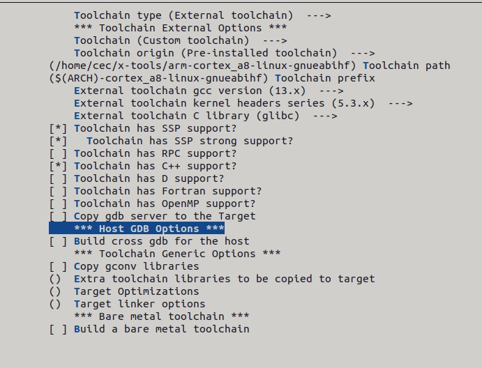

前面已经手撸了整个嵌入式系统的构建过程，但是在实际工作中，尤其是根文件系统的建立是很费时间的。这个时候一个自动化的构建工具就非常重要了。

自动化构建工具，需要能完成：

1. 自动化的获取源码（不管是网络还是本地）
2. 为源码打补丁，并进行一些配置
3. 完成构建
4. 将构建的文件组织成根文件系统
5. 最终可以将多个镜像文件打包并装载到目标机。

以上的过程都是可以用户灵活配置的，并可以输出 SDK 便于多个开发人员的环境统一。

目前有以下自动化构建工具：

1. [Buildroot](https://buildroot.org/)：使用 Make 和 Kconfig 的构建工具，非常易于使用。
2. [EmbToolkit](https://www.embtoolkit.org/)：用于构建跟文件系统和工具链的简单构建工具
3. [OpenEmbedded](https://openembedded.org/)：功能强大的构建系统，是 Yocto 的核心组件
4. [OpenWrt](https://openwrt.org/)：专用于构建无线路由器软件包的工具
5. [PTXdist](https://www.ptxdist.org/)：简单的构建工具
6. [Yocto](https://www.yoctoproject.org/)基于 OpenEmbedded 扩展的元数据、工具、文档集，更为强大的构建工具

其中 Buildroot 最易用，Yocto 最完善，所以这里只关注 Buildroot 和 Yocto。

<!--more-->

# 使用 Buildroot 构建

## 安装依赖

要正常使用 Buildroot 需要至少安装以下依赖：

```shell
sudo apt install -y sed make binutils build-essential \
diffutils gcc g++ bash patch gzip bzip2 perl tar cpio unzip \
rsync file bc findutils wget python3 libncurses5-dev 
```

## 配置

buildroot 具有一些默认配置文件，存在于`configs`文件夹下，也可以使用`make list-defconfigs` 来列出所有的默认配置。

对于 bbb 而言就是：

```shell
make beaglebone_defconfig menuconfig
```

接下来需要对配置做一些修改。

1. 选择自己构建的工具链：
   
   - **Toolchain->Toolchain type->External toolchain**
   
   - **Toolchain->Toolchain->Custom toolchain**
   
   - **Toolchain->Toolchain path**：填入工具链的路径
   
   - **Toolchain->Toolchain prefix**：修改为正确的工具链前缀
   
   - 选择 c 库为 glibc

2. 配置工具链的版本：
   
   - **Toolchain->External toolchain gcc version**：可以通过`arm-cortex_a8-linux-gnueabihf-gcc -v` 查看

工具链对应的头文件版本，有对应的说明：

> If unsure what version your toolchain is using, you can look  at the value of LINUX_VERSION_CODE in linux/version.h in your  toolchain. The Linux version is M.m.p, with: 
>  M = ( LINUX_VERSION_CODE >> 16 ) & 0xFF
>  m = ( LINUX_VERSION_CODE >> 8  ) & 0xFF
>  p = ( LINUX_VERSION_CODE >> 0  ) & 0xFF 

那么查看当前工具链：

```shell
cat ./arm-cortex_a8-linux-gnueabihf/sysroot/usr/include/linux/version.h
```

得到如下输出：

```shell
#define LINUX_VERSION_CODE 328466
#define KERNEL_VERSION(a,b,c) (((a) << 16) + ((b) << 8) + (c))
```

那么就得到对应的版本是：5.03.18



3. 以 initramfs 的方式构建：
   
   - **Filesystem images->cpio the root filesystem (for use as an initial RAM filesystem)**
   
   - **Compression method->lz4**：这是为了文件系统尽量的小

4. 取消 Kernel 和 Uboot 的构建，因为前面几章已经构建了自己的 bootloader 和 Kernel

在取消了内核和 Uboot 构建后，需要修改文件 `board/beaglebone/genimage.cfg`，让它只生成 rootfs.cpio：

```shell
#image boot.vfat {
#    vfat {
#        files = {
#            "MLO",
#            "u-boot.img",
#            "zImage",
#            "uEnv.txt",
#            "am335x-evm.dtb",
#            "am335x-evmsk.dtb",
#            "am335x-bone.dtb",
#            "am335x-boneblack.dtb",
#            "am335x-bonegreen.dtb",
#            "am335x-boneblack-wireless.dtb",
#            "am335x-bonegreen-wireless.dtb",
#            "extlinux"
#        }
#    }
#
#    size = 16M
#}

image sdcard.img {
    hdimage {
    }

    #partition u-boot {
    #    partition-type = 0xC
    #    bootable = "true"
    #    image = "boot.vfat"
    #}

    partition rootfs {
        partition-type = 0x83
        image = "rootfs.cpio"
        size = 512M
    }
}
```

在使用 `make` 构建后，会产生两个新的目录：

- `dl`：用于 Buildroot 构建的，从网络下载的软件包

- `output`：包含编译的中间文件和最终的文件

在 `output`中有以下目录：

- `build`：包含所有组件的编译输出

- `host`：包含 Buildroot 所需要的主机上的工具

- `images`：打包好的镜像文件和一些脚本

- `staging`：指向编译器的`sysroot`的符号链接

- `target`：根文件系统，但是其权限不对，所以无法直接使用

## 运行

接下来，只需要把生成的`rootfs.cpio`编译进内核，然后在 Uboot 中输入命令就可以进入新做的文件系统了：

```shell
fatload mmc 0:1 0x80200000 zImage
fatload mmc 0:1 0x8CA00000 am335x-boneblack.dtb
setenv bootargs console=ttyO0,115200 rdinit=/sbin/init
bootz 0x80200000 - 0x8CA00000
```

## 将应用程序打包进 rootfs

### overlay 的方式

在编译完应用程序后，将其拷贝到 board 对应的 overlay 目录下：

```shell
cec@box:~/github/buildroot-2024.02/board/beaglebone/rootfs_overlay$ mkdir -p usr/bin

cp ~/lab/cpp/hello/hello /home/cec/github/buildroot-2024.02/board/beaglebone/rootfs_overlay
```

然后配置 buildroot 中的 **System configuration | Root filesystem overlay directories** 为此 overlay 路径，再次编译后该应用程序便被打包进去了。

# 重新认识构建过程

## 初始化构建环境

NXP 将构建初始化环境又封装了一次脚本，所以其构建命令如下：

```shell
DISTRO=fsl-imx-xwayland MACHINE=myd-imx8mm source myir-setup-release.sh -b build-xwayland
```

可以先不去分析`myir-setup-release.sh`，而是看其输出的结果。

### bblayers.conf

首先看`bblayers.conf`，这包含了 bitbake 将要构建的层：

```shell
LCONF_VERSION = "7"

BBPATH = "${TOPDIR}"
BSPDIR := "${@os.path.abspath(os.path.dirname(d.getVar('FILE', True)) + '/../..')}"

BBFILES ?= ""
BBLAYERS = " \
  ${BSPDIR}/sources/poky/meta \
  ${BSPDIR}/sources/poky/meta-poky \
  \
  ${BSPDIR}/sources/meta-openembedded/meta-oe \
  ${BSPDIR}/sources/meta-openembedded/meta-multimedia \
  ${BSPDIR}/sources/meta-openembedded/meta-python \
  \
  ${BSPDIR}/sources/meta-freescale \
  ${BSPDIR}/sources/meta-freescale-3rdparty \
  ${BSPDIR}/sources/meta-freescale-distro \
"

# i.MX Yocto Project Release layers
BBLAYERS += " ${BSPDIR}/sources/meta-myir/meta-bsp "
BBLAYERS += " ${BSPDIR}/sources/meta-myir/meta-sdk "
BBLAYERS += " ${BSPDIR}/sources/meta-myir/meta-ml "

BBLAYERS += "${BSPDIR}/sources/meta-browser"
BBLAYERS += "${BSPDIR}/sources/meta-rust"
BBLAYERS += "${BSPDIR}/sources/meta-openembedded/meta-gnome"
BBLAYERS += "${BSPDIR}/sources/meta-openembedded/meta-networking"
BBLAYERS += "${BSPDIR}/sources/meta-openembedded/meta-filesystems"
BBLAYERS += "${BSPDIR}/sources/meta-qt5"
```

为了能够比较清楚的知道层之间的优先级，需要输出其优先级来看看：

```shell
$ bitbake-layers show-layers
NOTE: Starting bitbake server...
layer                 path                                      priority
==========================================================================
meta                  ~/yocto/sources/poky/meta      5
meta-poky             ~/yocto/sources/poky/meta-poky  5
meta-oe               ~/yocto/sources/meta-openembedded/meta-oe  6
meta-multimedia       ~/yocto/sources/meta-openembedded/meta-multimedia  6
meta-python           ~/yocto/sources/meta-openembedded/meta-python  7
meta-freescale        ~/yocto/sources/meta-freescale  5
meta-freescale-3rdparty  ~/yocto/sources/meta-freescale-3rdparty  4
meta-freescale-distro  ~/yocto/sources/meta-freescale-distro  4
meta-bsp              ~/yocto/sources/meta-myir/meta-bsp  8
meta-sdk              ~/yocto/sources/meta-myir/meta-sdk  8
meta-ml               ~/yocto/sources/meta-myir/meta-ml  8
meta-browser          ~/yocto/sources/meta-browser   7
meta-rust             ~/yocto/sources/meta-rust      7
meta-gnome            ~/yocto/sources/meta-openembedded/meta-gnome  7
meta-networking       ~/yocto/sources/meta-openembedded/meta-networking  5
meta-filesystems      ~/yocto/sources/meta-openembedded/meta-filesystems  6
meta-qt5              ~/yocto/sources/meta-qt5       7
```

数值越大优先级越高（可以覆盖低优先级的配置），那么可以看到在`meta-myir`层中的优先级较高，在后面需要对当前配置进行微调时，可以在这个层中进行修改。

### local.conf

`local.conf`是对构建环境变量的配置：

```shell
$ cat conf/local.conf
MACHINE ??= 'myd-imx8mm'
DISTRO ?= 'fsl-imx-xwayland'
PACKAGE_CLASSES ?= 'package_rpm'
EXTRA_IMAGE_FEATURES ?= "debug-tweaks"
USER_CLASSES ?= "buildstats image-mklibs image-prelink"
PATCHRESOLVE = "noop"
BB_DISKMON_DIRS ??= "\
    STOPTASKS,${TMPDIR},1G,100K \
    STOPTASKS,${DL_DIR},1G,100K \
    STOPTASKS,${SSTATE_DIR},1G,100K \
    STOPTASKS,/tmp,100M,100K \
    ABORT,${TMPDIR},100M,1K \
    ABORT,${DL_DIR},100M,1K \
    ABORT,${SSTATE_DIR},100M,1K \
    ABORT,/tmp,10M,1K"
PACKAGECONFIG_append_pn-qemu-system-native = " sdl"
CONF_VERSION = "1"

DL_DIR ?= "${BSPDIR}/downloads/"
ACCEPT_FSL_EULA = "1"
```

这里最主要的就是`MACHINE`和`DISTRO`两个环境变量：

- `MACHINE`：主要表明了对用户空间以下的系统配置，比如 bootloader，kernel
- `DISTRO`：则是对整个发型版的全局配置，比如发行版的名字，使用 x11 还是 wayland 等

除了以上二者，还有个比较重要的就是`image`。

## 开始构建

构建完整镜像，使用`bitbake myir-image-full`即可，这里表示了与之相关的 image 就是 `myir-image-full`。

## 构建的脉络

基于`MACHINE`,`DISTRO`和`image`这 3 个最为重要的元素，以及所包含的 layer，便可以梳理出构建的主要脉络。

### MACHINE

通过`MACHINE`的值，便可以搜寻到其关联的配置文件`myd-imx8mm.conf`。

在这个文件中，便可以清楚明了的看到以下主要内容：

- `bootloader`的配置
- 会生成的设备树
- kernel 构建时调用的配置文件

### DISTRO

通过`DISTRO`的值，可以搜寻到其关联的配置文件`fsl-imx-xwayland.conf`。

通过展开其包含的头文件，就可以清楚明了的看到其使用的是`wayland`，初始化系统使用的是`systemd`等。

### image

通过`myir-image-full`可以查到其对用的 recipe 文件就是`myir-image-full.bb`。

可以看到它在`imx-image-multimedia.bb`的基础之上进行了文件系统的扩展。

### layer 之间的覆盖

可以使用命令`bitbake-layers show-appends`来查看对原有`recipe`的附加修改。

## 总结

如果仅仅是在官方提供的构建工具下做微调，那么只要把握`MACHINE`,`DISTRO`,`image`,`layers`这 4 个核心元素，就可以顺藤摸瓜了解整个系统的配置。

其他的诸如变量表达式的意思、生成文件的路径、配置的增加及删除等等都是一些细枝末节的东西。只要把握重点，并通过查询文档便可以掌握这些细枝末节。

整个嵌入式开发的重点难点依然是在`bootloader`,`kernel`，以及用户态的业务逻辑层。

# 认识 devtool

简单的 recipe 可以使用 bitbake-layers 来创建，然后再手动编写。但是如果 recipe 太多时，就会比较繁琐。这个时候使用 devtool 就会更加方便。

## devtool 的工作流

首先初始化工作环境：

```shell
$ source oe-init-build-env build/
```

然后创建新的层：

```shell
$ bitbake-layers create-layer ../meta-mine
```

接下来将新建的层加入构建任务中：

```shell
$ bitbake-layers add-layer ../meta-mine
```

然后使用`devtool`来构建：

```shell
$ devtool build-image core-image-sato
```

经过构建后，发现`conf`目录下新增了一个`devtool.conf`文件：

```shell
[General]
workspace_path = /home/cec/github/poky/build/workspace

[SDK]
target_basename = core-image-sato
```

其中的`workspace_path`指定了由`devtool`所创建的沙盒工作区，可以在这里面做一些试验。

> 可以看到在 bblayers.conf 中也加入了该 workspace 的路径，在用户测试完成后，可以将该路径移除。

## 创建新的 recipe

下面以`devtool`来构建[bubblewrap](https://github.com/containers/bubblewrap)。

### 增加 recipe

首先增加这个 recipe：

```shell
$ devtool add https://github.com/containers/bubblewrap/releases/download/v0.5.0/bubblewrap-0.5.0.tar.xz
```

可以发现`devtool`会自动下载压缩包，然后解压缩文件，接下来会自动创建一些 recipe：

1. 在`appends`目录下创建`bubblewrap_0.5.0.bbappend`
   
   > 这里面指定了本地解压缩源码的位置

2. 在`recipes`目录下创建`bubblewrap/bubblewrap_0.5.0.bb`
   
   > 这里面指定了远端 URI 及其校验，还根据源码推测了构建系统是 autotools

3. 在`source`目录中即为 bubblewrap 的源码

### 编辑

接下来是编辑文件：

```shell
$ devtool edit-recipe bubblewrap
```

可以指定其说明文件安装目录：

```shell
# PN 代表 packagename，在这里就是 bubblewrap。将其说明安装到 /usr/share 目录中
FILES_${PN} += "/usr/share/*"
```

### 构建

构建命令也十分简单：

```shell
$ devtool build bubblewrap
```

接下来便可以看到其配置、编译、打包的过程。

### 部署

`devtool`可以将构建的包直接部署到目标机，以便快速验证结果。

这里先启动`qemu`来做演示：

```shell
$ runqemu qemux86-64 nographic
```

可以通过 ifconfig 看到其 ip 是 192.168.7.2，那么就将该包部署过去：

```shell
$ devtool deploy-target bubblewrap root@192.168.7.2
```

`bwrap`可执行文件便安装完成了，且可执行了。

### 清除部署

当测试完成后，便可以从目标机系统中清除该包：

```shell
$ devtool undeploy-target bubblewrap root@192.168.7.2
```

执行该命令后，可以发现`bwrap`相关文件已经清理完毕了。

### 完成 recipe

到目前为止还只是测试完毕，接下来就是将沙盒中的 recipe 更新到`meta-mine`中：

```shell
$ devtool finish -f bubblewrap ../meta-mine
```

可以看到，`meta-mine`中已经包含了`bubblewrap`相关 recipe，干净又整洁！

既然已经部署完成，便可以删除之前的沙盒了，为了以后再次构建，也可以仅仅在`bblayers.conf`中屏蔽这个沙盒 layer 即可。
