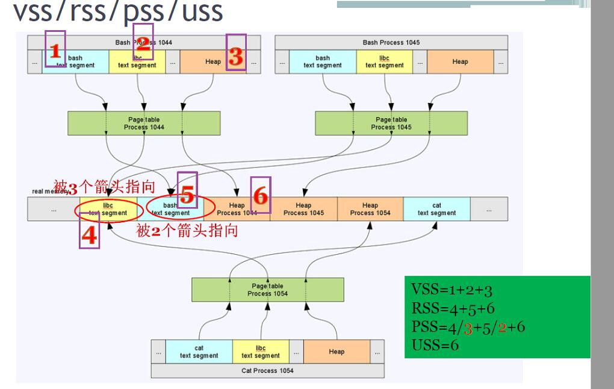

| kernel version | arch  |
| -------------- | ----- |
| v5.4.0         | arm32 |

<!--more-->

理解进程(用户空间)对内存的消耗和泄露，可以更好的监控用户空间内存。

通过前面的说明，可以知道用户空间获得的内存都是lazy机制，但在用户空间中的虚拟地址却是认为已经被全部分配了，那么这些地址空间是如何表示的呢？

同时用户空间中有很多的共享内存(比如代码段)，这些又是如何表示的呢？

- VSS(virtual set size)
- RSS(resident set size)
- PSS(proporitional set size)
- USS(unique set size)

# 一个进程的内存表示


上面这幅图就表明了一个进程所占用的虚拟内存资源的表示形式，下面进行一一说明。

在进程表示的结构体 `task_struct` 中包含了结构 `mm_struct` 的指针，以总体表示该进程占用的虚拟内存资源。

- `pgd` 代表该进程的页表
- `struct vm_area_struct *mmap` 将进程整个VMA给链接起来了

mmap是一个指向 =vm_area_struct= 结构的链表，每一个节点(称为VMA)都表示了该进程的**合法虚拟地址空间**,进程每申请一段虚拟内存都会有一个节点与之对应。

- 虽然实际分配内存是lazy机制，但进程的VMA中已经包含了该进程所有的代码段、数据段等全部地址范围
  + 所以站在程序员(虚拟空间的角度)，一个程序在最开始运行时它就被全部加载到了内存
- `vm_start,vm_end` 表示一段虚拟地址的起始和结束
- `vm_page_prot` 表示了这段地址的访问权限


正是因为有了这些合法虚拟地址节点，内核才可以判断出：在后期的操作中，当进程写该段空间时，对产生的pagefault进行对应的处理。

- 比如是用户**首次对申请的堆进行写(其VMA权限是可读可写,但其页表是只读的)** ，处理pagefault应该是申请物理地址并修改其页表
  + minor page fault:只发生内存申请操作
- 如果是对其只读空间(比如代码段)进行写(**其VMA权限和页表都是只读的**)，处理pagefault应该是杀死进程并抛出segmentatoin fault信号。
- 如果是要执行代码，刚开始代码还没有存在内存中，这时产生pagefault，内核检查这部分是**可执行的权限**，然后将一部分代码段从硬盘读取到内存并修改页表。
  + major page fault：不仅要申请内存还要发生IO操作，从硬盘读
- 如果访问的虚拟地址并没有落在任何一个VMA中，那就是一段非法地址了，内核也会kill进程并抛出segmentation fault信号


## vma的查看

在查看进程的vma前，首先就是要知道其pid，可以通过 `ps -aux` 或 `pidof` 来找出 pid.

有以下3种方式查看vma：

1. 使用 `pmap <pid>` 
2. 使用 `cat /proc/<pid>/maps` 
3. 使用 `cat /proc/<pid>/smaps | more`
   - 此种方式最为详细

# 多个进程在内存条中的分配

从上面的理解可以知道，每个进程的vma都表示了自己所独自占用的虚拟地址空间， **但实际上只有部分被加载到了物理内存** 。

当有多个进程时，一个物理内存上有具有多个进程加载的一部分，这些多个进程是如何瓜分内存条的呢？



由上图可以看出：

1. 每个进程的虚拟地址空间都认为自己独占整个系统内存资源
2. 每个进程都具有一个页表，在进程切换的时候也会发生页表切换，页表的基地址会给MMU
3. 页表将每个进程对应的物理地址进行映射，其中具有相同代码段的进程其物理地址是一样的，虽然虚拟地址可能不一样
   + 在多核架构上，每个核都有一个MMU可以实现一一映射，之间并不冲突

基于上图，就可以再次来看内存消耗表示的几个概念了:

- VSS(Virtual set size) : 指的是一个进程所消耗的虚拟地址空间。
  + 对应进程1044，其 VSS = 1 + 2 + 3 
- RSS(resident set size) : 指的是一个进程所真实消耗的物理内存空间
  + 对应进程1044, 其 RSS = 4 + 5 + 6
- PSS(proporitional set size) : 指一个进程所消耗的经过比例运算后的物理内存空间
  + 对应进程1044，其所占用的libc空间也同时被其他两个进程所使用，所以1044仅占用1/3。bash空间被另外一个进程所占用，所以1044仅占用1/2
    + 那么其所占用的 PSS = 4 / 3 + 5 / 2 + 6
  + 如果站在内存条的视角，看当前所有进程所占用的空间，那么就应该看PSS之和
- USS(unique set size) : 指一个进程所独占的物理内存空间
  + 对应进程1044，其 USS = 6
  + 一个进程所独占的空间其中必然包含堆区，所以：**我们可以通过多点采样进程的USS来观察其是否有内存泄露**

有以下几种方式来观察进程内存消耗：

- 使用 `smem -P <pid>` 来观察其总体的消耗
  + 在实际检测一个进程是否有内存泄露时，可以通过脚本使用此命令来长时间抓取其USS并保存到文件中，最后通过matlab之类的软件拟合出一条曲线
    + 嵌入式中使用的是 `smemcap` 来获取数据然后再交由PC上分析
  + `smem --pie/--bar` 还可以以图形的方式来显示
- 使用 `cat /proc/<pid>/smaps | more` 的方式来详细的观察进程的VSS,RSS,PSS.
- 使用 `valgrind` 来监控一个进程是否有内存泄露， **这种方式会严重降低进程的运行速度.**

```c
  gcc -g hello.c
  valgrind --tool=memcheck --leak-check=yes ./a.out
```

- 在使用 gcc 编译代码时，使能其 `addresssanitizer` 选项。这种方式会在源代码中插入内存监控代码，进程运行速度影响不大。
  如下代码：
  
  ```c
  #include <stdio.h>
  #include <stdlib.h>
  #include <string.h>
  #include <sanitizer/lsan_interface.h>
  #include <unistd.h>
  
  void main(void)
  {
    uint32_t *p1, i = 0;
    while(1)
      {
        p1 = malloc(1024);
        memset(p1, 0, 1024);
        sleep(1);
        //check memory leak by asan
        if(++i > 3)
          {
            __lsan_do_leak_check();
          }
      }
  }
  ```

还需要加上编译选项:

```shell
  gcc -g -fsanitize=address ./leak.c
  ./a.out
```

# 观察内核的内存泄露

多个进程是共享同一份内核空间的，当进程发出系统调用陷入内核后，如果内核有内存泄露那么其 slab 和 vmalloc 的占用就会随着时间推移宏观上呈上升趋势。

有以下几个办法来观察内核是否有泄露：

1. 通过脚本长时间抓取 `cat /proc/meminfo` 输出中的 slab 和 vmalloc 记录并保存在文件中，最后经过 matlab之类工具进行绘图。
