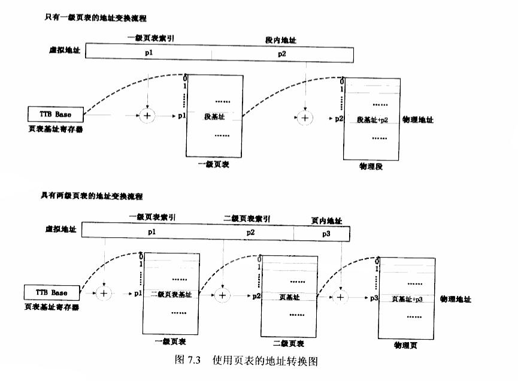
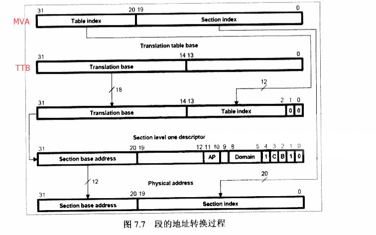
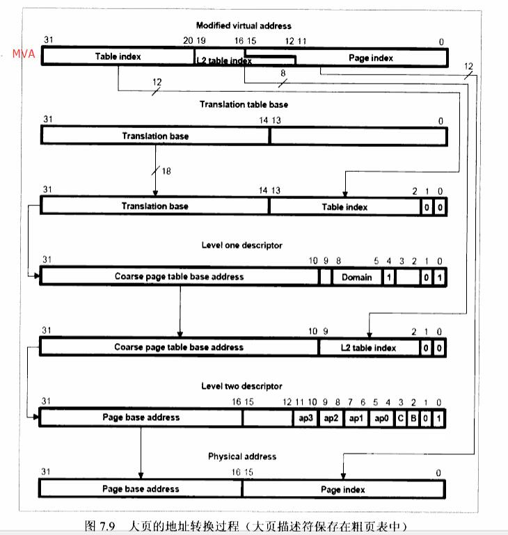
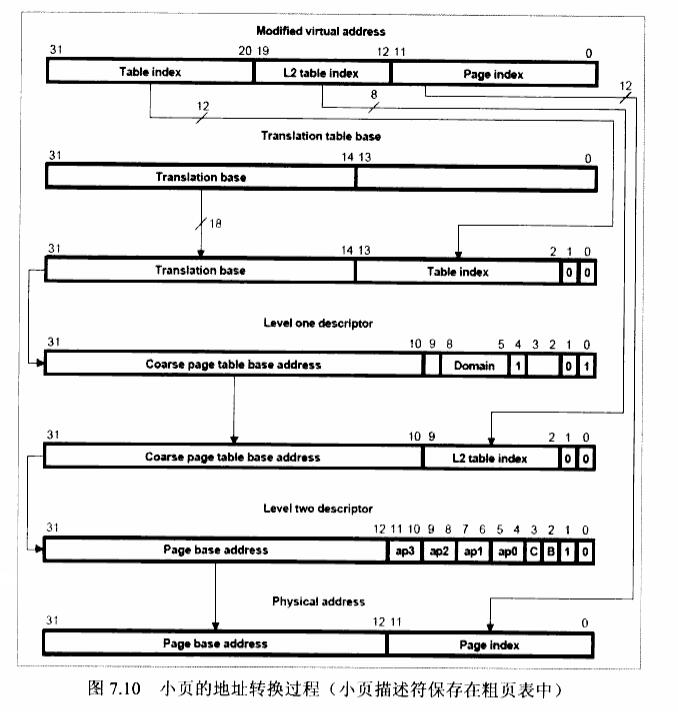
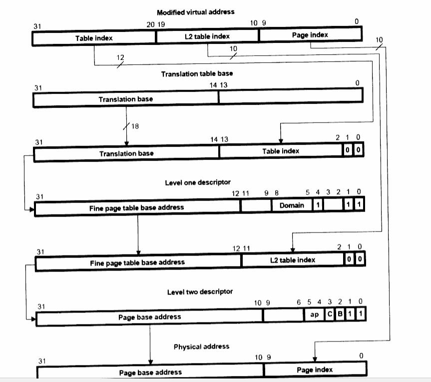

对于内存管理知识而言，MMU基本原理是这类知识的基础，需要掌握。

<!--more-->

# MMU的作用

内存管理单元（Memory Management Unit）简称MMU，负责将虚拟地址映射到物理地址，并具有内存访问权限检查的功能。

它具有如下好处：

- 让应用程序可以分段加载，这样可以让多个程序（程序之和大于内存）并发地在内存中运行
  + 仅将要运行的部分装入内存，其他部分用到的时候再载入。
  + 当内存不够用时，将暂时不用的部分再重新调出到硬盘
- 应用程序不用关心实际物理内存，相互虚拟地址互不干扰
  + 每个应用程序都可以在逻辑上认为自己独占内存
- 应用程序之间的地址隔离，不能越权访问，很好的保护了程序空间

而对于这些功能的满足都是基于硬件来实现的。

# 地址转换概念

## 相关概念

- 虚拟地址空间： 在使用了MMU之后，应用程序逻辑上可以使用的内存不与实际的物理内存大小相关。
  + 比如在32位的CPU中，逻辑上可以使用 0 ~ 0XFFFFFFFF 的内存空间，这个空间就是虚拟地址空间 
    + 需要注意的是： 这里所指的内存空间是CPU总线可以理论访问的地址范围，其中**包括了I/O设备、内存条、预留空间等！**
  + 虚拟地址空间对应的地址就是虚拟地址(VA, Virtual Address)
- 物理地址空间：硬件上实实在在存在的内存大小就是物理地址空间
  + 需要注意的是： 这里所指的内存空间是CPU总线可以实际访问的地址范围，其中**包括了I/O设备、内存条、预留空间等！**
    + 物理地址空间对应的地址就是物理地址(PA, Physical Address)
- 变换后的虚拟地址(MVA, Modified Virtual Address): 在虚拟地址向物理地址转换中间的地址

```shell
  虽然内存空间包括I/O设备、内存条等等，其加起来可能远远不及4G。但是依然需要为每个进程建立覆盖4GB的页表！！

  只有这样MMU才可以对每个内存访问进行无死角的监控！不然来个MMU都不认识的虚拟地址，你要人家怎么办？
```

## 地址转换概念

虽然虚拟地址大于物理地址，但程序总是要在实实在在的物理地址上运行的。于是将虚拟地址空间和物理地址空间划分为**同样大小**的空间（也叫段或页），这样虚拟和物理之间建立映射关系。但是由于虚拟地址空间大于物理地址空间，那么虚拟地址空间分得的页多于物理地址空间，所以就会出现：

- 几个虚拟地址空间映射页到同一个物理地址空间页
  + 多个进程使用内存的内容一致
  + 多个进程分时使用相同的物理内存，物理内存对于不同进程进行置换
- 一些虚拟地址空间页没有映射到物理地址空间页上
  + 当这些虚拟地址空间被访问时，MMU 会觉察并通知 CPU 进行重映射到物理页
    + MMU硬件会由于没有映射到物理地址而产生 page fault，CPU 会接收此信号并做处理

## 相互之间的视角

1. CPU能看到的是虚拟地址(VA)
   + 无论I/O还是内存条都是虚拟地址，所以在 Linux 驱动中要访问外设硬件时，也必须经过映射
2. cache 和 MMU 看到的是转换后的虚拟地址(MVA)，通过此值转换为PA
3. 实际设备在没有IOMMU的情况下看到的是物理地址(PA)，VA 和 MVA 对其都不可见
   + 一般情况下实际设备当然只关心物理地址，人家怎么知道你虚拟地址要怎么映射？
     + 但有IOMMU就不一样了，其对应的物理地址依然可以不连续。

# 地址转换过程

## 转换概览

虚拟地址到物理地址转换的办法：

- 用确定的数学公式进行转换
- 用表格存储虚拟地址对应的物理地址（ARM使用此种方式）
  + 一个条目（Entry）存储了一段虚拟地址对应的物理地址及其访问权限，或下一级页表的地址
  + 许多条目组成了页表（Page table），页表可能会有多级

ARM CPU 具体转换流程：

1. 根据给定的虚拟地址找到一级页表中的条目
2. 如果此条目是段描述符，则返回物理地址，转换结束
3. 如果此条目是二级页表描述符，继续利用虚拟地址在二级页表中找到下一个条目
4. 如果第二个条目是页描述符，则返回物理地址，转换结束
5. 其他情况出错(如果有3级及以上，以此推理)



在 32 位 CPU 中，虚拟地址空间达到 4GB，一级页表使用 4096 个描述符来分段，每个描述符对应 1MB 的虚拟空间。
也就是说，一级页表占用 MVA [31:20] 地址范围来对应每一个描述符。

- 当使用段描述符时，对应的MVA[19:0]位就是对应物理基准地址。
- 当使用多级页表的情况下，MVA[19:0]又会从中分配出一段以代表二级页表的偏移。

```shell
也就是说在寻找物理地址的过程中，都是通过一个页表基地址再加上 MVA 中取出一段作为偏移来层层索引到最终地址的。
```

## 一级描述符的内容

每个描述符占用 32 位，分别描述了描述符类型，描述符地址，对应的内存权限等。

一级描述符低两位代表了描述符的类型。

## 段(Section)描述符

- MVA 通过其 [31:20] 位加上页表基地址首先找到其对应的段描述符，一共有4096个段描述符
- 段描述符其 [31:20] 为段的基地址，其索引到物理内存以 1M 为分段的起始地址。 
- 其剩余的 [19:0] 位对应的就是物理地址在1M空间的偏移，对应 MVA [19:0] 位（`4096*1MB = 4GB`）。



### 粗页表(Coarse page table)描述符

- MVA通过其 [31:20] 位加上页表基地址首先找到其对应的粗页表描述符，一共有 4096 个粗页表
- 粗页表 [31:10] 为粗页表基地址，与MVA的 [19:12] 组合，对应索引到二级页表的基地址
- 每二级页表条目为 256 个，每个条目就可以表示 4KB 的物理地址空间,对应MVA [11:0] (`4096*256*4KB=4GB`)

### 细页表(Fine page table)描述符

- MVA 通过其 [31:20] 位加上页表基地址首先找到其对应的细页表描述符，一共有4096个细页表
- 细页表 [31:12] 为细页表基地址，与 MVA [19:10] 组合，对应索引到二级页表的基地址
- 每个二级页表条目为 1024 个，每个条目可以表示1KB的物理地址空间,对应MVA [9:0](`4096*1024*1KB=4GB`)

## 二级描述符内容

当一级描述符为粗页表或者为细页表时，就会需要有二级描述符，二级描述符用于描述1MB的空间，二级描述符分为如下几种：

### 大页描述符

- 大页描述符[31:16]为大页基地址(Large page base address)
- 其[15:0]对应64KB的物理地址空间偏移
- 在粗页表中，二级页表条目只能表示4KB的物理空间，所以有连续16个条目保存同一个大页表描述符
- 在细页表中，二级页表条目只能表示1KB的物理空间，所以有连续64个条目保存同一个大页表描述符



### 小页描述符

- 小页描述符 [31:12] 为小页基地址(Small page base address)
- 其 [11:0] 对应4KB的物理地址空间偏移
- 在粗页表中，每个条目正好4KB，则一个条目正好对应一个小页描述符
- 在细页表中，每个条目1KB，则需要4个连续的条目表示同一个小页描述符



### 极小页描述符

- 极小页描述符 [31:10] 为极小页基地址(Tiny page base address)
- 其 [9:0] 对应1KB物理地址空间偏移
- 极小页描述符通过细页表一个条目与之一一对应



# 多进程下的页表

在有操作系统的情况下，都是多个进程并发运行，而不同的进程具有不同的页表。
这些页表都是保存在内存中的，CPU在运行不同的进程时，都会调取对应的**一级页表基地址**到 MMU 的基地址寄存器，
接下来的转换过程便是 MMU 硬件来自动完成的过程。

在进程切换时，除了要修改页表基地址，一般情况下还要无效 TLB 和 Cache，具体情况需要根据硬件而定。

# 内存的权限检查

MMU通过读取页描述符中的对应位来确定当前的访问是否具有对应的权限。

内存的访问权限检查可以概括为以下两点：

1. “域”决定是否对某块内存进行权限检查
2. "AP"决定如何对某块内存进行权限检查

在Linux中，可以抽象为以下两种权限：

1. 是否对该处内存具有RWX权限
2. 此处内存是仅仅内核态(管理者模式)能够访问，还是内核态和用户态(用户模式)都可以访问

# TLB的作用

转译查找缓存(Translation Lookaside Buffers, TLB)就是部分页表的一个快速缓存(类似于cache)，避免每次MMU都要从主存中获取页表内容。

当CPU发出一个虚拟地址时，MMU首先访问TLB，如果TLB中含有对应的描述符，则直接利用此描述符进行转换和权限检查。否则MMU
访问主存中的页表进行转换和权限检查，并将这次获取的描述符放入TLB，以便下次使用。

```shell
使用TLB需要保证TLB与主存的一致性，在启动MMU之前需要使无效整个TLB，启动后再打开此功能。
```

# Linux 中的页表

Linux 默认使用 3 级页表，以更好的节省页表对内存的消耗（尤其是 64 位处理器），其 3 级页表称作：

- 页总目录PGD（Page Global Directory）

- 页中间目录PMD（Page Middle Derectory）

- 页表PT（Page Table）