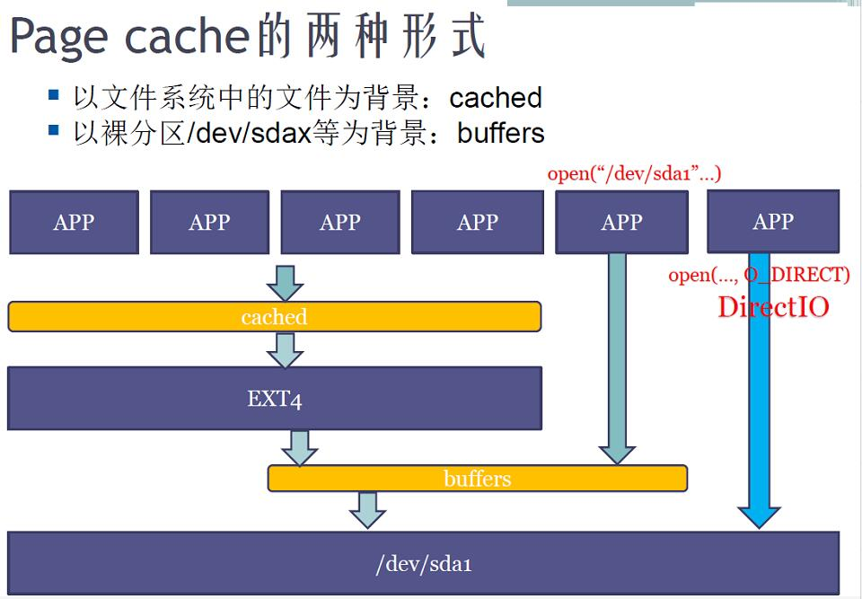
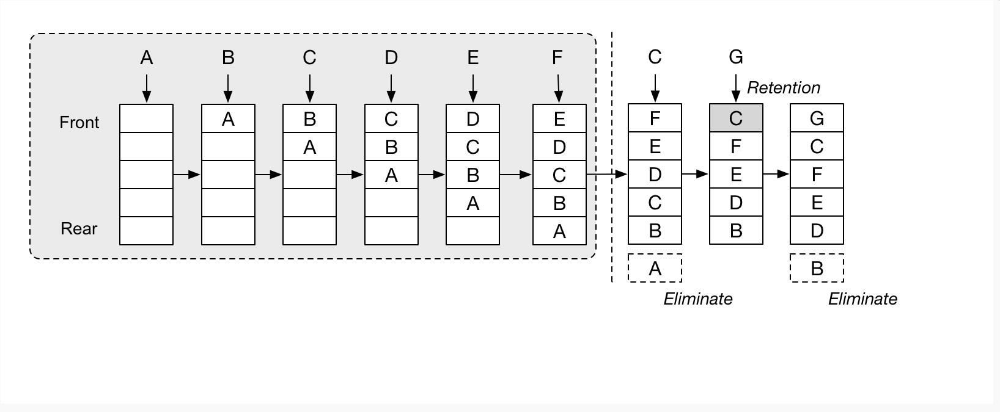
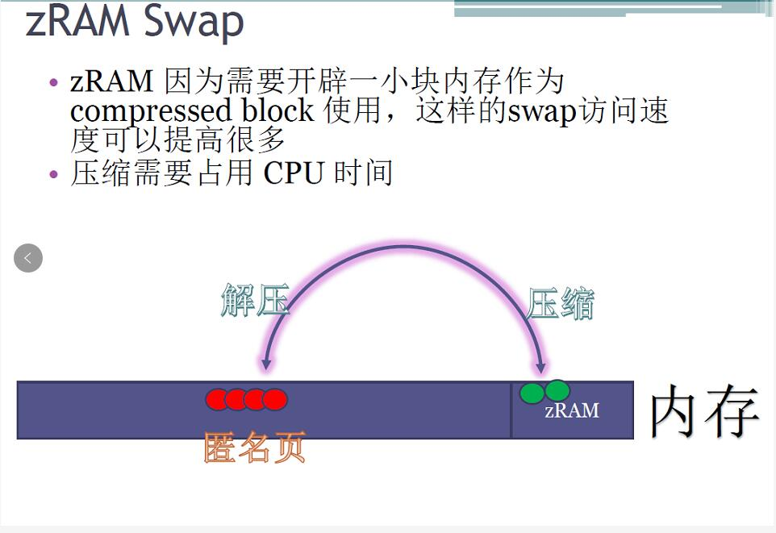

| kernel version | arch  |
| -------------- | ----- |
| v5.4.0         | arm32 |

<!--more-->

# page cache

计算机硬件系统中具有 cache 来缓存内存中的一部分内容以达到CPU的快速访问。

而在软件逻辑上，操作系统可以为硬盘中的文件做一个cache到内存，而避免频繁的IO操作以提高访问效率。

- 之所以称为 page cache，是因为内存申请都是以页为基本单位的


那么在Linux上读写文件的逻辑就是：

1. 当读取文件内容时，首先检查此内容是否在内存命中，如果命中则直接从内存读取，如果不命中就从硬盘读取并更新 pagecache.
2. 当写文件内容时，首先将内容写入内存中，内核在合适的时候将内存的内容更新到硬盘。
3. 使用 mmap 将内核中的page cache地址映射到用户空间，用户空间可以直接通过指针来访问。
   + mmap 由于是直接的内存映射操作，所以其操作效率很高。(不需要再通过copy与内核交互)
   + 代码段就是通过 mmap 的方式将其映射，并以指针的方式执行，其本质也是 page cache。

通过以下方式来观察page cache:

```shell
  #清空cache
  echo 3 > /proc/sys/vm/drop_caches

  \time -v python ./hello.py #注意：运行的代码需要文件关联够多，才比较容易看出效果,推荐python
  #第一次运行此命令，可以发现其产生了major page faults，代表有硬盘的文件交互

  \time -v python ./hello.py
  #第二次运行此命令，可以发现其major page faults 计数为0，代表是直接从内存读，且运行时间远短于第一次
```

## page cache 的表现形式



由上图可以看出，page cache有两种不同的表现形式:

- cached : 当用户以文件的方式来进行 I/O 操作，这时对文件的 page cache 就称为cached
  + **在文件系统底层会将 inode 这些元数据放入 buffers，而将文件block放入 cached**
- buffers: 当用户以设备的方式来访问分区进行I/O操作时，这时对分区的 page cache 就称为buffers

在 `cat /proc/meminfo` 和 `free` 中都可以看到这两项数据报告。

## free 显示说明

free 命令的输出如下：

```shell
               total       used       free     shared    buffers     cached
  Mem:       2063720     483316    1580404       7292       6564     170096
  -/+ buffers/cache:     306656    1757064
  Swap:       522236          0     522236
```

- 第一行说明:
  + total = `used + free (以buddy的角度来计算整体)`
  + buffers = `以裸分区方式访问 + 文件系统的元数据所缓存的page cache`
  + cached = `以文件方式访问所缓存的page cache`
- 第二行说明:(比较新的free命令已经取消了此行，改用 available 参数来预估系统可用的内存)
  + used = `第一行used - buffers - cached`
    + buffers 和 cached 所使用掉的page cache是可以释放掉的
  + free = `第一行free + buffers + cached`
    + 同理，实际上还可以通过释放 buffers 和 cached 获取空间内存

# file-backed 和 anonymous page

- file-backed pages : 称为有文件背景的page cache，指的是在硬盘中有对应的文件，为了提高执行效率，内存读取了一段作为副本
  + 当内核需要更多的内存时，这些 file-backed pages 可以被取消映射而不会影响进程的正常执行(**这个动作称为swap**)
    + 当然，文件内容如果被修改了肯定是会写回到文件的
- anonymous pages : 称为匿名页,指的是在运行过程中所产生的栈、堆等所占用的页面，虚拟地址空间与硬盘的文件没有映射关系
  + 这些匿名页是无法回收到硬盘对应文件中的,为了让出更多的内存就只有将硬盘一部分分区作为单独存放anonymous pages的位置， **这个就是swap分区(也就是将匿名页swap到swap分区)** 。
    + windows中与之相对的概念就是 **虚拟内存**

## linux内核中的swap动作

linux内核使用LRU(Least Recently Used)算法来实现将 `file-backed` 和 `annoymous pages` swap到对应分区中,将最近最少使用的内存页swap出去.



上图来自链接:[](https://xuri.me/2016/08/13/lru-and-lfu-cache-algorithms.html)

**linux内核通过软件实现LRU算法置换内存页到硬盘，而CPU内部的硬件cache与内存之间也是通过LRU算法实现的置换，只不过这是硬件实现的。**

## zRAM Swap

虽然将硬盘的一个分区作为swap分区可以变相增大内存，但当进程切换的时候会导致硬盘被频繁的读写。

- 在嵌入式系统上频繁擦写flash会导致其寿命大大降低

为了改善这种情况，linux提供了zRAM 算法:

- 将物理内存中分一小块分区作为swap分区
- CPU将要被置换的页面 **压缩** 以后放入这个swap分区
  + 这样也相当于增加了一部分内存
- 当进程要切换回来时，CPU再解压缩swap分区


