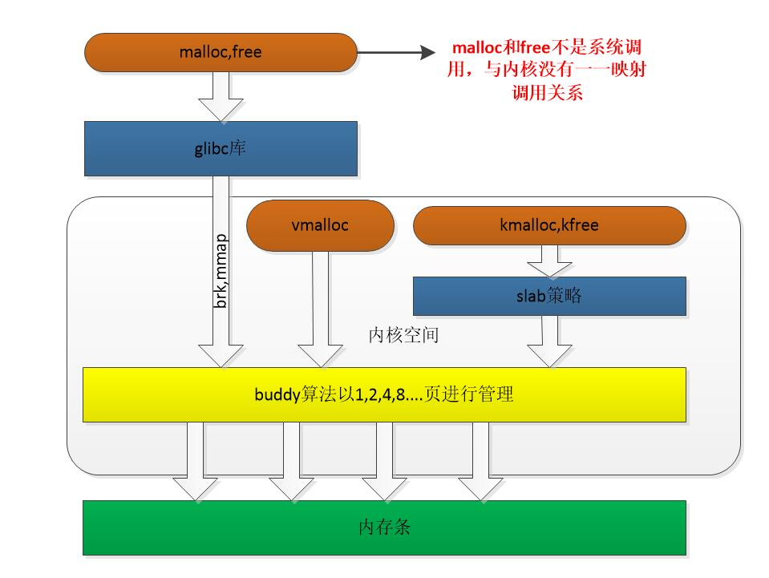
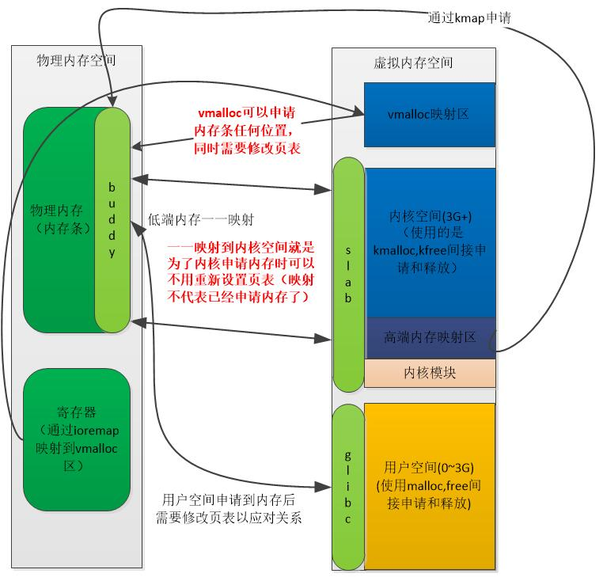
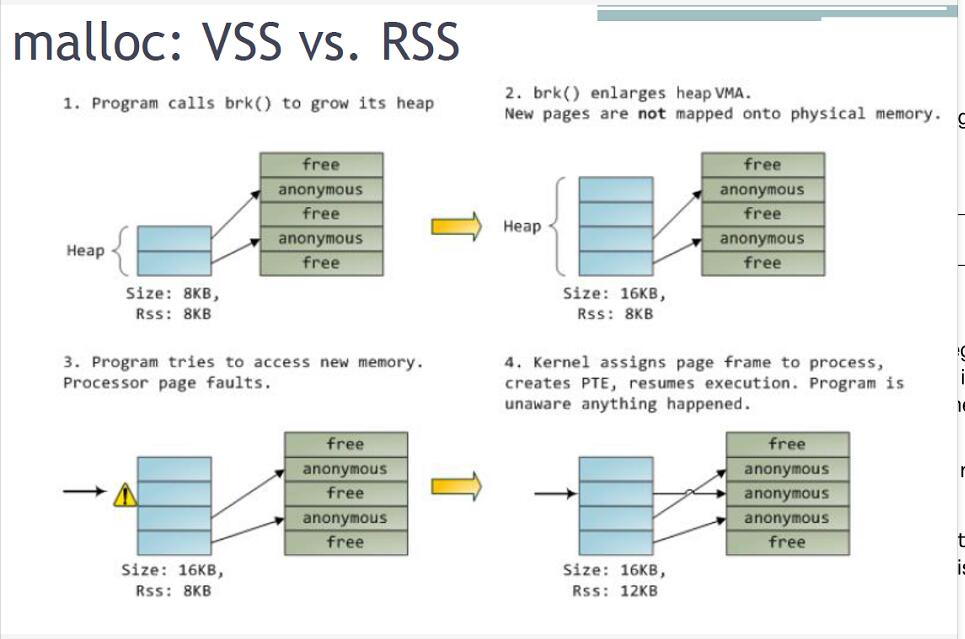

| kernel version | arch  |
| -------------- | ----- |
| v5.4.0         | arm32 |

<!--more-->

# buddy 算法缺陷

## 算法页面连续性缺陷

buddy算法虽然是动态的分离和合并，但合并的前置条件是这段物理页内存空间需要是连续的。但在申请内存的时候，确是分散的。
随着时间的推移，最终必然会造成很多空闲内存页分散的情况。

这就会造成一个问题： **当DMA需要申请一个连续的物理内存空间时，虽然空闲页面远远大于此内存，但由于它们都是分散的，导致申请失败!**

- 对于用户而言，虚拟地址空间连续即可，物理空间是否分散都不影响其使用，而DMA是直接对应物理内存操作的，需要其物理内存真的连续。

## 页面连续性问题解决方案

### reserved 内存

为了保证 DMA 在任何时候都可以申请到连续的物理内存，所以在一开始就指定一片内存区域为保留区，仅仅用于DMA申请连续物理内存。

但这会导致当平时DMA不使用时，这片内存也无法用作其他用途，造成空间浪费。

### CMA(Contiguous Memory Allocator, 连续内存分配器)

为了弥补 reserved 方式的不足，三星提出了CMA方式，其基本思想为：

1. 在物理内存分配了一片CMA区域(设备树中指定)，这片区域是物理内存连续的。

2. 当DMA没有使用时，这片CMA区域交付给用户空间使用

3. 当DMA要使用时，将用户空间的虚拟与物理内存对应表进行修改，也就是将这片物理内存区域移动到其他物理内存区域，空闲出 CMA 区。
   
   - 在这个过程中，由于应用程序的虚拟地址没有改变，所以其感知不到这个变化
   - 在移动应用程序对应的物理内存时，新申请的内存是否连续对应用程序并不影响
   - 由于在移动过程中需要重新修改页表，这段时间应用程序无法操作物理内存，会有短暂的卡顿。

4. 将CMA区交付给DMA使用。
- 有关reserved内存在设备树中的配置文档位于 `Documentation/devicetree/bindings/reserved-memory/reserved-memory.txt` 

可以在 menuconfig 中配置 cma：

- `Memory Management options -> Contiguous Memory Allocator` : 使能cma
- `Library routines -> DMA Contiguous Mmeory Allocator` : 使能dma_cma

## 算法粒度问题

由于buddy算法的基本单位是页，而目前大部分页都是4K字节，这就导致当一个用户仅申请几个字节时，剩余的3K多字节就白白浪费了！

为了解决这个问题，Linux内核在buddy的基础之上进行了二次管理。

## 内存碎片

在内核空间申请的内存都是不可移动的，这也会导致最终的内存碎片。虽然内存中有足够多的空间，但这些空间由于其不连续而导致申请大内存失败。

为此linux将内存空间又分为了可移动的、不可移动的、可回收类型，内核空间就在不可移动内存中申请空间，用户空间就在可移动内存中申请空间。这样内核就可以整理可移动的内存空间以腾出大片的连续内存。

但这些类型的分配都是一个动态的过程，最开始都是可移动的页面，只有在内核申请时才会从可移动页面申请一部分为不可移动内存。

```c
  /*
   ,* This array describes the order lists are fallen back to when
   ,* the free lists for the desirable migrate type are depleted
   ,*/
  static int fallbacks[MIGRATE_TYPES][4] = {
                                            [MIGRATE_UNMOVABLE]   = { MIGRATE_RECLAIMABLE, MIGRATE_MOVABLE,   MIGRATE_TYPES },
                                            [MIGRATE_RECLAIMABLE] = { MIGRATE_UNMOVABLE,   MIGRATE_MOVABLE,   MIGRATE_TYPES },
                                            [MIGRATE_MOVABLE]     = { MIGRATE_RECLAIMABLE, MIGRATE_UNMOVABLE, MIGRATE_TYPES },
  #ifdef CONFIG_CMA
                                            [MIGRATE_CMA]         = { MIGRATE_TYPES }, /* Never used */
  #endif
  #ifdef CONFIG_MEMORY_ISOLATION
                                            [MIGRATE_ISOLATE]     = { MIGRATE_TYPES }, /* Never used */
  #endif
  };
```

上面的代码展示了不同类型的内存在其空间不够用时寻找内存的顺序。

- 比如内核要申请 UNMOVABLE(不可移动) 内存时如果当前类型空间不够了，依次在RECLAIMABLE(可回收)、MOVABLE(可移动)类型中寻找。

主动触发可移动页面整理:

```shell
  echo 1 > /proc/sys/vm/compact_memory
```

# buddy 算法与slab,malloc之间的关系

buddy算法与slab,malloc之间的关系可以简单的以下图表示:



从上图可以看出：

1. buddy算法是针对整个内存条的，它将内存条进行统一的管理。 **而内核态或是用户态对它来说都是客户而已！**
   - 也就是说：内核和用户对buddy来说都是平级的，无论是哪一方申请走了内存，另外一方都无法再申请同一处内存。
2. 在 **内核空间** 中 slab策略 将 buddy 的内存进行了二次管理，将从 buddy 申请的一大块内存分成很多小块给内核 kmalloc,kfree 使用
   - slab并非是每次都要与buddy交互，这要根据内核中申请的内存大小而定。
   - 并且可以看出 kmalloc 和 kfree 与 buddy 没有直接的关系，其申请与释放都是与slab交互的
   - buddy将内存条视为内存池，而slab将buddy视为内存池，所以它们在算法上是对等的
3. 在 **内核空间** 中，vmalloc直接与buddy进行交互，并没有二级管理
   - 所以申请的数量都是2的n次方页， **所以使用vmalloc不适合申请小内存!**
4. 在 **用户空间** 中 glibc 库通过 `brk,mmap` 将buddy的内存进行了二次管理，提供给用户函数 `malloc,free` 使用
   - glibc 也并非是每次都要与 buddy 交互，依然根据用户空间申请的内存大小而定
   - malloc,free 属于是库函数接口，不是系统调用

## slab机制(内核空间)

### 基本思想

slab先从buddy中申请一块内存，当内核空间要申请一小块内存时，slab将申请好的内存分成多个 **相同的小块** ，并将其中一块给予内核空间。
当预先申请的内存使用完后，slab再从buddy中申请一块内存来使用。

这一个小块，在slab中就称为一个object.

- 使用命令 `sudo cat /proc/slabinfo` 就可以看到内核中slab的分配情况
  + 输出的前半部分，表示slab为内核中一些常用的数据分配的空间
  + 输出的后半部分，表示slab为内核通用的用户提供的可以申请的内存块

### slab算法分类

slab机制分为slab,slub,slob三种算法来实现slab机制。

## glibc(用户空间)

gblic从buddy先申请内存，而后提供接口给用户使用，这样可以避免频繁的系统调用，减少CPU在IO切换上的消耗，提高系统吞吐量。

### 通过设置收缩阀值，提高申请内存速度

glibc会在释放的内存到达一定的阀值后，才将其释放给buddy内存池，下次申请大内存的时候glibc又要从buddy申请，这无疑会影响申请速度。

为了提高内存申请速度，可以设置glibc不释放内存给buddy，这样下次再来申请时，其速度就会快很多!

试验代码如下：

```c
  #include <malloc.h>
  #include <stdio.h>
  #include <string.h>
  #include <sys/mman.h>
  #include <sys/time.h>
  #include <unistd.h>
  #include <assert.h>

  #define SOME_SIZE (200 * 1024 * 1024)

  int main(void)
  {
    unsigned char *buffer;
    int i = 0;
    struct timeval start;
    struct timeval end;
    unsigned long timer;

    gettimeofday(&start, NULL);
    buffer = (unsigned char*)malloc(SOME_SIZE);
    assert(buffer != NULL);
    memset(buffer, 0, SOME_SIZE);
    gettimeofday(&end, NULL);

    timer = 1000000 * (end.tv_sec - start.tv_sec) + end.tv_usec - start.tv_usec;
    printf("malloc bytes through normal mode: %ldus\n", timer);

    gettimeofday(&start, NULL);
    free(buffer);
    gettimeofday(&end, NULL);
    timer = 1000000 * (end.tv_sec - start.tv_sec) + end.tv_usec - start.tv_usec;
    printf("free bytes through normal mode: %ldus\n", timer);

    gettimeofday(&start, NULL);
    buffer = (unsigned char*)malloc(SOME_SIZE);
    assert(buffer != NULL);
    //在真实写入操作时，glibc才会将此虚拟内存映射到物理内存
    memset(buffer, 0, SOME_SIZE);
    gettimeofday(&end, NULL);

    timer = 1000000 * (end.tv_sec - start.tv_sec) + end.tv_usec - start.tv_usec;
    printf("malloc bytes again through normal mode: %ldus\n", timer);
    free(buffer);

    printf("\n***************\n");
    if(!mlockall(MCL_CURRENT | MCL_FUTURE))
    {
      //设置收缩阀值为无穷大
      mallopt(M_TRIM_THRESHOLD, -1UL);
    }
    mallopt(M_MMAP_MAX, 0);
    gettimeofday(&start, NULL);
    buffer = (unsigned char*)malloc(SOME_SIZE);
    assert(buffer != NULL);
    memset(buffer, 0, SOME_SIZE);
    gettimeofday(&end, NULL);

    timer = 1000000 * (end.tv_sec - start.tv_sec) + end.tv_usec - start.tv_usec;
    printf("malloc bytes through fast mode: %ldus\n", timer);

    gettimeofday(&start, NULL);
    //此时的free只还给了glibc但没有还给buddy内存池
    free(buffer);
    gettimeofday(&end, NULL);
    timer = 1000000 * (end.tv_sec - start.tv_sec) + end.tv_usec - start.tv_usec;
    printf("free bytes through fast mode: %ldus\n", timer);

    gettimeofday(&start, NULL);
    buffer = (unsigned char*)malloc(SOME_SIZE);
    assert(buffer != NULL);
    memset(buffer, 0, SOME_SIZE);
    gettimeofday(&end, NULL);

    timer = 1000000 * (end.tv_sec - start.tv_sec) + end.tv_usec - start.tv_usec;
    printf("malloc bytes again through fast mode: %ldus\n", timer);
    free(buffer);


    return 0;
  }
```

# 内存申请的流程




由上两幅图可以看出：

- vmalloc 可以用于申请内存的任何位置以及映射寄存器
  + 使用 `sudo cat /proc/vmallocinfo | grep ioremap` 可以查看当前寄存器被映射的情况
  + **通过vmalloc申请的地址其虚拟地址连续但物理地址不一定连续**
- kmalloc 申请低端内存时，由于不需要修改页表，所以其操作简便
  + 正因为kmalloc与物理内存的简单映射关系，所以 **其物理地址连续并且对应的虚拟地址也是连续的**
- 高端内存映射区通过kmap对应申请高端物理内存
- 用户空间malloc则可以 **申请内存条的任意位置**
  + **通过malloc申请的地址其虚拟地址连续但物理地址不一定连续**

## malloc 申请机制

malloc在用户使用时，其内部使用的是 lazy机制：

1. 当用户调用 `malloc` 时，malloc将其申请的虚拟地址都指向0页，并且 **此页是一个只读页**
   + 此时用户还没有真正拥有内存，并且使用代码读取时读到的都是0
2. 当用户 **真正是写时由于0页是只读页，此时发生pagefault，内核才会去分配真正的内存**
   + 也就是说在用户第一次写对应虚拟空间页时，内核才依次的为其分配内存。
   + **pagefault几乎是所有应用程序获取物理内存的途径**
     + 代码段、数据段、栈、堆都是一样的lazy机制

由此就引出两个概念：

- VSS(Virtual Set size)：用户调用 malloc 返回的虚拟地址空间大小
- RSS(resident set size)：用户真正获取到的对应的物理内存空间(驻留内存)大小



### 引发的问题

既然内核给用户空间的内存都是lazy机制的，那么就完全有可能出现VSS大于真正的RSS的情况，导致用户真正写内存时内存不够用的情况。

此时Linux就会启动OOM(out of memory)机制， **将内存打分因子最高** 的应用给Kill掉以释放足够的内存。

在内存为1G的32位虚拟机上，按照如下流程体验：

```shell
  #使用root身份，关闭交换空间
  swapoff -a
  echo 1 > /proc/sys/vm/overcommit_memory
```

```c
  #include <stdlib.h>
  #include <stdio.h>
  #include <string.h>
  #include <assert.h>

  int main(void)
  {
    int max = -1;
    int mb = 0;
    char *buffer;
    int i = 0;
  #define SIZE 2000
    unsigned int *p = malloc(1024 * 1024 * SIZE);
    assert(p != NULL);
    printf("malloc buffer addr = %p\n", p);

    for( i = 0; i < 1024 * 1024 * (SIZE/sizeof(int));i++)
      {
        //此时才会真正分配到物理内存
        p[i] = 123;
        if((i & 0xfffff) == 0)
          {
            printf("%d MB written\n", i >> 18);
            usleep(100000);
          }
      }
    pause();
    return 0;
  }
```

可以发现应用会被内核强制杀死,并在dmesg中也会看到相应的提示。

### 打分因子

Linux会为每个进程进行打分，每个进程的 oom score 取决于:

- 驻留内存、pagetable和swap的使用量
  + 采用百分比乘以10(percent-times-tem):一个使用全部内存的进程得分1000，使用0字节的进程得分0
- root用户进程减去30分
- oom_score_adj: oom_score 会加上 oom_score_adj 这个值
- oom_adj: -15 ~ 15 的系数范围调整

这部分规则的代码位于函数 `/mm/oom_kill.c/oom_badness()` 中:

```c
  /**
   ,* oom_badness - heuristic function to determine which candidate task to kill
   ,* @p: task struct of which task we should calculate
   ,* @totalpages: total present RAM allowed for page allocation
   ,*
   ,* The heuristic for determining which task to kill is made to be as simple and
   ,* predictable as possible.  The goal is to return the highest value for the
   ,* task consuming the most memory to avoid subsequent oom failures.
   ,*/
  unsigned long oom_badness(struct task_struct *p, struct mem_cgroup *memcg,
          const nodemask_t *nodemask, unsigned long totalpages)
  {
    long points;
    long adj;

    if (oom_unkillable_task(p, memcg, nodemask))
      return 0;

    p = find_lock_task_mm(p);
    if (!p)
      return 0;

    adj = (long)p->signal->oom_score_adj;
    if (adj == OOM_SCORE_ADJ_MIN) {
      task_unlock(p);
      return 0;
    }

    /*
     ,* The baseline for the badness score is the proportion of RAM that each
     ,* task's rss, pagetable and swap space use.
     ,*/
    points = get_mm_rss(p->mm) + get_mm_counter(p->mm, MM_SWAPENTS) +
      atomic_long_read(&p->mm->nr_ptes) + mm_nr_pmds(p->mm);
    task_unlock(p);

    /*
     ,* Root processes get 3% bonus, just like the __vm_enough_memory()
     ,* implementation used by LSMs.
     ,*/
    if (has_capability_noaudit(p, CAP_SYS_ADMIN))
      points -= (points * 3) / 100;

    /* Normalize to oom_score_adj units */
    adj *= totalpages / 1000;
    points += adj;

    /*
     ,* Never return 0 for an eligible task regardless of the root bonus and
     ,* oom_score_adj (oom_score_adj can't be OOM_SCORE_ADJ_MIN here).
     ,*/
    return points > 0 ? points : 1;
  }
```

可以手动来调整每个进程的oom_score_adj或oom_adj来改变进程打分，这样可以偏向让系统首先杀死谁。

- 在 `/proc/<pid>/` 下就具有这些文件

安卓主动将前台进程的oom调低，将后台的进程oom调高，这样以保证可以杀死后台来给予前台更多的运行内存。

### oom调试

将 `/proc/sys/vm/panic_on_oom` 写1，这样当出现oom时，内核会奔溃，这在调试嵌入式程序是比较有帮助的。
