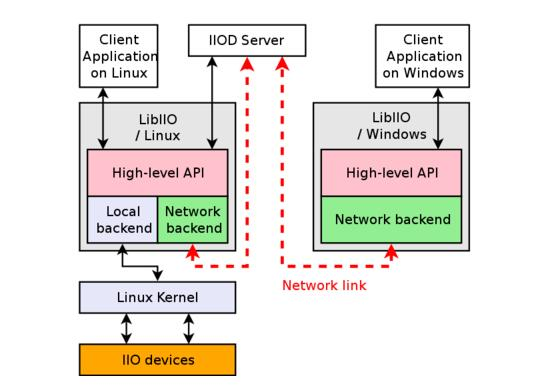

[libiio](https://wiki.analog.com/resources/tools-software/linux-software/libiio) 提供了统一的接口来操作位于iio子系统下的设备。


<!--more-->

# 结构



由上图可以看出:
- libiio 具有 `local backend` 和 `network backend` 两种后端
  + `local backend` 用于与本地的 `sysfs` 中的文件交互
  + `network backend` 通过 `iiod` 服务器运作，可以通过网络连接将测试数据发送到其他平台上

# 编译

- 在[github](https://github.com/analogdevicesinc/libiio) 下载最新稳定版代码
- 编写工具链配置文件 `toolchain.cmake`

``` shell
mkdir build
cd build
# 指定编译器设定文件以及取消掉不必要的编译选项
# 第一次cmake生成基础文件
cmake -DCMAKE_TOOLCHAIN_FILE=../toolchain.cmake ../
# 第二次才是重新配置选项
cmake-gui -DCMAKE_TOOLCHAIN_FILE=../toolchain.cmake ../

make all
make install DESTDIR=/home/cec/iio
```

# API

参考[官方手册](http://analogdevicesinc.github.io/libiio/) 做简单整理。

[](./api_struct.jpg)

API由以下4部分组成:

- iio_channel : 代表一个设备上的一个通道
- iio_device : 代表一个具体的设备实例，一个 `iio_device` 可能会包含多个 `iio_channel`
- iio_buffer : 针对设备的缓存，一个 `iio_device` 对应一个 `iio_buffer`
- iio_context : 可能包含多个 `iio_device` 
  
iio 设备在sysfs中可以读写的文件名为: `<in/out>_<channel>_<attr>` 。

## context

### 创建与消除

一般一个进程创建一个 `iio_context` 对象，以代表对 IIO 设备的打包使用：
- 在创建 `context` 就会遍历 `iio:device` 以集合设备

``` c
  /**
   ,* @brief Create a context from local IIO devices (Linux only)
   ,* @Returns
   ,* On success, A pointer to an iio_context structure
   ,* On failure, NULL is returned and errno is set appropriately
   ,*/
  __api struct iio_context* iio_create_local_context 	(void);
  /**
   ,* @brief Create a context from the network.
   ,* @param host:	Hostname, IPv4 or IPv6 address where the IIO Daemon is running 
   ,* @Returns
   ,* On success, a pointer to an iio_context structure
   ,* On failure, NULL is returned and errno is set appropriately
   ,*/
  __api struct iio_context* iio_create_network_context 	(const char *  host);
  /**
   ,* @brief Destroy the given context. 
   ,*/
  __api void iio_context_destroy 	(struct iio_context * ctx);
```

### 与设备的关系

``` c
  /**
   ,* @brief Enumerate the devices found in the given context.
   ,* @ret : The number of devices found 
   ,*/
  unsigned int iio_context_get_devices_count 	(const struct iio_context * ctx);
  /**
   ,* @brief Get the device present at the given index.
   ,*/
  struct iio_device* iio_context_get_device 	(const struct iio_context *  	ctx,
                                                  unsigned int  	index);
  /**
   ,* @brief :Retrieve the device ID (e.g. iio:device0) 
   ,*/
  const char* iio_device_get_id 	(const struct iio_device *  	dev);
  /**
   ,* @brief : Retrieve the device name (e.g. xadc) 
   ,*/
  const char* iio_device_get_name 	(const struct iio_device *  	dev);
  /**
   ,* @brief : Try to find a device structure by its name of ID.
   ,*/
  struct iio_device* iio_context_find_device 	(const struct iio_context *  	ctx,
                                                  const char *  	name);
```

### channels

注意: **两个channels可以具有相同的ID，分别代表输入和输出！**

``` c
  /**
   ,* @brief : Enumerate the channels of the given device. 
   ,*/
  unsigned int iio_device_get_channels_count 	(const struct iio_device *  	dev);
  /**
   ,* @brief : Get the channel present at the given index. 
   ,*/
  struct iio_channel* iio_device_get_channel 	(const struct iio_device *  	dev,
                                                  unsigned int  	index);
  /**
   ,* @brief : Try to find a channel structure by its name of ID.
   ,* @param output:	True if the searched channel is output, False otherwise 
   ,*/
  struct iio_channel* iio_device_find_channel 	( 	const struct iio_device *  	dev,
                                                    const char *  	name,
                                                    bool  	output
                                                    );
  /**
   ,* @brief : Return True if the given channel is an output channel. 
   ,*/
  bool iio_channel_is_output 	(const struct iio_channel *  	chn);
  /**
   ,* @brief : Retrieve the channel ID (e.g. voltage0) 
   ,*/
  const char* iio_channel_get_id 	(const struct iio_channel * chn);
  /**
   ,* @brief : Retrieve the channel name (e.g. vccint) 
   ,*/
  const char* iio_channel_get_name 	(const struct iio_channel *  chn);
```

### 属性

``` c
  /**
   ,* @brief : Enumerate the device-specific attributes of the given device. 
   ,*/
  unsigned int iio_device_get_attrs_count(const struct iio_device *  	dev);
  /**
   ,* @brief : Get the device-specific attribute present at the given index. 
   ,*/
  const char* iio_device_get_attr 	( 	const struct iio_device *  	dev,
                                        unsigned int  	index);
  unsigned int iio_channel_get_attrs_count 	( 	const struct iio_channel *  chn);
  const char* iio_channel_get_attr 	( 	const struct iio_channel *  	chn,
                                        unsigned int  	index 
                                        );
  /**
   ,* @brief : Try to find a device-specific attribute by its name. 
   ,* @NOTE: This function is useful to detect the presence of an attribute. It can also be used to retrieve the name of an attribute a * s a pointer to a static string from a dynamically allocated string. 
   ,*/
  const char* iio_device_find_attr 	( 	const struct iio_device *  	dev,
                                        const char *  	name 
                                        );
  const char* iio_channel_find_attr 	( 	const struct iio_channel *  	chn,
                                          const char *  	name 
                                          );
```

## 参数的读写

- 读取设备参数
  + iio_device_attr_read()
  + iio_device_attr_read_all()
  + iio_device_attr_read_bool()
  + iio_device_attr_read_longlong()
  + iio_device_attr_read_double()
- 读取通道参数
  + iio_channel_attr_read()
  + iio_channel_attr_read_all()
  + iio_channel_attr_read_bool()
  + iio_channel_attr_read_longlong()
  + iio_channel_attr_read_double()
- 读取调试参数:并不是每个设备都有debugfs
  + iio_device_debug_attr_read()
  + iio_device_debug_attr_read_all()
  + iio_device_debug_attr_read_bool()
  + iio_device_debug_attr_read_longlong()
  + iio_device_debug_attr_read_double()
  + iio_device_get_debug_attrs_count() : 获取debug参数数目
  + iio_device_get_debug_attr(): 得到attr
  + iio_device_find_debug_attr(): 寻找attr
- 写设备参数
  + iio_device_attr_write()
  + iio_device_attr_write_all()
  + iio_device_attr_write_bool()
  + iio_device_attr_write_longlong()
  + iio_device_attr_write_double()
- 写通道参数
  + iio_channel_attr_write()
  + iio_channel_attr_write_all()
  + iio_channel_attr_write_bool()
  + iio_channel_attr_write_longlong()
  + iio_channel_attr_write_double()
- 写调试参数:并不是每个设备都有debugfs
  + iio_device_debug_attr_write()
  + iio_device_debug_attr_write_all()
  + iio_device_debug_attr_write_bool()
  + iio_device_debug_attr_write_longlong()
  + iio_device_debug_attr_write_double()
- 寄存器的直接读写:并不是每个设备都有
  + iio_device_reg_read()
  + iio_device_reg_write()
  
## 触发

- iio_device_is_trigger() : 检查设备是否可以使用触发
- iio_device_get_trigger(): 是否已经绑定触发
- iio_device_set_trigger(): 绑定触发或解绑

## 获取采样的值

在 `libiio` 中使用 `iio_buffer` 来获取或设置设备的值。

- 在使用buffer之前需要先使能或关闭对应的采样通道:
  + iio_channel_enable()  / iio_channel_disable()
  + iio_channel_is_scan_element() : 检查此通道是否可用于buffer
- 然后再创建buffer
  +  iio_device_create_buffer()
  +  iio_buffer_destroy() : 不使用时关闭
- 当为输入通道时，还需要刷新依次缓存
  +  iio_buffer_refill()
  
### 缓存的操作

- 向缓存写数据:

``` c
  size_t iio_buf_size = iio_buffer_end(buffer) - iio_buffer_start(buffer);
  size_t count = MAX(sizeof(samples_buffer), iio_buf_size);
  memcpy(iio_buffer_start(buffer), samples_buffer, count);
  /**
   ,* @note : 当申请的缓存时环形队列时并且kernel中支持环形队列,缓存的值会自动更新到kernel
   ,* 否则上层需要使用 iio_buffer_push() 来主动发送缓存到kernel
   ,*/
```

- 回调: 当缓存读入数据或缓存发送时需要填入数据，都会触发回调

``` c
  ssize_t sample_cb(const struct iio_channel *chn, void *src, size_t bytes, void *d)
  {
    /* Use "src" to read or write a sample for this channel */
  }
  int main(void)
  {
    ...
    iio_buffer_foreach_sample(buffer, sample_cb, NULL);
    ...
  }
```

- 循环的读写

``` c
  for (void *ptr = iio_buffer_first(buffer, channel);
       ptr < iio_buffer_end(buffer);
       ptr += iio_buffer_step(buffer)) {
    /* Use "ptr" to read or write a sample for this channel */
   }
```

## 获取版本号

使用 `iio_library_get_version()` 来获取版本号进行区分，以使用对应的功能。

# 实例

基本思路如下:
- 创建一个context
- 找寻设备
- 获取通道
- 进行读写

以气压计 ms5611 为例:

``` c
  struct iio_context * context;
  struct iio_device  * baro;
  struct iio_channel * mb_temp;

  context = iio_create_local_context();
  assert(context != NULL);

  baro = iio_context_find_device(context, "ms5611");
  if(baro == NULL)
    {
      printf("can not find ms5611!\n");
    }
  printf("ms5611 has %d channels\n", iio_device_get_channels_count(baro));
  mb_temp = iio_device_find_channel(baro,
                                           "temp", false);

  double f_temp_val = 0;
  if(iio_channel_attr_read_double(mb_temp, "input", &f_temp_val))
    {
      printf("read error!\n");
    }
  else
    {
      printf("value is = %f\n", f_temp_val);
    }
```

