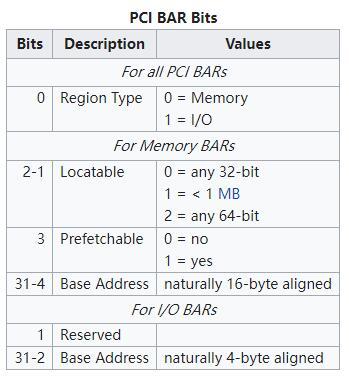

学习视频：[GNU/Linux & PCI(Express)](https://www.youtube.com/playlist?list=PLCGpd0Do5-I1hZpk8zi9Zh7SCnHrIQlgT)

[pciutils](https://github.com/pciutils/pciutils)提供了一个库，用户可以基于此库来完成对 PCI 设备的操控。但是里面的地址到底和 CPU 能直接映射的地址之间是什么关系呢？

<!--more-->

# 对 PCI 的地址进行配置

其实系统开机的时候，PCI 设备并没有被分配地址。而是由操作系统最开始根据 PCI 物理总线的地址开始扫描 PCI 设备。

如果一个 PCI 插槽上有 PCI 设备，那么就可以获取到该 PCI 设备配置空间中的信息。

经过扫描以后，操作系统便知道当前有多少设备存在了，然后再由设备驱动程序对设备的配置空间进行配置。

设备驱动程序会将申请到的地址写入到配置空间中去，对于 endpoints 最多可以有 6 个地址（BAR，Base address Registers），对于 bridges 最多可以有 两个地址（BAR）。

对于 X86 构架而言，地址就分为 IO 地址和 memory 地址，对于 ARM 架构而言就是 memory 地址：

可以看到，bit 0 用于区分是 I/O 地址还是 memory 地址，如果是 memory 地址则是 16 字节对齐的（因为前 4 位是配置位）。

# 获取地址访问

目前仅仅是获取到了 PCI 设备的可操作地址，但是还不知道其可操作范围。

以 memory address space 为例，获取操作范围步骤如下：

1. 对对应的 BAR 地址写入全 1 数据 0xffffffff

2. 对应的 BAR 将会返回表示范围的值 比如： 0xfffff00x

   > x 代表低 4 位的配置

3. 将配置位清 0 后为： 0xfffff000

4. 会值进行按位取反再加一，那就是 0xfff + 1 = 0x1000

5. 最终可操作范围就是 4096 字节

# 对 BARs 进行解析

在作者 [自己 clone 的库](https://github.com/Johannes4Linux/pciutils)中已经实现了一个`pcibars.c`，用于从逻辑设备中读取 BAR 的内容。

> 这里有对 BAR 可操作范围的计算，与上面说的流程一致。
>
> 使用 lspci 也可以查看 BARs
