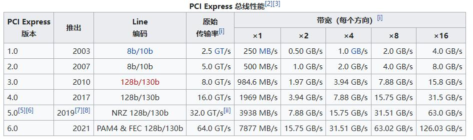
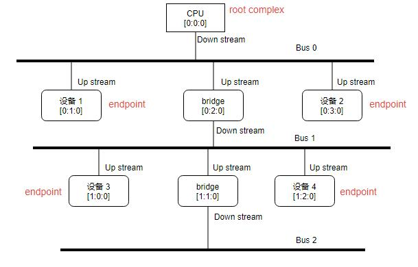

学习视频：[GNU/Linux & PCI(Express)](https://www.youtube.com/playlist?list=PLCGpd0Do5-I1hZpk8zi9Zh7SCnHrIQlgT)

PCIE 使用高速差分串行总线替代了并口的 pci，取得了惊人的速度提升：



先来学习一下如何查看与主机连接的 PCIE 设备。

<!--more-->

# lspci

最简单的命令就是`lspci`，用于列出所有的 PCI 总线以及与 PCI 接入的所有设备：

```shell
~$ lspci
00:00.0 Host bridge: Intel Corporation 8th Gen Core Processor Host Bridge/DRAM Registers (rev 07)
00:02.0 VGA compatible controller: Intel Corporation UHD Graphics 630 (Desktop)
00:14.0 USB controller: Intel Corporation 200 Series/Z370 Chipset Family USB 3.0 xHCI Controller
00:14.2 Signal processing controller: Intel Corporation 200 Series PCH Thermal Subsystem
00:16.0 Communication controller: Intel Corporation 200 Series PCH CSME HECI #1
00:17.0 SATA controller: Intel Corporation 200 Series PCH SATA controller [AHCI mode]
00:1b.0 PCI bridge: Intel Corporation 200 Series PCH PCI Express Root Port #17 (rev f0)
00:1c.0 PCI bridge: Intel Corporation 200 Series PCH PCI Express Root Port #1 (rev f0)
00:1c.1 PCI bridge: Intel Corporation 200 Series PCH PCI Express Root Port #2 (rev f0)
00:1c.4 PCI bridge: Intel Corporation 200 Series PCH PCI Express Root Port #5 (rev f0)
00:1d.0 PCI bridge: Intel Corporation 200 Series PCH PCI Express Root Port #9 (rev f0)
00:1f.0 ISA bridge: Intel Corporation Z370 Chipset LPC/eSPI Controller
00:1f.2 Memory controller: Intel Corporation 200 Series/Z370 Chipset Family Power Management Controller
00:1f.3 Audio device: Intel Corporation 200 Series PCH HD Audio
00:1f.4 SMBus: Intel Corporation 200 Series/Z370 Chipset Family SMBus Controller
00:1f.6 Ethernet controller: Intel Corporation Ethernet Connection (2) I219-V
03:00.0 SATA controller: ASMedia Technology Inc. ASM1062 Serial ATA Controller (rev 02)
04:00.0 USB controller: ASMedia Technology Inc. ASM2142 USB 3.1 Host Controller
```

前面的几个数依次是：`[bus number]:[device number]:[function number]`。

## 理解 PCI 拓扑

要理解这几个数值，就需要理解 PCI 拓扑：



如上图所示，一共有 3 条总线：

- 与每个节点连接的称之为`Stream`，靠近根节点的是`Up stream`，反之则是`Down stream`
- 根节点只有与之相连的`Down stream`，根节点又称之为`Root complex`。而设备节点只有`Up stream`与之相连，设备节点又称之为`Endpoint`
- 桥节点负责将两个总线连接起来，所以会有`Up stream`和`Down stream`与之连接

其中`Root complex`的号就是`0:0:0`，接下来便是根据当前的总线，设备便可以确定对应的总线号、设备号。而功能号则是根据设备可以提供的功能而定。

> 这里的功能指的是在这个设备上可以抽象出来的多个逻辑设备，比如一个网卡物理设备可以抽象出来两个逻辑的网卡。

其中，总线占用 8 位，设备占用 5 位，功能占用 3 位。

> 所以一个系统最多拥有 256 个总线，每个总线最多拥有 32 个设备，每个设备最多支持 8 个功能。

这样子再来看上面的输出：

> 00:00.0 Host bridge: Intel Corporation 8th Gen Core Processor Host Bridge/DRAM Registers (rev 07)

这里的初始节点指的就是 CPU 本身，它作为一个`Root complex`。

> 00:1f.0 ISA bridge: Intel Corporation Z370 Chipset LPC/eSPI Controller
> 00:1f.2 Memory controller: Intel Corporation 200 Series/Z370 Chipset Family Power Management Controller
> 00:1f.3 Audio device: Intel Corporation 200 Series PCH HD Audio
> 00:1f.4 SMBus: Intel Corporation 200 Series/Z370 Chipset Family SMBus Controller
> 00:1f.6 Ethernet controller: Intel Corporation Ethernet Connection (2) I219-V

上面的几个输出都是在总线 0，设备 0x1f 上，只是具有 5 个功能。

## 查看树形结构

基于以上的认知，现在可以理解下面的树形连接：

```shell
~$ lspci -tv
-[0000:00]-+-00.0  Intel Corporation 8th Gen Core Processor Host Bridge/DRAM Registers
           +-02.0  Intel Corporation UHD Graphics 630 (Desktop)
           +-14.0  Intel Corporation 200 Series/Z370 Chipset Family USB 3.0 xHCI Controller
           +-14.2  Intel Corporation 200 Series PCH Thermal Subsystem
           +-16.0  Intel Corporation 200 Series PCH CSME HECI #1
           +-17.0  Intel Corporation 200 Series PCH SATA controller [AHCI mode]
           +-1b.0-[01]--
           +-1c.0-[02]--
           +-1c.1-[03]----00.0  ASMedia Technology Inc. ASM1062 Serial ATA Controller
           +-1c.4-[04]----00.0  ASMedia Technology Inc. ASM2142 USB 3.1 Host Controller
           +-1d.0-[05]--
           +-1f.0  Intel Corporation Z370 Chipset LPC/eSPI Controller
           +-1f.2  Intel Corporation 200 Series/Z370 Chipset Family Power Management Controller
           +-1f.3  Intel Corporation 200 Series PCH HD Audio
           +-1f.4  Intel Corporation 200 Series/Z370 Chipset Family SMBus Controller
           \-1f.6  Intel Corporation Ethernet Connection (2) I219-V
```

上面的输出更加明了，可以看到在桥`[00:1c:1]`和`[00:1c:4]`与之连接了总线对应的 ATA 控制器和 USB3.1 控制器。

# pciutils

上面的 lspci 命令便是出自于 [pciutils](https://github.com/pciutils/pciutils)，其提供了命令`setpci`，可以与 pci 设备进行读写测试。

> 使用 setpci 对 FPGA 进行测试是一个比较快的方式。

