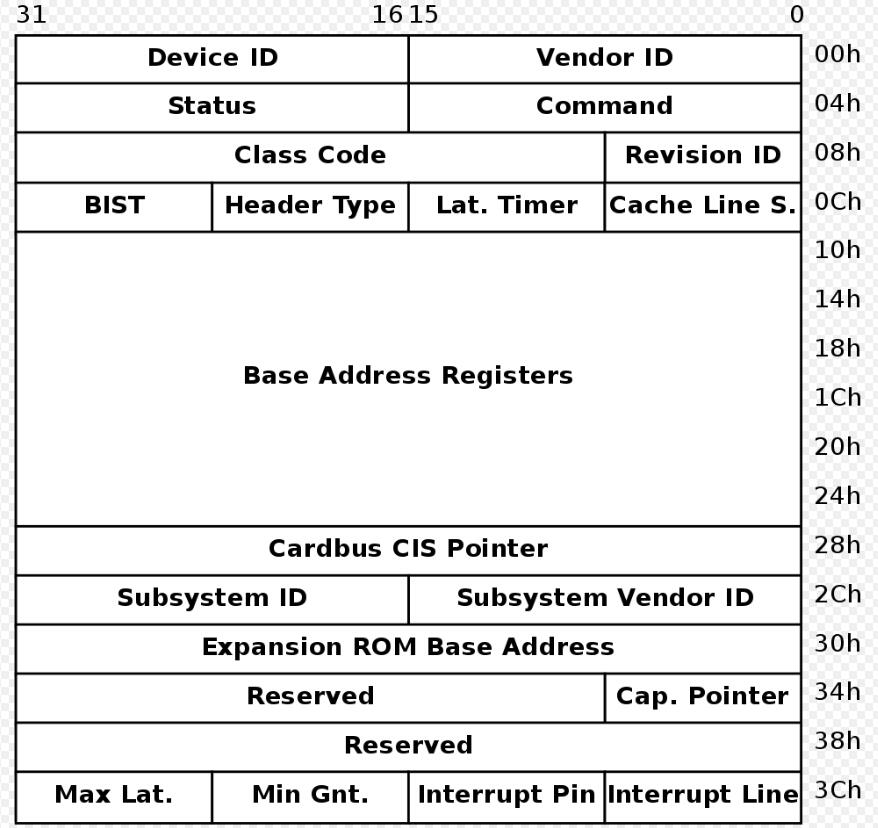

学习视频：[GNU/Linux & PCI(Express)](https://www.youtube.com/playlist?list=PLCGpd0Do5-I1hZpk8zi9Zh7SCnHrIQlgT)

[pciutils](https://github.com/pciutils/pciutils)提供了一个库，用户可以基于此库来完成对 PCI 设备的操控。

> 当然需要注意的是，该库是 GPL 协议，所以无法直接拿来作为产品使用。

<!--more-->

# PCI 配置空间

## 概览

PCI 配置空间（configuration space）是 PCI 设备的一组寄存器，用于提供该设备的一些信息：

配置空间一共 256 字节长，其中前 64（0x10h） 字节的格式是各个设备相同的，其余的字节则是根据厂家而定。

> PCI-X 2.0 和 PCIE 将配置空间增加到了 4096 字节长，其中前 256 字节都是标准格式。

- Vendor ID(VID)  和 Device ID(DID) ：表示独一无二的厂家 ID，包含了该厂家所定的独一无二的设备 ID

  > 厂家 ID 从 PCI-SIG 申请，而设备 ID 则是厂家自己定

- Status：用于表示该设备所支持的功能和错误状态

- Command：以位的形式表示设备所支持的特性

- Header Type：指定头的类型以表示接下来 48 字节所表示的意义

  > 值为 1 表示其为 Root complex、switches、bridges
  >
  > 值为 0 表示其为 endpoint

- Cache Line Size：指定与 CPU 符合的 Cache Line 大小

  > PCIE 中不使用该寄存器

- Subsystem Vendor ID(SVID) 和 Subsystem ID(SSID)：用于表示该设备上的各个模块厂商 ID 和设备 ID

## 输出配置空间的内容

在作者 [自己 clone 的库](https://github.com/Johannes4Linux/pciutils)中已经实现了一个，`pciheader.c`用于打印配置空间，代码也比较好理解。

# PCI capabilities

## 概览

在 PCI 配置空间中，有一个`Cap.Pointer`寄存器，这个是一个指针，用于指向下一个 capability 的地址。

每个 capability 都具有一个字节用于表示当前的类型，以及一个`Cap.Pointer`寄存器指向下一个 capability 的地址。

这样多个 capability 就通过自己的`Cap.Pointer`寄存器将 PCI 设备的多个特性以链表的形式链接了起来。

这样便保证了设备配置信息的灵活性。

## 输出 capabilities

在作者 [自己 clone 的库](https://github.com/Johannes4Linux/pciutils)中已经实现了一个，`lspcicaps.c`用于打印 capalibities，代码也比较好理解。

> 使用 lspci -v 也可以输出这些内容
