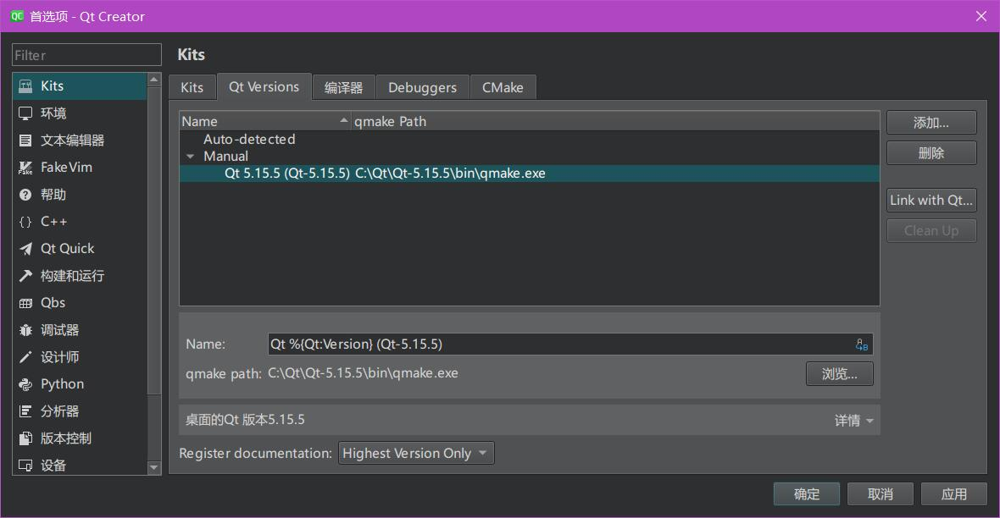
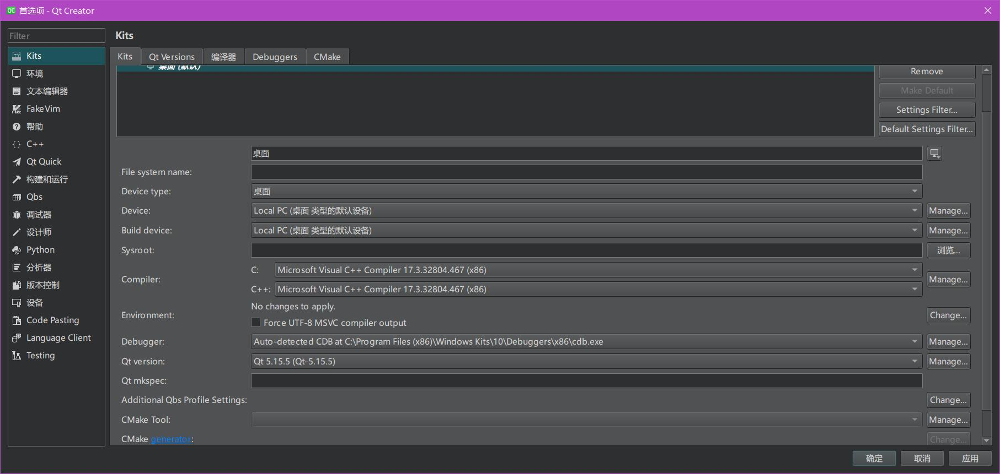
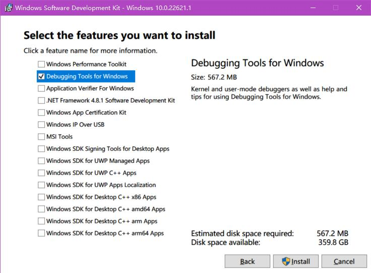

Qt 5.15 是 Qt5 系列的最后一个 LTS，但是在 Qt 5.15.2 之后，需要付费用户才能获取其官方源码了。

而 KDE 是基于 Qt5 开发的，所以他们宣布[以开源的方式继续维护 5.15 分支](https://community.kde.org/Qt5PatchCollection)，直到 KDE 切换到 Qt6 分支。

这对于我们普通用户来讲就是福音了，我们可以编译 KDE 维护的 5.15 。

<!--more-->

# 编译前的准备

## 安装编译需要的工具

为了完成编译，需要安装的工具有：
1. [Visual Studio 2022](https://visualstudio.microsoft.com/zh-hans/)，安装 c++ 以及通用平台组件即可
2. [Python](https://www.python.org/)
3. [strawberryperl](https://strawberryperl.com/)
4. [ruby](https://www.ruby-lang.org/en/)

以上工具，基本上按照提示即可完成安装。

## 获取分支源码

> 获取源码要开代理，速度才快。

在 [KDE Qt 库](https://invent.kde.org/qt/qt/qt5)获取源码，并切换到`kde/5.15`分支：

```shell
git clone --progress --verbose --branch kde/5.15 https://invent.kde.org/qt/qt/qt5.git qt-kde-5.15-LTS
```

然后获取其子模块：

```shell
cd qt-kde-5.15-LTS
git submodule update --init --recursive --progress
```

当然，子模块也需要切换到`kde/5.15`分支：
> 以下这个脚本，是我在 WSL 下完成运行的，对 Windows 脚本不太熟悉……

```shell
#!/bin/bash

QT_SUBDIRS=$(ls -F | grep / | grep qt)

echo "Git module sub-directories to switch to kde/5.15 branch: $QT_SUBDIRS"

for SUBDIR in $QT_SUBDIRS ; do

	echo "Branching $SUBDIR to kde/5.15..."
	cd $SUBDIR
	git checkout kde/5.15 || true
	cd ..

done
```

注意：
1. 这里的`qtwebengine`没有切换成功，因为其分支名称不叫这个，但我目前没有使用这个模块，所以就没有管它。

# 编译

假设目前编译 X86 编码的库，那么就在“开始”中打开命令行窗口`x86 Native Tools Command Prompt for VS 2022`，然后切换到源码目录下。

然后就开始配置并编译吧：

```powershell
# 配置
configure -confirm-license -opensource -debug -qt-sqlite -qt-zlib -qt-libpng -qt-libjpeg -nomake tests -no-compile-examples -nomake examples
# 编译
nmake
# 安装
nmake install
```

编译完成后，可以在源码目录`qtbase/bin`下运行一下`qmake --version`来验证是否编译成功：

```shell
D:\github\qt-kde-5.15-LTS\qtbase\bin>qmake --version
QMake version 3.1
Using Qt version 5.15.5 in C:/Qt/Qt-5.15.5/lib
```

# QtCreator 使用编译好的库

安装最新的[QtCreator](https://github.com/qt-creator/qt-creator)，目前我用的是 8.0.0。

进入`编辑--preferences`中选择`Kit`选项卡，在`Qt Versions`中选择安装好的`qmake`路径：



然后进入`Kits`中选择当前 Qt 库的版本，选项 MSVC 编译器，和 CDB 调试器：



如果没有 CDB 调试器的话，可以进入[Windows SDK](https://developer.microsoft.com/zh-cn/windows/downloads/windows-sdk/)安装下载器，然后选择安装调试器：




以上，便大功告成了！
