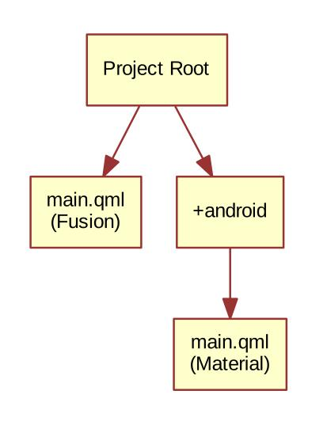

学习书籍：
1. [《QmlBook》](http://qmlbook.github.io/index.html)

Qt 版本：Qt 5.12.10

现在来理解以下什么是 Qt Quick control。
<!--more-->

# 什么是 Qt Quick Control

前面学习的部分都是使用基础元素来进行绘制 UI，但是如果要来开发稍微复杂点的 UI，虽然比起 QWidget 效率要高，但依然还是很麻烦。

Qt Quick Control 便提供了很多内建的组件和风格（称之为模块）来帮助用户又快又美的实现 UI。

用户使用的使用只需要`import`对应的模块即可，比如：

| 模块                       | 描述                                               |
| -------------------------- | -------------------------------------------------- |
| QtQuick.Controls           | 基础的控制交互                                     |
| QtQuick.Templates          | 交互模板，用户可以继承与此进行自己的扩展           |
| QtQuick.Dialogs            | 提供一系列对话框（比如消息、文件浏览、颜色设定等） |
| QtQuick.Controls.Universal | 对微软 Universal 风格的支持                        |
| QtQuick.Controls.Material  | 对谷歌 Material 风格的支持                         |
| Qt.labs.calendar           | 对日历的相关操作                                   |
| Qt.labs.platform           | 对本地系统显示风格的支持                           |

# 图片浏览器

尝试创建多种风格的图片浏览器。

## 桌面（Fusion）风格

经典的桌面风格包括以下几个部分： 

- `MenuBar`:菜单栏
- `ToolBar `:工具栏
- `TabBar`:状态栏
- 中间显示/操控区

在使用 QWidget 来开发此代码的画，得需要继承自 QMainWindow 类，并且在构造函数中设置其菜单栏、工具栏、状态栏，在选中图片后，还需要配置相应的信号与槽来显示图片……

在使用 Qt Quick Control 后，就相对简单多了。

### 工程配置

``` makefile
#指定要使用的模块
QT += quick quickcontrols2
CONFIG += c++11

# The following define makes your compiler emit warnings if you use
# any feature of Qt which as been marked deprecated (the exact warnings
# depend on your compiler). Please consult the documentation of the
# deprecated API in order to know how to port your code away from it.
DEFINES += QT_DEPRECATED_WARNINGS

# You can also make your code fail to compile if you use deprecated APIs.
# In order to do so, uncomment the following line.
# You can also select to disable deprecated APIs only up to a certain version of Qt.
#DEFINES += QT_DISABLE_DEPRECATED_BEFORE=0x060000    # disables all the APIs deprecated before Qt 6.0.0

# 预先通过 c++ 来对 quick 进行配置
SOURCES += \
        main.cpp

# 以资源文件的形式来加载 qml 文件
RESOURCES += qml.qrc

# Additional import path used to resolve QML modules in Qt Creator's code model
QML_IMPORT_PATH =

# Additional import path used to resolve QML modules just for Qt Quick Designer
QML_DESIGNER_IMPORT_PATH =

# Default rules for deployment.
qnx: target.path = /tmp/$${TARGET}/bin
else: unix:!android: target.path = /opt/$${TARGET}/bin
!isEmpty(target.path): INSTALLS += target
```

### 基础配置

首先需要在`main.cpp`中配置显示风格为`Fusion`版本，然后载入 qml 文件

```cpp
#include <QGuiApplication>
#include <QQmlApplicationEngine>
#include <QQuickStyle>

int main(int argc, char *argv[])
{
    QCoreApplication::setAttribute(Qt::AA_EnableHighDpiScaling);

    QGuiApplication app(argc, argv);

    QQmlApplicationEngine engine;
    QQuickStyle::setStyle("Fusion");
    engine.load(QUrl(QStringLiteral("qrc:/main.qml")));
    if (engine.rootObjects().isEmpty())
        return -1;

    return app.exec();
}
```

### 界面配置

在进行了基础配置后，接下来就是进入到 qml 中进行界面开发了：

```javascript
import QtQuick 2.0
import QtQuick.Controls 2.4
import QtQuick.Dialogs 1.2

ApplicationWindow {
    
    // ...
    
    visible: true
    width: 640
    height: 480
    title: qsTr("Image Viewer")
    
    //菜单栏
    menuBar: MenuBar {
        //每个主菜单就是一个 Menu，对应的下拉菜单就是一个 MenuItem
        Menu {
            title: qsTr("&File")
            MenuItem {
                text: qsTr("&Open...")
                //调用 freedesktop 的图标
                icon.name: "document-open"
                //按下以后打开文件对话框
                onTriggered: fileOpenDialog.open()
            }
        }

        Menu {
            title: qsTr("&Help")
            MenuItem {
                text: qsTr("&About...")
                //按下以后打开 about 对话框
                onTriggered: aboutDialog.open()
            }
        }
    }

    //工具栏以 Flow 的形式排列，避免换行
    header: ToolBar {
        Flow {
            anchors.fill: parent
            ToolButton {
                text: qsTr("Open")
                icon.name: "document-open"
                onClicked: fileOpenDialog.open()
            }
        }
    }

    background: Rectangle {
        color: "darkGray"
    }

    Image {
        id: image
        anchors.fill: parent
        fillMode: Image.PreserveAspectFit
        asynchronous: true
    }

    //设置文件对话框的过滤文件类型
    FileDialog {
        id: fileOpenDialog
        title: "Select an image file"
        folder: shortcuts.documents
        nameFilters: [
            "Image files (*.png *.jpeg *.jpg)",
        ]
        //当选中以后，便将 URL 填入图片资源地址中
        onAccepted: {
            image.source = fileOpenDialog.fileUrl
        }
    }

    Dialog {
        id: aboutDialog
        title: qsTr("About")
        Label {
            anchors.fill: parent
            text: qsTr("QML Image Viewer\nA part of the QmlBook\nhttp://qmlbook.org")
            horizontalAlignment: Text.AlignHCenter
        }

        standardButtons: StandardButton.Ok
    }

    // ...

}
```

## 移动端风格

移动端与桌面端最大的不同在于其交互方式的不同，将桌面风格修改为移动端风格时，工程配置不需要任何改动。

而且对于基础配置而言，也仅需要将其风格修改为`Material`风格即可：

```cpp
QQuickStyle::setStyle("Material");
```

有关`Material`风格的图片，可以在[官网获取](https://material.io/resources/icons/?style=baseline)。

重点还是在于对 qml 文件的修改：

```javascript
import QtQuick 2.0
import QtQuick.Controls 2.4
import QtQuick.Dialogs 1.2
import QtQuick.Controls.Material 2.1

ApplicationWindow {
    
    // ...
    
    id: window

    visible: true
    //尺寸设置为竖屏
    width: 360
    height: 520
    title: qsTr("Image Viewer")

    //以抽屉风格的形式展示工具栏
    Drawer {
        id: drawer

        width: Math.min(window.width, window.height) / 3 * 2
        height: window.height

        ListView {
            focus: true
            currentIndex: -1
            anchors.fill: parent

            delegate: ItemDelegate {
                width: parent.width
                text: model.text
                highlighted: ListView.isCurrentItem
                onClicked: {
                    drawer.close()
                    model.triggered()
                }
            }

            model: ListModel {
                ListElement {
                    text: qsTr("Open...")
                    triggered: function(){ fileOpenDialog.open(); }
                }
                ListElement {
                    text: qsTr("About...")
                    triggered: function(){ aboutDialog.open(); }
                }
            }

            ScrollIndicator.vertical: ScrollIndicator { }
        }
    }
    
    //工具栏说明
    header: ToolBar {
        Material.background: Material.Orange

        ToolButton {
            id: menuButton
            anchors.left: parent.left
            anchors.verticalCenter: parent.verticalCenter
            icon.source: "images/baseline-menu-24px.svg"
            onClicked: drawer.open()
        }
        Label {
            anchors.centerIn: parent
            text: "Image Viewer"
            font.pixelSize: 20
            elide: Label.ElideRight
        }
    }

    background: Rectangle {
        color: "darkGray"
    }

    Image {
        id: image
        anchors.fill: parent
        fillMode: Image.PreserveAspectFit
        asynchronous: true
    }

    FileDialog {
        id: fileOpenDialog
        title: "Select an image file"
        folder: shortcuts.documents
        nameFilters: [
            "Image files (*.png *.jpeg *.jpg)",
        ]
        onAccepted: {
            image.source = fileOpenDialog.fileUrl
        }
    }

    Dialog {
        id: aboutDialog
        title: qsTr("About")
        Label {
            anchors.fill: parent
            text: qsTr("QML Image Viewer\nA part of the QmlBook\nhttp://qmlbook.org")
            horizontalAlignment: Text.AlignHCenter
        }

        standardButtons: StandardButton.Ok
    }

    // ...

}
```

## 跨平台重用

前面的移动端及桌面端风格的代码有部分是可以重用的，Qml 使用文件选择器来完成这种重用，Qml 启动时会根据编译平台载入对应平台的代码。

不同平台以`+selector`的方式来表示这是一个针对特定平台的代码，比如`+android`就表示这是针对安卓平台的代码。



### 模块化元素

通过观察前面的代码，发现在选择图片以及显示图片这部分的代码是可以模块化的，那么就将这部分的代码写成一个单独的元素：

```javascript
//file: ImageViewerWindow.qml
import QtQuick 2.0
import QtQuick.Controls 2.4
import QtQuick.Dialogs 1.2

ApplicationWindow {

    // ...
    //暴露操作接口给外部
    function openFileDialog() { fileOpenDialog.open(); }
    function openAboutDialog() { aboutDialog.open(); }

    visible: true
    title: qsTr("Image Viewer")

    background: Rectangle {
        color: "darkGray"
    }

    Image {
        id: image
        anchors.fill: parent
        fillMode: Image.PreserveAspectFit
        asynchronous: true
    }

    FileDialog {
        id: fileOpenDialog

        // ...

        title: "Select an image file"
        folder: shortcuts.documents
        nameFilters: [ "Image files (*.png *.jpeg *.jpg)" ]
        onAccepted: image.source = fileOpenDialog.fileUrl;
    }

    Dialog {
        id: aboutDialog

        // ...

        title: qsTr("About")
        standardButtons: StandardButton.Ok

        Label {
            anchors.fill: parent
            text: qsTr("QML Image Viewer\nA part of the QmlBook\nhttp://qmlbook.org")
            horizontalAlignment: Text.AlignHCenter
        }
    }

    // ...

}
```

### 桌面端

有了模块化的元素，那么桌面端代码仅需要编写独立部分即可，也就是桌面端独有的菜单栏和状态栏：

```javascript
//file main.qml
import QtQuick 2.0
import QtQuick.Controls 2.4

ImageViewerWindow {
    
    // ...

    id: window
    
    width: 640
    height: 480
    
    menuBar: MenuBar {
        Menu {
            title: qsTr("&File")
            MenuItem {
                text: qsTr("&Open...")
                icon.name: "document-open"
                onTriggered: window.openFileDialog()
            }
        }

        Menu {
            title: qsTr("&Help")
            MenuItem {
                text: qsTr("&About...")
                onTriggered: window.openAboutDialog()
            }
        }
    }

    header: ToolBar {
        Flow {
            anchors.fill: parent
            ToolButton {
                text: qsTr("Open")
                icon.name: "document-open"
                onClicked: window.openFileDialog()
            }
        }
    }

    // ...

}
```

### 移动端

同样的，移动端仅需要编写自己的抽屉式工具栏即可（这个文件放在`+android`这种独立文件夹中）：

```javascript
//file:main.qml
import QtQuick 2.0
import QtQuick.Controls 2.4
import QtQuick.Controls.Material 2.1

ImageViewerWindow {

    // ...

    id: window

    width: 360
    height: 520

    Drawer {
        id: drawer

        // ...

        width: Math.min(window.width, window.height) / 3 * 2
        height: window.height

        ListView {

            // ...

            focus: true
            currentIndex: -1
            anchors.fill: parent

            delegate: ItemDelegate {
                width: parent.width
                text: model.text
                highlighted: ListView.isCurrentItem
                onClicked: {
                    drawer.close()
                    model.triggered()
                }
            }

            model: ListModel {
                ListElement {
                    text: qsTr("Open...")
                    triggered: function(){ window.openFileDialog(); }
                }
                ListElement {
                    text: qsTr("About...")
                    triggered: function(){ window.openAboutDialog(); }
                }
            }

            // ...

            ScrollIndicator.vertical: ScrollIndicator { }
        }
    }

    header: ToolBar {

        // ...

        Material.background: Material.Orange

        ToolButton {
            id: menuButton
            anchors.left: parent.left
            anchors.verticalCenter: parent.verticalCenter
            icon.source: "images/baseline-menu-24px.svg"
            onClicked: drawer.open()
        }
        Label {
            id: titleLabel
            anchors.centerIn: parent
            text: "Image Viewer"
            font.pixelSize: 20
            elide: Label.ElideRight
        }
    }

    // ...

}
```

### 风格的设定

之前风格的设定是在`main.cpp`中指定的，有了文件选择器，可以在各个平台的`qtquickcontrols2.conf`文件中设定当前风格。

比如将`+android`平台设定为`Material`风格。

```ini
[Controls]
Style=Material
```

## 本地风格的对话框

如果想在弹出对话框的时候使用本地对话框，那就就得需要使用 QWidget 模块。

首先需要在项目配置文件（*.pro）中加入 widget 模块：

```ini
QT += quick quickcontrols2 widgets
```

然后在`main.cpp`中使用`QApplication`：

```cpp
#include <QApplication>
#include <QQmlApplicationEngine>
#include <QQuickStyle>

// ...

int main(int argc, char *argv[])
{
    QCoreApplication::setAttribute(Qt::AA_EnableHighDpiScaling);

    QApplication app(argc, argv);

    // ...

    QQmlApplicationEngine engine;
    QQuickStyle::setStyle("Fusion");
    engine.load(QUrl(QStringLiteral("qrc:/main.qml")));
    if (engine.rootObjects().isEmpty())
        return -1;

    return app.exec();
}
```

最后使用`Qt.labs.platform`来代替`QtQuick.Dialogs`:

```javascript
import QtQuick 2.0
import QtQuick.Controls 2.4
import Qt.labs.platform 1.0

ApplicationWindow {
    
    // ...
    
    visible: true
    width: 640
    height: 480
    title: qsTr("Image Viewer")
    
    menuBar: MenuBar {
        Menu {
            title: qsTr("&File")
            MenuItem {
                text: qsTr("&Open...")
                icon.name: "document-open"
                onTriggered: fileOpenDialog.open()
            }
        }

        Menu {
            title: qsTr("&Help")
            MenuItem {
                text: qsTr("&About...")
                onTriggered: aboutDialog.open()
            }
        }
    }

    header: ToolBar {
        Flow {
            anchors.fill: parent
            ToolButton {
                text: qsTr("Open")
                icon.name: "document-open"
                onClicked: fileOpenDialog.open()
            }
        }
    }

    background: Rectangle {
        color: "darkGray"
    }

    Image {
        id: image
        anchors.fill: parent
        fillMode: Image.PreserveAspectFit
        asynchronous: true
    }

    FileDialog {
        id: fileOpenDialog
        title: "Select an image file"
        folder: StandardPaths.writableLocation(StandardPaths.DocumentsLocation)
        nameFilters: [
            "Image files (*.png *.jpeg *.jpg)",
        ]
        onAccepted: {
            //这里使用 file 而不是 fileUrl
            image.source = fileOpenDialog.file
        }
    }

    Dialog {
        id: aboutDialog
        title: qsTr("About")
        Label {
            anchors.fill: parent
            text: qsTr("QML Image Viewer\nA part of the QmlBook\nhttp://qmlbook.org")
            horizontalAlignment: Text.AlignHCenter
        }

        standardButtons: StandardButton.Ok
    }

    // ...

}
```

# 常用的界面模式

用 Qml 来做触摸交互设计，有一些常见的模式可以了解一下。

## 嵌套交互

这也是最常见的一种方式，也就是用户选择一些选项后，再进入下一级进行操作。当用户要返回的时候，也是一级一级的返回。

> 这就如同一个栈一样，先进后出。

实现这种逻辑得关键组件就是`StackView`，通过其`push`和`pop`方法来完成界面的切换。

## 滑动交互

通过左右滑动页面来进行交互，使用其核心是使用`SwipeView`组件来完成多个页面的切换，使用`PageIndicator`来指示当前处在哪一个页面。

# 图片外观绑定

业务逻辑需要与 UI 分离以降低耦合度。

同样的，对于 UI 来讲，交互逻辑与控件具体的外观也应该分离（比如按钮以及按钮的外观）。

Qml 使用 image style 以支持这种分离。

与控件关联的图片以`9.png`作为后缀，图片名称包含与控件关联的相关动作，也就是当控件的状态发生改变后它会与不同的图片进行关联。这样就实现了不同状态下的显示效果（也可以实现不改变代码的情况下换肤）。

最为方便的是，图片的显示大小会根据内容进行缩放以实现最佳的显示效果。

更加详细的说明还是要看[官方文档](https://doc.qt.io/qt-5/qtquickcontrols2-imagine.html)。