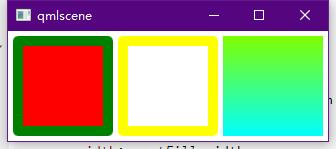
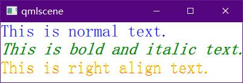
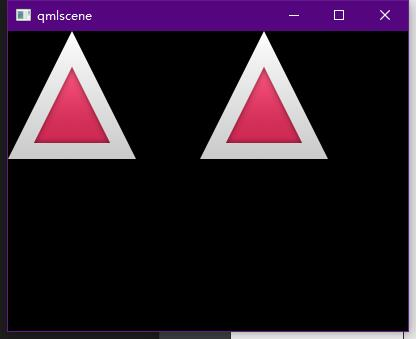
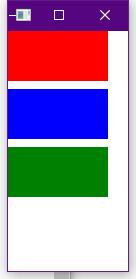
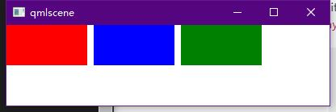
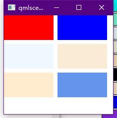
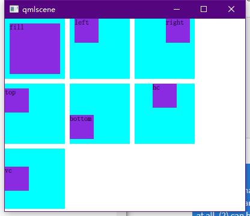

学习书籍：
1. [《QmlBook》](http://qmlbook.github.io/index.html)

Qt 版本：Qt 5.12.10

传统的工业嵌入式 Linux 是用 Qt widget 来做界面，但这种方式有以下不足：
1. 如果上层架构设计得不好，很容易将业务逻辑和用户交互在混杂在一起，后期维护困难。
2. 基于 Qt widget 的自定义控件需要涉及的方面较为繁杂，开发效率不高

目前越来越多的嵌入式 SOC 都会带有 GPU，那么基于 GPU 加速的 QML 便在运行效率上和 widget 的差距越来越小，并且：
1. 业务逻辑使用 c++ 编写成后端的方式，给前端提供最终的数据，基于 QML 专注于用户交互，便于维护代码
2. QML 和 c++ 完全可以分为两个人或多个人并行开发，提高开发效率
3. QML 内建的渲染方式比 widget 美观不少，这在赶进度的同时也可以开发出卖相不错的界面

综上所述，有必要来系统的了解一下 Qt Quick，以避免在实际项目中踩天坑。

关于 QML 的性能问题，可以使用[compiling-qml-ahead-of-time](https://doc.qt.io/qt-5/qtquick-deployment.html#compiling-qml-ahead-of-time)。

<!--more-->

# 什么是 Qt Quick
Qt Quick 是 Qt5 主打的用户交互技术的统称，它包括：
1. QML：用于用户交互的标记型语言
2. JavaScript：动态脚本语言
3. Qt C++：基于标准 c++ 的增强型版本，主要用于后端业务逻辑开发

其中 QML/JavaScript 结合用于前端开发，Qt C++ 用于后端开发。

# QML 语法概览
QML 是陈述式的语言，相比 c++ 来讲更接近人类的语言，所以在实现时用户更多关注的是具体表述层面，而不在语法层面，开发效率自然就上去了。
## 层级结构
QML 将复杂的界面分成了多个 QML 来完成，每个 QML 由多个元素组成，元素以层级的方式排布，可以具有自己的子控件，子控件继承父控件的坐标系统，也就是子控件的坐标是相对父控件而言的。
> 这一点和 QWidget 一致

比如使用 QML 在一个矩形中绘制一个图片和对图片说明的文字，其代码如下：
``` js
  /*
    注释和 c/c++,js 是一致的 
  */
  //导入对应的模块和版本
  //对于 QtQuick 模块而言，Qt5.11 就对应2.11，Qt 5.12 就对应 2.12 以此推类
  import QtQuick 2.12

  //矩形作为 QML 的基础层
  //每个 QML 文件都必须有且仅有一个 root 元素
  //元素由花括号来设定其内容
  Rectangle{
      //root 标识该层为基础层，id 标识该元素的名称，不得与其它元素 id 相冲突
      //使用 id 标识后，其它层可以使用此 id 名称来获取此层的属性
      id: root

      //指定属性名称及其值
      //属性的格式为： 名称:值
      width:120; height: 240
    
      //颜色属性，# 代表 16 进制
      color: "#4A4A4A"
    
      //创建 root 层的子控件，该控件用于显示一张图片
      Image {
    
          id: triangle
    
          //指定该图片的坐标，相对父控件的相对坐标
          //子控件也可以通过 parent 来访问父控件
          x: (parent.width - width) / 2; y: 40
    
          //指定图片的路径，图片存放在当前目录的 images 目录中
          source: "images/triangle_red.png"
      }
    
      //再创建一个 root 层的子控件，该控件用于显示文字
      Text{
          //这里没有给这个字符串设置 id
    
          //设置 y 坐标是相对于图片坐标的偏移
          //这里引用了上面图片的 id
          y:triangle.y + triangle.height + 20
    
          //设置宽度与 root 元素一致
          //这里引用了 root 元素的 id
          width: root.width
    
          //设置字体颜色，对齐方式，字符串内容
          color: 'white'
          //由于这里设置了居中对齐，所以都不需要设置字符串的 x 坐标了
          horizontalAlignment: Text.AlignHCenter
          text: 'Triangle'
      }
  }
```

## 属性
元素的配置就是通过键值对来完成，并且用户也可以自定义键值对，对键的赋值也可以引用其它键的名称，这就和 c/c++ 变量一样。
``` js
  Text{
      //为这个 Text 类元素指定一个对象名称
      id: thisLabel

      //设置该对象的坐标
      //同一行中使用分号分隔
      x: 24; y:16
      //设置高度
      height: 2 * width
      //自定义一个属性
      //该属性的类型为 int,名称为 times,值为 24
      property int times: 24
      //自定义另一个属性
      //该属性是对属性 times 的别名
      property alias anotherTimes: thisLabel.times
    
      //设置该文本的内容
      //完成字符串并且，int 型的 times 会转化为字符串形式
      text: "Greetings" + times
    
      //设置字体及大小
      font.family: "Ubuntu"
      font.pixelSize: 24
    
      //对该文本对象进行扩展
      //按下 Tab 按键切换到 otherLabel 对象
      KeyNavigation.tab: otherLabel
    
      //接收信号
      //当 height 改变后，从终端输出其值
      onHeightChanged: console.log('height:', height)
    
      //设置该文本可以接收按键事件
      focus: true
    
      //文本的颜色
      //这和 c/c++ 的三目运算符类似
      color:focus ? "red" : "black"
  }
```
由上面的示例可以看出来：元素的类型就相当于类，而创建一个具体的元素就是实例化该对象，而设置属性就相当于使用该类的方法来设置该对象。
- `id` 就是该对象的名称，名称不使用双引号包含，在创建之初确定后便不能被更改，且在同一个 QML 文件中，不能有相同的  `id` 值。
> 设定了 `id` 后，便可以通过 <id 值>.<属性> 来引用属性的值了

- 如果一个对象的属性没有被显示的设定，那么它们将会使用默认值
- 当有属性的值被改变了，引用它的属性的值也会跟着改变，在 QML 中这叫做绑定（binding）
> 这如同 c/c++ 中变量的值改变了，那么对应使用它的其它部分的运算结果也跟着改变了。

- 定义一个属性的格式为 `property <type> <name> : <value>` ，如果没有设置 <value> 则该属性使用默认值
- 可以通过 `property alias <name>: <reference>` 为属性设定一个别名
  + 这种方式主要是为了把当前对象的属性转发到外部可以使用
- 有些属性具有子属性，所以一般将这种属性集中设置
  + 对于上面的 `font` 属性还可以这样设置： `font { family: "Ubuntu"; pixelSize: 24 }`
- QtQuick 还内建了很多已创建的对象，可以直接引用对象的名称来完成一些关联设置： `<Element>.<property>: <value>`
- 对于任何属性，我们都可以为他绑定对应的信号处理机制
  + 比如对于 `Height` 属性，当它被改变时，就输出其值 `onHeightChanged: console.log('height:', height)`

**注意：**  对于 `id` 值的引用应该仅限于当前 QML 文件，最好不要跨文件引用。
> 因为这相当于严格限制了 QML 被载入的顺序，一旦顺序错误而其它文件有同名的 id 值覆盖了之前的 id 值，便会非常难以调试。

## 编写脚本
QML 与 JavaScript 是可以无缝衔接的（可以说是 QML 是 JavaScript 的扩展），如下：
``` js
  Text {
      id: label

      x: 24; y: 100
        
      // 自定义一个 int 类型的属性
      property int spacePresses: 0
        
      text: "Space pressed: " + spacePresses + " times"
        
      // 当文本内容被改变后，输出到控制台
      onTextChanged: console.log("text changed to:", text)
      onSpacePressesChanged: console.log("spacePress changed to:", spacePresses)
        
      // 捕捉输入事件
      focus: true
        
      // 使用 JS 检测空格按下然后增加属性 spacePresses 的值
      Keys.onSpacePressed: {
          increment()
      }
        
      // ESC 按下后清 0
      Keys.onEscapePressed: {
          label.text = ''
      }
        
      // 定义的 JS 函数
      function increment() {
          spacePresses = spacePresses + 1
      }
  }
```

**有一点需要特别注意：**
> QML 中的冒号（：）是绑定的意思，而 JavaScript 中的等号（=）是赋值的意思。
>
>  绑定可以从以下几个方面来理解：
>  - 绑定类似于 c++ 的引用，当其被绑定的值的内容发生变化时，这个属性所表示的内容也跟着改变了
>    + 而 JavaScript 中的赋值则是实际的占有了独立的内存
>  - 当属性绑定到其它值时或使用 JavaScript 方式赋值给它时，原来的值就与它脱离关系了

这也就解释了上面的代码：
  - JavaScript 通过检测空格键将属性 spacePresses 的值加 1，text 属性所表示的内容也自动更新了
  - 当按下 ESC 按键后，text 属性绑定到空字符串上去了，接下来继续按空格键，虽然 spacePress 的值依然在改变，但是在显示上已经看不到它的变化了

所以，为了能够正常显示，那么 text 的属性也应该用赋值而不是绑定，以满足正常的刷新：
``` js
    // 使用 JS 检测空格按下然后增加属性 spacePresses 的值
    Keys.onSpacePressed: {
        increment()
        label.text = "Space pressed: " + spacePresses + " times"
    }
```

# QML 内建的基础元素

元素可以被归类为两种类型：
- 可视化的：比如像矩形元素，可以设置坐标、大小、颜色等
- 非可视化的：比如像定时器提供的触发机制，用于操控这些可视化的元素

此处仅为常用元素的快速预览，更加详细的属性说明还是需要参考官方文档。

## Item

`Item` 元素是所有可视化元素的基类，其它可视化元素都继承于它。

`Item` 的目的是提供**所有可视化元素的共有的属性**，它实际上不会绘制任何图形，共有属性如下：

- 几何结构 
  + `x` 和 `y` 指定元素的左上角
  + `width` 和 `height` 指定元素的宽和高
  + `z` 指定元素所在的层
- 布局处理
  + `anchors` 指定该元素相对于其它元素的位置，相距之间有 `margins` 的距离
- 按键处理
  + `Key` 和 `KeyNavigation` 进行按键处理
  + `focus` 来使能按键处理
- 变换
  + `scale` 和 `rotate` 进行比例和旋转变换
  + `transform` 进行 x,y,z 变换
  + `transformOrigin` 进行点变换 
- 可视化
  + `opacity` 设置透明度
  + `visible` 设置显示还是隐藏
  + `clip` 抑制元素边界的绘图
  + `smooth` 增强渲染质量
- 状态定义
  + `states` 列出可支持的状态
  + `state` 表示当前的状态
  + `transitions` 列出动画中的状态

## Rectangle

> rectangle 需要显示设置其 `width` 和 `height` 属性，否则它就是不可见的。   

矩形元素除了继承自 `Item` 外，还具有以下扩展属性:
- `color` : 设置矩形的颜色
  + 颜色的值可以是 16进制 RGB（比如 “#FF4444”），也可以在[svg-color](https://www.w3.org/TR/css-color-3/#svg-color)表中填入对应的名称。
- `border.color` , `border.width` ：设置矩形轮廓的颜色和宽度
- `radius` : 设置圆角
- `gradient` ： 设置矩形填充的渐变色
  + 填充适合简单的应用场景，要是想要复杂的填充效果那还是自己贴图来得又快又好
``` js
  //填充渐变色是使用一系列 GradientStop 来完成的
  //每个 GradientStop 由对应的 position 和 color 来完成
  gradient: Gradient {
      //position : 0.0 代表 y 轴顶部
      GradientStop { position: 0.0; color: "lightsteelblue" }
      //position : 1.0 代表 y 轴底部
      GradientStop { position: 1.0; color: "slategray" }
  }
```

示例如下：
``` js
  import QtQuick 2.12

  //先实例化一个大的矩形作为一个根元素，这里实际上用来做背景
  Rectangle {
      id: root

      width: 320; height: 110
    
      color: "white"
    
      //画一个填充其它颜色并且带边框的圆角矩形
      Rectangle{
          id: rectFill
    
          x: 5; y: 5
    
          width: 100; height: 100
    
          color: "red"
    
          border.color: "green"; border.width: 10
    
          radius: 5
      }
      //画一个仅带有边框的圆角矩形
      Rectangle{
          id: rectHollow
    
          x: rectFill.x + rectFill.width + 5
          y: rectFill.y
    
          width: rectFill.width
          height: rectFill.height
    
          border.color: "yellow"; border.width: 10
    
          radius: rectFill.radius
      }
      //画一个带有渐变色的矩形
      Rectangle{
          id: rectGradient
    
          x: rectHollow.x + rectFill.width + 5
          y: rectFill.y
    
          width: rectFill.width
          height: rectFill.height
    
          gradient: Gradient{
              GradientStop {position: 0.0; color: "chartreuse"}
              GradientStop {position: 1.0; color:"cyan"}
          }
      }
  }
```
效果如下：


## Text
`Text` 除了继承自 `Item` 之外，还扩展了这些常用属性：
- `text` : 设置字符串内容
- `color` ： 设置字符串颜色
- `font` : 这是一组属性
  + `font.family` : 字体
  + `font.pixelSize` : 大小
  + `font.bold`：加粗
  + `font.italic`: 斜体
- `horizontalAlignment` : 水平对齐方式
- `verticalAlignment` : 垂直对齐方式
- `style`：设置字体的凸起和凹陷样式
- `styleColor`：设置字体样式边框的颜色
  

示例如下：
``` js
import QtQuick 2.12

//先以一个白底矩形作为根
Rectangle{
    id: root

    width: 400;height: 100

    color: "white"

    //显示一个正常的字符串
    Text {
        id: textNormal
        text: "This is normal text."

        color: "blue"

        font.family: "Helvetica"
        font.pixelSize: 28
    }
    //显示一个粗斜体字符串
    Text {
        id: textBold
        text: "This is bold and italic text."

        color: "green"

        y: textNormal.y + 30

        font.family: "Helvetica"
        font.pixelSize: 28
        font.bold: true
        font.italic: true
    }
    //显示一个右对齐字符串
    Text {
        id: textRight
        text: "This is right align text."

        color: "yellow"

        y: textBold.y + 30

        font.family: "Helvetica"
        font.pixelSize: textBold.font.pixelSize

        horizontalAlignment: Text.AlignRight
        verticalAlignment: Text.AlignBottom

        //设置突起，边框是红色
        style: Text.Raised
        styleColor: "red"
    }
}

```
效果如下：


## Image
`Image` 元素除了继承自 `Item` 以外，扩展的属性还有：
- `source` : 设置图片所在地址
  + 地址可以是左斜杠的本地地址，也可以是网络地址
- `fillMode` : 控制调整大小的行为
  + 使用此属性后，需要设置属性 `clip: true` ，以约束图片的大小
示例如下：
``` js
  import QtQuick 2.12

  //以黑底矩形作为根元素
  Rectangle{
      id: root

      width: 400; height: 300
        
      color: "black"
        
      //显示一个正常的图片
      Image{
          id: normalImage
        
          source: "triangle_red.png"
      }
      //显示一个调整大小的图片
      Image{
          x: normalImage.x + normalImage.width
        
          width: normalImage.width * 2
        
          //如果没有这个约束，图片就会被横向拉伸
          fillMode: Image.PreserveAspectFit
          clip: true
        
          source: "triangle_red.png"
      }
  }
```
效果如下：


## MouseArea
`MouseArea` 元素是非可视化的元素，它是一个矩形区域用户捕捉鼠标事件。
通常该元素与可视化元素一起使用以形成一种交互效果。

示例如下：
``` js
  import QtQuick 2.12

  //白色矩形作为根元素
  Rectangle{
      id: root

      width: 300; height: 200
    
      color: "white"
    
      //当前矩形捕捉鼠标事件
      Rectangle{
          id: rectMouse
    
          x: 50; y: 50
    
          width: 200
          height: 100
    
          color: "red"
    
          MouseArea{
              id: mouseTrace
    
              width: parent.width
              height: parent.height
    
              //鼠标点击后父矩形变黑色
              onClicked: parent.color = "black"
          }
      }
  }
```

# 组件
用户可以在内建元素的基础之上构建自己的元素，这个被组合构建的元素就是组件。

比如用户可以创建一个`Button.qml`文件，在此文件中基于其它元素来构建一个组件。
然后其它的 qml 文件可以将 `Button.qml` 作为一个元素来使用了：
``` js
  Button{
      id: ...
  }
```

下面假设我们要设计一个 `Button` 元素：
1. 这个元素是一个矩形按钮
2. 可以设置其显示字符串
3. 可以捕获到按钮

分析：
- 由于元素名称是 `Button` ，那么文件名就肯定要是 `Button.qml` 
- 由于外形是一个矩形并且可以设置字符串，那么它至少需要 `Rectangle` 和 `Text` 元素来组成
- 既然可以捕获按钮，那么就得需要 `MouseArea` 来完成捕获，并且得要让调用它的 QML 可以接收到该鼠标事件
``` js
  //Button.qml
  import QtQuick 2.12

  //以矩形最为根元素，以显示按钮的外形
  Rectangle{
      id: root

      //将内部 label.text 字符串重名为 text  暴露给外部使用
      property alias text: label.text
      //clicked 信号
      signal clicked

      width: 116;height: 26
      color: "lightsteelblue"
      border.color: "slategrey"
    
      //这个 Text 元素就是为了显示 button 的内容
      Text{
          id: label
          //居中显示
          anchors.centerIn: parent
          //默认值为 "Start"
          text:"Start"
      }
    
      //捕捉鼠标事件
      MouseArea{
          anchors.fill: parent
    
          //当鼠标按下后发送 clicked 信号
          onClicked: {
              root.clicked()
          }
      }
  }
```

对应使用它的代码如下：
``` js
  import QtQuick 2.12

  Rectangle{
      id: root

      width: 140;height: 120
    
      //使用新建的 Button 创建实例
      Button{
          id: button
    
          anchors.centerIn: parent
          text: "Button"
    
          //当获取到 Button 的 clicked 信号便改变 status 的显示内容
          onClicked: {
              status.text = "Button clicked!"
          }
      }
    
      Text {
          id: status
    
          x: 12; y: 76
          text: "waiting..."
      }
  }
```
可以看到，当 `Button` 元素捕捉鼠标事件后，其它使用它的 QML 就只需要获取其发出的信号即可。

# 简易变换
简易的变换操作包括移动、旋转和缩放。
- 移动：修改元素的 `x` 和 `y` 属性
- 旋转：使用元素的 `rotation` 属性让其旋转 0~360°
- 缩放：使用元素的 `scale` 属性将其放大（> 1）和缩小（< 1）

为了测试这些操作，可以尝试当图片被点击后，图片做相关操作。

为了使用多个图片来展示不同的效果，那就需要一个图片组件可以捕捉鼠标点击事件：
``` js
//ClickAbleImage.qml
  import QtQuick 2.12

  //既然是可被点击的图片，那么就可以基于图片继承
  Image{
      id: root

      signal clicked
    
      //当捕捉到点击事件后，便发送 clicked 信号
      MouseArea{
          anchors.fill: parent
          onClicked: root.clicked()
      }
  }
```

接下来便是使用该自定义元素：
``` js
  import QtQuick 2.12

  Rectangle{
      id: root

      width: 600;height: 400
      color: "white"
    
      //当根元素捕捉到鼠标事件后，三个图像的转换就重置
      MouseArea{
          anchors.fill: parent
    
          onClicked: {
              circule.x = 0
              box.rotation = 0
              triangle.scale = 1
          }
      }
    
      //鼠标点击后向右移动
      ClickAbleImage{
          id: circule
    
          source: "assets/circle_blue.png"
    
          onClicked: x += 2
      }
      //鼠标点击后旋转 10 °
      ClickAbleImage{
          id: box
          source: "assets/box_green.png"
          x : 100
          y : circule.height + 10
    
          antialiasing: true
          onClicked: rotation += 10
      }
      //鼠标点击后放大
      ClickAbleImage{
          id: triangle
          source: "assets/triangle_red.png"
          x : 100
          y : box.y + box.height + 10
    
          antialiasing: true
          onClicked: scale += 0.05
      }
  }
```

# 位置设定
位置的设定可以使用以下元素：
- `Row` 和 `Column` : 将其子元素以行或列排列
  + `spacing` 属性可以调整各个子元素之间的间隔

`Column` 使用示例如下：
``` js
  import QtQuick 2.12

  //仍然以白底作为根元素
  Rectangle{
      id: root

      color: "white"
      width: 120; height: 240
    
      Column{
          id: column
          //在整个根元素填充，以列排列
          anchors.fill: parent
    
          //元素与元素之间的间隔
          spacing: 8
    
          Rectangle{
              id : red
    
              color: "red"
              width: 100
              height: 50
          }
    
          Rectangle{
              id: blue
    
              color: "blue"
              width: red.width
              height: red.height
          }
    
          Rectangle{
              id: green
    
              color: "green"
              width: red.width
              height: red.height
          }
      }
  }
```

显示效果如下：


可以看到，虽然没有设置子元素的坐标，它们仍然会以列的形式排列。

仅仅需要把根元素的长宽改一下，再将 `Column` 改为`Row` 就可以实现以行排布：
``` js
  import QtQuick 2.12

  //仍然以白底作为根元素
  Rectangle{
      id: root

      color: "white"
      width: 400; height: 100
    
      Row{
          id: row
          //在整个根元素填充，以行排列
          anchors.fill: parent
    
          //元素与元素之间的间隔
          spacing: 8
    
          Rectangle{
              id : red
    
              color: "red"
              width: 100
              height: 50
          }
    
          Rectangle{
              id: blue
    
              color: "blue"
              width: red.width
              height: red.height
          }
    
          Rectangle{
              id: green
    
              color: "green"
              width: red.width
              height: red.height
          }
      }
  }
```


顾名思义， `Grid` 就是将子元素以表格的形式排列.
- 设置其 `rows` 和 `columns` 属性以选择几行几列。
- 设置其 `flow` 和 `layoutDirection` 控制元素的排布顺序
- `spacing` 设置元素与周围的距离
- 还可以在其中使用 `Repeater` 元素，让 `Repeater` 元素中的子元素循环被产生（就如同 forloop ）

``` js
  import QtQuick 2.12

  //仍然以白底作为根元素
  Rectangle{
      id: root

      color: "white"
      width: 220; height: 200
    
      Grid{
          id: grid
          rows: 3
          columns: 2
          //在整个根元素填充，以表格排列
          anchors.fill: parent
    
          //元素与元素之间的间隔
          spacing: 8
    
          Rectangle{
              id : red
    
              color: "red"
              width: 100
              height: 50
          }
    
          Rectangle{
              color: "blue"
              width: red.width
              height: red.height
          }
    
          Rectangle{
              color: "aliceblue"
              width: red.width
              height: red.height
          }
          Rectangle{
              color: "antiquewhite"
              width: red.width
              height: red.height
          }
    
          Rectangle{
              color: "blanchedalmond"
              width: red.width
              height: red.height
          }
    
          Rectangle{
              color: "cornflowerblue"
              width: red.width
              height: red.height
          }
      }
  }
```



# 布局
`Item` 元素就含有 `anchors` 属性，用于对可视元素进行布局。
- 当使用 `anchors` 属性对元素进行约束后，该元素就可以和父元素进行等比例缩放了
  + 这就类似 widgets 中的布局管理器一样

任何一个可视元素都具有 6 个主要的 anchor lines ：
- `top` ：上对齐
- `bottom` ：下对齐
- `left` ：左对齐
- `right` ：右对齐
- `horizontalCenter` ：水平居中
- `vertialCenter` ：垂直居中

除此之外，还有:
- `fill` :填充
- `centerIn` : 中心放置

对于 `top,bottom,left,right,fill` 对齐方式，还可以设置 `margins` 属性配置到边缘的距离。

对于 `horizontalCenter,vertialCenter` 对齐方式，还可以设置 `offsets` 属性配置偏移（其实其意义与前面的 `margins` 是一个意思）。

示例代码：
``` js
  import QtQuick 2.12

  Rectangle{
      id: root

      color: "white"
    
      width: 400; height: 320
    
      //以 grid 排列方式展示多种效果
      Grid{
          anchors.fill: parent
    
          rows: 3
          spacing: 8
    
          //填充带边距
          Rectangle{
              id: fill
    
              color: "aqua"
              width: 100; height: 100
    
              Rectangle{
                  color: "blueviolet"
    
                  anchors.fill: parent
                  anchors.margins: 8
                  Text {
                      text: "fill"
                  }
              }
          }
    
          //与父元素的左边左对齐
          Rectangle{
              id: left
    
              color: "aqua"
              width: fill.width; height: fill.height
    
              Rectangle{
                  color: "blueviolet"
                  Text {
                      text: "left"
                  }
    
                  width: 40;height: 40
    
                  anchors.left: parent.left
                  anchors.leftMargin: 8
              }
          }
          //与父元素的右边右对齐
          Rectangle{
              color: "aqua"
              width: fill.width; height: fill.height
    
              Rectangle{
                  color: "blueviolet"
                  Text {
                      text: "right"
                  }
                  width: 40;height: 40
    
                  //如果与右边左对齐，那么子元素就会在父元素外面去了
                  anchors.right: parent.right
                  anchors.rightMargin:  8
                  // anchors.left: parent.right
                  // anchors.leftMargin: 8
              }
          }
          //与父元素的上边上对齐
          Rectangle{
              color: "aqua"
              width: fill.width; height: fill.height

              Rectangle{
                  color: "blueviolet"
                  Text {
                      text: "top"
                  }
                  width: 40;height: 40
    
                  anchors.top: parent.top
                  anchors.topMargin:  8
              }
          }
          //与父元素的下边下对齐
          Rectangle{
              color: "aqua"
              width: fill.width; height: fill.height
    
              Rectangle{
                  color: "blueviolet"
                  Text {
                      text: "bottom"
                  }
                  width: 40;height: 40
    
                  anchors.bottom: parent.bottom
                  anchors.bottomMargin:  8
              }
          }
          //与父元素水平对齐
          Rectangle{
              color: "aqua"
              width: fill.width; height: fill.height
    
              Rectangle{
                  color: "blueviolet"
                  Text {
                      text: "hc"
                  }
                  width: 40;height: 40
    
                  anchors.horizontalCenter: parent.horizontalCenter
              }
          }
          //与父元素垂直对齐
          Rectangle{
              color: "aqua"
              width: fill.width; height: fill.height
    
              Rectangle{
                  color: "blueviolet"
                  Text {
                      text: "vc"
                  }
                  width: 40;height: 40
    
                  anchors.verticalCenter: parent.verticalCenter
              }
          }
      }


  }
```

实际效果：


#  输入
## `TextInput`
`TextInput` 元素用于允许用户可以输入字符串，常用的属性有：
- `validator` : 允许用户输入内容的格式
- `inputMask` ：限制输入的类型
- `echoMode` ：如何显示用户输入的内容

``` js
  import QtQuick 2.12

  Rectangle{
      id: root

      width: 150; height: 30
    
      color: "white"
    
      //TextInput 并不带有可视外观，实际开发中需要将其基于其他装饰封装为组件
      Rectangle{
          anchors.centerIn: parent;
    
          width: 120; height: 20
          color: "lightgreen"
          border.color: "gray"
          TextInput{
              anchors.fill: parent
              anchors.margins: 2
    
              focus: true
    
              text: "This is a text"
          }
      }
  }
```


**需要注意的是**：当创建一个`TextInput`组件时，为了能够正常的在多个组件间切换焦点，需要使用`FocusScope`进行约束：
```js
import QtQuick 2.12
FocusScope {
	width: 96; height: input.height + 8
	Rectangle {
		anchors.fill: parent
		color: "lightsteelblue"
		border.color: "gray"
	}
	property alias text: input.text
	property alias input: input

	TextInput {
		id: input
		anchors.fill: parent
		anchors.margins: 4
		focus: true
	}
}
```

## `TextEdit`
`TextEdit` 相比 `TextInput` 具有多行输入功能。

``` js
  import QtQuick 2.12

  Rectangle{
      id: root

      width: 150; height: 60
    
      color: "white"
    
      Rectangle{
          anchors.fill: parent
          anchors.margins: 5
    
          color: "lightgreen"
    
          TextEdit{
              anchors.fill: parent
    
              text: "text edit"
          }
      }
  }
```

## 获取键盘事件
`Keys` 属性包含了按键事件，用户可以为这些按键事件定义处理任务：
``` js
  import QtQuick 2.12

  Rectangle{
      id: root

      width: 400;height: 200
      color: "white"
    
      Rectangle{
          x : 100; y : 100
    
          width: 50; height: 50;
          color: "lightcoral"
    
          focus: true
          Keys.onLeftPressed: x -= 8
          Keys.onRightPressed: x += 8
          Keys.onUpPressed: y -= 8
          Keys.onDownPressed: y += 8
          Keys.onPressed: {
              switch(event.key){
              case Qt.Key_Plus:
                  scale += 0.2
                  break;
              case Qt.Key_Minus:
                  scale -= 0.2
                  break;
              }
          }
      }
  }
```
