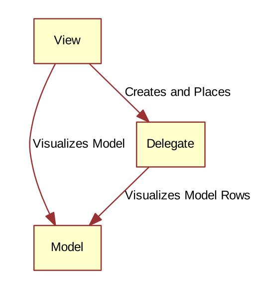

学习书籍：
1. [《QmlBook》](http://qmlbook.github.io/index.html)

数据以及数据的表现形式是可以分开的，于是便形成了`模型-视图-代理`这种架构。
<!--more-->

# 概念



- model: 结构化的数据
- view: 展现数据的前端
- delegate: 关联 model 和 view，view 排列所有的 delegate，而一个 delegate 负责展示 model 中的一个条目（Item）

# 基本的模型

## 模型内容为数值

最简易的模型就是使用`Repeater`来生成 model，model 中的值使用`modelData`来获取：

```javascript
import QtQuick 2.12

//Repeater 实例化的显示对象以列排列
Column{
    id: root

    spacing: 2

    Repeater{
        //创建 1 个 model，这个 model 的每个 Item 就是一个数值，总共从 0~9
        model: 10
        //使用带有 text 的矩形来显示 Item
        Rectangle{
            width: 120
            height: 32
            color: "#157efb"
            border.color: Qt.darker(color, 1.2)
            Text {
                id: label
                anchors.centerIn: parent
                font.pixelSize: 14
                color: '#1f1f1f'
                text: modelData
            }
        }
    }
}
```

## 模型内容为字符串

`Repeater`的 model 除了可以用数值方式产生外，还可以以字符串的方式：

```javascript
import QtQuick 2.12

//Repeater 实例化的显示对象以列排列
Column{
    id: root

    spacing: 2

    Repeater{
        //创建 1 个 model，这个 model 的每个 Item 就是一个数值，总共从 0~9
        model: ["Enterprise", "Columbia", "Challenger", "Discovery", "Endeavour", "Atlantis"]
        //使用带有 text 的矩形来显示 Item
        Rectangle{
            width: 120
            height: 32
            color: "#157efb"
            border.color: Qt.darker(color, 1.2)
            Text {
                id: label
                anchors.centerIn: parent
                font.pixelSize: 14
                color: '#1f1f1f'
                //index 就是对应 model 中的每个索引
                text: modelData + '(' + index + ')'
            }
        }
    }
}
```

## 模型内容为列表

当模型中的每个 Item 为复合数据类型时，可以使用`ListModel`将复合数据绑定为一个 Item：

```javascript
import QtQuick 2.12

Column {
    spacing: 2
    Repeater {
        model: ListModel {
            ListElement { name: "Mercury"; surfaceColor: "gray" }
            ListElement { name: "Venus"; surfaceColor: "yellow" }
            ListElement { name: "Earth"; surfaceColor: "blue" }
            ListElement { name: "Mars"; surfaceColor: "orange" }
            ListElement { name: "Jupiter"; surfaceColor: "orange" }
            ListElement { name: "Saturn"; surfaceColor: "yellow" }
            ListElement { name: "Uranus"; surfaceColor: "lightBlue" }
            ListElement { name: "Neptune"; surfaceColor: "lightBlue" }
            }
        Rectangle {
            width: 120
            height: 32
            color: "#157efb"
            border.color: Qt.darker(color, 1.2)
            Text {
                id: label
                anchors.centerIn: parent
                font.pixelSize: 14
                color: '#1f1f1f'
                //依次获取 Item 的 name
                text: name
            }
            Rectangle {
                anchors.left: parent.left
                anchors.verticalCenter: parent.verticalCenter
                anchors.leftMargin: 4
                width: 16
                height: 16
                radius: 8
                color: surfaceColor
            }
        }
    }
}
```

# 动态视图

`Repeater`适合用于固定不变的一组数据，但是很多情况下数据都是需要动态变化的，这种情况下就需要使用`ListView`和`GridView`。

`ListView`和`GridView`支持很多与用户交互的动态操作，比如滑动、拖动等。

## ListView

`Repeater`会将 Item 的内容显示完整，而 `ListView`则仅仅显示其中一部分。

```javascript
import QtQuick 2.12
Rectangle {
    width: 80
    height: 300
    ListView {
        anchors.fill: parent
        anchors.margins: 20
        clip: true
        model: 100
        //delegate 指定显示对象
        delegate: numberDelegate
        spacing: 5
    }
    //使用 component 打包成一个独立模块
    Component {
        id: numberDelegate
        Rectangle {
            id: root
            width: 64
            height: 64
            color: "#ffffff"
            border.color: Qt.darker(color, 1.2)
            Text {
                id: label
                anchors.centerIn: parent
                font.pixelSize: 14
                color: '#1f1f1f'
                text: modelData
            }
        }
    }
}
```

为了更加好的显示效果，在`ListView`将属性`clip`设置为`true`是建议的。

### 方向

`ListView`默认的方向是竖向排列，可以通过：

- `orientation: ListView.Horizontal`将其设置为横向排列
- `layoutDirection : ListView.RightToLeft`设置为从右向左排列 

### 与键盘联动

如果希望通过键盘来操作选择 model 的 Item，那么需要设置：

- `focus`为`true`以捕获键盘事件
- `highlight`以绑定高亮显示块

```javascript
import QtQuick 2.12
Rectangle {
    width: 80
    height: 300
    ListView {
        anchors.fill: parent
        anchors.margins: 20
        clip: true
        model: 100
        //delegate 指定显示对象
        delegate: numberDelegate
        spacing: 5

        highlight: highlightComponent
        focus: true
    }
    //使用 component 打包成一个独立模块
    Component {
        id: numberDelegate
        Item {
            id: root
            width: ListView.view.width
            height: 64
            Text {
                id: label
                anchors.centerIn: parent
                font.pixelSize: 14
                color: '#1f1f1f'
                text: modelData
            }
        }
    }

    Component{
        id: highlightComponent
        Rectangle {
            id: root
            width: ListView.view.width
            height: 64
            color: "#f8f8f8"
            border.color: Qt.darker(color, 1.2)
        }
    }
}
```

### 头与尾

`ListView`还可以添加头和尾，以增强对列表的说明或控制。

```javascript
import QtQuick 2.12
Rectangle {
    width: 80
    height: 300
    ListView {
        anchors.fill: parent
        anchors.margins: 20
        clip: true
        model: 100
        //delegate 指定显示对象
        delegate: numberDelegate
        spacing: 5

        highlight: highlightComponent
        focus: true

        header: headerComponent
        footer: footerComponent
    }
    Component {
        id: headerComponent
        Rectangle {
            id: root
            width: ListView.view.width
            height: 64
            color: "#63f3f3"
            border.color: Qt.darker(color, 1.2)
            Text {
                id: label
                anchors.centerIn: parent
                font.pixelSize: 14
                color: '#1f1f1f'
                text: "Header"
            }
        }
    }
    Component {
        id: footerComponent
        Rectangle {
            id: root
            width: ListView.view.width
            height: 64
            color: "#6363f3"
            border.color: Qt.darker(color, 1.2)
            Text {
                id: label
                anchors.centerIn: parent
                font.pixelSize: 14
                color: '#1f1f1f'
                text: "Footer"
            }
        }
    }
    //使用 component 打包成一个独立模块
    Component {
        id: numberDelegate
        Item {
            id: root
            width: ListView.view.width
            height: 64
            Text {
                id: label
                anchors.centerIn: parent
                font.pixelSize: 14
                color: '#1f1f1f'
                text: modelData
            }
        }
    }

    Component{
        id: highlightComponent
        Rectangle {
            id: root
            width: ListView.view.width
            height: 64
            color: "#f8f8f8"
            border.color: Qt.darker(color, 1.2)
        }
    }
}
```

## GridView

`GridView`和`ListView`都是大同小异，在思想上几乎是一致的。

```javascript
import QtQuick 2.12
Rectangle {
    width: 80
    height: 300
    GridView {
        anchors.fill: parent
        anchors.margins: 20
        clip: true
        model: 100

        cellHeight: 45
        cellWidth: 45
        //delegate 指定显示对象
        delegate: numberDelegate
    }
    //使用 component 打包成一个独立模块
    Component {
        id: numberDelegate
        Rectangle {
            id: root
            width: 64
            height: 64
            color: "#ffffff"
            border.color: Qt.darker(color, 1.2)
            Text {
                id: label
                anchors.centerIn: parent
                font.pixelSize: 14
                color: '#1f1f1f'
                text: modelData
            }
        }
    }
}
```

# 委托

模型的每个 item 是通过委托来完成显示的。

委托相当于是模型与视图之间的桥梁：

- 模型将 item 传达给委托
- 视图将当前视图的状态信息传达给委托

比如说下面这个例子，通过`isCurrentItem`获取键盘是否选择了当前`item`而决定其颜色：

```javascript
import QtQuick 2.12
Rectangle {
    width: 120
    height: 300

    gradient: Gradient{
        GradientStop{position: 0.0; color: "#f6f6f6"}
        GradientStop{position: 1.0; color: "#d7d7d7"}
    }

    ListView{
        anchors.fill: parent
        anchors.margins: 20

        clip: true

        model: 100

        delegate: numberDelegate
        spacing: 5

        focus: true
    }

    Component{
        id: numberDelegate

        Rectangle{
            width: ListView.view.width
            height: 40

            color: ListView.isCurrentItem ? "#157efb":"#53d769"
            border.color:  Qt.lighter(color, 1.1)

            Text{
                anchors.centerIn: parent

                font.pixelSize: 10

                text:modelData
            }
        }
    }
}
```

## 添加动画

也就是将模型 item 的添加与删除和视图动作对应在一起：

```javascript
import QtQuick 2.5

Rectangle {
    width: 480
    height: 300
    gradient: Gradient {
        GradientStop { position: 0.0; color: "#dbddde" }
        GradientStop { position: 1.0; color: "#5fc9f8" }
    }
    //创建模型
    ListModel {
        id: theModel
        ListElement { number: 0 }
        ListElement { number: 1 }
        ListElement { number: 2 }
        ListElement { number: 3 }
        ListElement { number: 4 }
        ListElement { number: 5 }
        ListElement { number: 6 }
        ListElement { number: 7 }
        ListElement { number: 8 }
        ListElement { number: 9 }
    }
    Rectangle {
        anchors.left: parent.left
        anchors.right: parent.right
        anchors.bottom: parent.bottom
        anchors.margins: 20
        height: 40
        color: "#53d769"
        border.color: Qt.lighter(color, 1.1)
        Text {
            anchors.centerIn: parent
            text: "Add item!"
        }
        MouseArea {
            anchors.fill: parent
            //当鼠标点击这块区域后，模型便增加一个 Item
            onClicked: {
                theModel.append({"number": ++parent.count});
            }
        }
        property int count: 9
    }
    GridView {
        anchors.fill: parent
        anchors.margins: 20
        anchors.bottomMargin: 80
        clip: true
        //以表格视图的方式显示模型
        model: theModel
        cellWidth: 45
        cellHeight: 45
        delegate: numberDelegate
    }
    Component {
        id: numberDelegate
        Rectangle {
            id: wrapper
            width: 40
            height: 40
            gradient: Gradient {
                GradientStop { position: 0.0; color: "#f8306a" }
                GradientStop { position: 1.0; color: "#fb5b40" }
            }
            Text {
                anchors.centerIn: parent
            }
            //点击对应视图后，删除当前视图对应的 item
            MouseArea {
                anchors.fill: parent
                onClicked: {
                    theModel.remove(index);
                }
            }
            //删除时的动作
            GridView.onRemove: SequentialAnimation {
                PropertyAction { target: wrapper; property: "GridView.delayRemove";value: true }
                NumberAnimation { target: wrapper; property: "scale"; to: 0;duration: 250; easing.type: Easing.InOutQuad }
                PropertyAction { target: wrapper; property: "GridView.delayRemove";value: false }
            }
            //添加时的动作
            GridView.onAdd: SequentialAnimation {
                NumberAnimation { target: wrapper; property: "scale"; from: 0; to:1; duration: 250; easing.type: Easing.InOutQuad }
            }
        }
    }
}
```

## 可变换形态的委托

在使用列表视图时，通常是用户点击哪个列表条目，哪个条目就扩展。

`expanded`状态特性就可以支持这种显示效果：

```javascript
import QtQuick 2.12

Item {
    width: 300
    height: 480

    //作为显示区的背景
    Rectangle {
        anchors.fill: parent
        gradient: Gradient {
            GradientStop { position: 0.0; color: "#4a4a4a" }
            GradientStop { position: 1.0; color: "#2b2b2b" }
        }
    }
    //创建一个 listview
    ListView {
        id: listView
        anchors.fill: parent
        //每个 item 的显示关联于 detailsDelegate
        delegate: detailsDelegate
        //模型关联于 planets
        model: planets
    }
    //产生一个 list 型的模型
    ListModel {
        id: planets
        //定义每一个 item 的属性
        ListElement { name: "Mercury"; imageSource: "images/mercury.jpeg"; facts:
        "Mercury is the smallest planet in the Solar System. It is the closest planet to
        the sun. It makes one trip around the Sun once every 87.969 days." }
        ListElement { name: "Venus"; imageSource: "images/venus.jpeg"; facts:
        "Venus is the second planet from the Sun. It is a terrestrial planet because it
        has a solid, rocky surface. The other terrestrial planets are Mercury, Earth and
        Mars. Astronomers have known Venus for thousands of years." }
        ListElement { name: "Earth"; imageSource: "images/earth.jpeg"; facts: "The
        Earth is the third planet from the Sun. It is one of the four terrestrial
        planets in our Solar System. This means most of its mass is solid. The other
        three are Mercury, Venus and Mars. The Earth is also called the Blue Planet,
        'Planet Earth', and 'Terra'." }
        ListElement { name: "Mars"; imageSource: "images/mars.jpeg"; facts: "Mars
        is the fourth planet from the Sun in the Solar System. Mars is dry, rocky and
        cold. It is home to the largest volcano in the Solar System. Mars is named after
        the mythological Roman god of war because it is a red planet, which signifies
        the colour of blood." }
    }
    Component {
        id: detailsDelegate
        Item {
            id: wrapper
            width: listView.width
            height: 30
            //每一个 item 显示的大小
            Rectangle {
                anchors.left: parent.left
                anchors.right: parent.right
                anchors.top: parent.top
                height: 30
                color: "#333"
                border.color: Qt.lighter(color, 1.2)
                //Text 显示 item 的名称，位于左边
                Text {
                    anchors.left: parent.left
                    anchors.verticalCenter: parent.verticalCenter
                    anchors.leftMargin: 4
                    font.pixelSize: parent.height-4
                    color: '#fff'
                    text: name
                }
            }
            //图片显示在 item 的右边
            Rectangle {
                id: image
                width: 26
                height: 26
                anchors.right: parent.right
                anchors.top: parent.top
                anchors.rightMargin: 2
                anchors.topMargin: 2
                color: "black"
                Image {
                    anchors.fill: parent
                    fillMode: Image.PreserveAspectFit
                    source: imageSource
                }
            }
            //当鼠标点击以后，view 的状态就变成 expanded
            MouseArea {
                anchors.fill: parent
                onClicked: parent.state = "expanded"
            }
            //此显示区默认透明，显示 item 的说明
            Item {
                id: factsView
                anchors.top: image.bottom
                anchors.left: parent.left
                anchors.right: parent.right
                anchors.bottom: parent.bottom
                opacity: 0
                Rectangle {
                    anchors.fill: parent
                    gradient: Gradient {
                        GradientStop { position: 0.0; color: "#fed958" }
                        GradientStop { position: 1.0; color: "#fecc2f" }
                    }
                    border.color: '#000000'
                    border.width: 2
                    Text {
                        anchors.fill: parent
                        anchors.margins: 5
                        clip: true
                        wrapMode: Text.WordWrap
                        color: '#1f1f21'
                        font.pixelSize: 12
                        text: facts
                    }
                }
            }
            //关闭按钮默认也是透明的
            Rectangle {
                id: closeButton
                anchors.right: parent.right
                anchors.top: parent.top
                anchors.rightMargin: 2
                anchors.topMargin: 2
                width: 26
                height: 26
                color: "#157efb"
                border.color: Qt.lighter(color, 1.1)
                opacity: 0
                //关闭按钮被触发后，状态被还原
                MouseArea {
                    anchors.fill: parent
                    onClicked: wrapper.state = ""
                }
            }
            states: [
                //当状态是 expanded 时，修改组件的状态
                State {
                    name: "expanded"
                    //将当前 item 的高度设置为和 listview 一致，也就是填充全屏
                    PropertyChanges { target: wrapper; height: listView.height }
                    //将图片的高度和宽度都扩展
                    PropertyChanges { target: image; width: listView.width;
                    height: listView.width; anchors.rightMargin: 0; anchors.topMargin: 30 }
                    //说明信息和关闭按钮都显示出来
                    PropertyChanges { target: factsView; opacity: 1 }
                    PropertyChanges { target: closeButton; opacity: 1 }
                    PropertyChanges { target: wrapper.ListView.view; contentY:
                    wrapper.y; interactive: false }
                }
                ]
            transitions: [
                Transition {
                    NumberAnimation {
                    duration: 200;
                    properties: "height,width,anchors.rightMargin,anchors.topMargin,opacity,contentY"
                    }
                }
            ]
        }
    }
}
```