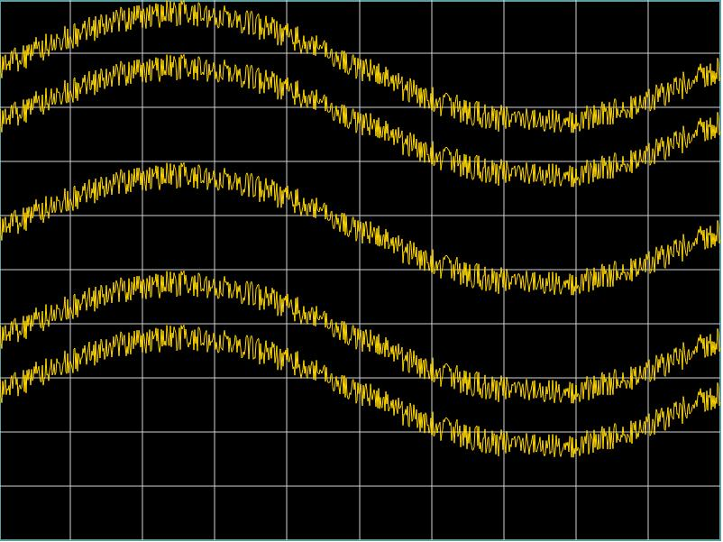

QtQuick 提供的 [QtChart](https://doc.qt.io/qt-5/qtcharts-index.html) 可以满足在 Qml 中高效绘制动态曲线，但由于它是 GPL 协议，故应用场景有限。

<!--more-->

# Canvas 绘图
Qml 中提供了 Canvas 组件，可以直接使用 js 进行绘制，比如下面几行代码，便可以绘制多条动态曲线：

```javascript
Canvas {
    id: curve_dis
    anchors.fill: parent
    property var curve_data : []

    onPaint: {
        var ctx = getContext("2d");
        ctx.clearRect(0, 0, width, height);

        var config = {
            vertical:height,
            points: curve_data,
            color: "Gold",
            ref: 0,
            div: 10,
            pixel: 60
        };

        MeasCurve.drawCurve(ctx, config);

        config.ref = 20;
        MeasCurve.drawCurve(ctx, config);

        config.ref = -20;
        MeasCurve.drawCurve(ctx, config);

        config.ref = 30;
        MeasCurve.drawCurve(ctx, config);

        config.ref = -30;
        MeasCurve.drawCurve(ctx, config);
    }
}

function drawCurve(ctx, config) {
    ctx.strokeStyle = config.color;
    ctx.lineWidth = 1;

    var verical_size = config.vertical;
    var points_array = config.points;
    var ref_lev = config.ref;
    var div_val = config.div;
    var pixel_size = config.pixel;
    var points_len = config.points.length;

    ctx.beginPath();
    ctx.moveTo(0,
    getPointY(verical_size, points_array[0],
              ref_lev, div_val, pixel_size));

    for (let i = 1; i < points_len; ++i) {
        ctx.lineTo(i,
        getPointY(verical_size, points_array[i],
        ref_lev, div_val, pixel_size));
    }
    ctx.stroke();
}
```
其显示效果如下：


但由于其在实际运行过程中，是由 CPU 来解析脚本再来执行，**其运行效率极为低下** 。

# 其它的选择
为了能够高效的显示动态曲线，目前有以下几种选择方式：
- QQuickPaintedItem ：通过继承 QQuickPaintedItem 来重载其 `paint` 函数，使用 QPainter 完成图形绘制。
- QOpenGLWindow : 通过继承自 QOpenGLWindow 来直接调用 OpenGL API 完成图形绘制
- QQuickFrameBufferObject ：实现 `QQuickFramebufferObject::Renderer` 类来完成图形绘制

> Qml Shape 也是个高效组件，但是它无法用来显示动态曲线

QPainter 其使用 CPU 来渲染无法很好的利用 GPU，虽然比起 Canvas 好得多，但也不够高效。

OpenGL 相关 API 不是太好懂，编写起来比较吃力……

# QNanoPainter
[QNanoPainter](https://github.com/QUItCoding/qnanopainter) 则很好的解决上面的问题：
1. 基于 [NanoVG](https://github.com/memononen/nanovg) 实现了自己的 QNanoPainter，以尽量以 GPU 直接渲染
2. 提供 Canvas API，可以很好的将 Qml API 重构

对于上面显示的曲线，对应的代码如下：
```cpp
void NanoCurvePainter::DrawLines(float ref, QNanoPainter* painter) {
    if (curve_data_.size() <= 1) {
        return;
    }

    painter->setStrokeStyle(QNanoColor(255, 255, 0));
    painter->setLineWidth(1);

    painter->beginPath();
    painter->moveTo(0,
                   GetPointY(ref, curve_data_.at(0)));
    for (int i = 1; i < curve_data_.size(); ++i) {
        painter->lineTo(i,
                   GetPointY(ref, curve_data_.at(i)));
    }

    painter->stroke();
}

void NanoCurvePainter::paint(QNanoPainter* painter) {
    DrawLines(0, painter);
    DrawLines(20, painter);

    DrawLines(-20, painter);

    DrawLines(30, painter);

    DrawLines(-30, painter);
}
```

经过测试，相比 Canvas 绘图，QNanoPainter 消耗 CPU 为前者的 ⅓ 。