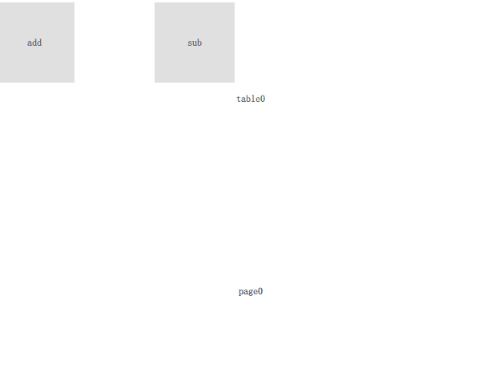

QWidget 中就具有类 [QTabWidget](https://doc.qt.io/qt-5/qtabwidget.html) 以 Table 的方式来切换各个窗口，但是在 QtQuick 中并没有一个叫 TabWidget 的组件。

与之较为接近的便是 [TabBar](https://doc.qt.io/qt-5/qml-qtquick-controls2-tabbar.html) 这个组件，但其没有提供子窗口的动态增加和删除。

> 这里主要关注同类型窗口的动态创建

<!--more-->

# 如何创建和删除显示组件？
在 Qml 中，显示组件都继承自 `Item` 组件，也就是说需要找到一个可以动态创建组件的方法。

最开始我想到的是 [createObject()](https://doc.qt.io/qt-5/qtqml-javascript-dynamicobjectcreation.html) 这种 API，但始终觉得这种 API 在陈述性语言中的用法是不优雅的。

可以人为控制组件的添加和删除，且目前以 TabWidget 的方式来显示，以后也有可能以其他方式来显示。

这不就是 Model-View-Delegate 的显示方式吗？
1. 控制 Model 的添加和删除
2. Delegate 根据 model 数量来动态的添加和删除
3. View 以一定的方式来显示多个 Delegate

而动态的创建 `Item` 类组件的最合适方式，就是使用 [Repeater](https://doc.qt.io/qt-5/qml-qtquick-repeater.html)。

# 如何删除指定的窗口？
使用 Repeater 最简单的方式就是使用整数值作为其 Model，但这样子其 Model 值只能有顺序的增加和减小。

而我们需要选中哪一个窗口，就删除哪一个窗口，所以需要将 index 和 Model 的数值分离，以字符串的形式来表示 Model。

既然要灵活的修改，那么使用 [ListModel](https://doc.qt.io/qt-5/qml-qtqml-models-listmodel.html) 是不二之选，因为它已经提供了相关方法。

# 最终代码
有了以上思考，那么代码就自然而然地出来了：

```javascript
import QtQuick 2.12
import QtQuick.Window 2.12
import QtQuick.Controls 2.12
import QtQuick.Layouts 1.12

Window {
    property int page_cnt: 0

    visible: true
    width: 640
    height: 480

    ListModel {
        id: tabModel
    }

    Button {
        id: button
        width: 100
        height: 100
        anchors.top: parent.top
        text: "add"
        onClicked: {
            tabModel.append({text: page_cnt});
            page_cnt += 1;
        }
    }

    Button {
        id: button2
        width: 100
        height: 100
        x: 200
        anchors.top: parent.top
        text: "sub"
        onClicked: {
            if (tabBar.count >= 1) {
                console.log("remove index " + tabBar.currentIndex);
                tabModel.remove(tabBar.currentIndex);
            }
        }
    }

    TabBar {
        id: tabBar
        anchors.top: button.bottom
        anchors.bottom: parent.bottom
        anchors.left: parent.left
        anchors.right: parent.right

        Repeater {
            id: tabBtnRepeater
            model : tabModel

            TabButton {
                id: tabButton
                width: parent.width / parent.count
                text: "table" + modelData
            }

            onItemAdded: {
                console.log("table add :" + index);
            }

            onItemRemoved: {
                console.log("table remove:" + index);
            }
        }
    }

    StackLayout {
        width: parent.width
        height: parent.height / 2
        anchors.bottom: tabBar.bottom
        anchors.horizontalCenter: parent.horizontalCenter

        currentIndex: tabBar.currentIndex

        Repeater {
            id: itemRepeater

            model: tabModel

            Item {
                Text {
                    text: "page" + modelData
                    anchors.centerIn: parent
                }
            }

            onItemAdded: {
                console.log("page add :" + index);
                console.log(parent.width, parent.height, parent.x, parent.y);
            }

            onItemRemoved: {
                console.log("page remove:" + index);
            }
        }
    }
}
```
显示效果如下图：


