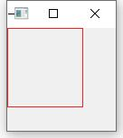

[官方文档](https://doc.qt.io/qt-6/coordsys.html#window-viewport-conversion)对 Window 和 Viewport 有了概念性的解释，但要理解这个概念还是要实践一下。

<!--more-->

# 理解概念

根据文档，可以得到最为核心的说明：Viewport 对应物理坐标系，Window 对应逻辑坐标系，默认二者一致，Window 对应 Viewport 是一一线性映射的关系。

根据这个说明可以知道：
1. 默认情况下，Viewport 和 Window 坐标系是完全一致的
2. 当 Viewport 固定，Window 不固定的情况下，绘制的固定大小图形会随着窗口反比例变化
3. 当 Viewport 不固定，Window 固定的情况下，绘制的固定大小图形会随着窗口正比例变化
4. 如果 Viewport 和 Window 设定的长和宽比例不一致，绘制的固定大小图形会发生失真

要理解以上 2、3、4 点就需要明白 Window 和 Viewport 是线性映射关系，也就说说它们存在一个比例关系，那么：
- 当 Viewport 固定而 Window 不固定的情况下，Window 越大，Window 与 Viewport 的比值就越大。而原来绘制的固定大小图形要转换为物理坐标，就要除以更大的值。所以我们会看到更小的图形，反之亦然。
- 当 Window 固定而 Viewport 不固定的情况下，Viewport 越大，Window 与 Viewport 的比值就越小。而原来绘制的固定大小图形要转换为物理坐标，就要除以更小的值。所以我们会看到更大的图形，反之亦然。
- 转换是按照长和宽比例来分别映射的，所以如果物理坐标系和逻辑坐标系的长宽比不一致，就会看到显示的图形长宽比和逻辑坐标系不一致。

# 默认情况

按如下代码测试：

```cpp
void Widget::paintEvent(QPaintEvent *event) {
    QPainter painter(this);

    painter.setPen(QColor(Qt::red));
    painter.drawRect(0, 0, 50, 50);

    qDebug() << "viewport -> " << painter.viewport();
    qDebug() << "window -> " << painter.window();
    qDebug() << "rect ->" << rect();
}
```


可以看到：
1. 窗口的缩放并不会影响实际显示的图形
2. Viewport 和 Window 的大小和窗口保持一致

也就验证了上面说的：默认情况下二者的坐标系是完全一致的


# Viewport 固定

按下面代码测试：

```cpp
void Widget::paintEvent(QPaintEvent *event) {
    QPainter painter(this);

    painter.setPen(QColor(Qt::red));

    painter.setViewport(0, 0, 100, 100);
    painter.drawRect(0, 0, 100, 100);

    qDebug() << "viewport -> " << painter.viewport();
    qDebug() << "window -> " << painter.window();
    qDebug() << "rect ->" << rect();
}
```




可以看到：
1. Window 随窗口大小而变化
2. 显示的图形随窗口大小反比例变化

这个现象就证实了上面第二点说明：由于比值的正向变化，导致转换到物理坐标系的显示反向变化

# Window 固定

按下面代码测试：

```cpp
void Widget::paintEvent(QPaintEvent *event) {
    QPainter painter(this);

    painter.setPen(QColor(Qt::red));

    painter.setWindow(0, 0, 100, 100);
    painter.drawRect(0, 0, 50, 50);

    qDebug() << "viewport -> " << painter.viewport();
    qDebug() << "window -> " << painter.window();
    qDebug() << "rect ->" << rect();
}
```


可以看到：
1. Viewport 随窗口大小而变化
2. 显示的图形岁窗口大小正比例变化

这个现象就证实了上面第三点说明：由于比值的反向变化，导致转换到物理坐标系的显示正向变化

# 正确的使用方式

首先要明白是哪种情况下需要用到来设置 Viewport 和 Window？

当 Window 固定，Viewport 不固定的情况下，显示的绘图随窗口正比例变化。这在需要窗口随意放大缩小时比较有用。

假设没有设置 Viewport 和 Window 时，要满足上面的需求就要：
1. 当`paintEvent`被调用时，获取当前窗口的尺寸
2. 根据当前尺寸，重新计算需要绘制图形的坐标和长宽

这是个比较繁琐的工作，而且在绘制复杂图形时更为头痛。

但如果设置 Viewport 和 Window 时，则需要：
1. 当`paintEvent`被调用时，获取当前窗口的尺寸
2. 设置 Window 为固定大小，设置 Viewport 为与 Window 比例一致且符合窗口尺寸的大小
3. 绘制的图形坐标不变

很明显，这种方式更为优雅简单，用户不需要知道当前窗口的尺寸，对于逻辑坐标而言，它永远是固定的。

使用下面代码测试：

```cpp
void Widget::paintEvent(QPaintEvent *event) {
    QPainter painter(this);

    painter.setPen(QColor(Qt::red));

    qint16 side = qMin(width(), height());

    painter.setViewport((width() - side) / 2, (height() - side) / 2,
                        side, side);
    painter.setWindow(-512, -512, 1024, 1024);
    painter.drawRect(0, 0, 200, 200);

    qDebug() << "viewport -> " << painter.viewport();
    qDebug() << "window -> " << painter.window();
    qDebug() << "rect ->" << rect();
}
```


可以看到：
1. Viewport 随着窗口大小而变化，但是是和 Window 正比例的正方形尺寸
2. 图形随着窗口大小而正比例变化，且不会失真
3. 逻辑绘图不用关心窗口的大小变化

通过这种方式，就可以绘制随着窗口大小而自由缩放的图形了。

只是有一点需要注意：逻辑绘图下的图形分辨率不能太低，否则放大以后就会有锯齿。

