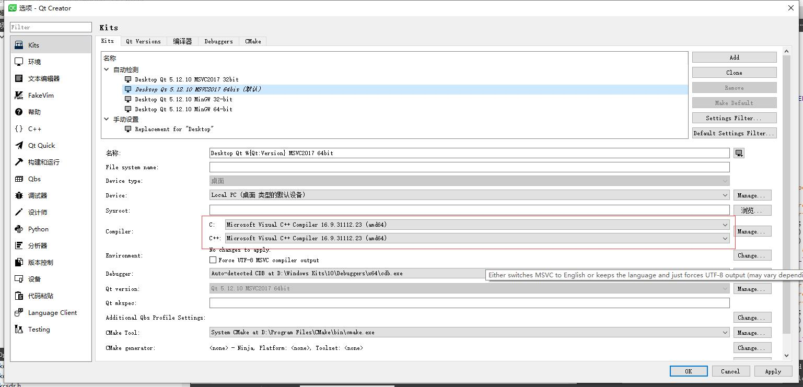

记录在使用 Qt 的过程中遇到过的编译及链接的问题。
<!--more-->
# 编译问题
## C and C++ compiler paths differ. C compiler may not work

这是因为在配置编译工具链时，c 和 c++ 的编译器指定不同而造成的，如下图所示：



## Cannot open include file: 'type_traits': No such file or directory

在使用 msvc 通过命令行编译时会遇到此问题，在确认已经安装了 msvc 相应编译器后，那就很可能是环境变量配置不完整造成的。

在启动 Qt 对应的 msvc 命令行后，注意最开始有此提示：

> Setting up environment for Qt usage...
> **Remember to call vcvarsall.bat to complete environment setup!**

这就代表环境还没有设置完整，需要主动来运行一次`vcvarsall.bat`脚本完成配置，比如使用 x64 编译：

```shell
C:\Program Files (x86)\Microsoft Visual Studio 12.0\VC>vcvarsall.bat amd64
```

完成此配置后，便能够正常编译了。

# 链接问题
## The CDB process terminated
出现这个问题是的原因是 Qt 项目链接的**第三方库的路径不全，并且往往会是间接依赖库**。

> 如果是直接依赖库，编译过程中就会因为找不到符号而编译失败了。

比如项目链接了一个库叫做`a.dll`，而`a.dll`的库又依赖了一个库`b.dll`。当项目配置文件仅指定了`a.dll`路径而没有指定`d.dll`路径时，便会出现应用程序和调试器启动便闪退的效果。

解决办法有两个：
1. 将依赖库和其间接依赖库放在同一个文件夹下
2. 在项目配置文件中也指定其依赖库的路径

为了便于开发而不破坏原来的环境，使用方法 2 是一个合理的方式。

## QSqlDatabase: QMYSQL driver not loaded

在使用 Qt 来连接 MySql 数据库时，会出现此提示。

这是因为：

1. Qt 默认并没有安装使用 MySql 的插件。
2. 该插件所依赖的 MySql 库文件也没有被链接

所以就需要安装插件，并且链接到 MySql 库文件。

### 下载 MySql 库文件

在[官方链接](https://dev.mysql.com/downloads/installer/)下载完全的 Mysql 安装包，默认的安装路径将会在`C:\Program Files\MySQL\MySQL Server 8.0`。

### 编译 Qt MySql 插件

以 Qt5.12.10 为例，启动 MinGW 64 命令行窗口，并且进入到目录`D:\Qt\Qt5.12.10\5.12.10\Src\qtbase\src\plugins\sqldrivers`，这里就是插件的源码路径。

> 之所以这里选择 MinGW 64 是因为 MySql 安装包需要使用它才能成功的链接。

然后使用 qmake 配置，以指定需要包含的头文件和库路径：

```shell
qmake -- MYSQL_INCDIR="C:\Program Files\MySQL\MySQL Server 8.0\include" MYSQL_LIBDIR="C:\Program Files\MySQL\MySQL Server 8.0\lib"
```

可以看到 mysql 的检查状态为`yes`：

```shell
Running configuration tests...
Checking for DB2 (IBM)... no
Checking for InterBase... no
Checking for MySQL... yes
Checking for OCI (Oracle)... no
Checking for ODBC... yes
Checking for PostgreSQL... no
Checking for SQLite (version 2)... no
Checking for TDS (Sybase)... no
Done running configuration tests.

Configure summary:

Qt Sql Drivers:
  DB2 (IBM) .............................. no
  InterBase .............................. no
  MySql .................................. yes
  OCI (Oracle) ........................... no
  ODBC ................................... yes
  PostgreSQL ............................. no
  SQLite2 ................................ no
  SQLite ................................. yes
    Using system provided SQLite ......... no
  TDS (Sybase) ........................... no
```

接下来进行编译及安装：

```shell
mingw32-make
mingw32-make install
```

安装完成后，可以在路径`D:\Qt\Qt5.12.10\5.12.10\mingw73_64\plugins\sqldrivers`查看到已经安装好的`qsqlmysql.dll,qsqlmysqld.dll`。

### 链接 MySql 库文件

接下来便是要配置工程了，首先对于编译工具链的选择，也要对应的是`MinGW 64`。

然后在工程配置中加入 MySql 路径，这样就可以正常使用了：

```shell
LIBS += -L"C:/Program Files/MySQL/MySQL Server 8.0/lib" -llibmysql
```

