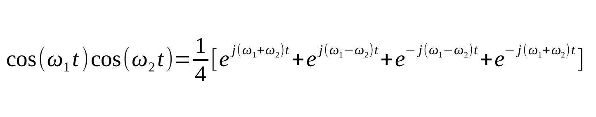
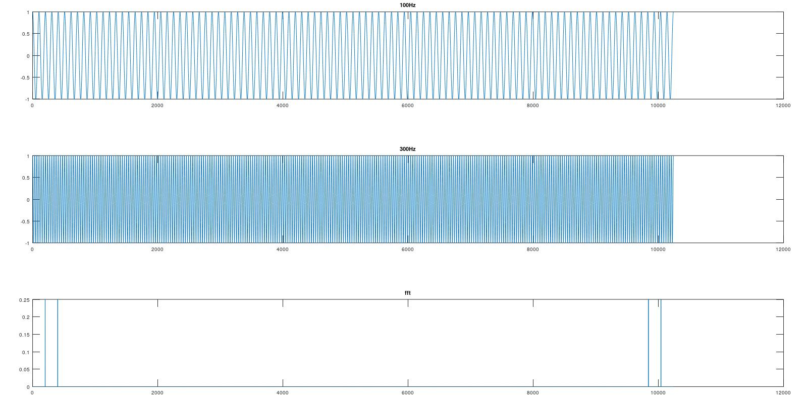
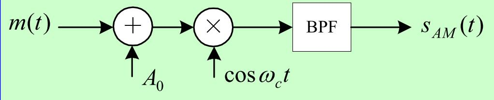
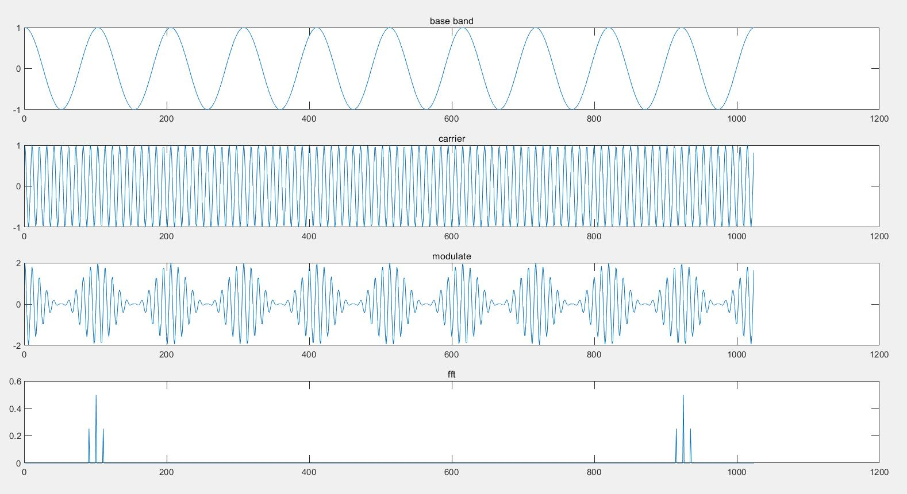
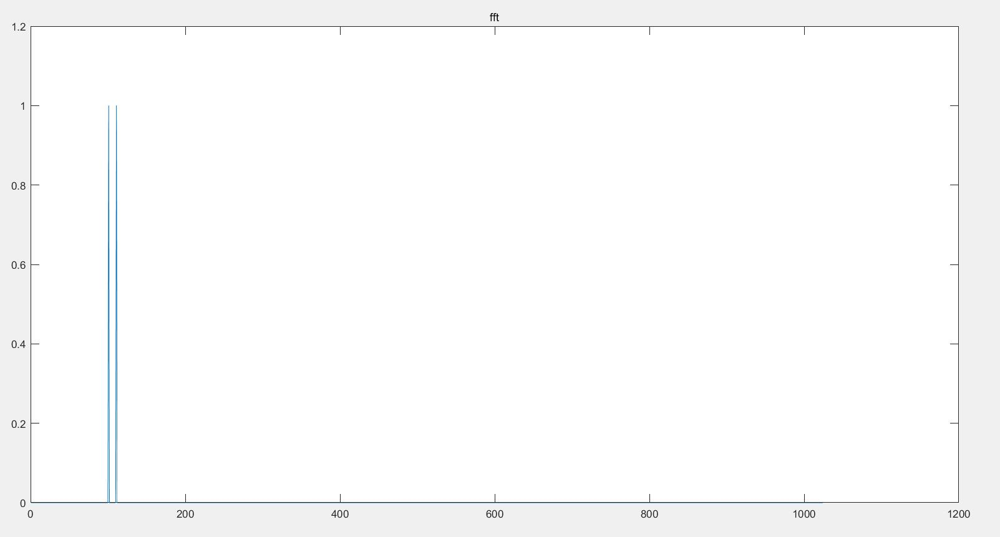
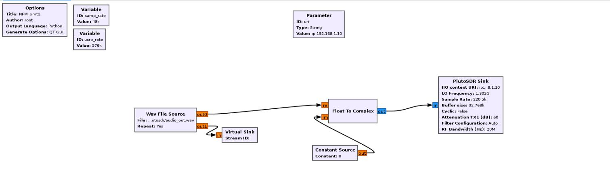
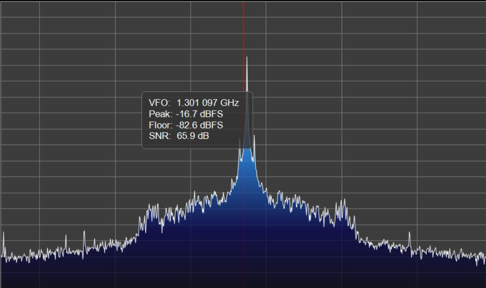

先以最简单的方式来认识 AM 调制。

<!--more-->

# 实数混频

## 理解公式

实数混频就是时域实信号的相乘，由于是实部所以取 cos 为信号产生函数：


可以看到：两个实信号的混频得到的是其和频与差频。

这点通过欧拉公式也可以理解：


从上面的欧拉运算结果来看，其频谱图会出现两组对称的和频和差频。

## 实例

将上面以 matlab 运算来看效果：

```fortran
clear;
clc;
close all;

% 采样率及信号频率
fs = 10240;
f1 = 100;
f2 = 300;
n = [1:fs];

% 产生信号
signal_f1 = cos(2*pi*f1*n/fs);
signal_f2 = cos(2*pi*f2*n/fs);

% 相乘
signal_multiply = signal_f1 .* signal_f2;

% 绘制
figure;
subplot(3, 1, 1);
plot(signal_f1);title("100Hz");
subplot(3, 1, 2);
plot(signal_f2);title("300Hz");
subplot(3, 1, 3);
plot(abs(fft(signal_multiply))./fs);title("fft");
```

运行效果如下：




可以看到，得到的频率和幅度与欧拉公式推导结果一致。

> 上面的脚本中，幅度除以了 N，是因为以整个频谱来看的。如果只看一半的话，那么就需要再乘以 2 做补偿。
> DFT 运算中则需要除以 N/2 ，因为 DFT 只产生 N/2 +1 点，而 FFT 产生的是 N 个点。
> 但是对于直流和 N / 2 索引点处，都是除以 N！ 

# 常规 AM 调制

其实最简单的 AM 调制也就是上面信号相乘的过程，只不过是具备了直流偏移而已。直流偏移的目的是为了使得信号的值在任意时刻都为正。



## 单音调制

那么对应上图（先忽略滤波器）的 matlab 脚本为：

```fortran
close all;
clear;
clc;

fs=1024;
f1=10;
f2=100;

t=0:1/fs:(fs-1)/fs;

% 产生基带信号
base_cos = cos(2*pi*f1*t);
% 产生载波信号
carry_cos = cos(2*pi*f2*t);
% 调制后的信号
s_modulate = (1 + base_cos).* carry_cos;

s_fft = fft(s_modulate);
s_fft_abs = abs(s_fft) ./ fs;

figure;
subplot(4,1,1);
plot(base_cos);title("base band");
subplot(4,1,2);
plot(carry_cos);title("carrier");
subplot(4,1,3);
plot(s_modulate);title("modulate");
subplot(4,1,4);
plot(s_fft_abs);title("fft");
```

对应的运行效果为：



上图的载波频率和幅度与 1.2 节的预期一致。

以上是实数混频的效果，当是复数混频时，频谱上就只会出现一个 载波及和频信号（这点通过欧拉公式也可以解释）：

```fortran
close all;
clear;
clc;

fs=1024;
f1=10;
f2=100;

t=0:1/fs:(fs-1)/fs;

% 产生基带信号
base = cos(2*pi*f1*t) + sin(2*pi*f1*t) * 1i;
% 产生载波信号
carry = cos(2*pi*f2*t) + sin(2*pi*f2*t) * 1i;
% 调制后的信号
s_modulate = (1 + base).* carry;

s_fft = fft(s_modulate);
s_fft_abs = abs(s_fft) ./ fs;

figure;
subplot(2,1,1);
plot(real(base));title("base band real");
subplot(2,1,2);
plot(imag(base));title("base band imag");

figure;
subplot(2,1,1);
plot(real(carry));title("carrier real");
subplot(2,1,2);
plot(imag(carry));title("carrier imag");

figure;
subplot(2,1,1);
plot(real(s_modulate));title("modulate real");
subplot(2,1,2);
plot(imag(s_modulate));title("modulate imag");

figure;plot(s_fft_abs);title("fft");
```



## WAV 音频调制

由于上面的是单音，所以可以很明显的区分出调制后的载波和上下边带。

单如果是 WAV 音频，则会看到的是一个宽频谱：因为基带信号的频率和幅度是在一直变化的，我们就会看到一个宽频信号，且幅度也在不断变化。

下面这段脚本是将双通道的 WAV 音频信号提取为 IQ 信号的过程：

```fortran
clear;
clc;

[audio_data, fs] = audioread("./audio.wav");

% 加入直流偏置
data_left = audio_data(:,1) .+ 1;
data_right = audio_data(:,2) .+ 1;
out_fs = 220500;

% 重采样到高采样率以满足 SDR 发送的本振频率范围
resample_left = resample(data_left(500000:700000), out_fs, fs);
resample_right = resample(data_right(500000:700000), out_fs, fs);

data_iq = complex(resample_left, resample_right);
audiowrite("./audio_out.wav", data_iq, out_fs);

```

然后只使用其 I 路信号发送：


由于在前面的脚本已经进行了偏置，所以在 gnuradio 中就不用加入偏置了。

接收后的信号如下：



这里就无法明显区分出来载波和两个边带了，因为边带的频率是在不断变化了。

