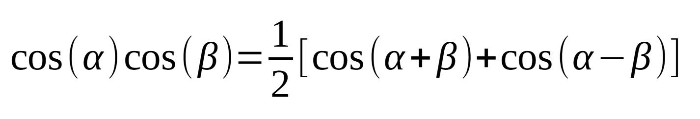
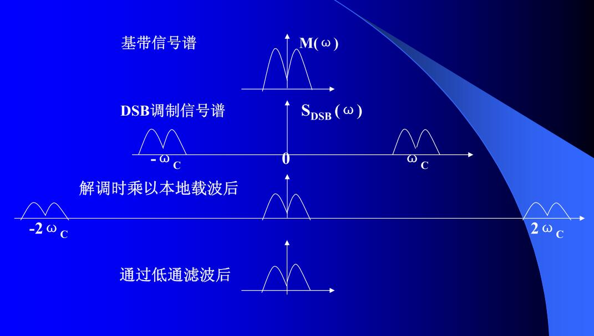

先以最简单的方式来认识 AM 调制。

<!--more-->

# 实数混频

## 理解公式

实数混频就是时域实信号的相乘，由于是实部所以取 cos 为信号产生函数：


可以看到：两个实信号的混频得到的是其和频与差频。

这点通过欧拉公式也可以理解：


从上面的欧拉运算结果来看，其频谱图会出现两组对称的和频和差频。

## 实例

将上面以 matlab 运算来看效果：

```fortran
clear;
clc;
close all;

% 采样率及信号频率
fs = 10240;
f1 = 100;
f2 = 300;
n = [1:fs];

% 产生信号
signal_f1 = cos(2*pi*f1*n/fs);
signal_f2 = cos(2*pi*f2*n/fs);

% 相乘
signal_multiply = signal_f1 .* signal_f2;

% 绘制
figure;
subplot(3, 1, 1);
plot(signal_f1);title("100Hz");
subplot(3, 1, 2);
plot(signal_f2);title("300Hz");
subplot(3, 1, 3);
plot(abs(fft(signal_multiply))./fs);title("fft");
```

运行效果如下：


可以看到，得到的频率和幅度与欧拉公式推导结果一致。

> 上面的脚本中，幅度除以了 N，是因为以整个频谱来看的。如果只看一半的话，那么就需要再乘以 2 做补偿。
> DFT 运算中则需要除以 N/2 ，因为 DFT 只产生 N/2 +1 点，而 FFT 产生的是 N 个点。
> 但是对于直流和 N / 2 索引点处，都是除以 N！ 

# 常规 AM 调制

其实最简单的 AM 调制也就是上面信号相乘的过程，只不过是具备了直流偏移而已。直流偏移的目的是为了使得信号的值在任意时刻都为正。


如果 A0 值小于 m(t) 的最大值，则会发生过调制的现象。

## 单音调制

那么对应上图（先忽略滤波器）的 matlab 脚本为：

```fortran
close all;
clear;
clc;

fs=1024;
f1=10;
f2=100;

t=0:1/fs:(fs-1)/fs;

% 产生基带信号
base_cos = cos(2*pi*f1*t);
% 产生载波信号
carry_cos = cos(2*pi*f2*t);
% 调制后的信号
s_modulate = (1 + base_cos).* carry_cos;

s_fft = fft(s_modulate);
s_fft_abs = abs(s_fft) ./ fs;

figure;
subplot(4,1,1);
plot(base_cos);title("base band");
subplot(4,1,2);
plot(carry_cos);title("carrier");
subplot(4,1,3);
plot(s_modulate);title("modulate");
subplot(4,1,4);
plot(s_fft_abs);title("fft");
```

对应的运行效果为：


上图的载波频率和幅度与 1.2 节的预期一致，载波的幅度比边带大，这点也可以通过欧拉公式来推导出来。

以上显示的是调制度为 100% 的情况，可以改变基带信号的幅度从 0~1，对应 0%~100% 调制深度。

> 调制深度的计算是 Am/A0，也就是基带的幅度除以直流偏置。

以上是实数混频的效果，当是复数混频时，频谱上就只会出现一个 载波及和频信号（这点通过欧拉公式也可以解释）：

```fortran
close all;
clear;
clc;

fs=1024;
f1=10;
f2=100;

t=0:1/fs:(fs-1)/fs;

% 产生基带信号
base = cos(2*pi*f1*t) + sin(2*pi*f1*t) * 1i;
% 产生载波信号
carry = cos(2*pi*f2*t) + sin(2*pi*f2*t) * 1i;
% 调制后的信号
s_modulate = (1 + base).* carry;

s_fft = fft(s_modulate);
s_fft_abs = abs(s_fft) ./ fs;

figure;
subplot(2,1,1);
plot(real(base));title("base band real");
subplot(2,1,2);
plot(imag(base));title("base band imag");

figure;
subplot(2,1,1);
plot(real(carry));title("carrier real");
subplot(2,1,2);
plot(imag(carry));title("carrier imag");

figure;
subplot(2,1,1);
plot(real(s_modulate));title("modulate real");
subplot(2,1,2);
plot(imag(s_modulate));title("modulate imag");

figure;plot(s_fft_abs);title("fft");
```


## WAV 音频调制

由于上面的是单音，所以可以很明显的区分出调制后的载波和上下边带。

单如果是 WAV 音频，则会看到的是一个宽频谱：因为基带信号的频率和幅度是在一直变化的，我们就会看到一个宽频信号，且幅度也在不断变化。

下面这段脚本是将双通道的 WAV 音频信号提取为 IQ 信号的过程：

```fortran
clear;
clc;

[audio_data, fs] = audioread("./audio.wav");

% 加入直流偏置
data_left = audio_data(:,1) .+ 1;
data_right = audio_data(:,2) .+ 1;
out_fs = 220500;

% 重采样到高采样率以满足 SDR 发送的本振频率范围
resample_left = resample(data_left(500000:700000), out_fs, fs);
resample_right = resample(data_right(500000:700000), out_fs, fs);

data_iq = complex(resample_left, resample_right);
audiowrite("./audio_out.wav", data_iq, out_fs);

```

然后只使用其 I 路信号发送：


由于在前面的脚本已经进行了偏置，所以在 gnuradio 中就不用加入偏置了。

接收后的信号如下：


这里就无法明显区分出来载波和两个边带了，因为边带的频率是在不断变化了。

## 过调制

下面看看过调制的现象：


上面的框图中直流偏置只有 0.5，运行结果如下：


可以看到，这种波形通过解调以后，必然会产生失真。

## 解调

常规调幅方式效率很低，原因在于直流成分 A0 在已调信号中成为“空载波”，浪费的能量超过了有用信号。如果没有直流成分 A0 效率将会达到百分之百。但如果没有直流成分，解调后信号会发生严重的失真。只要有办法解决解调后信号的失真问题，就能大大提高调制效率。

这就引出了相干解调与双边带调制。

## 非相干解调


## 相干解调


相干解调就是使用同频同相的载波与调制信号再次混频：


从最下面展开的公式有：

1. 直流：可以通过减去平均值滤除
2. 载波的 2 倍频：可以通过低通滤波器滤除
3. 基带和载波的 2 倍频的混频：可以通过低通滤波器滤除

只是需要注意的是：基带和载波 2 倍频的差频是会低于载波二倍频的频率。这就需要载波的频率与基带的频率不能相离较劲，否则会导致滤波器无法滤除而形成噪音。

```fortran
close all;
clear;
clc;

fs=1024;
f1=10;
f2=100;

t=0:1/fs:(fs-1)/fs;

% 产生基带信号
base_cos = cos(2*pi*f1*t);
% 产生载波信号
carry_cos = cos(2*pi*f2*t);
% 调制后的信号
s_modulate = (1 + base_cos).* carry_cos;
% 解调后的信号
s_demodulate = s_modulate.* carry_cos;

s_fft = fft(s_modulate);
s_fft_abs = abs(s_fft) ./ fs;

s_demodu_fft = fft(s_demodulate);
s_demodu_fft_abs = abs(s_demodu_fft) ./ fs;

figure;
subplot(5,1,1);
plot(base_cos);title("base band");
subplot(5,1,2);
plot(carry_cos);title("carrier");
subplot(5,1,3);
plot(s_modulate);title("modulate");
subplot(5,1,4);
plot(s_fft_abs);title("fft");
subplot(5,1,5);
plot(s_demodu_fft_abs);title("demodu fft");
```


## 调制深度

调制深度在公式上来说就是基带的幅度除以偏移的值乘以百分之百，那么在频谱图上，当看到双边带后又如何在对数域反算出调制深度呢？


# 双边带调制（DSB）

双边带相比单边带，那就是不加直流电压，相当于产生了过调制的现象，

不加直流就不会有载波，只会有合频与差频。

## 调制


通过 matlab 也可以仿真：

```fortran
close all;
clear;
clc;

fs=1024;
f1=10;
f2=100;

t=0:1/fs:(fs-1)/fs;

% 产生基带信号
base_cos = cos(2*pi*f1*t);
% 产生载波信号
carry_cos = cos(2*pi*f2*t);
% 调制后的信号
s_modulate = (base_cos).* carry_cos;

s_fft = fft(s_modulate);
s_fft_abs = abs(s_fft) ./ fs;

figure;
subplot(4,1,1);
plot(base_cos);title("base band");
subplot(4,1,2);
plot(carry_cos);title("carrier");
subplot(4,1,3);
plot(s_modulate);title("modulate");
subplot(4,1,4);
plot(s_fft_abs);title("fft");
```


## 解调

由于已经产生了过调制，所以无法使用包络检波的方式进行解调，而只能使用相干解调：





```fortran
close all;
clear;
clc;

fs=1024;
f1=10;
f2=100;

t=0:1/fs:(fs-1)/fs;

% 产生基带信号
base_cos = cos(2*pi*f1*t);
% 产生载波信号
carry_cos = cos(2*pi*f2*t);
% 调制后的信号
s_modulate = (base_cos).* carry_cos;
% 解调后的信号
s_demodulate = s_modulate.* carry_cos;

s_fft = fft(s_modulate);
s_fft_abs = abs(s_fft) ./ fs;

s_fft_demodu = fft(s_demodulate);
s_fft_demodu_abs = abs(s_fft_demodu)./fs;

figure;
subplot(5,1,1);
plot(base_cos);title("base band");
subplot(5,1,2);
plot(carry_cos);title("carrier");
subplot(5,1,3);
plot(s_modulate);title("modulate");
subplot(5,1,4);
plot(s_fft_abs);title("fft");
subplot(5,1,5);
plot(s_fft_demodu_abs);title("fft demodu");
```


# 单边带调制（SSB）

虽然双边带相比普通 AM 节省了能量，但其占用了两倍带宽，而 SSB 只占用一倍带宽，提高了信道的利用率。


## 调制

可以使用低通或高通滤波器在 DSB 的基础上产生 SSB ，但对滤波器的设计要求较高。

所以一般是通过矢量调制的方式来做到：


上图直流通过欧拉公式的乘除法就更加好理解。

## 解调

解调也是通过相干解调来完成：


```fortran
close all;
clear;
clc;

fs=1024;
f1=10;
f2=100;

t=0:1/fs:(fs-1)/fs;

% 产生基带信号
base_signal = hilbert(cos(2*pi*f1*t));

% 产生载波信号
carry_cos = cos(2*pi*f2*t);
carry_signal = cos(2*pi*f2*t) + sin(2*pi*f2*t)*1i;
% 调制后的信号
s_modulate = (base_signal).* carry_signal;
% 解调后的信号
s_demodulate = s_modulate.* carry_cos;

s_fft = fft(s_modulate);
s_fft_abs = abs(s_fft) ./ fs;

s_fft_demodu = fft(s_demodulate);
s_fft_demodu_abs = abs(s_fft_demodu)./fs;

figure;
subplot(3,1,1);
plot(real(s_modulate));title("modulate");
subplot(3,1,2);
plot(s_fft_abs);title("fft");
subplot(3,1,3);
plot(s_fft_demodu_abs);title("fft demodu");
```


# 残留边带调制（VSB）

单边带调制的滤波器法，需要理想的低通或高通滤波器，但实际中是难以实现的。如果上、下边带虽然都不是那么完整，但可以互补，合起来仍然能够得到完整的信息。

从双边带出发，巧妙地设计滤波器，使上、下两块不那么完整的边带互补，这样的调制方法称为残留边带调制。


# 一些概念的理解

## 为什么 AM 调制称之为线性调制？

已调信号 s(t) 的频谱和输入基带信号 m(t) 的频谱之间满足线性搬移的关系。

由于频率或相位的变化都是载波的余弦角度的变化，故调频和调相统称为角度调制。

调频和调相的已调信号频谱不再是原调制信号频谱的线性搬移，而是频谱的非线性变化，会产生新的频率成分。因此调频和调相属于非线性调制。


