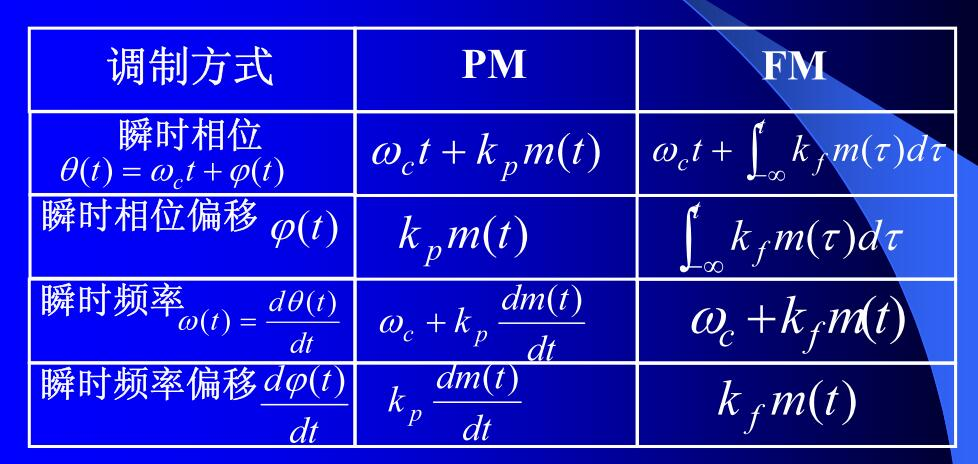
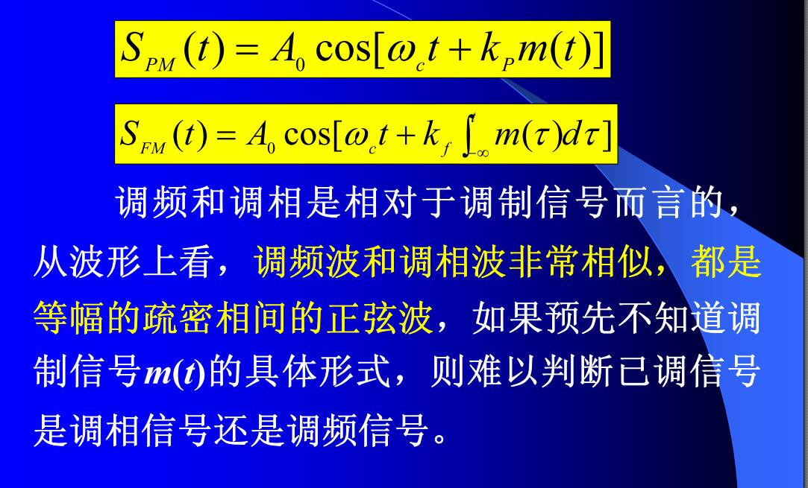

先以最简单的方式来认识 FM/PM 调制。

因为频率或相位的变化都是载波余弦角度的变化，所以调频和调相统称为**角度调制**。

> 频率和相位之间存在密切的关系，调频必调相，调相必调频。

因为调频和调相信号的频谱不再是线性搬移，而是频谱的非线性变换，产生新的频率成分，
因此调频和调相属于非线性调制。

<!--more-->

# 认识角度调制

任何一个正余弦型时间函数，如果它的幅度不变，则可用下式表示：


如果加上了初相，就是：


## 相位调制

调相指的是：瞬时相位偏移与调制信号成正比。

其公式为：


从前面的**瞬时频率**公式可以看出，相位的变换也会导致频率的变化，那么：


## 频率调制

调频指的是：载波的瞬时频率偏移与调制信号成比例：


## 频率与相位的比较






# 几种典型的角度调制

## 单音调相

### 理论

对于基带信号，其表示为：

$$
m(t) = A_{m}cosω_{m}t
$$
而对于调相，其表示为：

$$
S_{PM}(t) = A_{0}cos[ω_{c}t+k_{p}m(t)]
= A_{0}cos[ω_{c}t+k_{p}A_{m}cosω_{m}t]
$$
上式中的 $k_{p}A_{m}cosω_{m}t$ 就是瞬时频偏，其中的 $m_{p}=k_{p}A_{m}$ 就叫做调相指数，表示最大的相偏。

那么对其做微分，以求得瞬时频偏：

$$
\frac{d[ω_{c}t+m_{p}cosω_{m}t]}{dt} = ω_{c}-m_{p}ω_{m}sinω_{m}t
$$
- 其瞬时频偏就是 $-m_{p}ω_{m}sinω_{m}t$
- 其最大频偏就是 $\Delta_{max} = m_{p}ω_{m}$

从上面的公式也可以看出，$m_{p}$ 也表示最大相对频偏：

$$
m_{p} = \frac{\Delta_{max}}{\omega_{m}} = \frac{\Delta f_{max}}{f_{m}}
$$

比如基带信号的频率为 `10Hz`，其幅度为 `3`，那么可以被表示为：

$$
S_{m}t=A_{0}cos[ω_{c}t+3cosω_{m}t]
$$
根据上面的推导，其最大相偏就是 $m_{p}=3$ 弧度。

而最大频偏就是：

$$
\frac{d[ω_{c}t+3cosω_{m}t]}{dt} = ω_{c}-3ω_{m}sinω_{m}t
$$
又由于当前基带频率是 `10Hz`，那么最大频偏就是 `30Hz`。

### 验证

下面通过 matlab 来进行验证。

```fortran
clear;
close all;
clc;

base_freq = 10;
base_amp = 3;

carry_freq = 100;
carry_amp = 1;
fs = 1024;

n = [1:fs];

pm_signal = carry_amp * cos(2 * pi * carry_freq * n / fs + ...
    base_amp * cos(2 * pi * base_freq * n / fs));

figure;
subplot(2, 1, 1);
plot(pm_signal);
subplot(2, 1, 2);
plot(20* log10(abs(fft(pm_signal)) ./ fs));
```

其效果如下：


## 单音调频

### 理论

单音调频的表示为：

$$
\begin{aligned}
S_{FM}(t) &= A_{0} cos[\omega_{c}t + k_{f}\int_{-\infty}^\tau m(\tau)d\tau]\\
&= A_{0} cos[\omega_{c}t + k_{f}\int_{-\infty}^\tau A_{m}cos\omega_{m}\tau d\tau]\\
&= A_{0} cos[\omega_{c}t + \frac{k_{f}A_{m}sin\omega_{m}t}{\omega_{m}}]\\
&= A_{0} cos[\omega_{c}t + m_{f}sin\omega_{m}t]\\
\end{aligned}
$$

上式子中 $m_{f} = \frac{k_{f}A_{m}}{\omega_{m}}$ 叫做调频指数，以表示**最大相偏**。

> 上面式子经过化简后，就和调相的公式一致了（sin 和 cos 只是有个相位偏移的差异罢了）
> 这也就是为什么将调频和调相放在一起看。

为了求**最大频偏**，就需要对公式求微分，得到瞬时频率：

$$
\frac{d[\omega_{c}t + m_{f}sin\omega_{m}t]}{dt} = \omega_{c} + 
m_{f}\omega_{m}cos\omega_{m}t
$$
那么就可以得出其最大频偏（rad/s）是 $m_{f}\omega_{m}=k_{f}A_{m}$，将该值除以 2Π，得到的就是最大频偏（Hz /s）。

$m_{f}$ 也表示最大相对频偏：

$$
m = \Phi_{max} (最大相偏) = \frac{\Delta\omega_{max}}{\omega_{m}} = \frac{\Delta f_{max}}{f_{m}} (最大相对频偏)
$$

比如基带信号为`1kHz`，其幅值为 $4*10^3\pi$，`kf` 为 2，那么其最大频偏就是：

$$
m_{f} \omega_{m} = k_{f} * A_{m} = 8 * 10^3\pi
$$

该值再除以 $2\pi$ 就是就是 4kHz 的频偏。

### 验证

matlab 脚本如下：

```fortran
clear all;
clc;
close all;

kf = 2;
Am = 4e3*pi;
base_freq = 1e3;
carry_freq = 10e3;
fs = 10e4;

n = [1:fs];

fm_signal = cos(2*pi*carry_freq*n/fs + ...
    kf * Am * sin(2 * pi * base_freq * n / fs) / (2 * pi * base_freq));

figure;
subplot(2, 1, 1);
plot(fm_signal);
subplot(2, 1, 2);
plot(20 * log10(abs(fft(fm_signal))./fs));
```

运行效果如下：


## 窄带调角

当最大相位偏移小于 $\frac{\pi}{6}$ （或 0.5）时，就称其为窄带角度调制，反之为宽带调角。

