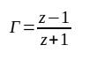
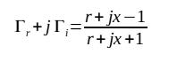
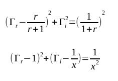
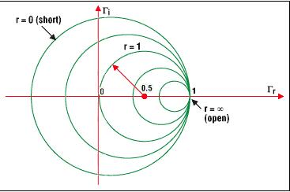
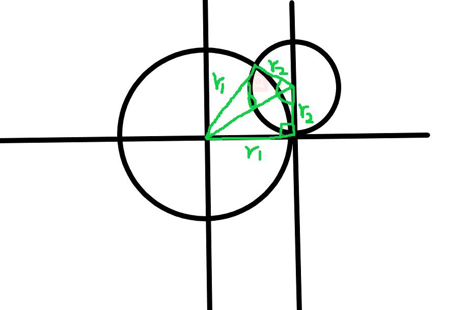
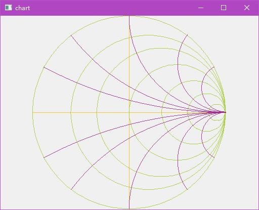

Smith chart 对于射频领域的重要性不言而喻，但我们应该如何通过 CPU 将其绘制出来呢？

<!--more-->

# 绘制的理论

在 [这篇文章](https://www.maximintegrated.com/en/design/technical-documents/tutorials/7/742.html) 中已经说明了，对于史密斯圆图，其核心公式是：



由于其是复数，所以展开是：



最终经过展开后，便可以得到标准的圆方程：




也就是说：
- 对于电阻圆，圆心是`[r/(r+1), 0]`，半径是`1/(1+r)`
- 对于电抗圆，圆心是`[1,1/x]`，半径是`1/|x|`

比如当电阻 r 为**归一化**的 0 时，得到的圆心就是（0，0），半径就是 1，也就是最大的理论极限圆：



当电抗 x 为归一化的`1`时，圆心就是（1，1），半径就是 1：


有了上面的理论，圆就好画了。

# 绘制弧线

由于电抗圆是弧线，所以有两种办法来绘制电抗部分：
1. 仍然以圆的方式进行绘制，绘制完成后再来擦除多余的部分
2. 计算要绘制圆的起始和终止角度，仅绘制需要的弧度部分

第一种办法虽然画圆很简单，但是擦除的时候由于需要计算擦除的部分，也是需要避开最外面的极限圆。

所以用第二种办法显然是更为合理的方式。



如上图所示：
- 由于已知电抗圆、电阻圆的圆心和半径，所以可以根据**勾股定理**求得斜边 b
- 由于已知三角形的三个边，那么根据**余弦定理**就可以求得弧线的角度了

# 示例代码

以下便是使用 Qt 绘制示例的主要代码：

```cpp
#include "widget.h"

#include <cmath>

#ifndef M_PI
#define M_PI    (3.141592653)
#endif

#define LOGIC_WIDTH     (435)
#define LOGIC_HEIGHT    (435)
#define DEVIDER_CNT     (50)

void Widget::paintEvent(QPaintEvent* event) {
    QPainter painter(this);

    painter.setPen(QColor(Qt::red));
    qint16 side = qMin(width(), height());

    painter.setViewport((width() - side) / 2,
                        (height() - side) / 2,
                        side,
                        side);
    painter.setWindow(0, 0, LOGIC_WIDTH, LOGIC_HEIGHT);

    painter.setPen(QColor(253, 189, 19));
    painter.drawLine(LOGIC_WIDTH / 2, 0, LOGIC_WIDTH / 2, LOGIC_HEIGHT - 1);
    painter.drawLine(0, LOGIC_WIDTH / 2, LOGIC_WIDTH - 1, LOGIC_WIDTH / 2);

    painter.setPen(QColor(165, 206, 57));

    DrawResistance(painter, 0);
    DrawResistance(painter, 0.25);
    DrawResistance(painter, 0.5);
    DrawResistance(painter, 1);
    DrawResistance(painter, 2);
    DrawResistance(painter, 4);
    DrawResistance(painter, 10);

    painter.setPen(QColor(165, 35, 142));
    DrawReactance(painter, 0.25);
    DrawReactance(painter, 0.5);
    DrawReactance(painter, 1);
    DrawReactance(painter, 2);
    DrawReactance(painter, 4);
    DrawReactance(painter, -0.25);
    DrawReactance(painter, -0.5);
    DrawReactance(painter, -1);
    DrawReactance(painter, -2);
    DrawReactance(painter, -4);
}

void Widget::DrawResistance(QPainter& painter, float val) {
    int x = val / (val + 1) * LOGIC_WIDTH / 2 + LOGIC_WIDTH / 2;
    int y = LOGIC_HEIGHT / 2;
    int r = 1 / (1 + val) * LOGIC_HEIGHT / 2;

    DrawCircle(painter, x, y, r);
}

void Widget::DrawReactance(QPainter& painter, float val) {
    int x = LOGIC_WIDTH - 1;
    int y = LOGIC_HEIGHT / 2 - 1 / val * LOGIC_HEIGHT / 2;
    int r = 1 / abs(val) * LOGIC_HEIGHT / 2;
    float r2 = LOGIC_HEIGHT / 2;

    float d = sqrt(r * r + r2 * r2);
    float phase = acos((r2 * r2 - d * d - r * r) /
                       (-2 * d * r)) * 2;
    phase = phase * 180 / M_PI;

    float start = (-90 - phase) * 16;
    if (val < 0) {
          start = 90 * 16;
    }

    painter.drawArc(x - r, y - r, 2 * r, 2 * r,
                    start, phase * 16);
}

void Widget::DrawCircle(QPainter& painter, int x, int y, int r) {
    float step = 2 * M_PI / DEVIDER_CNT;
    float phase = step;
    int prev_x = x + cos(0) * r;
    int prev_y = y + sin(0) * r;
    int cur_x, cur_y;

    for (int i = 1; i <= DEVIDER_CNT; ++i) {
        int diff_x = cos(phase) * r;
        int diff_y = sin(phase) * r;
        cur_x = x + diff_x;
        cur_y = y + diff_y;

        painter.drawLine(prev_x, prev_y, cur_x, cur_y);

        phase += step;
        prev_x = cur_x;
        prev_y = cur_y;
    }
}
```

效果如下图：




