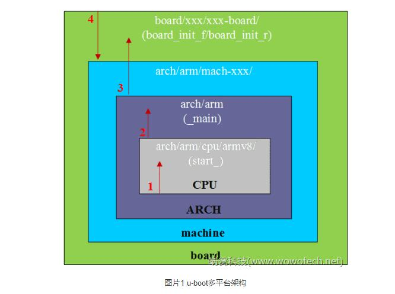
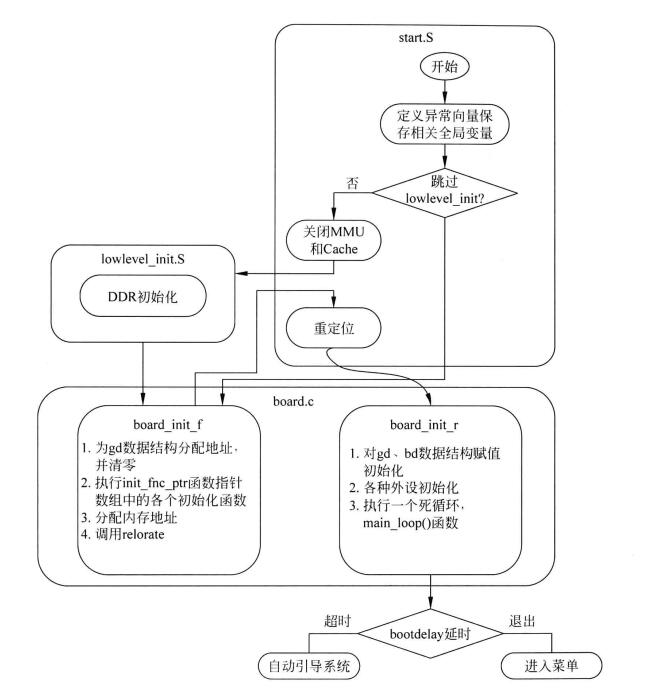

[What] Zynq --> u-boot 2016.1
==========================

## 编译过程

make menuconfig

## 启动过程

u-boot 中与实际硬件平台相关的结构层次如下图所示（参考于 [蜗窝科技](http://www.wowotech.net/u-boot/boot_flow_1.html) ）：

- board : 代表整个硬件平台，在对应目录下主要为 **控制器之外的外设代码**
- machine : 代表 SOC，在对应目录下主要为 **控制器内部的 CPU的外设控制器代码**
- arch : 代表 CPU，在对应目录下主要为 **除开 CPU 内核架构外的内部代码**
- CPU : 代表 CPU 架构，比如 "armv7",在对应目录主要为 **CPU 内核架构处理代码**

由下从上看，流程大致如下图：

在各个层级的调用关系为：

- u-boot 启动后，会最先执行 CPU 层代码初始化基本的内核
- CPU 相关代码会调用 ARCH 层代码初始化内部架构
- ARCH 相关代码会调用 BOARD 层来初始化控制器外设
- BOARD 层会根据使用的外设来调用 MACHINE 层代码，来初始化 SOC 对应的内部控制器

了解 u-boot 的启动过程，最好的方式是首先打开uboot的一些调试选项，比如 `CONFIG_DISPLAY_BOARDINFO` ,选项会输出当前平台的启动流程。

在 petalinux 的支持下：
1. 需要在 `./subsystems/linux/configs/u-boot/platform-top.h` 文件中增加此项宏定义
2. 编译 u-boot `petalinux-build -c u-boot `
3. 生成 BOOT.bin `petalinux-package --boot --fsbl <fsbl> --fpga <fpga> --u-boot`

### 1. start.S

> arch/arm/cpu/armv7/start.S

### 2. lowlevel_init()

### 3. board_init_f()

### 4. board_init_r()

### 5. main_loop()

> common/main.c

## 配置

从启动过程分析可以知道，当使用一个已经移植好的底层代码架构时，仅仅需要修改与板载外设相关的代码，然后增加相应的命令即可。基本的配置方式，除了 `make menuconfig` 和定义 `CFG_XX` 宏以外，进一步的改进为：

> 在petalinux 中，配置 u-boot 使用命令 `petalinux-config -c u-boot`

### 在 u-boot 中增加多余的外设控制代码

### 在 u-boot 中增加命令

u-boot 中的命令文件位于 `common` 文件夹中。

1. 为了与 u-boot 统一，新建的命令文件名为 `cmd_xxx.c`
2. 参考其他的命令文件格式，新建命令处理函数以及 `U_BOOT_CMD`
3. 在  `common/Makefile` 中增加宏定义开关，比如 `obj-$(CONFIG_CMD_ECHO) += cmd_echo.o`
4. 在 `common/Kconfig` 中增加命令开关
