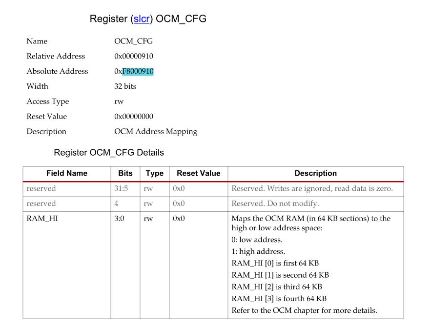

[What] Zynq --> 构架说明
==========================

## 片上存储空间 On-Chip Memory(OCM)

片上 RAM 256KB，ROM 128KB，其中 ROM 仅仅用于 BootROM 。

#### 默认 RAM 地址映射

BootROM 为了保证自己的运行空间，将其中的 64KB 设置到高位内存运行。所以 fsbl 仅有192KB 的RAM 运行空间。

如上图所示，最后一段 RAM 地址位于高段内存中，这导致 RAM 不连续，降低了裸机代码调试可用范围。所以，需要设置其地址连续，将其统一设置为高位或者低位(如果要设置为高位，需呀在 vivado 下打开允许高位访问 "PS-PL_Configuration -> General -> Address_Editor -> Allow_access_to_High_OCM ")。如下图所示：

设置地址映射的关键寄存器如下：

- 0x10 映射地址 : 0x0000_0000 ~ 0x0003_ffff
- 0x18 映射地址 : 0x0000_0000 ~ 0x0002_ffff  0xffff_0000 ~ 0xffff_ffff
- 0x1f 映射地址 : 0xfffc_0000 ~ 0xffff_ffff 

**为什么第 5 位要置一，现在还没搞懂**

除此之外，还需要打开 slcr 的访问权限，Xilinx 在 SDK 下提供了操作函数。

通过修改 XSLCR_OCM_CFG_RESETVAL ，然后**在执行应用代码前**调用此函数即可，对于通过 JATG 下载的代码，需要[修改配置脚本](https://github.com/KcMeterCEC/explore/blob/master/%5BWhat%5D%E5%9F%BA%E7%A1%80%E7%A1%AC%E4%BB%B6--DDR%E7%9F%A5%E8%AF%86/document.md)。

