[What] Zynq --> 构架说明
==========================

## 片上存储空间 On-Chip Memory(OCM)

片上 RAM 256KB，ROM 128KB，其中 ROM 仅仅用于 BootROM 。

### 默认 RAM 地址映射

BootROM 为了保证自己的运行空间，将其中的 64KB 设置到高位内存运行。所以 fsbl 仅有192KB 的RAM 运行空间。

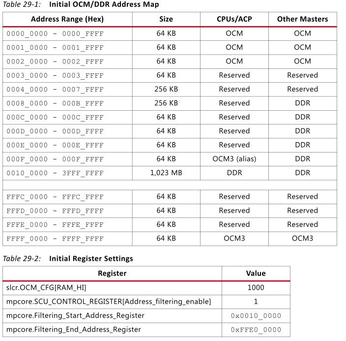

如上图所示，最后一段 RAM 地址位于高段内存中，这导致 RAM 不连续，降低了裸机代码调试可用范围。所以，需要设置其地址连续，将其统一设置为高位或者低位(如果要设置为高位，需呀在 vivado 下打开允许高位访问 "PS-PL_Configuration -> General -> Address_Editor -> Allow_access_to_High_OCM ")。如下图所示：

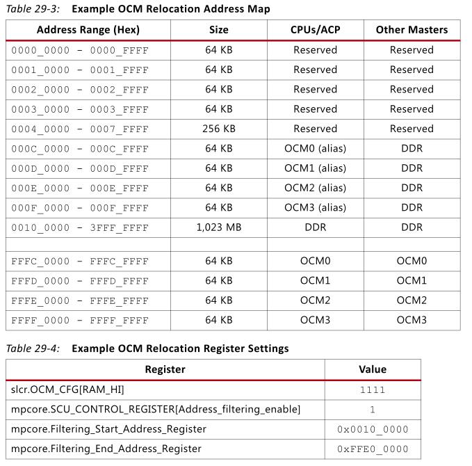

设置地址映射的关键寄存器如下：

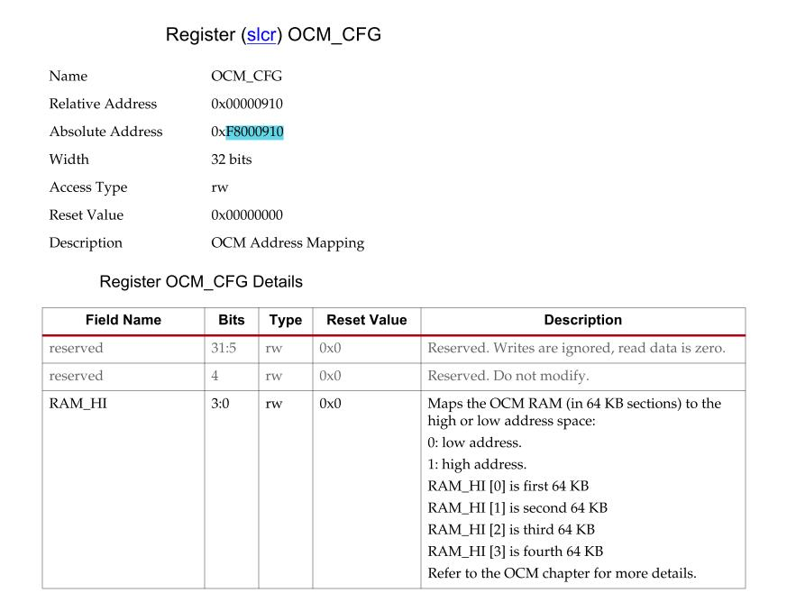

- 0x10 映射地址 : 0x0000_0000 ~ 0x0003_ffff
- 0x18 映射地址 : 0x0000_0000 ~ 0x0002_ffff  0xffff_0000 ~ 0xffff_ffff
- 0x1f 映射地址 : 0xfffc_0000 ~ 0xffff_ffff

**为什么第 5 位要置一，现在还没搞懂**

除此之外，还需要打开 slcr 的访问权限，Xilinx 在 SDK 下提供了操作函数。

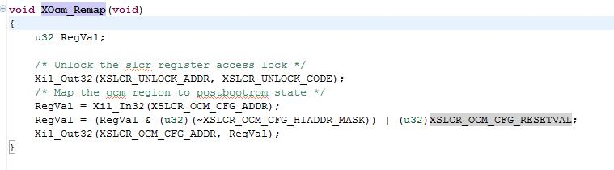

通过修改 XSLCR_OCM_CFG_RESETVAL ，然后**在执行应用代码前**调用此函数即可，对于通过 JATG 下载的代码，需要[修改配置脚本](https://github.com/KcMeterCEC/explore/blob/master/%5BWhat%5D%E5%9F%BA%E7%A1%80%E7%A1%AC%E4%BB%B6--DDR%E7%9F%A5%E8%AF%86/document.md)。

## 中断

### 概览

在 ARM 体系中通常在存储地址的低端固化了一个32字节的硬件中断向量表，用来指定各异常中断及处理程序的对应关系。当一个异常出现后，ARM 处理器会执行以下几步操作。

1. 保存处理器当前状态、中断屏蔽位以及各条件标志位。
2. 设置当前程序状态寄存器 CPSR 中相应的位。
3. 将寄存器 lr\_mode 设置成返回地址。
4. 将程序计数器（PC）值设置成该异常中断的中断向量地址，从而跳转到相应的异常中断处理程序处执行。

从异常中断处理程序中返回包括下面两个基本操作。

1. 恢复被屏蔽的程序的处理器状态。
2. 返回到发生异常中断的指令的**下一条指令处继续执行**。

当异常中断发生时，程序计数器 PC 所指的位置对于各种不同的异常中断是不同的，同样，返回地址对于各种不同的异常中断也是不同的。例外的是，复位异常中断处理程序是不需要返回，因为整个应用系统就是从复位异常中断处理程序处开始执行的。

#### 中断类型

ARM 处理器支持 7 种异常情况：复位、未定义指令、软件中断、指令预取中止、数据中止、中断请求（IRQ）和快速中断请求（FIQ）。

| 异常中断名称      	 				| 含义 	|
| :-----:         	 				| :----:|
| 复位（RESET）     					| 当处理器的复位引脚有效时，系统产生复位异常中断，程序跳转到复位异常中断程序处执行。复位异常中断通常用在下面两种情况：1、系统加电时和系统复位时 2、跳转到复位中断向量处执行，称为软复位 |
| 数据访问中止（Data Abort）			| 如果数据访问指令的目标地址不存在，或者该地址不允许当前指令访问，处理器产生数据访问中止异常中断 |
| 快速中断请求（FIQ）					| 当处理器的外部快速中断请求引脚有效，而且 CPSR 寄存器的 F 控制位被清除时，处理器产生外部中断请求异常中断 |
| 外部中断请求（IRQ）					| 当处理器的外部中断请求引脚有效，而且 CPSR 寄存器的 I 控制位被清除时，处理器产生外部中断请求异常中断。系统中各外设通常通过该异常中断请求处理器服务 |
| 预取指令中止（Prefech Abort）		| 如果处理器预取指令的地址不存在，或者该地址不允许当前指令访问，当该被预取的指令执行时，处理器产生指令预取中止异常中断 |
| 软件中断（software interrupt SWI）	| 这是一个用户定义的中断指令，可用于用户模式下的程序调用特权操作指令。在实时操作系统中，可以通过该机制实现系统功能调用 |
| 未定义指令（undefined instruction） | 当 ARM 处理器或者是系统中的写处理器认为当前指令未定义时，产生未定义的指令异常中断，可以通过该异常中断机制仿真浮点向量运算 |

#### 中断向量表

中断向量表指定了各异常中断及处理程序的对应关系，它通常放在存储地址的低端。在 ARM 体系中，异常中断向量表的大小为32字节。其中每个异常中断占据4字节大小，保留了4个字节空间。也就是说，正好有7个中断处理程序地址。

每个异常中断对应的中断向量表的4个字节的空间存放了一个跳转指令或者一个向 PC 寄存器中赋值的数据访问指令。通过这两种指令，程序将跳转到相应的异常中断处理程序处执行。

当几个异常中断同时发生时，就必须按照一定的次序来处理这些异常中断。在 ARM 中通过给各异常中断赋予一定的优先级来实现这种处理次序。当然，有些异常中断是不可能同时发生的，如指令预取中止异常中断和软中断（SWI）异常中断是由同一条指令的执行触发的，
是不可能同时发生的。处理器执行某个特定的异常中断的过程，称为处理器处于特定的中断模式。

| 中断向量地址 	| 异常中断类型 	| 异常中断模式 	| 优先级（6 最低） 	|
| :--------:  	|:-------:   	| :------: 		| :-------: 		|
| 0x00       	| 复位			| 特权模式（SVC）	| 1					|
| 0x04			| 未定义指令		| Undef			| 6					|
| 0x08			| 软件中断（SWI）	| 特权模式（SVC）	| 6					|
| 0x0c			| 指令预取中止	| 中止模式		| 5					|
| 0x10			| 数据访问中止	| 中止模式		| 2					|
| 0x14			| 保留			| 未使用			| 未使用				|
| 0x18			| IRQ			| IRQ模式		| 4					|
| 0x1c			| FIQ			| FIQ模式		| 3					|

#### 中断处理过程

ARM 处理器响应中断的时候，总是从固定的地址（一般是指中断向量表）开始，而在高级语言环境下开发中断服务程序时，无法控制固定地址开始的跳转流程。
为了使得上层应用程序与硬件中断跳转联系起来，需要编写一段中间的服务程序来进行连接。这样的服务程序常被称为中断解析程序。

每个异常中断对应一个4字节的空间，正好放置一条跳转指令或者向 PC 寄存器赋值的数据访问指令。理论上可以通过这两种指令直接使得程序跳转到对应的中断处理程序中去。但实际上由于函数地址值为未知和其他一些问题，并不这么做。

发生异常后，中断源请求中断，PC 自动跳转到中断向量表中固定地址执行。中断向量表中存放一条跳转指令，跳转到用户自定义地址（解析程序）继续执行。再解析程序中，将会和中断服务程序连接起来。

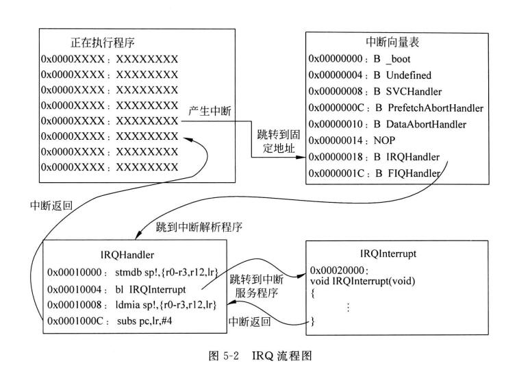

### 结构

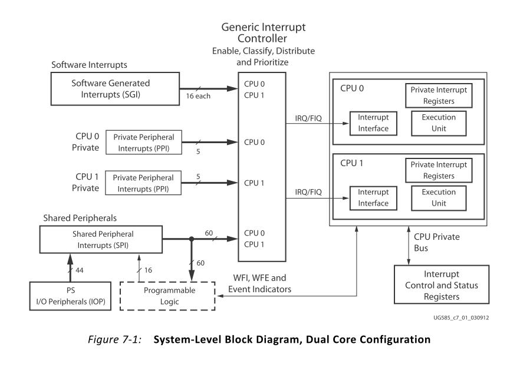

由上图可知中断体系具有如下特点：

1. 每个 CPU 具有自己的私有外设中断 Private Peripheral Interrupt(PPI), 具有5个中断源，包括全局定时器、私有看门狗、私有定时器、PL端的 FIQ/IRQ
2. CPU 共用软件中断生成器 Software Generated Interrupt(SGI),具有16个中断源
3. CPU 共用共享中断 Shared Peripheral Interrupt(SPI),一共具有60个中断源

这些中断都由通用中断控制器（Generic Interrupt Controller,GIC）来实现管理。

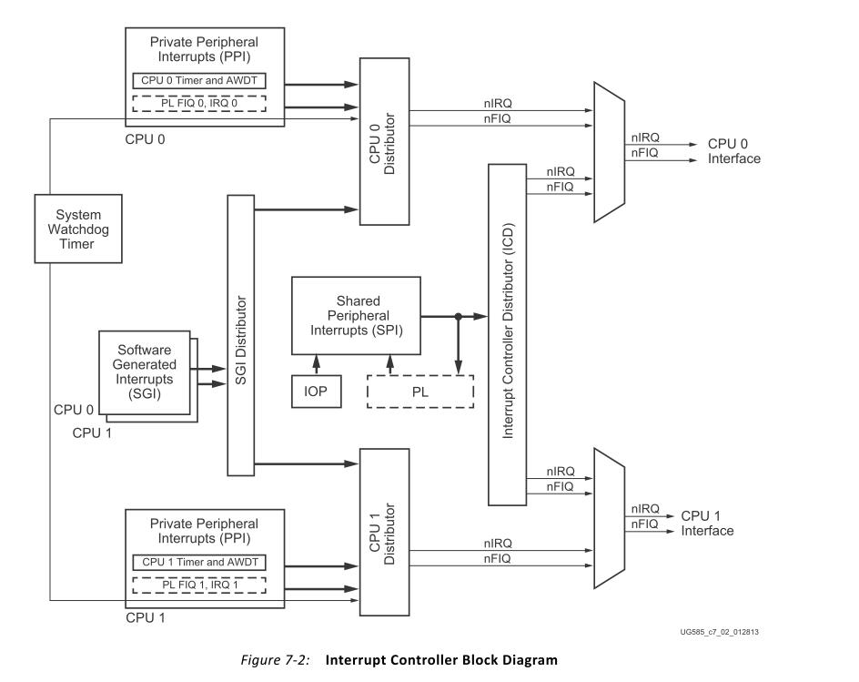

### 私有中断

| 名字        | PPI#      | 中断 ID   | 类型      | 描述    |
| :----:      | :-----:   | :------: | :------: | :------: |
| 保留      | ---- | 26：16|---|保留|
|全局定时器| 0 | 27 | 上升沿 | 全局定时器|
| nFIQ | 1 | 28 |  低电平（在 PS-PL 接口，**活动高**） | 来自PL的中断信号|
| CPU 私有定时器| 2 | 29 | 上升沿 | 来自  CPU 定时器的中断 |
| AWDT{0, 1} | 3 | 30| 上升沿 | 用于每个 CPU 的私有看门狗定时器|
| nIRQ | 4 | 31 | 低电平（在 PS-PL 接口，**活动高**）|来自PL的中断信号|

### 软件中断

| 名字 | SGI# | 中断 ID | 类型 |
| :----:      | :-----:   | :------: | :------: | :------: |
| 软件 0 | 0 | 0 | 上升沿 |
| 软件 1 | 1 | 1 | 上升沿 |
|  .| . | . | . |
| 软件 15 | 15 | 15 | 上升沿 |

### 共享外设中断

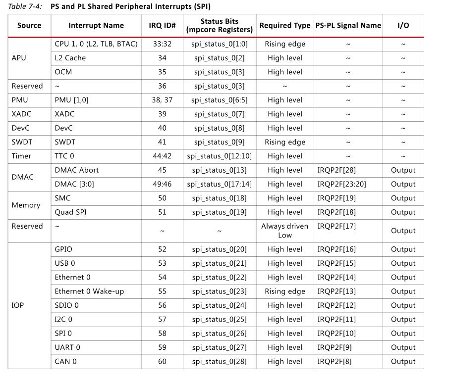
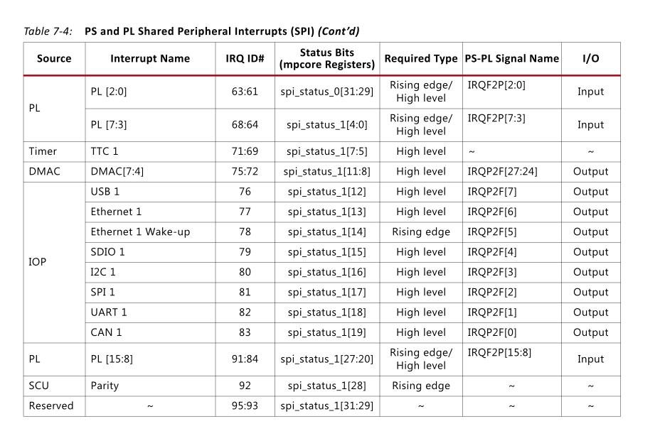

## SD/SDIO 控制器

zynq 具有 **两个独立的** sdio 控制器，可以兼容 sdio 设备，**但不支持 SPI 模式**。 **最多支持4根数据线** ，对于 SD 卡而言，支持 1 数据线和 4 数据线操作。 **控制线也可以扩展到 EMIO** 。兼容SD协议 **SD Host Controller Specificaton Version 2.0 Part A2**，以及 **MMC3.31** 标准,并且具有 SDMA（单次 DMA 传输），AMDA1（最大 4KB DMA 传输），ADMA2（无限 DMA传输）模式。支持 SDHS 和 SDHC 卡。

同样支持 eMMC 设备，**但是并不全部支持**，xilinx官方提供了 [已经经过验证的支持设备](https://www.xilinx.com/support/answers/65463.html)。

### 参数

- 每个控制器具有两个 512 字节的 FIFO
- 最大时钟 50MHZ （25MB/sec）
- 支持 CRC7 和 CRC16 校验

### SDIO 控制器框图

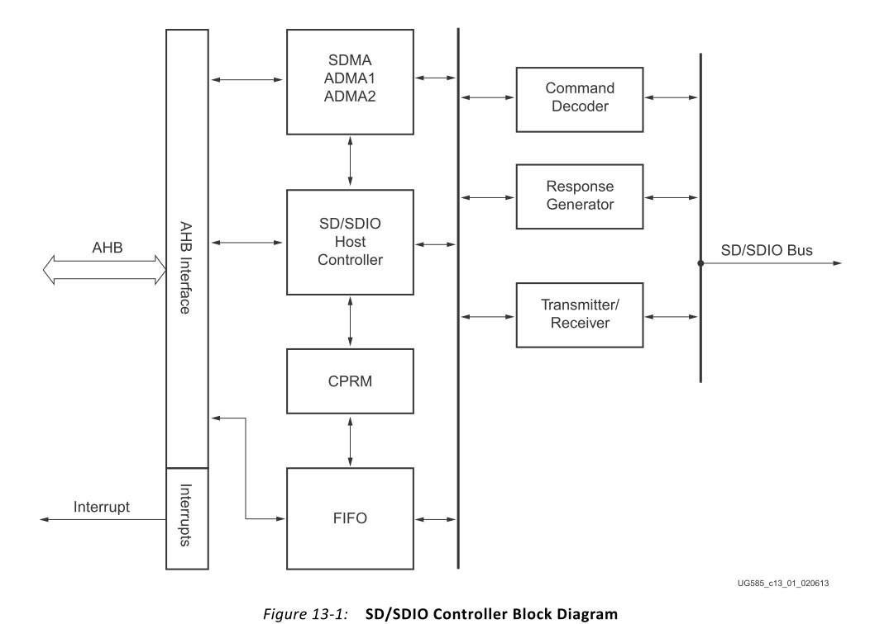

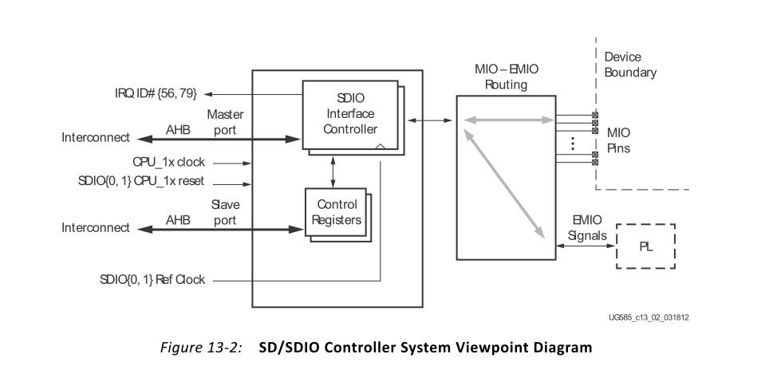

SDIO0 和 SDIO1 分别对应中断号 56，79，用于表示传输完成。也可以通过状态寄存器来循环检验传输完成标志位。

控制器使用两个 512 字节的 FIFO 在读或者写时，用于乒乓传输。因为FIFO都是以块来传输的，所以**不会出现FIFO没有被填满的状态**。当 FIFO 的数据没有被完全读取时，控制器会停止时钟传输，这样也**避免了数据丢失的发生**。当不能从设备读取数据时，会发出读取等待事件，**这将会停止时钟**。

当进行写数据流时，发送 WRITE\_DAT\_UNTIL\_STOP(CMD20) 命令，接着写数据，直到 STOP\_TRANSMISSION 事件。

当进行读数据流时，发送 READ\_DAT\_UNTIL\_STOP(CMD11) 命令，接着读数据，直到 STOP\_TRANSMISSION 事件。

在与高速卡通信时，数据的输出发生在时钟的上升沿。在与全速卡通信时，数据的输出发生在时钟的下降沿。

### SDIO 编程模式

#### 传输模式

- 单次传输，在传输之前，指定要传输的数据块。然后传输完成后自动停止。
- 多次传输，在传输之前，指定要传输的数据块。然后传输完成后自动停止或继续多次传输。
- 无限传输，在传输之前，不用指定传输的块数量，对于 SD 卡，使用 CMD12 停止传输，对于 SDIO 设备，使用 CMD52 停止传输。

#### 传输流程

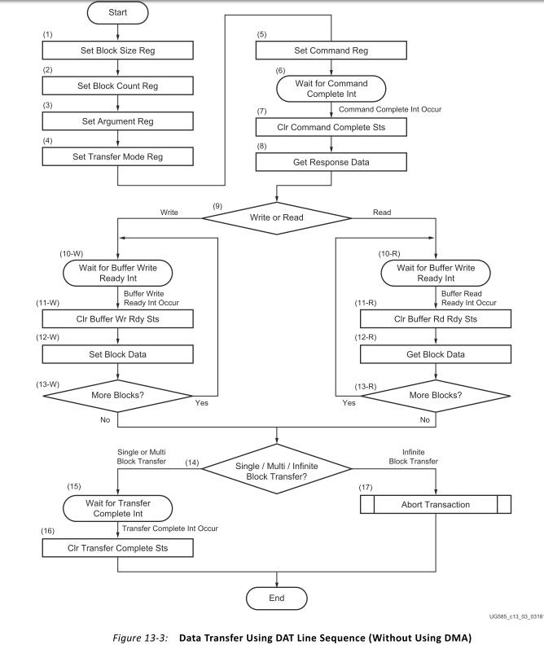

1. 设置块大小
2. 设置传输块数量
3. 设置要执行的命令到 argument 寄存器
4. 设置传输模式
5. 写入要发出的命令到 command 寄存器
6. 等待命令完成中断，并清除标志位
7. 判断设备响应
8. 等待数据缓存可用中断
9. 每次循环的且交替的从 FIFO 中读或写数据，每读或写一次 FIFO 都需要确认另外一个 FIFO 操作完成标志。
10. 如果是单次或者多次传输，等待传输中断标志，并清除标志位。如果是无限传输模式，则发送停止传输命令。

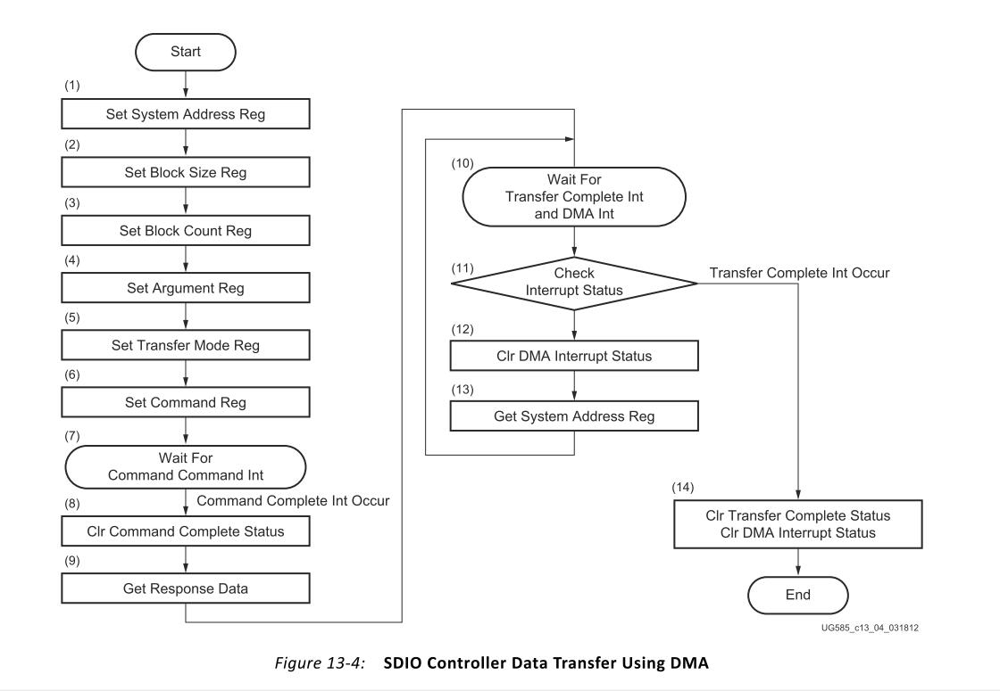

1. 设置 DMA 传输缓存的起始地址
2. 设置块大小
3. 设置块数量
4. 设置要执行的命令到 argument 寄存器
5. 设置传输模式
6. 写入要发出的命令到 command 寄存器
7. 等待命令完成中断，并清除标志位
8. 判断设备响应
9. 接下来便是 DMA 自动完成数据搬移操作，无需 CPU 干预
10. 等待传输完成标志，并清除标志位

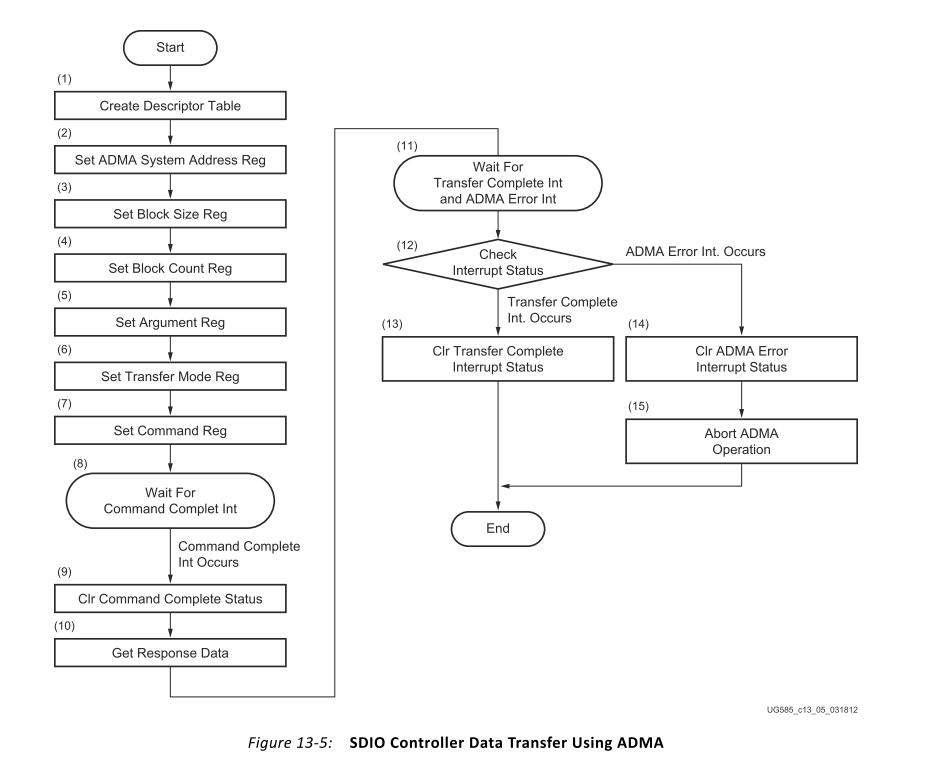

在 使用 DMA 步骤的基础上， AMDA 需要先设置一个描述符表。同时需要将此表的地址给予 System Address register.

#### 停止传输

可以发送同步或者异步停止传输命令，异步传输可以在任意时刻发出，单块传输完成后自动停止。而同步传输需要在单块传输完成后发出。
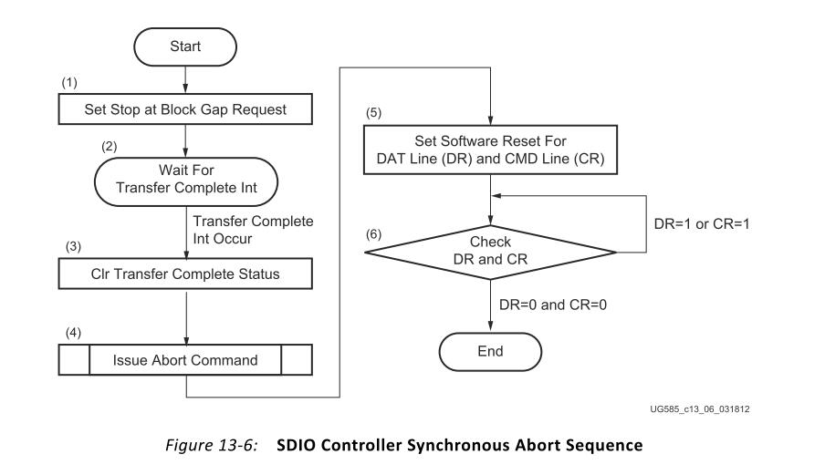

### 硬件连接

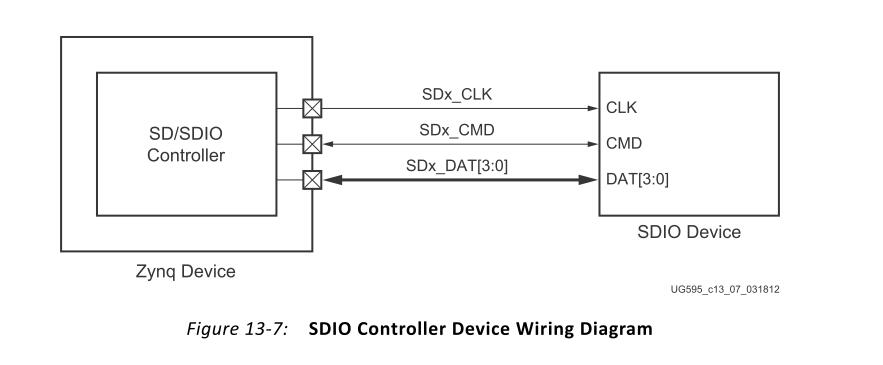

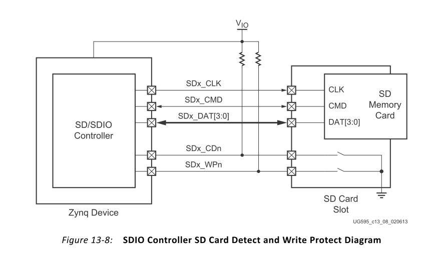
