[What]network --> 基础知识
===========================

## 基本概念

### 基本词汇

- 节点 (node)

具有独立网络地址 (IP) 的设备，就称为一个节点。比如手机、电脑都是节点，但是**交换机不是网络节点，因为它没有独立的 IP。**

- 服务器 (server) 与客户端 (client)

向客户端提供数据的设备就是服务器，向服务器请求数据的就是客户端。比如通过 PC(client) 向 www.google.com(server) 请求搜索结果。

- 网络拓扑 (topology)

指网络各个节点的连接方式，比如一般局域网通过路由器接入网络，路由器与同局域网的设备是星型连接方式。

### 连接范围

- 局域网 (Local Area Network, LAN)

近距离传输

- 广域网 (Wide Area Network, WAN)

远距离传输

### 协议分层

协议分层开源降低软件的复杂度，让各个层只需要关注自己的功能实现即可。各个层的收发关系也是一一对应的。
发送方通过将数据层层打包发送出去，接收方将数据层层拆包得出最终数据。每一层的包装都表明了包裹内的一些信息，比如发送者、接收者、校验数据。

#### OSI (Open System Interconnection)

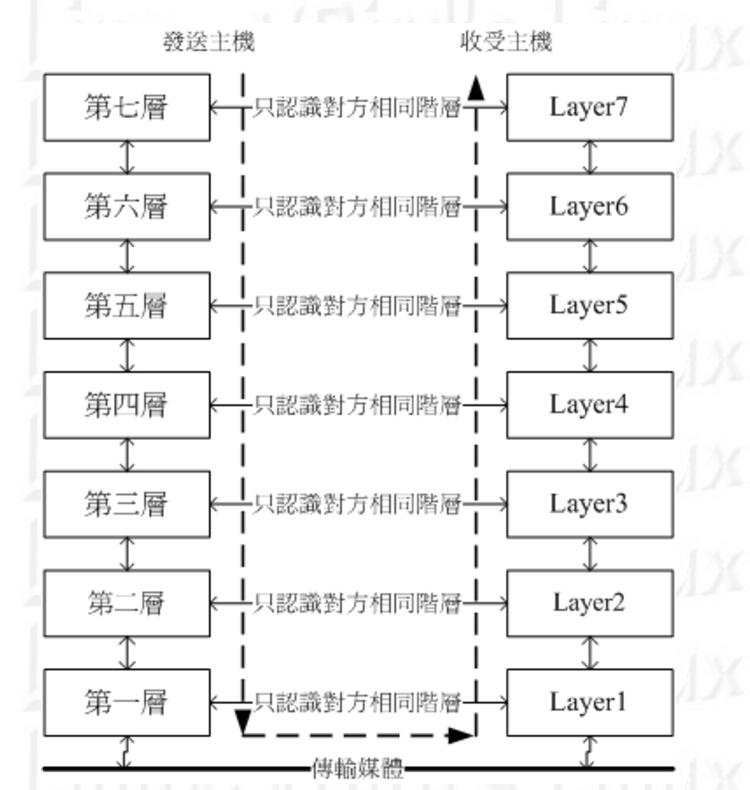
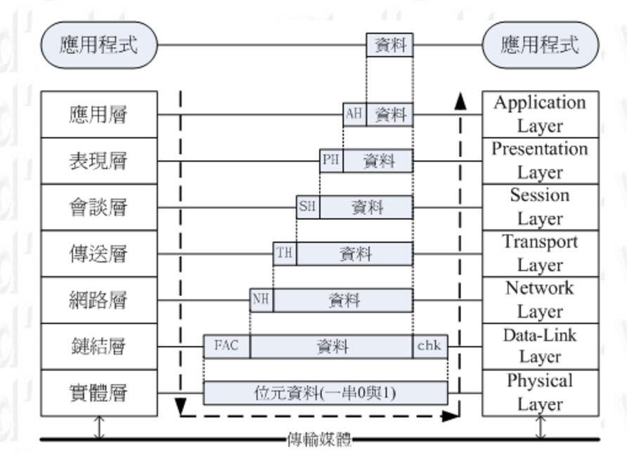

| 层级     | 内容  |
| :----:  | :-----: |
|physical Layer | 实现网络实际的数据传输，电压转换，编解码等等。也就是电路上常用的 PHY |
|Data-Link Layer | 由与物理层相连接的 MAC(Media Access Control) 和与软件层链接的LLC(Logical Link Control)组成 |
|Network Layer | 包括IP(Internet Protolcol)和路由(route) |
|Transport Layer | 包含具体的 TCP、UDP传输方式，流程控制 |
|Session Layer | 两个地址之间的连接与断开，对谈控制等 |
|Presentation Layer | 将来自本地端应用程序资料格式转换位网络标准格式 |
|Application Layer |最高层的传输方式，比如HTTP、FTP等 |

#### TCP / IP

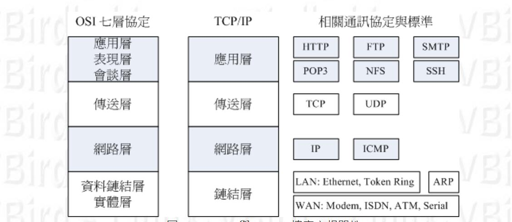

##### 物理层

网线接头的顺序：

以太网通过 CSMA/CD (Carrier Sense Multiple Access with Collision Detection) 标准来作为局域网传输，简单点说：就是局域网之间的数据传输其实是以广播的形式传输的，也就是每台电脑都会接受到发送端的数据，只是由于MAC地址不对应而丢弃了数据而已。传输的最小单位称为 frame。

- MAC 的封装格式

网络传输的最小单位就是 frame,其数据结构如下图：

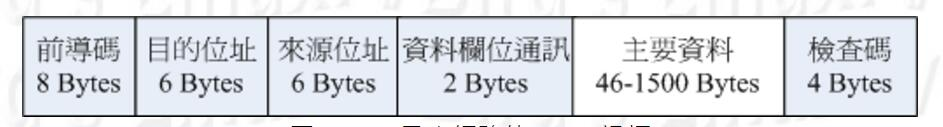

上图中的 `目的地址` 和 `来源地址` 均代表 MAC 地址，MAC 地址由6字节组成，前3字节为厂商地址，后3字节位网卡编码。
最大传输的字节为1500字节，被称为 MTU(Maximum Transmission Unit)。在 Gigabit 中支持 Jumbo frame ，大小为 9000 字节。

**需要注意的是：** MAC地址的直接传输仅再局域网中生效，如果跨了网段则会改变MAC地址来传递，如下图：

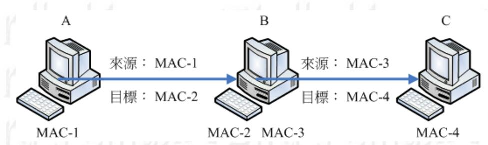

##### 链接层

目前常用的IPV4(Internet Protocol version 4)具有4字节表示地址，而IPV6则具有16字节来分配。
IP 封包最大为 65535 字节，其数据结果如下图(每一行占用32位)：

- version : 代表当前封包的版本是IPV4还是 IPV6
- IHL(Internet Header Length) : IP表头的字长度，一个字位4字节
- Type of Service : 组成方式为 `PPPDTRUU` IP 封包的服务类型。`PPP` 表示 IP 封包的优先度， `D` 为0表示一般延迟，为1表示低延迟。`T` 为0表示一般传输量，为 1 表示高传输。`R` 为0表示一般可靠度，为1表示高可靠度。 `UU`为保留位。
- Total Length : IP 封包的的总长度，单位为字节
- Identification : 用于标识MAC 讯框，为了在接收端能够重组数据
- Flags : 组成方式为 `0DM`, `D` 为0表示可以分段，为1表示不可分段。`M` 为0表示为IP的最后分段，为1表示非最后分段。
- Fragmentation Offset : 表示这个IP分段在原始IP包中的位置，为了能够在接收端组合。
- Time To Live : 存活时间，当通过一个路由器时，这个值就会减一，当 TTL 为0时，这个封包将会被直接丢弃。
- Protocol : 表示当前封包内容所使用的协议：

| 值  | 协议 |
|:----:|:----:|
| 1 | ICMP (Internet Control Message Protocol) |
| 2 | IGMP (Internet Group Management Protocol) |
| 3 | GGP (Gateway-to-Gateway Protocol) |
| 4 | IP (IP in Ip encapsulation) |
| 6 | TCP (Transmission Control Protocol) |
| 8 | EGP (Exterior Gateway Protocol) |
| 17| UDP (User Datagram Protocol) |

- Header Checksum : 表头校验码
- Source Address : 源 IP 地址
- Destination Address : 目标 IP 地址
- Options : 附加参数
- Padding : 对齐补充

##### 传输层

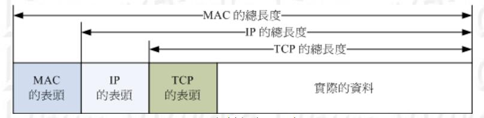

###### TCP 数据结构

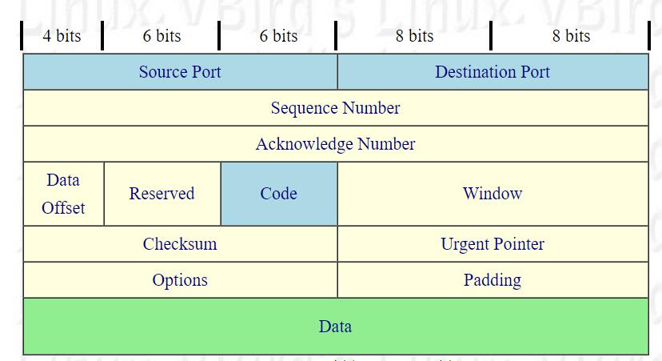

- Source Port & Destination Port : 源与地址的端口

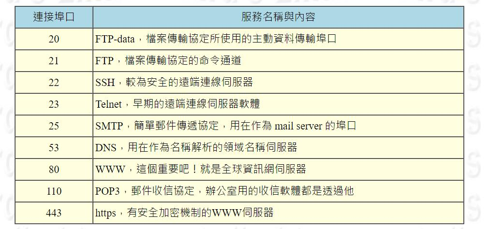

**将IP 与端口等信息封装，就是一个 Socket!**

- Sequence Number : 封包序号，用于接收端组合
- Acknowledge Number : 应答信号，确认对方已经收到
- Data Offset : 说明数据的起始位置
- Code : 控制标志，表明连线的状态

| 位           | 意义   |
| :--:        |:---: |
| URG(Urgent) | 1 -> 紧急封包 ,同时Urgent Pointer 也启用|
| AcK         | 1 -> 应答包 |
| PSH(Push function) | 1 -> 要求对方立即传送缓冲区的其他对应包 |
| RST(Reset) | 1 -> 连线会马上被结束 |
| SYN | 1 -> 希望建立同步处理 |
| FIN | 1 -> 传送结束 |

- Window : 滑动视窗，高速对方目前本身有缓冲容量，还可以接收封包。
- Checksum : 校验码
- Urgent Pointer : 紧急资料
- Options : 附加资料
- Padding : 对齐

###### TCP 握手(Three-way handshake)

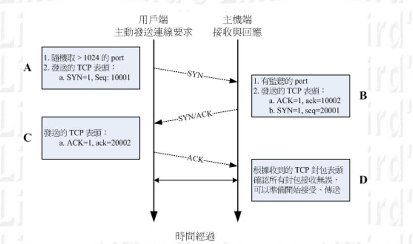

###### UDP（User Datagram Protocol） 数据结构

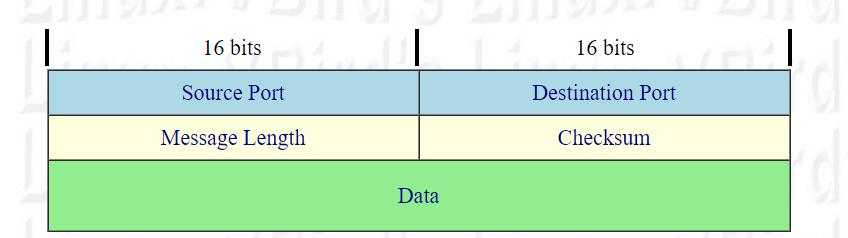

UDP 不提供可靠的传输模式，因为它并没有应答机制，所以整个数据结构看起来很简单。但相对TCP来说，传输数据量更大。

## IPv4 地址应用

### IP 地址的组成与分级

#### IP 组成

IP 由4字节组成，所以理论上的范围为 `0.0.0.0 ~ 255.255.255.255`，但IP组成分为两个部分，分别是 Net_ID 和 Host_ID 。局域网的定义就是：在同一个物理网段内， 主机的 IP 具有相同的 Net_ID ，并且具有唯一的 Host_ID。

在局域网中， `Net_ID` 是不变的，而 `Host_ID` 在二进制中，不能为全0，也不能为全1。因为全0表示为整个网段的地址 (Network IP),全 1 表示为广播地址 (Broadcast IP)。

在局域网中的数据传输，可以通过 CSMA/CD 的功能直接在局域网内用广播进行网络连接，也就是说直接通过 MAC 传输。

#### IP 分级
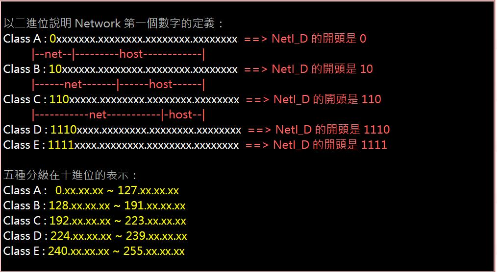

IP 分为公有 IP （Public IP）与私有 IP (Private IP)，只有公有 IP 才能直接连接上 Internet。私有 IP 分别在 A,B,C 三个类中保留一段作为私有 IP。

- Class A : 10.0.0.0 ~ 10.255.255.255
- Class B : 172.16.0.0 ~ 172.31.255.255
- Class C : 192.168.0.0 ~ 192.168.255.255

所以以上这三段 IP 是不能直接连接上 Internet 的，只能在局域网内传输数据，如果需要与 Internet 则需要 IP 伪装。

除此之外，Class A 还分出了一个 lo 回路，用于网络程序测试。地址为：
- 127.0.0.1

### Netmask 子网掩码

子网掩码就是用于设置 Net_ID 与 Host_ID 对应位数的，可以把私有 IP 再切分为很多小的局域网。
子网掩码的确定，规定 Net_ID 全为1，而 Host_ID 全为0 的值即为子网掩码。

比如将局域网IP地址 192.168.0.0 ~ 192.168.0.255 切分为两个局域网。
目前 Net_ID 为 24 位， Host_ID 为 8位，当我们将 Net_ID 设置为 25位， Host_ID 设置为 7位时，则可以分为两个局域网。

1100_0000.1010_1000.0000_0000.0000_0000  `Network: 192.1681.0.0`

1100_0000.1010_1000.0000_0000.1111_1111  `Broadcast: 192.168.0.255`

1111_1111.1111_1111.1111_1111.0000_0000  `Netmask : 255.255.255.0`

第一段：

1100_0000.1010_1000.0000_0000.0000_0000  `Network: 192.1681.0.0`

1100_0000.1010_1000.0000_0000.0111_1111  `Broadcast: 192.168.0.127`

1111_1111.1111_1111.1111_1111.1000_0000  `Netmask : 255.255.255.128`

第二段：

1100_0000.1010_1000.0000_0000.1000_0000  `Network: 192.1681.0.128`

1100_0000.1010_1000.0000_0000.1111_1111  `Broadcast: 192.168.0.255`

1111_1111.1111_1111.1111_1111.1000_0000  `Netmask : 255.255.255.128`

通常的写法是 Network / Netmask , 比如 192.168.0.0 / 24

### 路由

数据跨网段传输，就被称为路由。
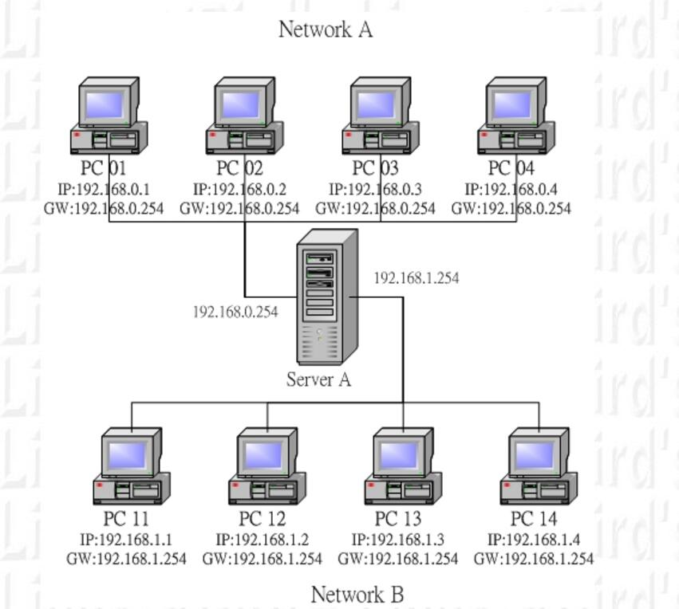

- 当 PC01 有数据要传送时， 主机会查阅 IP 封包表头的目标 IP 地址。
- PC01 会分析自己的路由表，当发现目标 IP 与本机 IP 的 Net_ID 相同时（局域网），则PC01会直接通过 MAC 传输。
- 当发现目标 IP 与本机 IP 的 Net_ID 不同时，PC01 会分析路由表当中是否有其他符合的路由设定，如果没有直接将该 IP 封包送到预设路由器(default gateway)
- 当 IP 由 PC01 送给 Server A 之后，PC01就不用理会接下来的工作了。而 Server A 接收到封包后，分析自己的路由表，然后传输到目的地址。

### IP 与 MAC

ARP （Address Resolution Protocol, 网络地址解析）协议，用于获取局域网中 MAC 与 IP 的对应关系。当主机要发送数据式，会向局域网发送 ARP，对方收到 ARP 包以后就会返回 MAC 地址。主机会将接收到的MAC 与 IP 对应建立一张 ARP table 记录20分钟。这样可以方便以后的传输。

### ICMP 包

ICMP（Internet Control Message Protocol, 网络信息控制协议），用于判断网络的连接状态。最常应用的便是 `ping命令`。

## DNS（Domain Name System）

DNS 服务器主要就是将 IP 地址与主机名想对应，便于访问和记忆。
