[What] 基础硬件 --> DDR 基础知识
===================================

- 参考于【高手进阶，终极内存技术指南--完整 / 进阶版】

## SDRAM 基本结构
- SDRAM: Synchronous Dynamic Random Access Memory（同步动态随机存储器）
> 同步：时钟频率与 CPU 前端总线的系统时钟频率相同，由 CPU 提供时钟完成数据传输。
> 动态：存储阵列需要不断刷新来保证数据不丢失。
> 随机：数据不是线性存储，而是自由指定地址进行数据读写。

- SIMM: Single In-line Memory Module（单列内存模组）
> 内存条与主板插槽只有一列引脚。

- DIMM: Double In-line Memory Module（双列内存模组）
> 内存条与主板插槽有两列引脚，也就是两侧的金手指对应不同的引脚。

### 物理 Bank
- P-Bank
> 内存与 CPU 接口的对应位宽就称之为物理 Bank (Physical Bank, 简称P-Bank)，比如CPU位宽为64 bit，则 P-Bank 为64bit。
> 由北桥芯片来协调内存与 CPU 之间的数据交换。

- 芯片位宽
> 芯片（内存颗粒）本身的 bit 位数，比如芯片位宽是 16bit，P-Bank 为64bit，那么一个内存条上需要 4 课芯片并联来满足 CPU 接口的需要。

### 逻辑 Bank
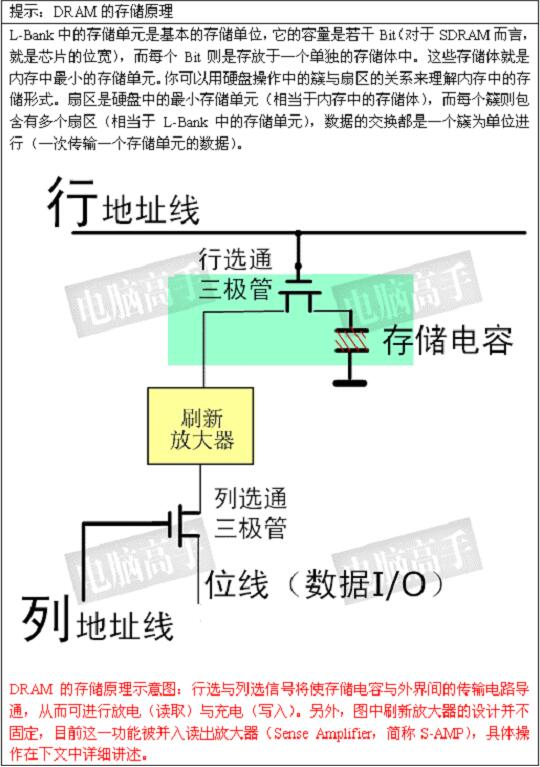 
> SDRAM 内部由很多表格组成，表格层层堆叠为整个内存。其中一个表格就是一个逻辑 Bank(L-Bank)。
> 寻址时就要先确定是哪个 L-Bank ，然后在 L-Bank 中选定行 (Row) 和列 (Colum)。所以在同一时刻只能操作一个 L-Bank。
> 也可以看出 **SDRAM表格每个单元的容量就是芯片的位宽，也是 L-Bank 的位宽** 。

> 由此可以得出芯片总容量（字节）为： **行数 X 列数 X L-Bank X 位宽 / 8**。
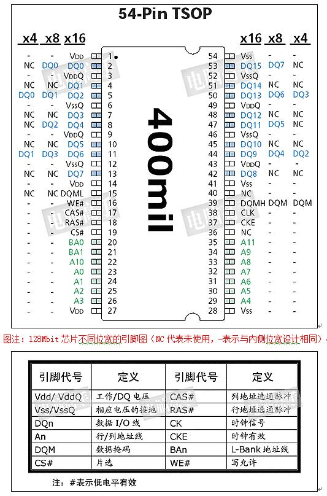

## SDRAM 内部操作与时序

### SDRAM 内部操作
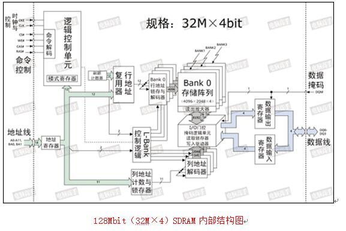
> SDRAM 在每次上电时，需要初始化内部模式寄存器（MR, Mode Register），由北桥芯片在 BIOS 的控制下进行。
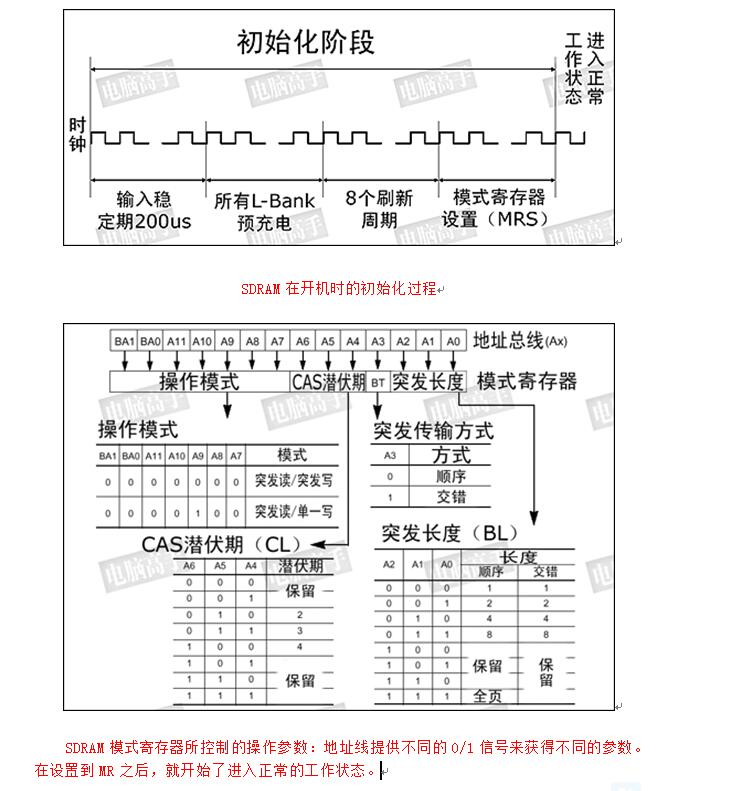

### SDRAM 时序

#### SDRAM 行选择时序 (RAS)
> SDRAM 行选择与片选和 L-Bank 选择同时进行，如下图所示。
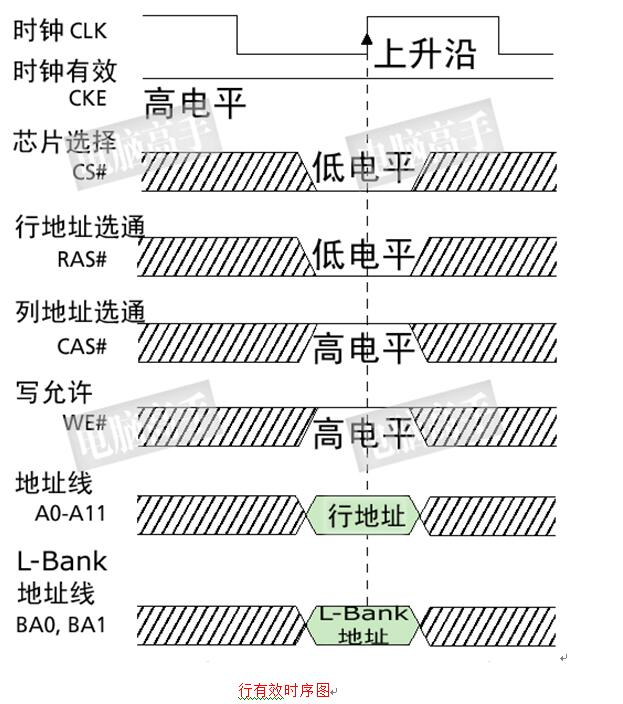

#### SDRAM 列选择时序 (CAS)
> 列寻址与读写命令是同时发出的，如下图所示。
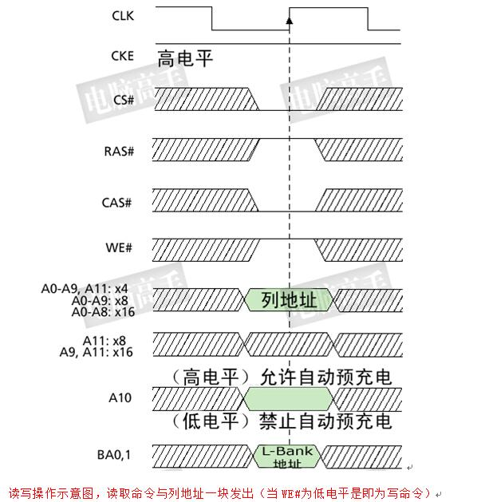

> 需要注意的是： **在发送行选择后，需要间隔一段时间才能发送列选择命令。定义为 tRCD，就是 RAS to CAS Delay** 。
> tRCD 以时钟周期数 (tCK) 为单位，如下图所示。
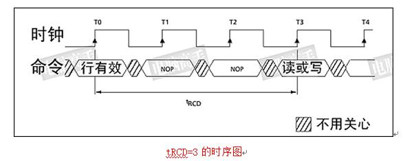

#### SDRAM 数据读出
> 在 CAS 发出后，需要经过一段时间后才能有数据输出。从CAS与读取命令发出到第一笔数据输出的时间定义为 **CL (CAS Latency， CAS 潜伏期)** 。
> 由于 CL 只在读取时出现，所以也被称为读取潜伏期 (RL, Read Latency) 。
> CL 与 tRCD 一样，以时钟周期数为单位。

> 由于每个存储单元的电容容量很小，所以信号需要经过放大来保证其有效的识别性，放大工作由 S-AMP 负责。
> S-AMP 需要有一个准备时间才能保证信号的发送强度，也就是说数据需要经过一定时间才能出现在数据总线上。
> 这个时间被称为 **tAC(Access Time from CLK, 时钟触发后的访问时间)** ， 单位为 nS 。
> 需要注意的是：每个数据在读取时都有 tAC ，包括在连续读中，只是在进行一个数据传输的同时就开始了第二个数据的 tAC 。
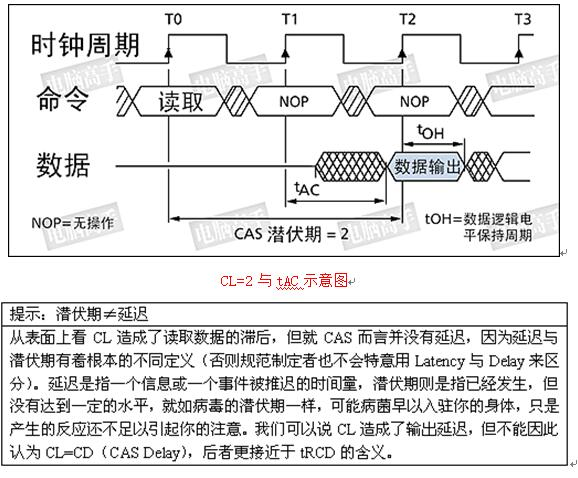

### SDRAM 数据写入
> 数据写入操作是在 tRCD 后进行，但此时没有了 CL ，如下图所示。
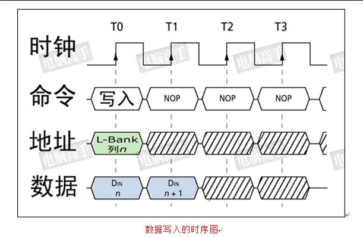

> 数据写入虽然没有延时，但是在内部电容充电过程中依然需要一定的时间，称为 ** 写入 / 校正时间 (tWR, Write Recovery Time)** ，也叫写回 (Write Back)。

### 突发长度
> 连续传输所涉及到的存储单元的数量就是突发长度 (Burst Lengths, BL) ，如下图所示 。
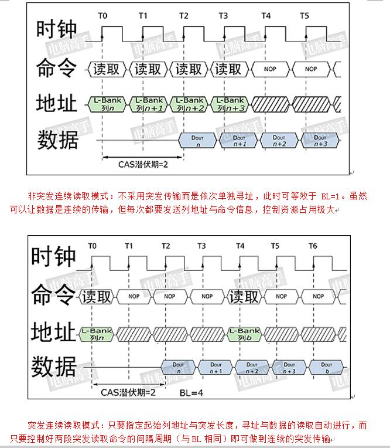

### 预充电
> L-Bank 关闭现有工作行，准备打开新行的操作就是预充电 (Precharge) 。
> 实际上是对工作行中所有存储体进行数据重写，并对行地址进行复位，同时释放 S-AMP 以准备新行的工作。
> 在发出预充电命令后，要经过一段时间后才能允许发送 RAS 命令打开新工作行，这个间隔称为 **tRP(Precharge command Period，预充电有效周期)** 。
> tRP 以时钟周期为单位。
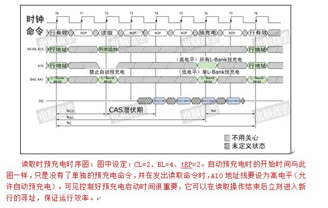

### 刷新
> 预充电是对一个或所有 L-Bank 中的工作行操作，并且是不定期的。而刷新是有固定周期，依次对所有的行进行操作，为了保留久久没有经历重写的存储体中的数据。
> 与所有的 L-Bank 预充电不同的是，预充电中各 L-Bank 中的工作行地址并不一定是相同的。
> 刷新分为自动刷新 (Auto Refresh, AR) 和 自刷新 (Self Refresh, SR)， AR 期间对应的 L-Bank 停止工作。 SR 主要用于休眠模式下保存数据，最著名的应用就是 STR (Suspend to RAM , 休眠挂起于内存)。

### 数据掩码 (Data I/O Mask, DQM)
> 内存可以控制  I/O 端口取消哪些输出或输入的数据。一个 DQM 信号占用一字节。
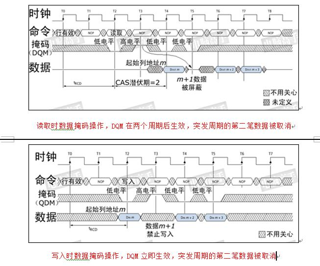

## DDR 基本结构及时序
- DDR SDRAM: Double Data Rate SDRAM （双倍数据流 SDRAM ）
> DDR 的数据输出在时钟的上升沿及下降沿都会输出数据，数据速度是 DDR 系统时钟的两倍。
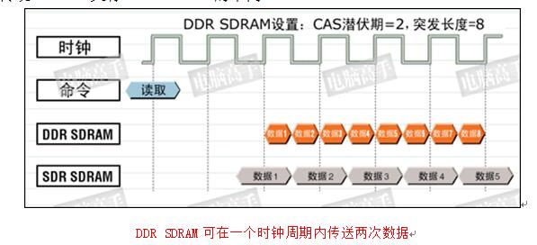

### DDR 基本结构
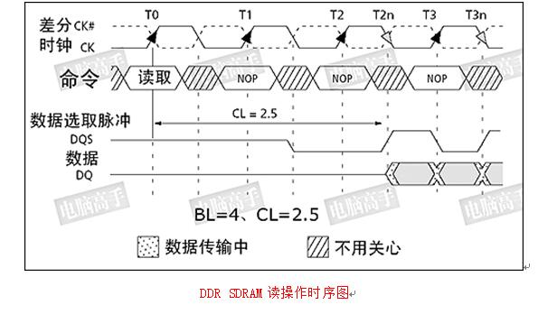
> 相比 SDR SDRAM ，DDR时序图多了两个信号 CLK# 和 DQS ，CLK# 与正常 CLK 时钟相位相反，形成差分时钟信号。
> 数据的传输在 CLK 与 CLK# 的交叉点进行，其具体实现如下图所示。
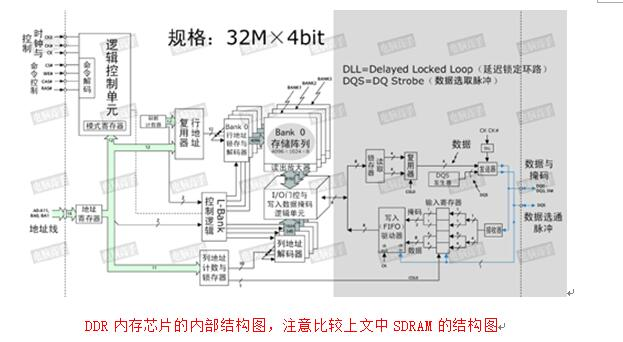

> 需要注意的是： SDRAM中 L-Bank 的存储单元的容量与芯片位宽相同， ** 但在DDR中存储单元的容量是芯片位宽的一倍 ** 。
> 以上图为例， L-Bank 在内部时钟信号的触发下一次传送的 8bit 的数据给读取锁存器，再分成两路 4bit 数据传给复用器，而后者将它们合并为
> 一路 4bit 数据流，然后由发送器在 DQS 的控制下在外部时钟上升与下降沿分两次传输 4bit 的数据给北桥。所以当时钟频率为 100MHz 时，数据数据就是 200MHz 。
> 所以 DDR 中内部存储单元的容量 = 2 X 芯片位宽

### DDR 与 SDRAM 的不同

> DDR 与 SDRAM 一样，在开机时也要进行 MRS ，不过由于操作功能的增多， DDR 在 MRS 之前还多了一个 EMRS 阶段 （ Extended Mode Register Set, 扩展模式寄存器设置）

### DDR 时序
#### 差分时钟
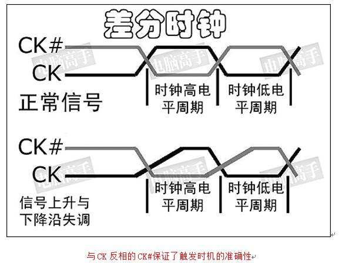
> CK# 起到了触发时钟校准的作用，由于数据是在CK的上下沿触发，造成传输周期缩短了一半，因此必须要保证传输周期的稳定以确保数据的正确传输，这就要求 CK 的上下沿间距要有精确的控制。
> 但因为温度、电阻性能的改变等原因， CK 上下沿间距可能发生变化，此时与其反相的 CK# 就起到了纠正的作用（ CK 上升快下降慢， CK# 则是上升慢下降快）。

#### 数据选取脉冲 (DQS)
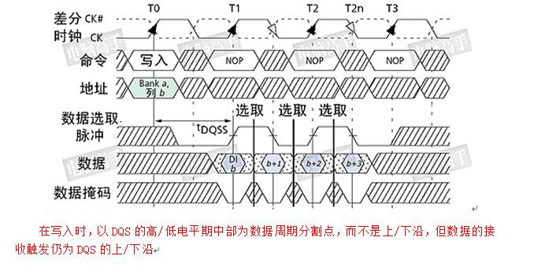
> DQS 用来在一个时钟周期内准确的区分出每个传输周期，并便于接收方准确接收数据。简单的说，它就是数据同步信号。
> DQS 与数据同时生成（也是在 CK 与 CK# 的交叉点），而 DDR 内存中的 CL 也就是 CAS 发出到 DQS 生成的间隔。
> 数据真正出现在数据 I/O 总线上相对于 DQS 触发时间间隔被称为 **tAC** （也就是结构图中灰色部分的数据输出时间）。
> 由于预取的原因，实际数据传出可能会提前于 DQS 发生。

#### 写入延迟
> 在发出写入命令后， DQS 与写入数据要等待一段时间才回送达，这个周期被称为 DQS 相对于写入命令的延迟时间 (tDQSS, WRITE Command to the first corresponding rising edge of DQS) 。
> tDQSS 也会导致读后写操作延迟增加，如下图所示。
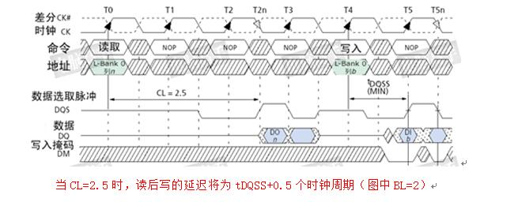

#### 突发长度与写入掩码
> DDR 突发长度指连续的传输周期数，每次是一个芯片位宽的数据。对于突发写入，如果其中有不想存入的数据，仍可以运用 DM 信号进行屏蔽。
> DM 信号和数据信号同时发出，接收方在 DQS 上升与下降沿来判断 DM 状态。

#### 延迟锁定回路 (DLL)
> DLL 根据外部时钟动态的修正内部时钟的延迟来实现与外部时钟的同步。
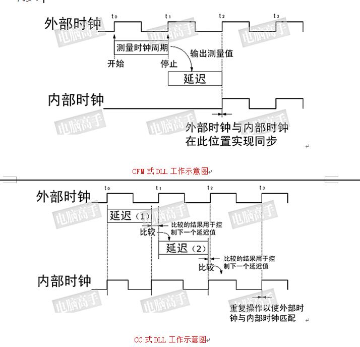

## 调试经验
1. DDR的各项参数配置以及外部PCB连线的延时时间不那么容易配置，比较好的解决方案是先将 DDR 的时钟频率降到一个比较低的值
（比如 10MHz ）,在这种低频率的操作下，对于延时参数就不会那么敏感了。