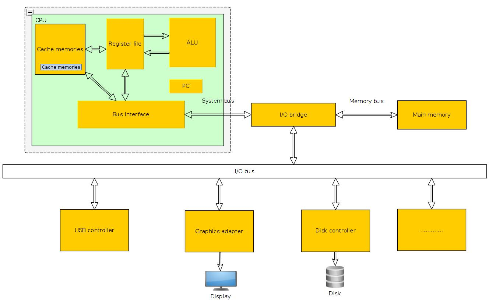
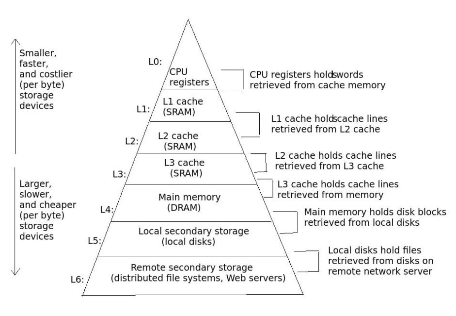
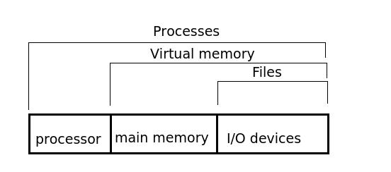
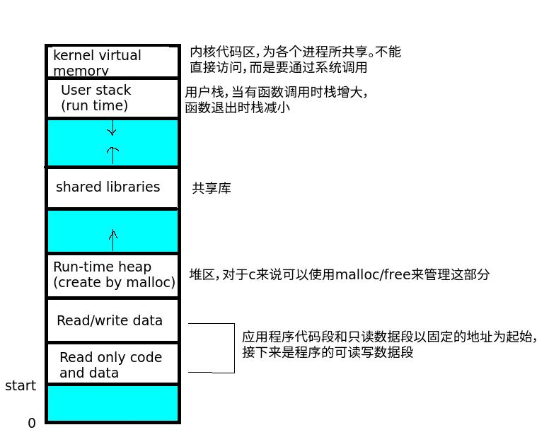
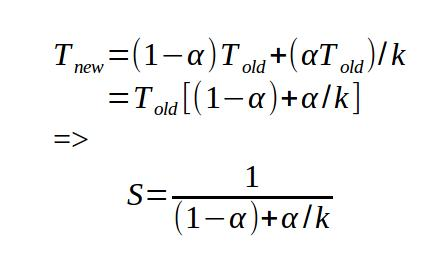
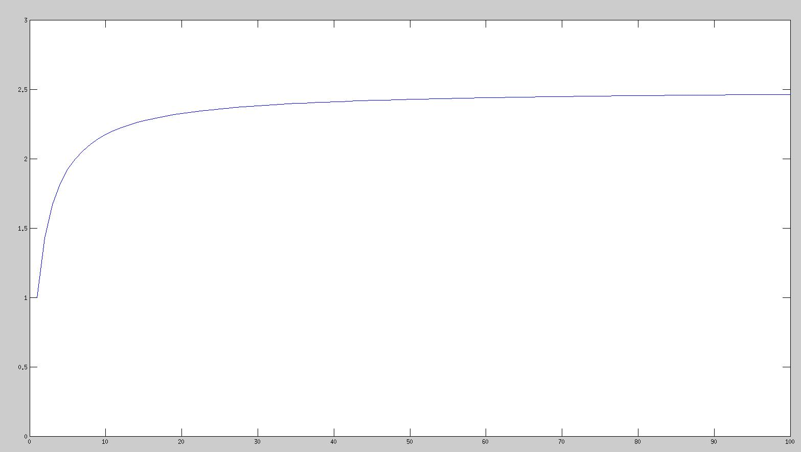
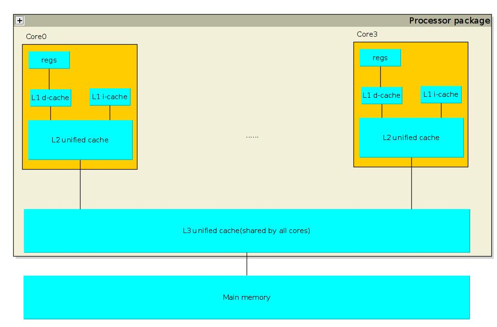

CSAPP 的各大章节与我之前读的书都多少有些覆盖，现在希望站在一个整体的局面再来温习一下对计算机系统的理解。

这本书的阅读时间肯定会比较长：
- 一是目前可支配的自由时间太少了
- 二是这本书本来就需要仔细研读
- 三是在读这本书的各大章节时，还要去回顾及校验以前做的一些读书笔记，看是否理解深入、是否需要修改

路漫漫其修远兮，吾将上下而求索……

<!--more-->

# 信息是由二进制位和上下文组成的
在计算机中，所有的信息都是由 0 和 1 这样的很多个二进制位组成的，8位组成一个字节。
至于一个字节或多个字节所表达的意义，则是由其语境而定的。
- 比如可以表示字符，数字，寄存器命令，地址等很多信息。

语境是由程序员来确定的，而语境到实际对应的二进制则是由编译器来完成的。
# 编译的流程
编译经过了以下4个步骤：
> 更为详细的解释，参看[编译与链接读书笔记](http://kcmetercec.top/2018/11/15/linker_load_chapter2/)。

- 预编译(Preprocessing)：将包含的头文件展开，替换宏定义，取消注释，最终生成 `.i` 结尾的文件
- 编译(Compilation)：将 `.i` 文件中的语言，编译为目标机的汇编语言，最终生成 `.s` 结尾的文件。
  - 不同的语言，不同的编译器，到了这一步都是一样的汇编语言。
- 汇编(Assembly)：将 `.s` 结尾的文件翻译为机器语言，并将内容打包为可以重定位的 `.o` 文件。
- 链接(Linking)：将可重定位文件中的外部引用符号与其定义建立地址链接，重新梳理为一个可执行文件。

# 计算机系统的硬件组成

## 总线
在计算机系统中，都是通过总线来连接各个组件的。总线的宽度，也就是一次传输的字节数，就被称为字长。
## I/O 设备
I/O设备是与挂载在I/O总线上的控制器或适配器连接的。
- 控制器（controller）： 一般是指芯片自带的，或者直接焊接在母板上的控制器。
  + 比如集成显卡
- 适配器（adapter）：一般是指安装母板上的接口槽的设备。
  + 比如独立显卡

## 存储器
存储器一般由许多 DRAM（dynamic random access memory）组成，其每个字节都具有独立地址，可以随机访问。
## 处理器
处理器通过 PC（program counter）寄存器的指定位置，从内存中读取指令进行处理，然后将PC指向下一个指令地址，如此循环往复。

其流程概览如下：
1. 载入（Load）： 从内存读取一字节或一个字长的指令或数据到内部寄存器
2. 存储（store）：将内部寄存器的一字节或一个字长覆盖到内存原来存储该数据的地址
3. 执行（Operate）：从内部寄存器取出两个内容到运算逻辑单元 ALU（arithmetic/logic unit）ALU 将对两个字进行操作，然后将操作的结果写回到一个寄存器，覆盖原来的存储位置。
4. 跳转（Jump）：将下一条指令的地址赋值给PC寄存器

## 内部缓存(cache)
CPU 要先将硬盘的代码载入内存中执行，而后 CPU 要通过内部寄存器与内存反复多次的交互。
但由于 CPU 的速度比内存快大约100倍，而内部寄存器容量太小（大约几百字节），这导致CPU很多时候都在等内存而浪费了很多时间。

为此，计算机学家发明了使用 SRAM（static random access memory）做成的内部缓存（Cache），这是典型的空间换时间策略，Cache包括：
- 一级缓存（L1）：其速度与内部寄存器接近，容量大约几万字节
- 二级缓存（L2）：其速度比 L1 慢 5 倍左右（但也比内存快 5~10 倍），容量大约十几万到数百万字节。

部分 CPU 还具有三级缓存（L3）。

这些存储器缓存以金字塔结构组成：

# 操作系统来管理计算机硬件系统
操作系统将I/O设备，内存，处理器以下图的方式进行抽象给应用程序：

- I/O 设备被抽象成了文件
- 内存和 I/O 设备被抽象成了虚拟内存
  + I/O 设备中的块设备数据在内核中都有缓存
- 处理器、内存和 I/O 设备被抽象成了进程
  + 进程是资源分配的基本单位，一个进程包含此 3 个基本资源

## 进程
每个进程在操作系统的调度下工作，每个进程都被认为独占系统资源，内核在通过切换进程上下文来达到切换不同进程运行的目的，从宏观上来看它们是并发运行的。
## 虚拟内存
虚拟内存使得进程以为自己独占整个内存，当应用程序运行时，其内存在 Linux 中分配如下图：

- 在meltdown漏洞出来后，每个进程的内核区映射仅有进行页表切换的代码了，内核有自己单独的页表。

## 文件
在 Linux 中所有的 I/O 操作都通过 VFS 虚拟为了文件操作，这使得编程简易。

# 网络使得不同的操作系统可以通信
遵从 TCP/IP 协议的操作系统都可以相互通信。
# 重要概念
## Amdahl's Law
[Gene Amdahl](https://en.wikipedia.org/wiki/Gene_Amdahl) 对于提高系统性能给出了一个定律：
>  When we spped up one part of a system, the effect on the overall system
>  performance depends on both how significant this part was and how much is speed up.

大意是：当我们提高系统中某个部分的性能时，对整个系统性能的影响取决于这部分对系统的重要性以及这部分的提升量有多大。

与之相关的公式为：

- T_old : 提升前系统运行代码所需要的时间
- T_new : 提升后系统运行代码所需要的时间
- α : 这部分占用总时间的比重
  + 也就是说原来这部分占用时间为 α * T_old , 提升后占用的时间为 α * T_old / k 
- k : 这部分的提速系数
- S : 整个系统提升系数

比如这部分消耗总时间的 60%，也就是α = 0.6，当此部分提升系数为 3，最终整个系统的提升系数约为1.67。
- 如果另外一部分提升系数也一样为 3 ，但由于其比重小，导致整个系统提升系数更小。
  + 所以做事要抓重点，明白什么更重要，什么最重要......

还有一点需要注意的是，假设k的值为无穷大，当此部分占用系统 60% 资源时，**其整个系统的提升系数最多为2.5。**
也就是说，并不代表K越大就越好，需要考虑投入与回报比。

为了直观的展示此函数的曲线，我们用 matlab进行绘制如下图（α=0.6）:

可以看出，只有前面的线性增长区才是投入与回报成正比。
## Concurrency and Parallelism
计算机的发展一直都存在以下两个需求：
1. concurrency : 多重的，并发的处理能力
2. parallelism : 并行，使得处理速度尽量的快

根据以上两个需求将硬件系统分为3个等级，分别由高到低。
### Thread-Level Concurrency
并发是宏观上的同时运行任务，并行是真实的同时进行，并行属于并发。

最开始的计算机都是都是由单核处理器通过分时复用来达到宏观上的同时处理任务的能力，这种系统称为单机系统（uniprocessor system）。

后来出现了可以同时处理多个任务的多处理系统（multiprocessor），这其中包括多核（multi-core）和超线程（hyperthreading）。
- 多核使得系统可以同时处理多个进程/线程。
- 而超线程使得一个核心上可以交替的运行两个线程，进一步提高了核心的利用率。

多核是指在一个单芯片上集成了多个核心，它们具有独立的缓存，也有共用的外部缓存和内存，如下图。

而超线程指的是在一个核心的基础上，其内部有多个寄存器的拷贝（比如有多个PC计数器，寄存器等），这样使得单核可以切换多组寄存器来运行不同的线程。
### Instruction-Level Parallelism
现在计算机可以在一个时钟周期执行多条指令，这是在指令执行的维度来提高处理速度。
### single-instruction,Multiple-Data(SIMD) Parallelism
处理器提供硬件支持单个指令可以同时处理多个数据，这样也可以提高处理速度。
## The importance of acstractions in computer systems
在计算机学科中，需要学会以抽象的方式体现系统的一部分或整体架构，这既能理解其中的概念，还能隐藏其中复杂的细节。