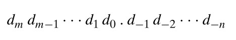
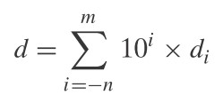
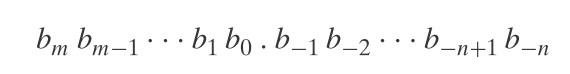
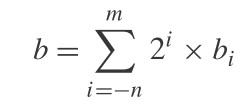
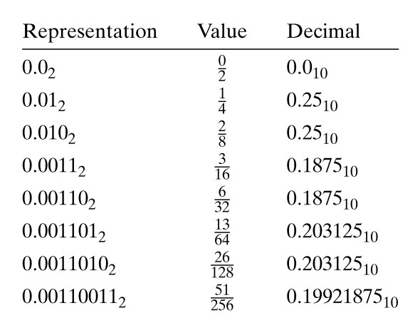
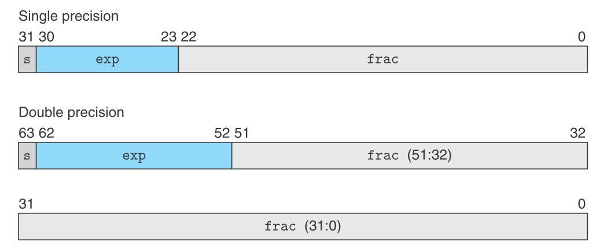
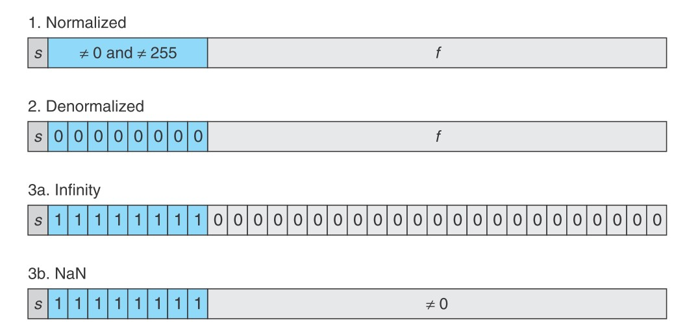
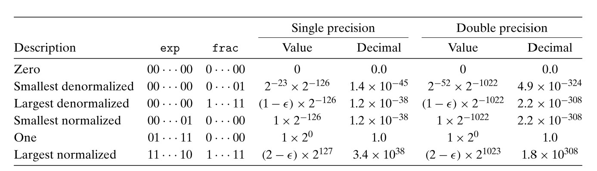

理解浮点数的表示。

<!--more-->

# 二进制小数

10 进制的小数表示为：



对应的公式为：



也就是说，最终十进制小数的值等于各位数于 10 的幂的乘积的和。

比如十进制小数 12.34，以公式来计算即为：

> 1 * 10<sup>1</sup> + 2 * 10<sup>0</sup> + 3 * 10<sup>-1</sup> + 4 * 10<sup>-2</sup> = 10 + 2 + 3/10 + 4/100

可以发现：将小数点向左移，就是将数除以 10，将小数点向右移，就是将数乘以 10


那么同样的，如果以二进制的方式来表示小数，就是：



那么对应的公式就一目了然了：



可以看到，公式相比 10 进制，仅仅是把底数由 10 换为 2 即可。

那么二进制小数 101.11，以公式来计算即为：

> 1 * 2<sup>2</sup> + 0 * 2<sup>1</sup> + 1 * 2<sup>0</sup> + 1 * 2<sup>-1</sup> + 1 * 2<sup>-2</sup> = 4 + 0 + 1 + 1/2 + 1/4

可以发现：将小数点向左移，就是将数除以 2，将小数点向右移，就是将数乘以 2

虽然说二进制表示法与 10 进制表示法有很多相似之处，但是有两点需要特别注意：

1. 计算机只有有限的空间表示小数，所以对于小数很长或无限小数都只能取近似值
2. 小数部分只能是 2 的负幂次相加，所以很多 10 进制能表示的小数，二进制只能近似的表示

对于第二点，比如 1/5 用 10 进制小数表示就是 0.2，但是用二进制小数表述只能用 1/8，1/16，1/32……这种方式来使用尽量多的位数接近 1/5：



# IEEE 规定的浮点数标准

如果以上面的二进制方式表示一个数的话。

那么`5 * 2<sup>100</sup>`将会是以 101 开头，然后后面跟 100 个零，这显然是不现实的。

而如果以科学计数法的方式来表达数，就可以表示很大或很小的数，IEEE 规定的公式如下：

<center>V = (-1)<sup>s</sup> x M x 2<sup>E</sup></center>

- `s`代表符号位，当`s`为 1 时，此浮点数为负数；为 0 时，浮点数为正数。
- `M`代表底数
- `E`代表**有符号指数**


浮点数格式如下图所示：



- 单精度浮点数，由 1 位符号位，8 位指数位，23 位底数位组成
- 双精度浮点数，由 1 位符号位，11 位指数位，52 位底数位组成

而浮点数真正在表示上有以下 4 种情况：



## 规范化的值

所谓的规范化，指的是指数位不为全 0 或全 1。

指数位是以无符号数来存储的，而真实的指数值是该值减去一个偏移值，偏移值为 2<sup>k-1</sup> - 1。

 对于单精度浮点数，偏移值就是 127。而双精度的偏移值就是 1023。

那么就可以得出，在规范化值的情况下：

- 对于单精度，可表示的指数范围是 -126 ~ +127
- 对于双精度，可表示的指数范围是 -1022 ~ +1023

> 设置偏移值的目的在于，将指数位也设定为无符号整型。这样对于浮点数的排序，可以将整个浮点数在二进制层面上看做无符号整型。这样就可以使用整数排序来排序浮点数以提高排序效率。

而对于底数，按照科学计数法来讲，底数的值应该是 `1<= M < 2`。

以二进制表示就是 1.f<sub>n-1</sub>...f<sub>1</sub>f<sub>0</sub>

可以看出来，最高那位永远为 1，所以在实际存储时，就将该位省略了，还可以提高 1 个二进制位的精度。

也就说，真是的底数 `M = 1 + f`。

## 非规范化的值

非规范化的值，是指其指数位全为 0 。

这种情况下：

- 指数位就是 `1 - 偏移值`（单精度就是 -126，双精度就是 -1022，以表示一个非常小的指数。）
- 底数 M = f，也就是说没有附加的那个 1 了

这种表示方式，可以：

1. 表示数值 0，当底数为全为 0 时，最终的值就是 0（当符号位为 0 时，就是 +0.0，反之则为 -0.0）。
2. 表示一个非常接近 0 的值，应该指数位是极端的小，所以它是非常接近 0 的数。

之所以指数位是以`1 - 偏移值`表示，是为了能够很好的将非规范化的值和规范化的很好的结合在一起。使用这种表示方式，最大的非规范化的值和最小的规范化的值在指数位上就一模一样了。唯一的差别就是规范化的值有一个默认的 1 来补偿。

> 这就相当于非规范化值的底数位小数增长到最大后，再加 1就产生了进位，这个进位就默认附加在了规范化的底数中。如此一来就可以无缝衔接了。


## 无限大和不是一个数

当指数位全为 1 ，并且底数为全为 0 时，代表该值为无穷大。

> 当符号位为 0 时，表示正无穷，反之表示负无穷。

当指数位全为 1，并且底数不全为 0 时，代表这是个无效的数（NaN，not a number）

> 比如求 根号下负1的值，实际上需要用虚数来表示，而浮点数无法表示，则表示这不是一个数。

## 范围

基于以上认识，可以列出单精度和双精度可表示的非负数数值范围（负数同理）：



# 舍入

由于浮点数可表示的范围及精度有限，所以它实际上只能近似的表示实数。


舍入有以下 4 中方法：

1. 取最接近的值：当最后一位小于 5 时舍去，大于 5 时舍去 5 且进 1。当等于 5 时，其前一位为奇数，则舍 5 进 1，否则直接舍去 5。

   > 比如 1.4 得到 1，1.6 得到 2，1.5 和 2.5 均得到 2（为了让前一位保持偶数）

2. 向零舍入：当数值为正数时，向下舍入；当数值为负数时，向上舍入。

   > 比如 1.4 和 1.6 都得到 1，-1.5 得到 -1

3. 向下舍入：无论数值为多少，都向下舍入。

   > 比如 1.4 和 1.6 都得到 1，-1.5 得到 -2

4. 向上舍入：无论数值为多少，都向上舍入

   > 比如 1.4 和 1.6 都得到 2，-1.5 得到 -1

# 浮点数的操作

浮点数的操作在大部分情况下都是符合实数操作规律的。

> 比如 1/(-0) 结果为负无穷，1/(+0)结果为正无穷

但需要注意的是，浮点数运算过程中也 要使用舍入，所以有些情况下得到的结果并不符合预期。

> 比如，对于单精度浮点： 3.14f + 1e10f - 1e10f 结果为 0，而  3.14f + (1e10f - 1e10f) 结果为 3.14
>
> 因为前面的方式先是 3.14+1e10f，而 3.14 就被舍去了。

还需要注意浮点数的溢出问题。

> 比如，对于单精度浮点：(1e20x1e20)x1e-20 结果是真无穷，而  1e20x(1e20x1e-20) 的结果就是 1e20

在实际编码过程中，需要注意以上两种极端情况。

# C 语言中的浮点数

c 标准使用 `float`和`double`来分别表示单双精度浮点数，但是并没有规定 -0，正无穷、负无穷、NaN 该如何定义。

在 gcc 中，在 `math.h`头文件之前定义宏`_GNU_SOURCE 1`便可以使用：

- `INFINITY`来表示正无穷
- `NAN`表示 NaN

```c
#define _GNU_SOURCE 1
#include <math.h>
```

当 `int`、`float`、`double`之间的转换规则如下：

- 当`int`转换为`float`时，`int`的值有可能会被舍入

- 当`int`或`float`转换为`double`时，精度能保证，因为`double`的范围比前两者广

- 当`double`转为`float`时，有可能得到正/负无穷，或者是值被舍入

- 当`float`或`double`转换为`int`时，会向 0 舍入。

  > 如果浮点数的值过大，它就会产生一个非预期的值。

