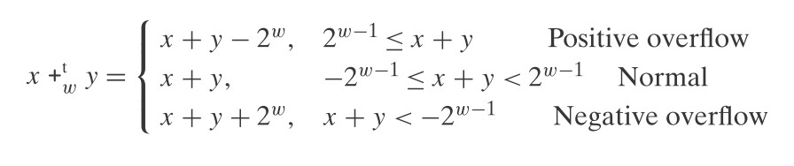

理解整型的运算。

<!--more-->

# 无符号整型相加

无符号整型相加的公式如下：

- 当两个无符号整型相加的结果小于 2w 时，其结果就是`x+y`的值

- 当两个无符号整型相加的结果大于或等于 2w 时，其结果就是二者之和减去 2w

  > 为了保存溢出的相加结果，需要进一位，而这最高一位会被截取。

基于以上的公式，如果求和的结果 s 发生了溢出，那么 s = x + y - 2w。

又由于 y 一定是小于 2w 的，所以如果发生了溢出那么**必然满足 s < x**。

**所以，我们可以看求和的结果是否小于 x，以判断它是否发生了溢出。**

# 无符号整型的负数

无符号整型的负数公式如下：

- 当 x 的值为 0 时，对 x 求负数也是 0

- 当 x 的值大于 0 时，对 x 求负数的结果是 2w - x

  > 比较好的理解是 -x，就一定是负数，然后需要转换为正数，那么就使用公式 -x + 2w 来转换为无符号整数

# 有符号整型的相加

有符号整型的相加需要考虑其上溢出和下溢出，其公式为：

- 当 x + y >= 2w-1 时，出现上溢，结果为 x + y - 2w
- 当 x + y >= -2w-1 并且 x + y < 2w-1 时，不会出现溢出，值为 x + y
- 当 x + y < -2w-1 时，出现下溢，结果为 x + y + 2w

当有符号整型相加发生溢出时：

- 上溢：x >= 0 并且 y >= 0 并且求和结果 s < 0
- 下溢：x < 0 并且 y < 0 并且求和结果 s >= 0

# 有符号整型的负数

有符号整型负数的公式如下：

- 当 x 为 TMin 时，其取反依然是 TMin

  > TMin 为 -2w - 1，而对其取反就相当于 0 - (-2w-1)，那么就是 0 + 2w-1
  >
  > 这样就满足 x + y >= 2w-1 的条件，出现上溢，结果为 x + y - 2w
  >
  > 所以最终结果就是 -2w - 1 即为 TMin

- 当 x 大于 TMin 时，取反即可

在二进制层面上，对有符号整型求负数可以使用**按位取反再加 1**的方式快速求得。

# 无符号整型相乘

一个无符号整型的取值范围是 [0, 2w - 1]，而如果两个无符号整型相乘时，取值范围就是 [0, (2w -1)2]。

c 规定最终只保留 w 位的数据，相当于对 2w 求模：

# 有符号整型相乘

一个有符号整型的取值范围是 [-2w-1, 2w-1 - 1]，而如果两个有符号整型相乘时，取值范围就是[-2w-1\*(2w-1 - 1), (-2w-1)\*(-2w-1)]。

c 规定最终只保留 w 位的数据，也就是对 2w求模后再进行一个无符号到有符号的转换：

# 与常量相乘

由于乘法操作相比较加、减、位操作所消耗的机器周期要多好几倍，编译器常用的优化策略是将乘法操作分解为移位和加法操作。

比如将数 x 左移  k 位，就相当于 x * 2k。

比如多个移位的组合， x * 14 就等同于 x * (23 + 22 + 21)，那么就可以转换为： (x<<3) + (x<<2) + (x<<1)。

> 也可以将 14 转为 24 - 21，最终就是 (x<<4) - (x<<1)

# 与 2 的幂相除

整数的除法操作比乘法操作消耗更多的机器周期，如果一个整数与 2 的幂相除，那么就可以使用右移来完成除法运算（当然，这很有可能会损失精度）。

> 无符号整型的右移就是逻辑右移，而有符号整型的右移是算术右移。

对于进行除法的结果，有以下规律：

- 如果 x>=0,y>0 则 x/y 的结果是向下取整。（比如 3/2 = 1.5 ，如果使用移位最终结果是 1）
- 如果 x<0,y>0 则 x/y 的结果是向上取整。（比如 -3/2=-1.5，如果使用移位最终结果是 -2)

x<0,y>0 的右移结果很多时候不是我们所期望的结果，这个时候可以使用下面的方式来避免该结果：

>  (x<0 ? x+(1<<k)-1 : x) >> k
>
> 将 x 除以 2k，也就相当于将 x >> k 位。
>
> 当 x < 0 时，需要首先为 x 增加一个偏移值，以补偿向上取整所带来的结果。

