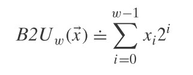
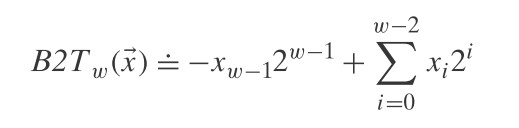
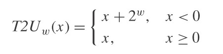
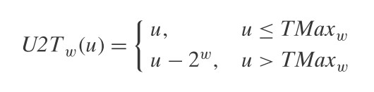

理解整型的表示。

<!--more-->

# 无符号整型编码
无符号整型可以使用的函数 B2U<sub>w</sub>(binary to unsigned, length w)来表示：


- w 代表整数一共有 w 位
- x<sub>i</sub> 分别代表每一位的索引
- 可表示的范围为 0 ～ 2<sup>w</sup> - 1

所以上面的意思就是说，无符号整数可以通过每一位的值乘以一个 2 的 n 次方总和来表示。
- 任何一个非负整数都可以表示为 2 的 n 次方的和，这让我想到了 linux kernel 中的 buddy 算法。
> B2U4([0111]) = 0\*2<sup>3</sup> + 1\*2<sup>2</sup> + 1\*2<sup>1</sup> + 1\*2<sup>0</sup> = 0 + 4 + 2 + 1 = 7

# 补码编码
有符号整型的编码方式为 B2T<sub>w</sub>（binary to two's complement length w），其公式为:


- 可表示的范围为 -2<sup>w-1</sup> ～ 2<sup>w-1</sup> - 1

代表符号位的负数，再加上其他位的2的n次方总和:
> B2T4(1011) = -1 * 2<sup>3</sup> + 0 * 2<sup>2</sup> + 1 * 2<sup>1</sup> + 1 * 2<sup>0</sup> = -8 + 0 + 2 + 1 = -5 

# c中无符号与有符号之间的转换
这里的转换指的是：
1. 显示强制转换：`u16_val = (uint16_t)i16_val`
2. 隐式转换：`u16_val = i16_val`

**有符号到无符号的隐式转换需要特别注意，因为直觉上的负号被隐式转换为无符号数后值就很大，这在一些比较判断中就会有漏洞。**
> 一个比较好的习惯是：在比较判断中，尽量使用有符号整型。

## 位数相同
当二者位数一致时，那么其在内存中二进制是一样的，只是解释形式不一致罢了
> 比如 16 位有符号数 -12345，转换为 16 位无符号数，实际上二进制一样，以无符号解释就是 53191

相同位数的有符号整型转换为无符号整型的公式如下：


也就是说：
- 当有符号整型为负号时，将其加上 2<sup>w</sup> 即为无符号整型的值
- 当有符号整型为非负数时，其值就为无符号整型值

相同位数的无符号整型转为有符号整型的公式如下：



也就是说：

- 当无符号整型值小于或等于有符号最大值时，其值就是有符号整型值
- 当无符号整型值大于有符号最大值时，其值减去2<sup>w</sup>即为有符号整型值

c中的数值都默认为是有符号整数，当数值后加 `u` 或 `U` 才指定为无符号整数

需要注意的是：**当有符号常量与无符号常量进行比较/运算时，有符号数会先以无符号解释再来进行比较**
``` c
#include <stdio.h>
#include <stdint.h>

int main(char argc, char**argv){
    if(-1 < 1u){
      printf("-1 < 1\n");
    }else{
      printf("-1 > 1\n");//最终会走这条路径!
    }
  return 0;
}
```
## 位数不同
- 当被赋值的位数小于数据时，会做二进制截断
  + 当无符号数截断到无符号数时，就是做求余数操作
  + 当无符号数截断到有符号数时，先做求余操作到无符号，再转换到有符号
  + 当有符号数截断到有符号或无符号时，先将有符号转为无符号再进行前两步操作
> 上面说这么多，其实都是为了保证尽量少的损失 2 进制位，然后再进行相应的有符号和无符号转换

- 当被赋值的位数大于数据时，会**先做二进制扩展，再赋值**
  + 非负数直接增加 0 即可
  + 负数则按照增加 1 的方式扩展
  + 非负数赋值给负数，得到的值不变。负数赋值给非负数，会将负数按照非负数位数转换后再赋值。