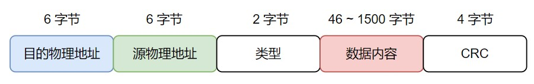
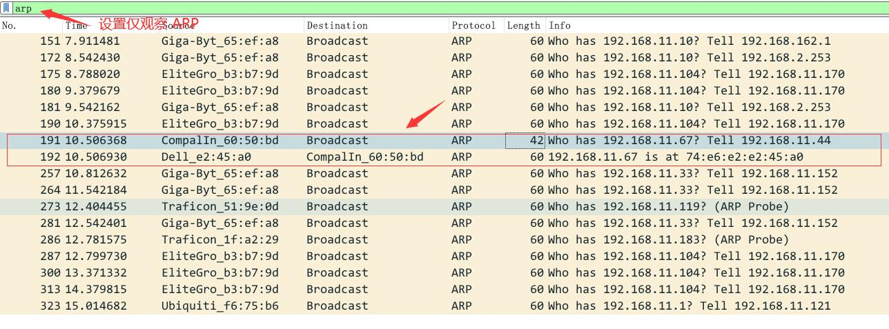
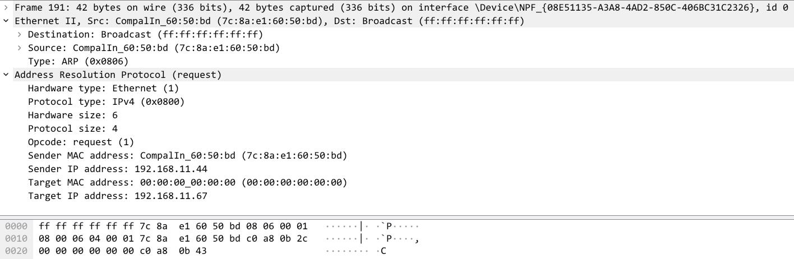
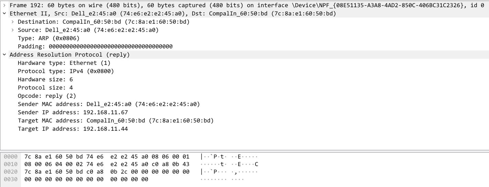

ARP 协议（处于数据链路层）的工作原理是：
1. 当前主机以广播的形式发送 ARP 请求，请求包中包含目标机器的 ip 地址
2. 目标机收到请求后，会返回 ARP 应答，应答包中包含目标机器的 MAC 地址

<!--more-->

# ARP 报文格式


- 硬件类型：定义物理地址的类型，1 表示 MAC 地址
- 协议类型：要映射的协议地址类型， 0x800 表示 IP 地址
- 硬件和协议地址长度：分别表示后面发送的物理地址和 IP 地址长度，单位为字节
  + 对于 MAC 地址来说就是 6 字节，对 IPv4 来说就是 4 字节
- 操作：指出 ARP 类报文类型
  + ARP 请求：1
  + ARP 应答：2
  + RARP 请求：3
  + RARP 应答：4
- 发送端及接收端的物理地址和 IP 地址：对于最开始 ARP 请求来说，主机并不知道目标机的物理地址
  + 目标机在匹配 IP 地址与自己相符后，会将自己的物理地址填充到 ARP 应答包后返回

ARP 包的长度为 28 字节，这对于数据链路层来说是属于数据部分。
- 有时候会要求该部分最小为 46 字节，所以会增加填充字节（填充内容为 0）。

该 ARP 包最终还需要封装为以太网帧才可以发送，以太网帧格式如下：



- 类型：表示数据的[类型](https://en.wikipedia.org/wiki/EtherType)，以便于接收方分包。
  + 0x800 代表数据报为 IP
  + 0x806 代表数据报为 ARP

那么假设 ARP 包填充到 46 字节，那么最终以太网帧长度就是 64 字节。

# ARP 的缓存

ARP 维护了一个缓存来保存最近访问的机器 IP 地址和物理地址的映射关系（cache 真是个提高效率的好东西）。

ARP 常用命令如下：
- `arp -a` : 查看缓存的映射关系
- `arp -d <ip>` : 删除对应 ip 的缓存项
- `arp -s <ip> <mac>` : 添加 ip 和物理地址映射关系

# 查看 ARP 通信过程
通过观察主机（192.168.11.44）访问 Linux 目标机（192.168.11.67）来查看 ARP 通信过程。

## 删除缓存

首先要删除其 ARP 缓存，不然无法抓取到 ARP 请求报文：
``` shell
  sudo arp -d 192.168.11.67
```

## 抓包

在主机使用`ping`命令，即可触发 ARP：
```shell
ping 192.168.11.67
```

如下所示：

可以看到，wireshark 已经抓到了主机发送的 ARP 请求，已经目标机的 ARP 返回。

## ARP 请求


从捕获的信息可以看出：
1. ARP 请求就是 28 字节的内容加上以太网帧一共 46 字节（图中显示的 42 字节是没有计算 CRC 的长度），也就是说 ARP 请求没有填充多余的数据
2. 由于请求并不知道目的端的物理地址，所以在以太网帧中填充`ff`，而在 ARP 帧中填充 `00`
3. 由于数据类型是 ARP，所以以太网帧中的类型值就是 0x0806
4. 对于 ARP 帧的解析 wireshark 已经分离了各个部分并做了详细的说明

## ARP 应答


从捕获的信息可以看出：
1. ARP 应答以太网帧返回长度是 64 字节，也就是说 ARP 应答的内容是填充到了 46 字节。
2. 由于这是应答，所以此时的目的和源的内容就做了一次对调，应答机填充了自己的 MAC 地址
3. 同时在 ARP 包中的操作字段值为 2，也表示这是一个 ARP 应答