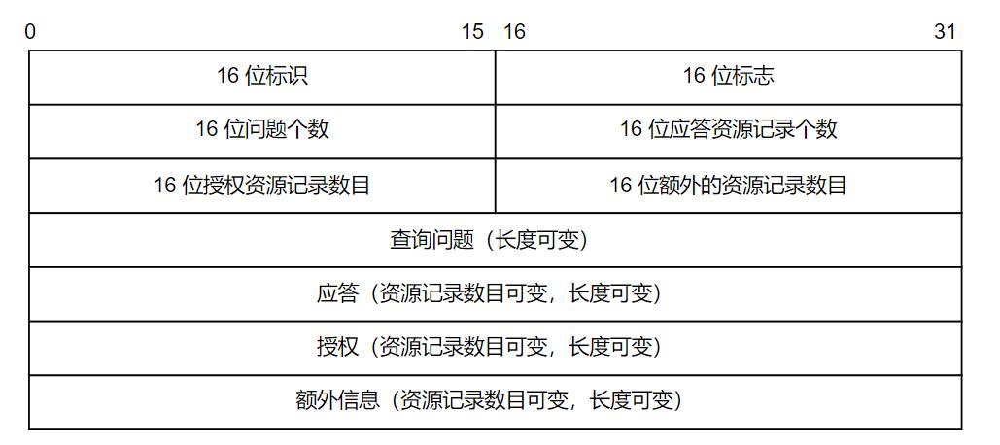
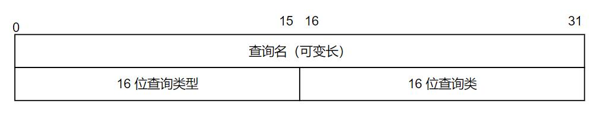
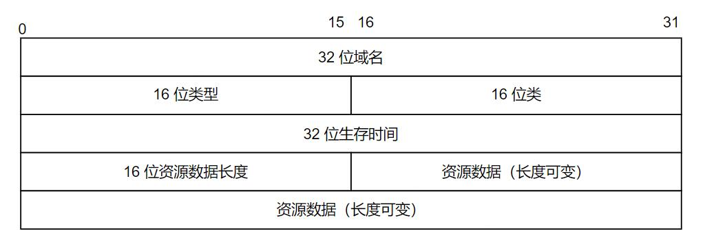

DNS 服务器是多个按层级分布的服务器系统，每个服务器负责对应的域名到 IP 地址的映射关系。

<!--more-->

# DNS报文格式


- 16 位标识：标记一对 DNS 查询和应答，以区分 DNS 应答所对应的是哪个 DNS 查询
- 16 位标志：协商具体的通信方式和反馈通信状态，16 位依次是
  + QR（1 位）：0 表示是查询报文，1 表示是应答报文
  + opcode（4 位）：查询和应答的类型，0 表示标准查询，1 表示反向查询（从 IP 反推出域名），2 表示请求服务器状态
  + AA（1 位）：授权应答，仅用于应答报文，1 表示域名服务器是授权服务器
  + TC（1 位）：截断标志，仅用于 DNS 报文使用 UDP 服务时使用，1 表示 DNS 报文超过 512 字节并被截断
  + RD（1 位）：递归查询标志，1 表示递归查询，DNS 服务器向其它 DNS 服务器查询，直到找到结果并返回给客户端。0 表示迭代查询，目标 DNS 无法解析某个主机名，则将它自己知道的其他 DNS 服务器的 IP 地址返回给客户端
  + RA（1 位）：允许递归标志，仅用于应答报文，1 表示 DNS 服务器支持递归查询
  + zero（3 位）：保留，设置为 0
  + rcode（4 位）：应答状态，0 表示无错误，3 表示域名不存在
- 接下来的 4 个字段分别表示最后 4 个字段的长度，这些长度很据查询报文和应答报文都不一样

查询报文包含 1 个查询问题，而应答、授权、额外信息为 0。


- 查询名是以一定格式封装的要查询的主机域名
- 查询类型表示如何执行查询操作：
  + 类型 A ：值为 1，表示获取目标主机的 IP 地址
  + 类型 CNAME：值为 5，表示获取目标主机的别名
  + 类型 PTR：值为 12，表示反向查询
- 查询类值为 1，表示获取 IP 地址

应答报文资源个数至少为 1，而授权、额外资源个数可以为 0，应答、授权字段和额外信息字段都使用资源记录（Resource Record，RR）格式。

资源记录格式如下：


- 32 位域名：资源的名字，和查询报文中的名字一样
- 16 位类型和类：与查询报文中的字段一样
- 32 位生存时间：该查询记录结果可被本地客户端缓存多长时间，单位为秒
- 16 为资源数据长度和资源数据：内容与字段有关，对于类型 A，资源数据就是 IPv4 地址，长度就为 4（以字节为单位）

# linux 中的 DNS 配置
linux 使用 `/etc/resolv.conf` 文件存放 DNS 服务器 IP 地址，可以使用 `systemd-resolve --status` 命令查看当前正在使用的 DNS 服务器地址。

``` shell
  #使用以下命令查询域名对应的 IP 地址
  host -t A <url>
```

# 查看 DNS 报文

查看 DNS 报文，还是使用最简单的`ping`工具来完成：
```shell
ping www.baidu.com
```
Wireshark 只观察 DNS 包即可：


## DNS 请求

可以看到一共抓到了 3 次 DNS 请求，下面依次来分析每次有何不同。

### 第一次请求


结合 16 进制结果以及 Wireshark 的说明来分析：
1. 以太网帧的类型值是 0x86dd，也就是说其打包的上层协议是 IPv6
2. 既然是 IPv6，那么其源和目的 IP 地址就是 16 进制格式的地址，且其打包的上层协议是 UDP（17）
3. UDP 中指出目标的端口就是 53，这也是 DNS 服务所使用的端口
4. DNS 协议拆分如下
  + 16 位标识是 0x2508
  + 16 位标志是 0x100，也就是第 8 位为 1，代表要进行递归查询
  + 16 位问题个数为 1，而应答、授权、额外信息为 0
  + 其问题的内容就是 `www.baidu.com`
  + 查询的类型为 A（1），代表要获取域名对应的 IPv4 地址
  + 查询的类值为 1，代表是 IP 地址

### 第二次请求


第二次请求与第一次请求不同之处在于：
1. 16 位标识是 0x1780
2. 查询的类型为 AAAA（28），也就是 IPv6 地址

### 第三次请求


第三次请求相比较前两次不同之处在于：
1. DNS 16 位标识值是 0x2508
2. 以太网帧的类型值是 0x800，也就是说其打包的上层协议是 IPv4，所以其目的及源地址都是 IPv4 格式

## DNS 返回

有了 3 次请求，也就有了 3 次返回。

### 第一次返回


结合 16 进制结果以及 Wireshark 的说明来分析：
1. 以太网帧的类型值是 0x800，也就是说其打包的上层协议是 IPv4
2. 而 IPv4 的内容正好对应第三次请求的目的地址和源地址，只是方向对调了一下
3. 对 DNS 应答拆分如下：
  + 16 位标识值是 0x2508，也就对应了第三次请求
  + 16 位标志值是 0x8180，代表了这是个应答
  + 16 位应答资源个数为 3，那就是说有 3 个回答
  + 第一个回答的内容是`www.baidu.com`，且其类型为 CNAME（5），代表该回答是个别名。其生存时间是 21 秒。 资源内容（CNAME 的值）是`www.a.shifen.com`
  + 第二个回答的内容是`www.a.shifen.com`，且其类型为 A（1），代表值为 IP 地址`39.156.66.18`
  + 第三个回答的内容是`www.a.shifen.com`，且其类型为 A（1），代表值为 IP 地址`39.156.66.14`

### 第二次返回


第二次返回与第一次返回不同的是：
1. 以太网帧的类型值是 0x86dd，也就是说其打包的上层协议是 IPv6，IPv6 中的地址也是以 IPv6 的格式来表示了
2. UDP 的 16 位标识是 0x1780，也就对应第二次请求
3. 返回的 DNS 中包含 2 个资源回答，1 个授权回答
  + 第一个回答`www.baidu.com`，是 CNAME 类型，其内容是`www.a.shifen.com`
  + 第二个回答`www.a.shifen.com`，也是 CNAME 类型，其内容是`www.wshifen.com`

### 第三次返回


第三次返回与前两次不同的是：
1. 以太网帧的类型值是 0x86dd，也就是说其打包的上层协议是 IPv6，IPv6 中的地址也是以 IPv6 的格式来表示了
2. 此次 DNS 应答中也有 3 次资源应答，前两次都是 CNAME，第三次对`www.wshifen.com`的内容给出了对应的地址`103.235.46.39`