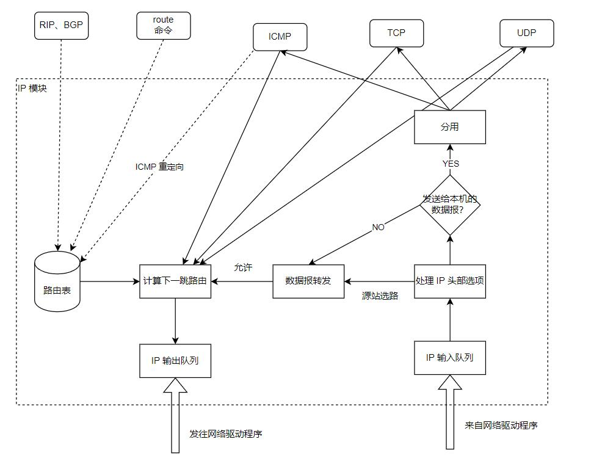

在阅读 <<图解TCPIP>> 时，只简单提了一下 ip，现在将它们加深一下理解。

<!--more-->

# IP 服务的特点
IP 协议的特点是：
1. 无状态（stateless）：IP 数据报的发送、传输和接收都是相互独立的，没有上下文关系。
  - 也就是说接收端无法识别 IP 数据报的先后顺序，也无法区分是否接收到了重复的数据报，这些数据报交由上层协议处理（IP 报中的标识是用于分片和重组，无法区分多个完整数据报的先后顺序）
2. 无连接（connectionless）：每次发送数据报都必须明确指定对方的 IP 地址
3. 不可靠：IP 协议不能保证 IP 数据报准确地到达接收端，这需要上层协议来处理
# 回顾 IPv4 头部


需要留意的是：
- 在 TOS 中的 4 位服务质量字段中，最多有 1 位能置 1
  + 像 ssh,telnet 这种服务就选最小延时，对 ftp 这样的服务就选最大吞吐量
- 同一个数据报的分片标识值都一样，不同的数据报标识值不同
- 3 位标志字段中，如果设置了“禁止分片”。如果 IP 数据报超过 MTU,则此包将会被丢弃并返回一个 ICMP 差错报文
  + 对于第 3 位，除了数据报最后一个分片外，其他分片都要把它置一
- 13 位分片偏移是数据部分的偏移，并且该值表示的是 8 的整数倍，也就是说 **除了最后一个 IP 分片外，其他分片数据长度必须是 8 的整数倍**
- 最后的可选字段可以作为：
  - 记录路由（record route）：将数据报途径的路由器的 IP 地址填入可选字段，跟踪数据传递路径
  - 时间戳（timestamp）：路由器将数据报被转发的时间填入可选字段，测量数据传输时间
  - 松散源路由选择（loose source routing）：指定路由器 IP 地址列表，数据报发送必须警告所有路由器
  - 严格源路由选择（stric source routing）：指定路由器 IP 地址列表，数据报发送**只能**经过所选路由
## 观察 IPv4 头部
通过 `telnet` 来访问本地的 `telnet` 服务观察 IP 头部：
``` shell
  # 抓取本地回路上的数据包
  sudo tcpdump -ntx -i lo
  # 登录本机
  telnet 127.0.0.1
```
第一个数据包如下：
``` shell
  IP 127.0.0.1.35918 > 127.0.0.1.23: Flags [S], seq 867943451, win 65495, options [mss 65495,sackOK,TS val 4238191006 ecr 0,nop,wscale 7], length 0
    0x0000:  4510 003c 6c90 4000 4006 d019 7f00 0001
    0x0010:  7f00 0001 8c4e 0017 33bb c41b 0000 0000
    0x0020:  a002 ffd7 fe30 0000 0204 ffd7 0402 080a
    0x0030:  fc9d a99e 0000 0000 0103 0307
```
IP 数据内容的前 20 字节就是 IP 头部：
- 版本： 4,代表是 IPv4
- 首部长度：5,代表 5 × 4 = 20 字节
- 服务类型：0x10, 代表最低延迟（由高位到低位方向）
- 总长度：0x003c，60 字节
- 标识：0x6c90
- 标记：0b010，第二位置一，代表不能分片（当前数据包内容很少，即使加上数据链路层的数据也完全不用分包）
- 分片偏移：0
- 生存时间：0x40，64
- 协议：0x06，TCP
- 检验和：0xd019
- 源地址：0x7f000001, 127.0.0.1
- 目的地址：0x7f000001,127.0.0.1
# IP 分包
当 IP 数据包超过帧 MTU 时，可能会被发送端或中转路由器分片，最终被接收端内核的 IP 模块重组。

IP 的分片和重组主要依靠：标识、标志和片偏移完成。
- 同一个数据报的 IP 头部具有相同的标识值，不同的片偏移。除了最后一个分片外，其他分片标志都是可分片。

对于以太网而言，MTU 是 1500 字节，那么除开 IP 头部以外（20 字节），IP 数据内容最多是 1480 字节。
所以当数据包超过 1480 字节时，IP 数据报就应该分片。
- 实际上在 IP 中的数据包还包括了 TCP 的头部，所以实际上真正的用户数据比这个还要少
## 抓取分包
以使用 ping 一个本地地址来查看 IP 分包细节：
```shell
  # 只抓取 icmp 报文，因为 ping 这个命令就是使用 icmp 完成的
  sudo tcpdump -ntv -i enp0s3 icmp
  # 指定发送数据数是 1473 字节，而 icmp 回显和应答头长度是 8 字节，所以刚好是 1501 字节
  ping www.baidu.com -s 1473
```
可以看到抓取的内容：
``` shell
  IP (tos 0x0, ttl 64, id 33961, offset 0, flags [+], proto ICMP (1), length 1500)
      192.168.0.253 > 14.215.177.39: ICMP echo request, id 25282, seq 1, length 1480
  IP (tos 0x0, ttl 64, id 33961, offset 1480, flags [none], proto ICMP (1), length 21)
      192.168.0.253 > 14.215.177.39: ip-proto-1
```
- 两个 IP 分片的 ID 是一样的
- 片内偏移一个是0,一个是 1480，因为除去 20 字节的头部，那么剩下的数据部分就是 1480 字节
- 第一个标记是分片，第二个代表这是最后一个分片
- 由于数据长度总共是 1451,第一分片内容是 1480,那么第二个就是21字节
  + 可见第二个 IP 包的数据部分并不包含 ICMP 头部信息，因为在目标机上将它们拼接即可。

# IP 路由
## IP 模块的工作流程


数据链路层在 Linux 中位于网络驱动部分，当接收到数据包时，数据链路层从中提取出网络层并发送给 IP 模块。

IP 在对网络层数据校验无误后，就分析其头部信息。

如果该 IP 数据报头部设置了源站选路选项，IP 模块便调用数据报转发子模块。

如果该 IP 数据报的头部中目标 IP 地址是本机 IP 地址或广播地址，IP 模块就根据数据报头部的协议字段派发给对应的传输层。
如果与本机 IP 地址不一样也不是广播地址，则也调用数据报转发子模块。

数据报转发子模块将首先检测系统是否允许转发，不允许就丢弃数据报，允许就将数据转发给 IP 数据报输出子模块。

IP 模块实现数据报路由的核心数据结构是路由表，同一类型的 IP 数据报将被发往相同的下一跳路由器。

IP 输出队列中存放所有等待发送的 IP 数据报，除了要转发的 IP 数据报外，还有上层数据的 IP 数据报。

路由协议和 route 命令来更新路由表。
## 路由机制
执行 `route` 命令即可查看本机的路由表：
``` shell
  cec@box:~$ route
  Kernel IP routing table
  Destination     Gateway         Genmask         Flags Metric Ref    Use Iface
  # 下一跳的目标是网关，也就是路由器
  default         _gateway        0.0.0.0         UG    100    0        0 enp0s3
  # 本机
  link-local      0.0.0.0         255.255.0.0     U     1000   0        0 enp0s3
  # 本地局域网（C 类 IP 地址），数据报不需要中转
  192.168.0.0     0.0.0.0         255.255.255.0   U     100    0        0 enp0s3
```
- Destination：目标网络或主机
- Gateway：网关地址
- Genmask：网络掩码
- Flags：路由标志
  + U：该路由项是活动的
  + H：该路由项的目标是一台主机
  + G：该路由项的目标是网关
  + D：该路由项是由重定向生成的
  + M：该路由项被重定向修改过
- Metric：路由距离，到达指定网络所需的中转数
- Ref：路由项被引用的次数
- Use：路由项被使用的次数
- Iface：该路由项对应的输出网卡接口

IP 路由机制分为 3 个步骤：
1. 查找路由表中和数据报的目标 IP 地址完全匹配的主机 IP 地址，如果找到就使用该路由项
2. 查找路由表中和数据报的目标 IP 地址具有相同网络 ID 的网络 IP 地址，如果找到就使用该路由项
3. 选择默认路由项，也就是跳转到网关

可以看出，其查找过程是由严格到宽松。
## 路由表更新
可以使用 `route add` , `route del` 来手动添加和删除路由表项，也可以通过 BGP(Border Gateway Protocol，边际网关协议）、RIP（Routing Information Protocol，路由协议）等自动更新路由表。


# IP 转发
主机是否支持 IP 转发与 `/proc/sys/net/ipv4/ip_forward` 的值有关，为 1 则代表允许转发。

执行数据报转发时，执行如下步骤：
1. 若 TTL 为 0,则丢弃该数据报
2. 如果头部设置了严格源路由选择选项，如果目标 IP 与本机 IP 不一致，则发送 ICMP 源站选路失败报文给发送端。
3. 如果有必要，给源端发送一个 ICMP 重定向报文，告诉它一个更合理的下一跳路由器
4. 将 TTL 减 1
5. 处理 IP 头部选项
6. 根据当前 MTU 查看是否需要对 IP 执行分片操作。
# 重定向


ICP 重定向报文的类型值是 5,代码字段为 1 时代表主机重定向。

此报文包含：
- 引起重定向的 IP 数据报的源端 IP 地址
- 应该使用的路由器的 IP 地址

主机根据以上信息断定引起重定向的 IP 数据报应该使用哪个路由器来转发，并且更新路由表。
- `/proc/sys/net/ipv4/conf/all/send_redirects` 指定是否可以发送 ICMP 重定向报文
- `/proc/sys/net/ipv4/conf/all/accept_redirects` 指定是否可以接受 ICMP 重定向报文

一般主机接收 ICMP 重定向报文，而路由器发送 ICMP 重定向报文。

