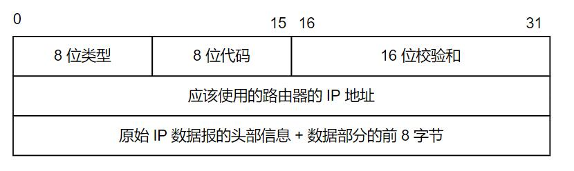

IP 协议是位于网络层的核心协议，需要理解。

<!--more-->

# IP 服务的特点

IP 协议的特点是：

1. 无状态（stateless）：IP 数据报的发送、传输和接收都是相互独立的，没有上下文关系。
   - 也就是说接收端无法识别 IP 数据报的先后顺序，也无法区分是否接收到了重复的数据报，这些数据报交由上层协议处理（IP 报中的标识是用于分片和重组，无法区分多个完整数据报的先后顺序）
2. 无连接（connectionless）：每次发送数据报都必须明确指定对方的 IP 地址
3. 不可靠：IP 协议不能保证 IP 数据报准确地到达接收端，这需要上层协议来处理

# 回顾 IPv4 头部

## 格式


- 4 位版本号：对 IPv4 来说，其值为 4
- 4 位头部长度：表示头有多少个 4 字节，4 位最大就是 15，那么 IPv4 头部最长只能到 60 字节
- 8 位服务类型：由 3 位优先权字段，4 位 TOS 字段，1 位保留字段组成。4 位 TOS 分别表示：最小延时，最大吞吐量，最高可靠性，最小费用。
  + TOS 中的 4 位服务质量字段中，最多有 1 位能置 1（像 ssh,telnet 这种服务就选最小延时，对 ftp 这样的服务就选最大吞吐量）
- 16 位总长度：指整个 IP 数据报的长度，那么 IP 数据报最大为 65535 字节。
  + 但由于 MTU 有限制，超过 MTU 限制的都将被分片传输。
- 16 位标识：唯一标识每个发送的数据报（初值随机，每发送一个数据报值就加 1）
  + 如果一个数据报被分片传输，那么分片具有相同的标识值
- 3 位标志：第二位置位表示禁止分片，第三位表示更多分片（分片传输的最后一个分片将其设 0，以表示最后的分片，其他分片都要将其置位）
- 13 位分片偏移：相对原始 IP 数据报开始处的偏移。
  + 实际的偏移值是该值乘 8 后得到，所以除了最后一个 IP 分片外，每个 IP 分片的数据长度都是 8 的整数倍
  - 8 位生存时间：数据报到达目的端之前允许通过的路由器个数，每经过一个路由器该值就被路由器减 1（减到 0 时就会被路由器丢弃）
  - 8 位协议：表示上层数据报的协议。`/etc/protocols`文件定义了该值
  - 16 位头校验和：接收端对其进行 CRC16 算法以检验数据是否损坏
  - 32 位源和目的地址：IPv4 的源和目的地址
  - 可选字段：前面长度是 20 字节，所以该字段最多可以有 40 字节。
    + 记录路由（record route）：将数据报途径的路由器的 IP 地址填入可选字段，跟踪数据传递路径
    + 时间戳（timestamp）：路由器将数据报被转发的时间填入可选字段，测量数据传输时间
    + 松散源路由选择（loose source routing）：指定路由器 IP 地址列表，数据报发送必须经过所有路由器
    + 严格源路由选择（stric source routing）：指定路由器 IP 地址列表，数据报发送**只能**经过所选路由

## 观察 IPv4 头部

使用`ping`工具来抓取`IPv4`:


通过图片结果一一分析：

- 4 位版本号的值为 4，代表此包为 IPv4
- 4 位头部长度值为 5，代表头长度为 4 x 5 = 20 字节
- 8 位服务类型的值为 0
- 16 位总长度的值为 60，就是说整个 IPv4 包长度为 60 字节
- 16 位标识值为 0x791f
- 3 位标记的值为 0
- 13 位分片偏移为 0，代表这是第一个分包
- 8 位生存时间为 64，表示最多经过 64 个路由器便被抛弃
- 8 位协议值为 1，表示上层协议为 ICMP
- 最后便是校验和为 0x00，还有源地址和目的地址

# IP 分片

## 分片原理

当 IP 数据包超过帧 MTU 时，可能会被发送端或中转路由器分片，最终被接收端内核的 IP 模块重组。

IP 的分片和重组主要依靠：标识、标志和片偏移完成。

- 同一个数据报的 IP 头部具有相同的标识值，不同的片偏移。除了最后一个分片外，其他分片标志都是可分片。

对于以太网而言，MTU 是 1500 字节，那么除开 IP 头部以外（20 字节），IP 数据内容最多是 1480 字节。

所以当数据包超过 1480 字节时，IP 数据报就应该分片。

- 实际上在 IP 中的数据包还包括了上层协议的头部，所以实际上真正的用户数据比这个还要少

## 抓取分包

以使用 ping 一个本地地址来查看 IP 分包细节：

```shell
  # 指定发送数据数是 1473 字节，而 icmp 回显和应答头长度是 8 字节，所以刚好是 1501 字节
  # windows 下使用 -l 命令设定发送的字节大小
  ping 192.168.11.67 -s 1473
```


- 从接受到的数据长度及提示信息就可以说明已经发生了 IP 分片。
  + 第一片长度是 1518，就是以太网帧的 18 字节包裹和 1500 字节的整个 IPv4 长度，除去 IPv4 头的 20 字节，内容就是 1480 字节
  + 第二片长度是 39，就是以太网帧的 18 字节包裹和 21 字节的整个 IPv4 长度，除去 IPv4 头的 20 字节，内容就是 1 字节
  + 第一片和第二片的标识都是 0x7972，代表它们是同一个数据报
  + 第一片 IP 分片的 MF 位标志置位，第二片 IP 分片的 MF 位标志为 0，代表它为最后一个 IP 分包
  + 第一片 IP 分片的偏移为 0，第二片 IP 分片的偏移为 185 x 8 = 1480

目的端经过以上信息就可以把 IP 分片重组成一个完整的数据报了。

# IP 路由

对于网络层而言，一个网络包应该怎样由源端发往目的端，首先需要了解的便是路由表。

## 路由表

在 Linux 命令行，执行 `route` 命令即可查看本机的路由表，比如下面是 WSL 输出的路由表：

```shell
cec@LAPTOP-14LL83CU:~$ route
Kernel IP routing table
Destination     Gateway         Genmask         Flags Metric Ref    Use Iface
# 默认路由，走网关
default         LAPTOP-14LL83CU 0.0.0.0         UG    0      0        0 eth0
# 本地局域网可以直接发送到目标机
172.26.128.0    0.0.0.0         255.255.240.0   U     0      0        0 eth0
```

- Destination：目标网络或主机
- Gateway：网关地址
- Genmask：网络掩码
- Flags：路由标志
  + U：该路由项是活动的
  + H：该路由项的目标是一台主机
  + G：该路由项的目标是网关
  + D：该路由项是由重定向生成的
  + M：该路由项被重定向修改过
- Metric：路由距离，到达指定网络所需的中转数
- Ref：路由项被引用的次数
- Use：路由项被使用的次数
- Iface：该路由项对应的输出网卡接口

IP 路由机制分为 3 个步骤：

1. 查找路由表中和数据报的目标 IP 地址完全匹配的主机 IP 地址，如果找到就使用该路由项
2. 查找路由表中和数据报的目标 IP 地址具有相同网络 ID 的网络 IP 地址，如果找到就使用该路由项
3. 选择默认路由项，也就是跳转到网关

可以看出，其查找过程是由严格到宽松。

WSL 的 IP 是 `172.26.128.135`，对于上面`route`的输出结果表示，当在`172.26.128.135`这个网段时，就可以直接发送到目标机。否则就需要走网关转发出去。

## 路由表更新

可以使用 `route add` , `route del` 来手动添加和删除路由表项，也可以通过 BGP(Border Gateway Protocol，边际网关协议）、RIP（Routing Information Protocol，路由协议）等自动更新路由表。

## IP 模块的工作流程

当 IP 数据报不处于本地局域网时，就需要通过网关转发出去， IP 模块的转发逻辑图如下：


数据链路层在 Linux 中位于网络驱动部分，当接收到数据包时，数据链路层从中提取出网络层并发送给 IP 模块。

IP 在对网络层数据校验无误后，就分析其头部信息。

如果该 IP 数据报头部设置了源站选路选项，IP 模块便调用数据报转发子模块。

如果该 IP 数据报的头部中目标 IP 地址是本机 IP 地址或广播地址，IP 模块就根据数据报头部的协议字段派发给对应的传输层。

如果与本机 IP 地址不一样也不是广播地址，则也调用数据报转发子模块。

数据报转发子模块将首先检测系统是否允许转发，不允许就丢弃数据报，允许就将数据转发给 IP 数据报输出子模块。

IP 模块实现数据报路由的核心数据结构是路由表，同一类型的 IP 数据报将被发往相同的下一跳路由器。

IP 输出队列中存放所有等待发送的 IP 数据报，除了要转发的 IP 数据报外，还有上层数据的 IP 数据报。

路由协议和 route 命令来更新路由表。

## IP 转发使能

主机是否支持 IP 转发与 `/proc/sys/net/ipv4/ip_forward` 的值有关，为 1 则代表允许转发。

执行数据报转发时，执行如下步骤：

1. 若 TTL 为 0，则丢弃该数据报
2. 如果头部设置了严格源路由选择选项，如果目标 IP 与本机 IP 不一致，则发送 ICMP 源站选路失败报文给发送端
3. 如果有必要，给源端发送一个 ICMP 重定向报文，告诉它一个更合理的下一跳路由器
4. 将 TTL 减 1
5. 处理 IP 头部选项
6. 根据当前 MTU 查看是否需要对 IP 执行分片操作。

# 重定向



ICP 重定向报文的类型值是 5，代码字段为 1 时代表主机重定向。

此报文包含：

- 引起重定向的 IP 数据报的源端 IP 地址
- 应该使用的路由器的 IP 地址

主机根据以上信息断定引起重定向的 IP 数据报应该使用哪个路由器来转发，并且更新路由表。

- `/proc/sys/net/ipv4/conf/all/send_redirects` 指定是否可以发送 ICMP 重定向报文
- `/proc/sys/net/ipv4/conf/all/accept_redirects` 指定是否可以接受 ICMP 重定向报文

一般主机接收 ICMP 重定向报文，而路由器发送 ICMP 重定向报文。