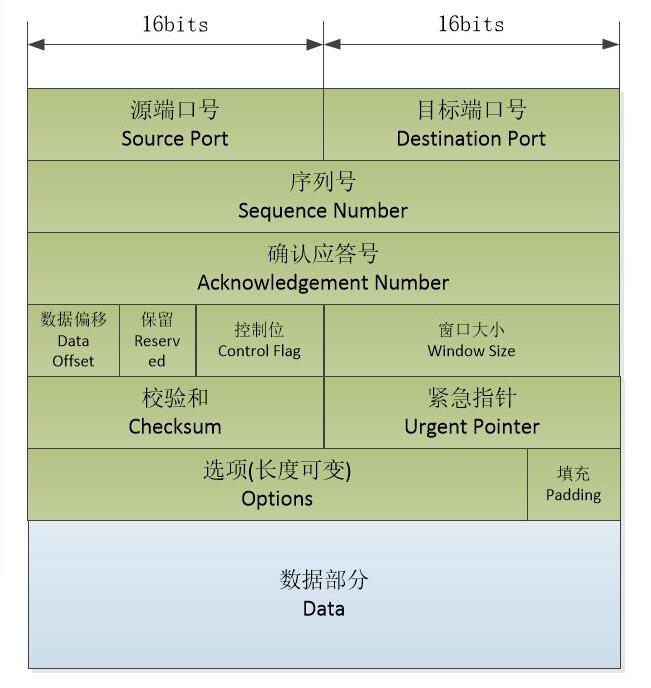
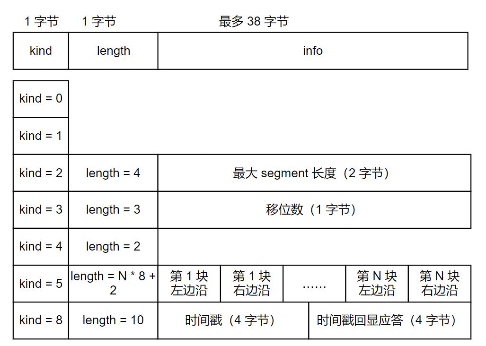
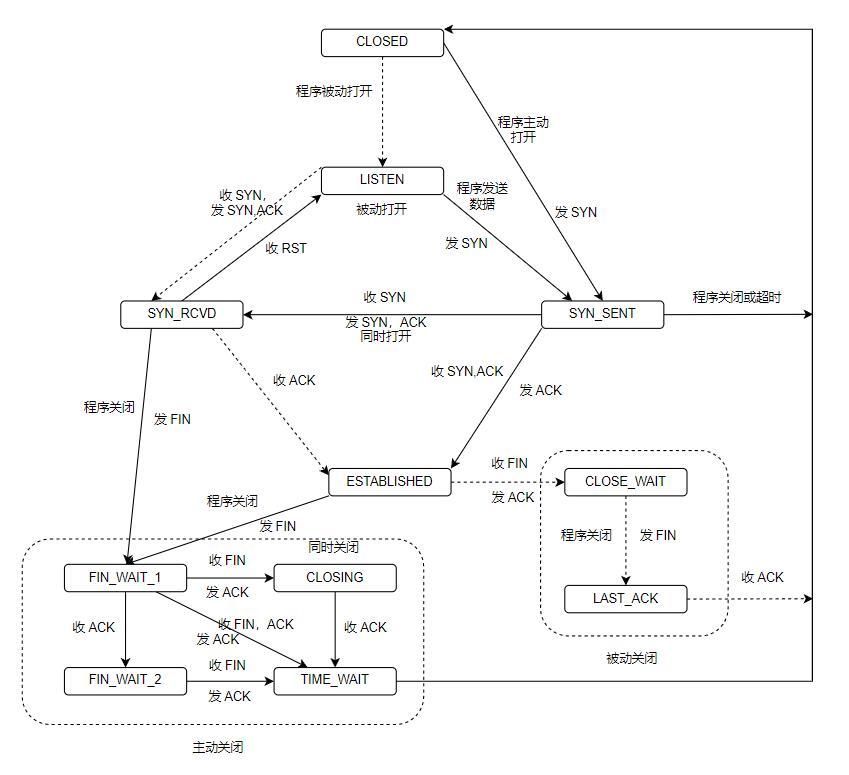
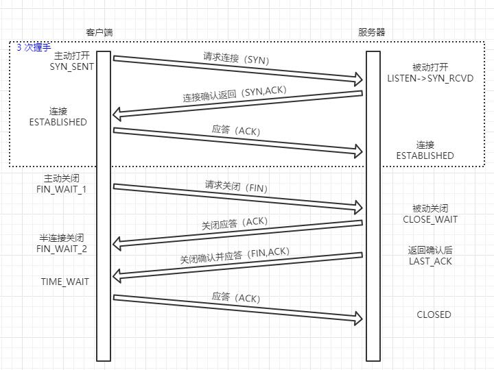

在阅读 <<图解TCPIP>> 时，只简单提了一下 tcp，现在将它们加深一下理解。

<!--more-->

# TCP 服务的特点
TCP 相对于 UDP 具有如下特点：
- 面向连接: TCP 通信前必须先建立连接，由于 TCP 是全双工的，完成数据交换后，通信双方都必须断开连接以释放系统资源。
  + 由于 TCP 协议是一对一的，所以无法用于广播和多播，这种情况下应该使用 UDP。
- 字节流：发送端的写操作次数和接收端执行的读操作次数之间没有任何数量关系，而 UDP 则是严格对应的。
  + 在发送端，TCP 模块发出的 TCP 报文的个数和应用程序执行的写操作次数之间没有固定的数量关系。
  + 在接收端，应用程序执行的读操作次数和 TCP 模块接收到的 TCP 报文个数之间也没有固定的数量关系。
- 可靠传输
  + 应答机制：每个 TCP 报文段都必须得到接收方的应答
  + 超时重传：发送端发出一个 TCP 报文后启动定时器，如果超时未收到应答，将重发报文。
  + 数据整理：由于 IP 数据报到达目的地有可能重复和乱序，所以 TCP 协议还会进行重排和整（UDP 则不会处理这些问题，而将问题丢给应用层）
# TCP 头部结构


之前在 <<图解TCPIP>> 时已经概览了 TCP 的头部数据，只是有以下几点需要注意。
## 固定部分
- 数据偏移：一共占 4 位，2 的 4 次方最大表示 15，这也表示 TCP 头部最长是 60 字节
- 控制位：一共占 6 位，包含下面几项
  + URG 标志：紧急指针（urgent pointer）是否有效
  + ACK 标志：确认号是否有效。携带 ACK 标志的 TCP 报文段为确认报文段
  + PSH 标志：提示接收端应用程序应该立即从 TCP 接收缓冲区中读走数据，为后续数据腾出空间
  + RST 标志：要求对方重新建立连接。称携带 RST 标志的 TCP 报文段为复位报文段
  + SYN 标志：请求建立一个连接。称携带 SYN 标志的 TCP 报文段为同步报文段
  + FIN 标志：通知对方本端要关闭连接了。称携带 FIN 标志的 TCP 报文段为结束报文段
- 16 位窗口大小：告诉对方本端的 TCP 接收缓冲区还能容纳多少字节数据，对方就可以控制发送数据的速度
- 16 位校验和：发送端填充 CRC 结果，接收端进行校验。这个校验包含头部和数据
- 16 位紧急指针：表示相对当前序号的偏移
## 头部选项
前面固定部分是 20 字节，所以头部选项部分最多为 40 字节：


kind 说明选项的类型，length 说明选项的**总长度**，如果有第三个字段，则是选项的具体信息。

kind = 0： 选项表结束选项

kind = 1：空操作，一般用于将 TCP 选项总长度填充为 4 字节对齐

kind = 2：最大报文段长度。在 TCP 连接初始化时，双方使用此选项确定最大报文段长度（Max Segment Size, MSS）。
TCP 模块通常将 MSS 设置为（MTU - 40)字节。
- 一般情况下 TCP 和 IP 头部都不包含选项字段，那么它们头部长度之和就是 40 字节。这种情况下，就不会产生 IP 分片。
  + 对以太网而言，MSS 值就是 1460。

kind = 3：是窗口扩大因子选项。在 TCP 连接初始化时，双方使用该选项协商接收通告窗口扩大因子。
- 实际的窗口大小是：TCP 头部固定部分的窗口大小左移扩大因子位（比如头部设置窗口大小是 1000，扩大因子是 2，那么实际窗口大小是 4000 字节）
  + 扩大因子取值是 0~14， `/proc/sys/net/ipv4/tcp_window_scaling` 设置此扩大因子

kind = 4：是选择性确认（Selective Acknowledgment，SACK）选项。
- 当 TCP 报文段丢失时，如果没有使能选择性确认，那么发送端会发送该丢失报文段及其后续所有报文段。但如果使能了选择性确认，则只重传丢失的部分。
  + `/proc/sys/net/ipv4/tcp_sack` 设置此选项

kind = 5：是 SACK 实际工作选项。用于告诉发送方本端已经收到并缓存的数据块，从而让发送端可以检查哪些数据块被丢失。
- “块左边沿”表示不连续块的第一个数据序号，“块又边沿”表示不连续块最后一个数据序号**的下一个序号**
  + 表示边沿之间的数据没有收到，一对边沿占用 8 字节，那么最多包含 4 对边沿

kind = 8：是时间戳选项。提供较为准确的计算通信双方之间的回路时间（Round Trip Time,RTT）的方法，用于流量控制。
- `/proc/sys/net/ipv4/tcp_timestamps` 来启动和关闭时间戳选项

# TCP 连接的建立和关闭
## 使用 tcpdump 观察
本机通过 `telnet` 访问局域网一台主机的 `telnet server` ，使用 `tcpdump` 进行抓取: 
``` shell
  sudo tcpdump -i enp0s3 -nt '(src 192.168.0.253 and dst 192.168.0.103)or (src 192.168.0.103 and dst 192.168.0.253)' 
  telent 192.168.0.103 80
```
连接后立即退出，可以抓取到如下输出：
``` shell                        
# 连接            
  IP 192.168.0.253.38336 > 192.168.0.103.80: Flags [S], seq 899063137, win 64240, options [mss 1460,sackOK,TS val 600659478 ecr 0,nop,wscale 7], length 0                                                   
  IP 192.168.0.103.80 > 192.168.0.253.38336: Flags [S.], seq 3217896549, ack 899063138, win 28960, options [mss 1460,sackOK,TS val 1442999620 ecr 600659478,nop,wscale 7], length 0                         
  IP 192.168.0.253.38336 > 192.168.0.103.80: Flags [.], ack 1, win 502, options [nop,nop,TS val 600659484 ecr 1442999620], length 0
# 断开                              
  IP 192.168.0.253.38336 > 192.168.0.103.80: Flags [F.], seq 1, ack 1, win 502, options [nop,nop,TS val 600679745 ecr 1442999620], length 0                                                                 
  IP 192.168.0.103.80 > 192.168.0.253.38336: Flags [F.], seq 1, ack 2, win 227, options [nop,nop,TS val 1443019885 ecr 600679745], length 0                                                                 
  IP 192.168.0.253.38336 > 192.168.0.103.80: Flags [.], ack 2, win 502, options [nop,nop,TS val 600679754 ecr 1443019885], length 0 
```
连接和断开并没有发生数据的交换，所以整个过程 TCP 报文的数据长度为 0。
第一个 TCP 报文段包含 SYN 标志，表示建立连接的同步报文段，该报文段的 ISN 值为 899063137。

第二个 TCP 报文段是对第一个报文段的响应，表示同意连接。该报文段的 ISN 值为 3217896549，并对第一个报文段的确认值为 899063138。

第三个 TCP 报文段是对第二个报文段的确认，这样 TCP 连接就建立了。称为 TCP 三次握手。

第四个 TCP 报文段包含 FIN 标志，表示结束报文段，其后的两个报文段和握手的逻辑是一样的。
## 半关闭状态
TCP 连接是全双工的，它允许其中一个通道关闭，称为半关闭（half close）。

比如当客户端关闭向服务器的写通道时，服务器的 `read` 返回为 0。
- 一般使用 `shutdown` 函数关闭。


## 连接超时
当 TCP 多次重连无效后，便会通知应用程序连接超时。
- `/proc/sys/net/ipv4/tcp_syn_retries` 设置重连的次数。

下面可以进行实验：
- 先将服务器的应答包过滤：
``` shell
  sudo iptables -F
  sudo iptables -I INPUT -p tcp --syn -i wlp12s0 -j DROP
```
- 然后客户端抓取数据包
``` shell
  sudo tcpdump -n -i enp0s3 port 23
```
- 客户端连接服务端，并加上时间记录：
``` shell
  date; telnet 192.168.0.103; date
```

输出分别如下：
``` shell
  2019年 10月 24日 星期四 22:29:01 CST
  Trying 192.168.0.103...
  telnet: Unable to connect to remote host: Connection timed out
  2019年 10月 24日 星期四 22:31:11 CST

  22:29:02.412815 IP 192.168.0.253.55270 > 192.168.0.103.23: Flags [S], seq 3346644927, win 64240, options [mss 1460,sackOK,TS val 609652001 ecr 0,nop,wscale 7], length 0
  22:29:02.726521 IP 192.168.0.253.55270 > 192.168.0.103.23: Flags [S], seq 3346644927, win 64240, options [mss 1460,sackOK,TS val 609653030 ecr 0,nop,wscale 7], length 0
  22:29:04.747347 IP 192.168.0.253.55270 > 192.168.0.103.23: Flags [S], seq 3346644927, win 64240, options [mss 1460,sackOK,TS val 609655050 ecr 0,nop,wscale 7], length 0
  22:29:08.775200 IP 192.168.0.253.55270 > 192.168.0.103.23: Flags [S], seq 3346644927, win 64240, options [mss 1460,sackOK,TS val 609659078 ecr 0,nop,wscale 7], length 0
  22:29:16.967268 IP 192.168.0.253.55270 > 192.168.0.103.23: Flags [S], seq 3346644927, win 64240, options [mss 1460,sackOK,TS val 609667270 ecr 0,nop,wscale 7], length 0
  22:29:33.099595 IP 192.168.0.253.55270 > 192.168.0.103.23: Flags [S], seq 3346644927, win 64240, options [mss 1460,sackOK,TS val 609683403 ecr 0,nop,wscale 7], length 0
  22:30:05.726783 IP 192.168.0.253.55270 > 192.168.0.103.23: Flags [S], seq 3346644927, win 64240, options [mss 1460,sackOK,TS val 609716030 ecr 0,nop,wscale 7], length 0
```
可以看到经过 130S 后返回超时警告，一共发出了 7 次连接请求，请求的间隔时间大约依次是 1,2,4,8,16,32 秒。

并且每次请求的 TCP 包序号都是一样的，可以看出是重发的同一个包。
# TCP 的状态转移




上图表示 TCP 的状态转移，实线表示客户端连接的状态转移，虚线表示服务器连接的状态转移。
## 服务器的状态转移
服务器通过 `listen` 进入 LISTEN 状态，被动等待客户端的连接，所以称为被动打开。

服务器一旦监听到某个连接请求（收到同步报文），就将该连接放入内核等待队列中，并向客户端发送带 SYN 标志的确认报文段，此时处于 SYN_RCVD 状态。

当服务器接受到客户端的确认报文段（三次握手完成），则该连接转移到 ESTABLISHED 状态，双方能够进行双向数据传输。

当客户端通过 `close` 或 `shutdown` 主动关闭连接时，服务器通过返回确认报文段使连接进入 CLOSE_WAIT 状态，等待服务器应用程序关闭连接。

当服务器发送结束报文段后，状态转移到 LAST_ACK 状态，等待客户端对结束报文段的确认。确认完成后（三次）连接就关闭了。

可以看到连接和关闭都是由客户端主动发起的，服务器接收到请求后便会返回确认并进行状态转移，当客户端再次返回确认时，操作便完成了。
## 客户端的状态转移
客户端通过 `connect` 主动与服务器建立连接，此调用首先会发送一个同步报文段，连接进入 SYN_SENT 状态，然后：
- 如果 `connect` 连接的目标端口不存在或该端口被处于 TIME_WAIT 状态的连接所占用，服务器将给客户端发送一个复位报文段， `connect` 返回失败
- 如果目标端口存在，但 `connect` 在超时时间内未收到服务器的确认报文段，则 `connect` 返回失败

当 `connect` 调用失败后，连接进入 CLOSED 状态。如果客户端收到服务器的确认，则 `connect` 发送 ACK 报文段后进入 ESTABLISHED 状态。

当客户端主动执行关闭时，向服务器发送一个结束报文段，同时连接进入 FIN_WAIT_1 状态。

若客户端此时收到服务器专门用于确认目的的确认报文段，连接状态转移到 FIN_WAIT_2 状态，此时服务器处于 CLOSE_WAIT 状态。

当服务器发送结束报文段，客户端将返回确认并进入 TIME_WAIT 状态。
- 若服务器直接返回带确认信息的结束报文段，那么将直接从 FIN_WAIT_1 状态进入 TIME_WAIT 状态。

连接停留在 FIN_WAIT_2 状态的情况可能发生在：客户端执行半关闭后，未等服务器关闭连接就强行退出了。
此时客户端连接由内核来接管，称为孤儿连接。
- 通过 `/proc/sys/net/ipv4/tcp_max_orphans` 指定内核能接管孤儿连接数目
- 通过 `/proc/sys/net/ipv4/tcp_fin_timeout` 指定孤儿连接在内核中的生存时间

## 关于 TIME_WAIT 状态
客户端在收到服务器的结束报文段（FIN，ACK）后，并没有直接进入 CLOSED 状态，而是进入到 TIME_WAIT 状态。
在这个状态涨，客户端连接要等待 2MSL(Maximum Segment Life， 报文最大生存时间），才能完全关闭。
- 标准文档建议值是 2min.

TIME_WAIT 状态用于：
- 可靠的终止 TCP 连接：为了确保服务器已正常的收到了最后的确认报文段（ACK），所以客户端需要足够的时间等待。
  + 假设 ACK 被丢失，那么服务器将会重发 (FIN,ACK) ，客户端才好来处理，否则服务器就会出现超时等错误
- 保证让迟来的 TCP 报文段有足够的时间被识别并丢弃
  + 在 TIME_WAIT 这段时间内，应用程序无法再新建相同端口的连接。这样可以保证，在 TIME_WAIT 时间内，将原来连接的 TCP 报文丢弃掉，避免随后新建的相同端口的连接接收到原来连接的数据而造成莫名其妙的错误。

所以当端口处在 TIME_WAIT 状态时，系统是会禁止应用程序再来建立相同端口的连接的，返回 `Address already in use` 错误。
- 在编程中，可以使用 `SO_REUSEADDR` 来强制新建

一般客户端使用系统随机分配的端口，不会出现此冲突，但服务器是肯定会出现的。
# 复位报文段
某些情况下，TCP 连接的一端会向另一端发送带 RST 标志的复位报文段，通知对方关闭连接或重新建立连接。

以下 3 种情况都会产生复位报文段。
## 访问不存在的端口
当客户端访问服务器上一个不存在的端口时，服务器将给它发送一个复位报文段。

假设访问服务端未监听的一个端口：
``` shell
  sudo tcpdump -nt -i enp0s3 port 54321

  telnet 192.168.0.105 54321
```
得到结果如下：
``` shell
  IP 192.168.0.253.35890 > 192.168.0.105.54321: Flags [S], seq 3093423632, win 64240, options [mss 1460,sackOK,TS val 1061202447 ecr 0,nop,wscale 7], length 0
  IP 192.168.0.105.54321 > 192.168.0.253.35890: Flags [R.], seq 0, ack 3093423633, win 0, length 0
```
可以看到，服务端返回了复位报文段，并且次报文段中的接收窗口长度为 0,也就是说客户端不能回应这个报文段。
## 异常终止连接
TCP 一方还可以主动发送复位报文段，来终止连接，对方发送端所有排队等待发送的数据都将被丢弃。
- 通过 socket 选项 `SO_LINGER` 来发送复位报文段。
## 处理半打开连接
半打开状态：服务器（或客户端）关闭或异常终止了连接，但对方没有接收到结束报文段，也就是说对方还维持着原来的连接。

处于半打开状态的连接，就是半打开连接。

如果半打开连接的进程往 socket 写入数据，对方则会返回一个复位报文段。
# TCP 交互数据流
TCP 所携带的应用程序数据按照长度分为两种：
- 交互数据：仅包含很少的字节，对实时性要求高。比如 telnet、ssh 等
- 成块数据：长度通常为 TCP 报文段允许的最大数据长度，对传输效率要求高。比如 ftp 。

对于交互数据，会在双方交互数据的过程中产生大量的 TCP 包（发送的少字节数据，以及对应包的应答），这可能会导致拥塞发生。

使用 Nagle 算法解决该问题：
>Nagle 算法要求一个 TCP 连接的通信双方在任意时刻都最多只能发送一个未被确认的 TCP 报文段，在该 TCP 报文段的确认到达之前不能发送其他 TCP 报文段。
>
>另一方面，发送方在等待确认的同时收集本端需要发送的微量数据，并在确认到来时以一个 TCP 报文段将它们全部发出。
>
> 这样就极大的减少了网络上的微小 TCP 报文段的数量。
> 该算法的另一个优点在于其自适应性：确认到达得越快，数据也就发送得越快。

# TCP 成块数据流
成块数据流每次发送的数据大小与最开始连接的 3 次握手有关，每次发送的字节数必然不会超过这个值。

成块数据流的应答与接收端窗口大小有关，如果下一次发送数据大小将使得窗口被填满或溢出，那么接收方必然会返回一次应答。
# 带外数据
有些传输层协议具有带外（Out of Band,OOB)数据的概念，用于迅速通告对方本端发生的重要事件。

TCP 利用头部中的紧急指针标志和紧急指针两个字段，给应用程序提供了一种紧急方式，利用传输普通数据的连接来传输紧急数据（带外数据）。

TCP 发送带外数据的过程如下：

假设一个进程已经往某个 TCP 连接的发送缓冲区写入了 N 字节的普通数据并等待发送。

在数据被发送前，该进程又向这个连接写入了 "abc" 3 字节的带外数据，此时 TCP 报文段头部将被设置 URG 标志，其紧急指针被设置为指向最后一个带外数据的下一字节。
- 紧急指针的值减去当前报文段的序号值，就可以得到紧急数据的位置偏移

如果 TCP 模块以多个 TCP 报文段来发送 TCP 发送缓存中的内容，则每个 TCP 报文段都将设置 URG 标志，并且紧急指针指向同一个位置，但只有一个 TCP 报文段真正携带带外数据。

对应的 TCP 接收端只有在接收到紧急指针标志时才检查紧急指针，根据紧急指针所指的位置确定带外数据的位置并将它读入一个特殊的缓存。
- 该缓存只有 1 字节，如果上层应用程序没有及时将带外数据读出，则会被后续的带外数据覆盖。

如果给 TCP 连接设置了 SO_OOBINLINE 选项，则带外数据将和普通数据一样被 TCP 模块存放在 TCP 接收缓存中。这时通过紧急指针来识别带外数据。
# TCP 超时重传
TCP 服务必须能够重传超时时间内未收到确认的 TCP 报文段，所以 TCP 模块为每个 TCP 报文段都维护一个重传定时器，定时器在 TCP 报文段第一次被发送时启动。

如果超时时间内未收到接收方的应答，TCP 模块将重传 TCP 报文段并重置定时器。

当超过一定重传次数后，由 IP 和 ARP 接管来查询对端 MAC 地址，直到最后放弃连接。

`/proc/sys/net/ipv4/tcp_retries1` 指定在底层 IP 接管之前 TCP 最少执行的重传次数

`/proc/sys/net/ipv4/tcp_retries2` 指定连接放弃前 TCP 最多可以执行的重传次数。
# 拥塞控制
拥塞控制是指：提高网络利用率，降低丢包率，并保证网络资源对每条数据流的公平性。

拥塞控制由 4 个部分组成：慢启动（slow start）、拥塞避免（congestion avoidance）、快速重传（fast retransmit）和快速恢复（fast recovery）。

Linux 下有 reno,vegas,cubic 等算法，部分或全部实现了拥塞控制的 4 个部分。
- `/proc/sys/net/ipv4/tcp_congestion_control` 来选择拥塞算法

拥塞控制最终控制向网络一次写入 TCP 报文段的数量，称为 SWND（Send Window，发送窗口）。

这些 TCP 报文段数据部分最大长度为 SMSS(Sender Maximum Segement Size,发送者最大段大小），其值一般等于 MSS。

SWND 太小会引起网络延迟，太大容易导致网络拥塞。最终 SWND 是取 RWND（接收通告窗口）和 CWND(拥塞窗口）的最小值。