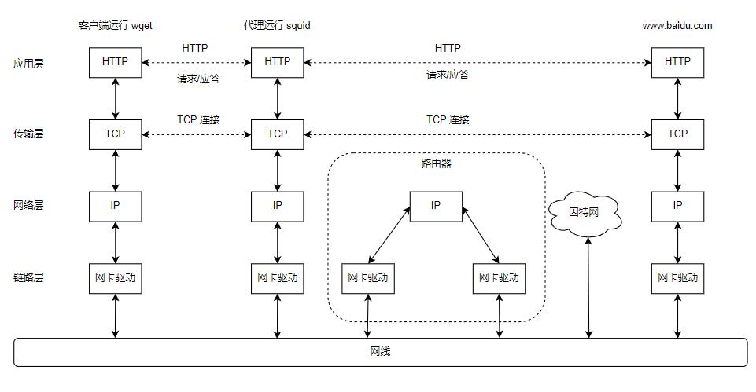

前面算是理解了一下 TCP/IP 的工作原理，现在要来实践消化一下了。

<!--more-->

* 总体思路


如上图所示，访问端运行 `wget` 程序，通过代理上的 `squid` 程序中转，访问 `www.baidu.com` 的首页 `index.html` 文档。
# 部署
## 客户端到代理
客户端需要先设置代理服务器：
``` shell
# 3128 为 squid 服务器的默认端口号
export http_proxy="192.168.11.188:3128"
```
## squid 代理服务器
在使用 apt 安装好 squid 后，在 `/etc/squid/squid.conf` 中加入以下两行：
``` shell
  acl localnet src 192.168.11.0/24
  http_access allow localnet
```
然后再启动服务：
``` shell
  sudo service squid restart
```
# 抓取
首先删除代理端对路由器的 arp 缓存，然后使用 tcpdump 抓取整个通信过程：
``` shell
  sudo arp -d 192.168.11.1
  sudo tcpdump -s 2000 -i eth0 -ntX '(src 192.168.11.188) or (dst 192.168.11.188) or (arp)'
  wget --header="Connection: close" http://www.baidu.com/index.html
```

可以看到简略输出如下：
``` shell 
  # 向代理的握手请求
  IP 192.168.11.9.51750 > 192.168.11.188.3128: Flags [S], seq 2395726701, win 29200, options [mss 1460,sackOK,TS val 4158096288 ecr 0,nop,wscale 10], length 0
  # 代理通过 ARP 得到客户端地址后返回
  ARP, Request who-has 192.168.11.9 tell 192.168.11.188, length 28
  ARP, Reply 192.168.11.9 is-at 08:00:27:a3:4b:28, length 46
  # 代理返回应答
  IP 192.168.11.188.3128 > 192.168.11.9.51750: Flags [S.], seq 4162159365, ack 2395726702, win 28960, options [mss 1460,sackOK,TS val 1725236061 ecr 4158096288,nop,wscale 7], length 0
  # 客户端回应后完成 3 次握手
  IP 192.168.11.9.51750 > 192.168.11.188.3128: Flags [.], ack 1, win 29, options [nop,nop,TS val 4158096289 ecr 1725236061], length 0

  # 发送 http 请求
  IP 192.168.11.9.51750 > 192.168.11.188.3128: Flags [P.], seq 1:196, ack 1, win 29, options [nop,nop,TS val 4158096289 ecr 1725236061], length 195
  IP 192.168.11.188.3128 > 192.168.11.9.51750: Flags [.], ack 196, win 235, options [nop,nop,TS val 1725236062 ecr 4158096289], length 0

  # 代理通过域名向 DNS 请求对应的 IP 地址
  IP 192.168.11.188.58330 > 8.8.8.8.53: 58551+ PTR? 9.11.168.192.in-addr.arpa. (43)
  IP 192.168.11.188.58330 > 8.8.8.8.53: 22503+ A? www.baidu.com. (31)
  IP 192.168.11.188.58330 > 8.8.8.8.53: 39842+ AAAA? www.baidu.com. (31)
  IP 8.8.8.8.53 > 192.168.11.188.58330: 58551 NXDomain 0/0/0 (43)
  IP 8.8.8.8.53 > 192.168.11.188.58330: 22503 3/0/0 CNAME www.a.shifen.com., CNAME www.wshifen.com., A 103.235.46.39 (100)
  IP 192.168.11.188.58330 > 8.8.4.4.53: 39842+ AAAA? www.baidu.com. (31)
  IP 8.8.4.4.53 > 192.168.11.188.58330: 39842 2/1/0 CNAME www.a.shifen.com., CNAME www.wshifen.com. (141)

  # 获取到百度 IP 地址后，便与其握手
  IP 192.168.11.188.47854 > 103.235.46.39.80: Flags [S], seq 254759734, win 29200, options [mss 1460,sackOK,TS val 418576865 ecr 0,nop,wscale 7], length 0

  # 客户端得到代理物理地址
  ARP, Request who-has 192.168.11.188 tell 192.168.11.9, length 46
  ARP, Reply 192.168.11.188 is-at b8:27:eb:e0:d8:a2, length 28

  # 百度与代理 3 次握手完成
  IP 103.235.46.39.80 > 192.168.11.188.47854: Flags [S.], seq 2113853043, ack 254759735, win 8192, options [mss 1420,sackOK,nop,nop,nop,nop,nop,nop,nop,nop,nop,nop,nop,wscale 5], length 0
  IP 192.168.11.188.47854 > 103.235.46.39.80: Flags [.], ack 1, win 229, length 0

  # 确认连接
  IP 192.168.11.188 > 103.235.46.39: ICMP echo request, id 1282, seq 512, length 30

  # 代理给百度发送 http 请求
  IP 192.168.11.188.47854 > 103.235.46.39.80: Flags [P.], seq 1:247, ack 1, win 229, length 246: HTTP: GET /index.html HTTP/1.1
  IP 103.235.46.39.80 > 192.168.11.188.47854: Flags [.], ack 247, win 812, length 0

  # 百度返回 http 内容
  IP 103.235.46.39.80 > 192.168.11.188.47854: Flags [P.], seq 1:401, ack 247, win 812, length 400: HTTP: HTTP/1.1 200 OK
  IP 192.168.11.188.47854 > 103.235.46.39.80: Flags [.], ack 401, win 237, length 0

  # 代理返回内容给客户端
  IP 192.168.11.188.3128 > 192.168.11.9.51750: Flags [P.], seq 1:506, ack 196, win 235, options [nop,nop,TS val 1725241671 ecr 4158096289], length 505
  IP 192.168.11.9.51750 > 192.168.11.188.3128: Flags [.], ack 506, win 30, options [nop,nop,TS val 4158101899 ecr 1725241671], length 0

  IP 103.235.46.39 > 192.168.11.188: ICMP echo reply, id 1282, seq 512, length 30

  IP 103.235.46.39.80 > 192.168.11.188.47854: Flags [P.], seq 1:401, ack 247, win 812, length 400: HTTP: HTTP/1.1 200 OK
  IP 192.168.11.188.47854 > 103.235.46.39.80: Flags [.], ack 401, win 237, options [nop,nop,sack 1 {1:401}], length 0
  IP 103.235.46.39.80 > 192.168.11.188.47854: Flags [.], seq 401:1701, ack 247, win 812, length 1300: HTTP
  IP 192.168.11.188.47854 > 103.235.46.39.80: Flags [.], ack 1701, win 257, length 0
  IP 103.235.46.39.80 > 192.168.11.188.47854: Flags [P.], seq 1701:2782, ack 247, win 812, length 1081: HTTP
  IP 192.168.11.188.47854 > 103.235.46.39.80: Flags [.], ack 2782, win 278, length 0

  IP 192.168.11.188.3128 > 192.168.11.9.51750: Flags [.], seq 506:1954, ack 196, win 235, options [nop,nop,TS val 1725241924 ecr 4158101899], length 1448
  IP 192.168.11.188.3128 > 192.168.11.9.51750: Flags [P.], seq 1954:2887, ack 196, win 235, options [nop,nop,TS val 1725241924 ecr 4158101899], length 933

  # 代理与客户端断开
  IP 192.168.11.188.3128 > 192.168.11.9.51750: Flags [F.], seq 2887, ack 196, win 235, options [nop,nop,TS val 1725241925 ecr 4158101899], length 0
  IP 192.168.11.9.51750 > 192.168.11.188.3128: Flags [.], ack 2887, win 35, options [nop,nop,TS val 4158102152 ecr 1725241924], length 0
  IP 192.168.11.9.51750 > 192.168.11.188.3128: Flags [F.], seq 196, ack 2888, win 35, options [nop,nop,TS val 4158102152 ecr 1725241925], length 0
  IP 192.168.11.188.3128 > 192.168.11.9.51750: Flags [.], ack 197, win 235, options [nop,nop,TS val 1725241925 ecr 4158102152], length 0
```