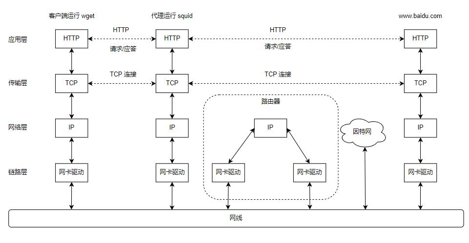

使用 Wireshark 来抓取整个流程，以粗浅的理解 TCP/IP。

<!--more-->

# 总体思路



如上图所示，访问端运行 `wget` 程序，通过代理上的 `squid` 程序中转，访问 `www.baidu.com` 的首页 `index.html` 文档。

# 部署

## squid 代理服务器

在使用 apt 安装好 squid 后，在 `/etc/squid/squid.conf` 中添加以下两行，以允许局域网访问该代理：
``` shell
  acl localnet src 192.168.11.0/24
  # 这一行在文件中就有，只是需要修改一下
  http_access allow all
```

然后再启动服务：
``` shell
  sudo service squid restart
```

删除 ARP 对网关的缓存，以观察到 ARP：

```shell
sudo arp -d 192.168.11.1
```

## 客户端到代理

客户端需要先使用 WSL 设置代理服务器（squid 的端口是 3128）：

```shell
export http_proxy=192.168.11.67:3128
```
然后开始发送请求：

```shell
wget --header="Connection: close" http://www.baidu.com/index.html
```

# 抓取

使用 Wireshark 抓取整个通信过程：


可以观察到其流程如下。

1. 握手：既然是 firefox 要经过服务器代理访问百度，那么首先就需要与代理服务器建立连接（TCP 3 次握手）。
2. ARP：客户端发送 HTTP 请求后，由于访问的不是局域网地址，所以根据路由表设定，需要走网关出去。那么代理服务器就需要先使用 ARP 来获取网关的 MAC 地址。
3. 数据传输：代理服务器在获取到数据后，通过 3 个 TCP 报文将内容返回给客户端
4. 断开：当代理服务器发送完数据后，服务器主动断开连接
  + 服务器首先主动发送 FIN TCP 报文
  + 客户端应答服务端所传输的 3 个 TCP 数据报文
  + 然后客户端再是对服务端的 FIN ACK 应答报文
  + 最后服务端返回一个应答，表示双方便断开连接了