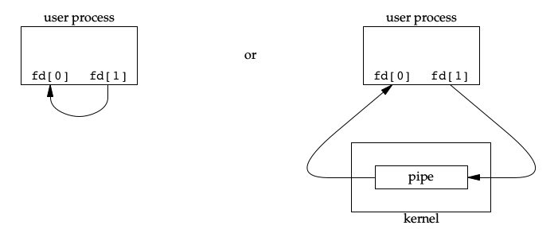
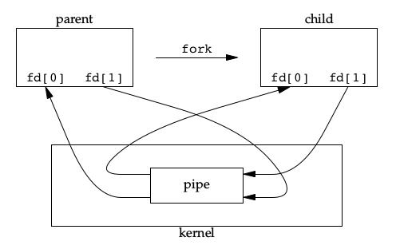

Linux 提供的高级 IO 函数，虽然不常用，但能提供优异的性能。

<!--more-->

# pipe

管道具有如下特点：

1. 半双工通信，数据流是单向的
2. 管道只能用于两个有亲缘关系进程间通信，一般是父子进程间通信

> FIFO 突破了第二点限制，socket 突破了以上两点限制。

shell 用经常使用管道来将一个命令的输出作为下一个命令的输入：

```shell
cat abc.txt | grep "123"
```

## 数据流方式

pipe 有两种数据流方式：

1. 数据在一个进程内在用户空间交互
2. 数据经过了内核 pipe 进行交互


在实际使用中，用得最多的是父子进程间的通信



- 当写端的被关闭时，读端读取时将会返回0
- 当读端被关闭时，写端写入时将会返回 -1 ,此时 `errno` 的值为 `EPIPE` ，还会接受到信号 `SIGPIPE`
- 宏 `PIPE_BUF` 指定了内核 pipe 的大小(字节)，可以通过 `pathconf` 或 `fpathconf` 来设置此值

其 API 如下：

```c
#include <unistd.h>
/**
 * @brief 创建两个pipe
 * @param fd: 包含两个元素的数组
 * @note fd[0] 代表当前进程读端，fd[1]代表当前进程写端。
 * 当只使用其中一个描述符时，需要关掉另一个描述符
 * @ret 0 : 创建成功 -1 : 创建失败
 */
int pipe(int fd[2]);
```

## 示例

```c
#include <unistd.h>

#include <stdint.h>
#include <stdio.h>
#include <string.h>

#define BUFFER_LEN  (20)

int main(void) {
    int ret = 0;
    int fd[2];
    pid_t pid;
    char buf[BUFFER_LEN];
    char* str = "Hello world!\n";

    memset(buf, 0, BUFFER_LEN);

    // 创建一对读写管道
    if ((ret = pipe(fd)) < 0) {
        perror("can not create pipe:");
        goto quick_out;
    }

    if ((pid = fork()) < 0) {
        perror("can not fork process:");
        ret = -1;
        goto quick_out;
    } else if(pid > 0) { // 父进程
        // 关闭父进程的读通道
        close(fd[0]);
        if ((ret = write(fd[1], str, strlen(str) + 1)) < 0) {
            perror("Can not write data to pipe:");
            goto quick_out;
        }
    } else { // 子进程
        // 关闭子进程的写通道
        close(fd[1]);

        if ((ret = read(fd[0], buf, BUFFER_LEN)) < 0) {
            printf("Can not read data from pipe!\n");
            goto quick_out;
        }
        printf("child process received data: %s", buf);
}

quick_out:
        return ret;
}
```

## socketpair

对于 socket 而言，创建 pipe 最合理的方式是使用`socketpair()`：

```c
#include <sys/types.h>          
#include <sys/socket.h>

int socketpair(int domain, int type, int protocol, int sv[2]);
```

- `socketpair()`参数列表前 3 个与 `socket()`一样，只是其`domain`只能是`AF_UNIX`
- `socketpair()`创建的描述符都是双向的

# dup

```c
#include <unistd.h>

//得到一个文件描述符副本
int dup(int oldfd);
int dup2(int oldfd, int newfd);

#define _GNU_SOURCE             /* See feature_test_macros(7) */
#include <fcntl.h>              /* Obtain O_* constant definitions */
#include <unistd.h>

int dup3(int oldfd, int newfd, int flags);
```

`dup` 得到文件描述符副本，副本和原文件描述符指向同一个文件。

dup 的关键在于： **返回当前可用的最小描述符**

比如先关闭标准输出，然后立即调用 dup，此时 dup 返回最小描述符则是 1。
也就是说 1 和当前文件描述符指向同一个文件，那么调用 `printf` 时，内容也就写入文件了。

看下面示例：

```c
#include <stdio.h>
#include <unistd.h>
#include <sys/types.h>
#include <sys/stat.h>
#include <fcntl.h>

int main(int argc, char *argv[]) {
    int fd = open("./output", O_CREAT | O_RDWR);
    if (fd < 0) {
        perror("create file failed:");
        return -1;
    }

    printf("This message is before dup\n");

    close(STDOUT_FILENO);
    int ret_fd = dup(fd);

    printf("This message is after dup\n");
    printf("dup return fd is %d\n", ret_fd);

    return 0;
}
```

这会将`dup()`后的`printf`内容，输出到 output 文件中。

# readv 和 writev

```c
#include <sys/uio.h>

struct iovec {
    void  *iov_base;    /* Starting address */
    size_t iov_len;     /* Number of bytes to transfer */
};

//从 fd 读取内容到分散的 iov 指向的内存中
ssize_t readv(int fd, const struct iovec *iov, int iovcnt);

//将 iov 指向的分散的内存写入到 fd 中 
ssize_t writev(int fd, const struct iovec *iov, int iovcnt);

ssize_t preadv(int fd, const struct iovec *iov, int iovcnt,
             off_t offset);

ssize_t pwritev(int fd, const struct iovec *iov, int iovcnt,
              off_t offset);
```

与`recvmsg(),sendmsg()`类似。

# sendfile

```c
#include <sys/sendfile.h>

//从 in_fd 的 offset 处拷贝 count 字节到 out_fd 中
//in_fd 对象必须能支持 mmap 类操作，out_fd 可以是任意文件
ssize_t sendfile(int out_fd, int in_fd, off_t *offset, size_t count);
```

sendfile 是零拷贝函数，因为是在内核中完成文件内容的复制，就没有用户空间到内核空间这一层的拷贝了。

- 显然这样的操作效率更高

下面验证服务端将一个文件发送给客户端，服务端代码：

```c
#include <sys/types.h>
#include <netinet/in.h>
#include <arpa/inet.h>
#include <sys/socket.h>
#include <stdio.h>
#include <stdlib.h>
#include <string.h>
#include <unistd.h>
#include <sys/sendfile.h>
#include <fcntl.h>
#include <sys/stat.h>

int main(int argc, char *argv[]) {
    if (argc != 3) {
        printf("usage: %s <port> <filepath>\n", argv[0]);
        return -1;
    }
    int port = atoi(argv[1]);
    //addr
    struct sockaddr_in socket_addr;
    memset(&socket_addr, 0, sizeof(socket_addr));
    socket_addr.sin_family = AF_INET;
    socket_addr.sin_port = htons(port);
    socket_addr.sin_addr.s_addr = htonl(INADDR_ANY);
    //socket
    int socket_fd = socket(AF_INET, SOCK_STREAM, 0);
    if (socket_fd < 0) {
        perror("can't create socket:");
        return -1;
    }
    //bind
    if (bind(socket_fd, (const struct sockaddr *)&socket_addr, sizeof(socket_addr)) < 0) {
        perror("bind socket and address failed:");
        return -1;
    }
    //listen
    if (listen(socket_fd, 5) < 0) {
        perror("listen failed:");
        return -1;
    }
    printf("I'm waiting for client...\n");
    //accept
    int client_fd = 0;
    struct sockaddr_in client_addr;
    socklen_t addr_len = sizeof(client_addr);
    if ((client_fd = accept(socket_fd, (struct sockaddr *)&client_addr, &addr_len)) < 0) {
        perror("accept failed!\n");
        return -1;
    }
    printf("connected to client ip: %s, port: %d\n",
    inet_ntoa(client_addr.sin_addr), ntohs(client_addr.sin_port));
    printf("send file %s to client\n", argv[2]);

    int file_fd = open(argv[2], O_RDONLY);

    struct stat file_stat;
    fstat(file_fd, &file_stat);

    if (sendfile(client_fd, file_fd, NULL, file_stat.st_size) < 0) {
        perror("sendfile failed:");
    }
    close(client_fd);
    close(socket_fd);
    return 0;
}
```

通过 `telnet` 连接服务端后便可以获取到该文件了

# mmap 和 munmap

```c
#include <sys/mman.h>

//将 fd 的 offset 处开始的内存映射 length 字节到 addr
void *mmap(void *addr, size_t length, int prot, int flags,
         int fd, off_t offset);
int munmap(void *addr, size_t length);
```

prot 设置内存段的访问权限：

- PROT_READ : 可读
- PROT_WRITE: 可写
- PROT_EXEC: 可执行
- PROT_NONE: 不能被访问

flags 控制内存段内容被修改后程序的行为：

- MAP_SHARED: 共享内存，对内存的修改被映射到文件中
- MAP_PRIVATE: 私有内存，对内存的修改不会被映射到文件中
- MAP_ANONYMOUS: 这段内存不是从文件映射来的，内容被初始化为全 0
- MAP_FIXED: 内存段必须位于 addr 参数指定的地址处，start 必须与内存页对齐
- MAP_HUGETLB: 按照大内存页面来分配内存空间

# splice

```c
#define _GNU_SOURCE         /* See feature_test_macros(7) */
#include <fcntl.h>

//将 fd_in 从 off_in 处拷贝 len 字节到 fd_out 的 off_out 处
// fd_in 和 fd_out 中必须至少有一个是管道文件描述符
ssize_t splice(int fd_in, loff_t *off_in, int fd_out,
             loff_t *off_out, size_t len, unsigned int flags);
```

此函数也是直接在内核操作，属于零拷贝高效率操作。

flags 控制数据如何移动：

- SPLICE_F_MOVE : 内核尝试按整页移动数据
- SPLICE_F_NONBLOCK : 以非阻塞的形式操作
- SPLICE_F_MORE: 提示内核后续还会读取更多数据

# tee

```c
#define _GNU_SOURCE         /* See feature_test_macros(7) */
#include <fcntl.h>

//复制两个管道文件描述符之间的数据，不消耗数据
ssize_t tee(int fd_in, int fd_out, size_t len, unsigned int flags);
```

# fcntl

```c
  #include <unistd.h>
  #include <fcntl.h>

  //对文件描述符控制
  int fcntl(int fd, int cmd, ... /* arg */ );
```