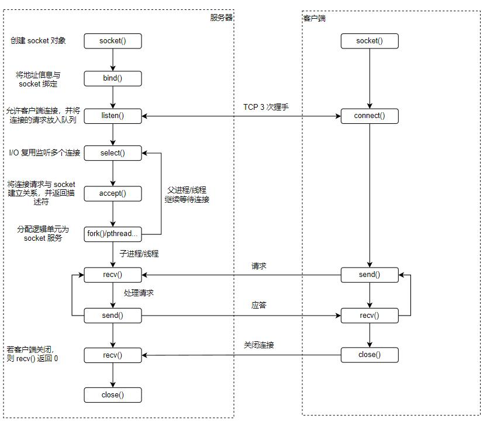
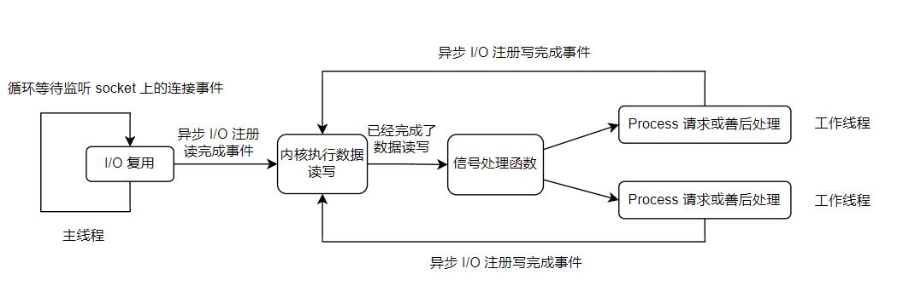
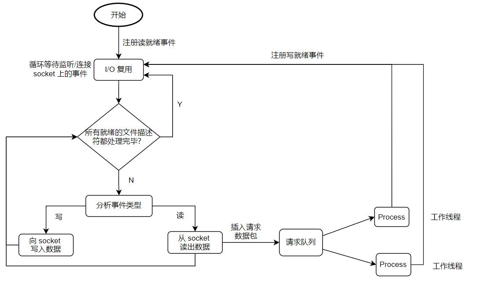
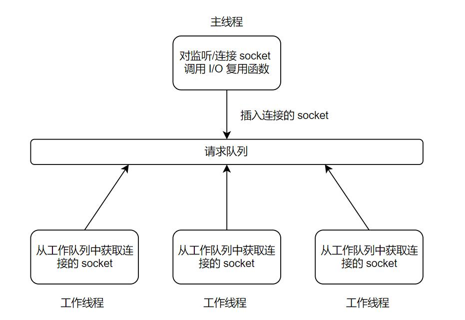
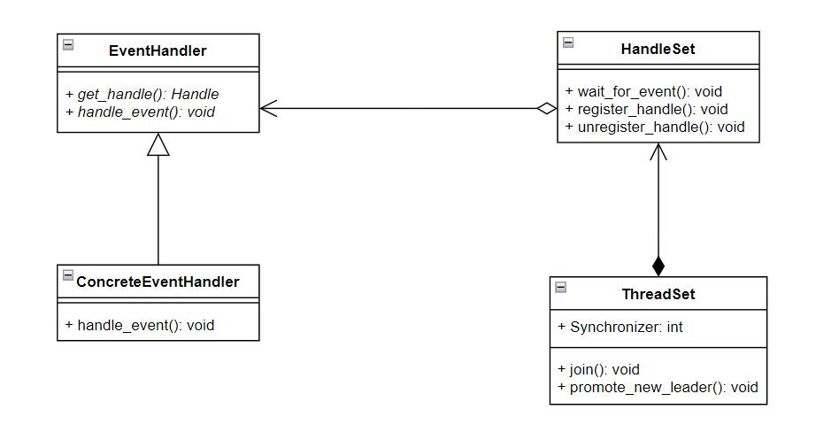
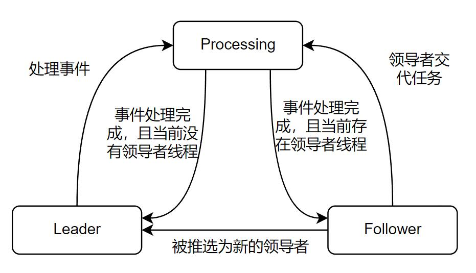
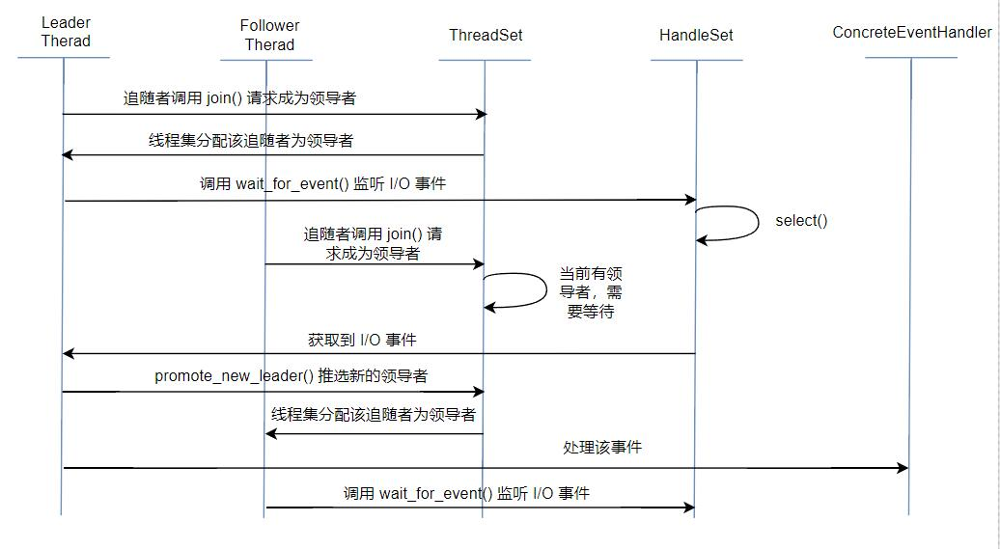

理解服务器是如何区分 I/O 密集型和 CPU 密集型任务的。

<!--more-->

# 服务器模型

## C/S （客户端/服务器）模型

虽然 TCP/IP 协议并没有客户端和服务器的概念，节点之间都是对等的。但由于资源的集中性，最常用的便是 C/S 模型：所有的客户端都通过访问服务器来获取所需资源。

C/S 模型实现起来简单，但其缺点是：当访问量过大时，所有的客户端得到的响应速度都可能慢下来。

## P2P （点对点）模型

P2P（Peer to Peer, 点对点）模型，使得每台机器在消耗服务的同时，也给别人提供服务，所有主机回归对等的地位。

P2P 模型使得资源能够充分、自由地共享，但当用户之间传输的请求过多时，网络的负载将加重。

实际使用的 P2P 模型通常都会带有一个专门的发现服务器，此服务器主要提供查找服务，使得每个客户都能尽快地找到自己需要的资源。

# 服务器编程框架

如上图，服务器各个部件的含义和功能如下表：

| 模块       | 单个服务器程序       | 服务器机群            |
|----------|---------------|------------------|
| I/O 处理单元 | 处理客户连接，读写网络数据 | 作为接入服务器，实现负载均衡   |
| 逻辑单元     | 业务进程或线程       | 逻辑服务器            |
| 网络存储单元   | 本地数据库、文件或缓存   | 数据库服务器           |
| 请求队列     | 各单元之间的通信方式    | 各服务器之间的永久 TCP 连接 |

I/O 处理单元用于管理服务器和客户端之间的连接，主要职责：
- 等待并接收新的客户连接
- 接收客户数据和将服务器响应数据返回给客户端
  + 数据收发也可能在逻辑单元中执行
- 对于机群来说，I/O 处理单元就是一个专门的接入服务器，实现负载均衡，从所有逻辑服务器中选取负荷最小的一台来服务客户。

逻辑单元通常是一个进程或线程，它分析并处理客户数据，然后将结果传递给 I/O 处理单元或直接发送给客户端。对机群来说，一个逻辑单元就是一台逻辑服务器。

网络存储单元可以是数据库、缓存、文件、服务器，但不是所有的服务都需要存储功能。

请求队列是各个单元之间通信方式的抽象。请求队列通常被实现为池的一部分。对于服务机群而言，请求队列是各台服务器之间预先建立的、静态的、永久的 TCP 连接。

# I/O 模型

I/O 分为阻塞和非阻塞，非阻塞只有在事件已经发生的情况下操作才能提高程序效率（否则就是不断的查询，也消耗 CPU 资源），需要配合 I/O 复用和 SIGIO 信号。
- I/O 复用函数有 select、poll、epoll_wait，它们本身是阻塞的，但它们具有同时监听多个 I/O 事件的能力
- 将 SIGIO 信号与宿主进程绑定，当事件发生时，对应的信号处理函数被触发，就可以对相应目标文件执行非阻塞 I/O 操作了

阻塞 I/O、I/O 复用和 SIGIO 都是同步 I/O 模型，**因为它们都是在 I/O 事件发生之后再执行相应的读写操作，读写操作真正发生在用户空间。**

对异步 I/O 而言，用户可以提前将 I/O 操作的缓存告知内核，内核待时机一到便执行相应的 I/O 操作，然后通知用户空间操作完成，**读写操作真正发生在内核空间。**

# 事件处理模式

服务器程序通常需要处理三类事件：I/O 事件、信号及定时事件。

对应事件有两种高效处理模式： Reactor 和 Proactor。
- 同步 I/O 模型通常用于实现 Reactor 模式
- 异步 I/O 模型通常用于实现 Proactor 模式

## Reactor 模式

Reactor 模式要求主线程（I/O 处理单元）只负责监听文件描述符上是否有事件发生，有的话就将该事件通知工作线程（逻辑单元）。除此之外，主线程不做其他工作。读写数据、接收新连接以及处理客户请求都在工作线程中完成。

使用同步 I/O 模型实现 Reactor 模式的工作流程是：
1. 主线程向 I/O 复用函数注册 socket 上的读就绪事件
2. 主线程调用 I/O 复用函数等待 socket 上有数据可读
3. 当 socket 上有数据可读时， I/O 复用函数通知主线程，主线程将 socket 可读事件放入请求队列
4. 睡眠在请求队列上的某个工作线程被唤醒，它从 socket 读取数据并处理请求，然后往 I/O 复用函数注册写就绪事件（如果需要返回数据的话）
5. 主线程调用 I/O 复用函数等待 socket 可写
6. 当 socket 可写时，I/O 复用函数通知主线程，主线程将 socket 可写事件放入请求队列
7. 睡眠在请求队列上的某个工作线程被唤醒，它往 socket 上写入服务器处理客户请求的结果

主线程的主要目的就是监听 socket 是否可读可写，然后将对应事件放入请求队列，相当于是 I/O 密集型任务。

工作线程是不用关心 socket 当前是否可读可写的，只要它被唤醒了，那只需要根据事件类型执行相应操作即可，相当于是 CPU 密集型任务。

这种模式就充分利用了 IO 密集型的快速响应特点，也使得处理用户请求的吞吐量上去了。

## Proactor 模式

Proactor 模式将所有的 I/O 操作都交给主线程和内核来处理，工作线程仅仅负责业务逻辑，这种方式看起来更加优雅。

使用异步 I/O 模型实现 Proactor 模式的工作流程是：
1. 主线程调用异步 I/O 函数向内核注册 socket 上的读完成事件，并告诉内核用户读缓冲区的位置，以及读操作完成时如何通知应用程序。
2. 主线程继续处理其他逻辑
3. 当 socket 上的数据被读入用户缓冲区后，内核将向应用程序发送一个信号，以通知应用程序数据已经可用。
4. 应用程序预先定义好的信号处理函数选择一个工作线程来处理客户请求。工作线程处理完客户请求后，调用异步写函数向内核注册 socket 上的写完成事件，并告诉内核用户写缓冲区的位置，以及写操作完成时如何通知应用程序。
5. 主线程继续处理其他逻辑
6. 当用户缓冲区的数据被写入 socket 之后，内核将向应用程序发送一个信号，以通知应用程序数据已经发送完毕。
7. 应用程序预先定义好的信号处理函数选择一个工作线程来做善后处理。

可以看到，这种模式下复用 I/O 仅仅用于监听连接请求，工作线程仅仅用于处理业务，而读写则是由内核来完成。

## 模拟 Proactor 模式

同步 I/O 模拟 Proactor 模式的原理是：主线程执行数据读写操作，读写完成之后，主线程向工作线程通知完成事件。

> 也就是把原来工作线程需要完成的读写工作，移交给了主线程，工作线程就只管处理业务逻辑了。

工作流程如下：
1. 主线程向 I/O 复用函数注册读就绪事件
2. 主线程等待 socket 上有数据可读
3. 当 socket 上有数据可读时， I/O 复用函数通知主线程。主线程从 socket 循环读取数据，直到没有更多数据可读，然后将读取到的数据封装成一个请求对象并插入请求队列
4. 睡眠在请求队列上的某个工作线程被唤醒，它获得请求对象并处理客户请求，然后向 I/O 复用函数注册写就绪事件
5. 主线程等待 socket 可写
6. 当 socket 可写时， I/O 复用通知主线程。主线程往 socket 写入服务器处理客户请求的结果。

可以看到，无论是 reactor 还是 proactor 模式，其主要目的就是为了工作线程不能因为 IO 而被阻塞，它应该尽可能快的完成用户请求。所以 IO 等待处理都由 IO 处理线程或者内核来完成。

# 并发模式

对于服务器而言，并发模式是指 I/O 处理单元和多个逻辑单元之间协调完成任务的方法。

主要有两种并发编程模式：半同步/半异步（half-sync/half-async）模式和领导者/追随者（Leader/Followers）模式。

## 半同步/半异步模式

- 同步：程序完全按照代码序列的顺序执行
- 异步：程序的执行需要由系统事件来驱动，比如中断、信号等

按照同步方式运行的线程称为同步线程，按照异步方式运行的线程称为异步线程，显然异步的吞吐量和 I/O 响应速度都更好。

在对于像服务器这种既要求较好的实时性，又要求能同时处理多个客户请求的应用程序，一般同时使用同步线程和异步线程的方式，称为**半同步/半异步模式**。

如上图所示，半同步/半异步模式中，同步线程用于处理业务逻辑，异步线程处理 I/O 事件。异步线程监听到客户请求后，将其封装为请求对象并插入请求队列。请求队列通知某个同步模式下的工作线程。

半同步/半异步模式加上几种 I/O 模型，就存在多种变体。其中一种就是**半同步/半反应堆（half-sync/half-reactive）模式**。

如上图所示，其工作流程如下：
1. 只有一个主线程作为异步 I/O 线程，首先监听所有 socket 上的事件
2. 当 socket 上有可读事件时，代表有新连接，主线程接受该连接后，向 I/O 复用函数注册读写事件
3. 如果连接的 socket 上有读写事件，主线程将**该连接 socket 插入请求队列中**
4. 工作线程通过竞争（比如申请互斥锁）的方式获取该 socket 后处理（只有空闲线程才可能获取到）。

插入请求队列中的是 socket，也就是说这种处理模式是 Reactor 模式，也就像需要工作线程自己完成读写操作。

半同步/半反应堆模式存在如下缺点：
- 主线程和工作线程共享请求队列：由于共享队列，在主线程和工作线程在操作队列时需要加锁互斥，白白耗费 CPU 时间。
- 每个工作线程在同一时间只能处理一个客户请求。如果客户数量较多而工作线程较少，则会堆积很多任务对象在请求队列中，服务器的响应速度就会很慢。
  + 假设暴力的增加工作线程的数量，那么多个线程的切换也将耗费大量的 CPU 时间。

为此一个优化方案如下：

- 主线程只管监听 socket，对 socket 的连接和读写检查由工作线程来完成
- 主线程可以通过管道的方式向工作线程派发 socket

这样子一个工作线程就可以并发的处理多个客户请求，此时的主线程和工作线程都是异步模式。

## 领导者/追随者模式

领导者/追随者模式是多个工作线程轮流获得事件源集合，轮流监听、分发并处理事件的一种模式。

在任意时间点，程序都仅有一个领导者线程，它负责监听 I/O 事件。而其他线程则都是追随者，它们休眠在线程池中等待成为新的领导者。

当前领导者如果检测到 I/O 事件，首先要从线程池中推选出新的领导者线程，新领导者等待新的 I/O 事件，原来的领导者处理 I/O 事件。

领导者/追随者模式包含如下几个组建：句柄集（HandleSet）、线程集（ThreadSet）、事件处理器（EventHandler）和具体的事件处理器（ConcreteEventHandler）。

### 句柄集

句柄（Handle）用于表示 I/O 资源，在 Linux 下就对应一个文件描述符。

句柄与`EventHandler`进行绑定，也就是该句柄及其对应的处理方式。

句柄集使用 `wait_for_event` 方法监听众多句柄，并将就绪事件通知给领导者线程。

领导者调用绑定到 Handle 上的事件处理器来处理事件（多态），领导者调用句柄集中的 `register_handle` 方法实现 Handle 和事件处理器的绑定。

### 线程集

线程集管理所有工作线程（包括领导者线程和追随者线程），它负责各线程之间的同步以及新领导者线程的推选。

如上图所示，线程集中的线程在任一时间必处于如下三种状态之一：
- Leader：线程当前处于领导者身份，负责等待句柄集上的 I/O 事件
- Processing：线程正在处理事件。领导者检测到 I/O 事件之后，可以转移到 Processing 状态来处理事件，并调用 `promote_new_leader()` 方法推选新的领导者。也可以指定其他追随者来处理事件（Event Handoff），此时领导者的地位不变。
  + 当处于 Processing 状态的线程处理完事件之后，如果当前线程集中没有领导者，则它将成为新的领导者，否则它就直接变为追随者。
- Follower：线程当前处于追随者身份，通过调用线程集的 `join()` 方法等待成为新的领导者，也可能被当前的领导者指定来处理新的任务。

领导者线程推选新的领导者和追随者等待成为新的领导者，这两个操作都将修改线程集，所以线程集提供了一个 `Synchronizer` 来同步这两个操作，避免竞态。

### 事件处理器和具体的事件处理器

事件处理器包含一个或多个回调函数 `handle_event()` ，用于处理事件对应的业务逻辑。

事件处理器在使用前需要被绑定到某个句柄上，当句柄上有事件发生时，领导者就执行与之绑定的事件处理器中的回调函数。

具体的事件处理器是事件处理器的派生类，它们必须重新实现基类的 `handle_event` 方法，以处理特定的任务。

最终领导者/追随者模式流程如下图：

可以看到：由于领导者线程自己监听 I/O 并处理客户请求，所以不会像半同步/半反应堆模式那样在线程之间传递数据。但它仅支持一个事件源集合，所以无法让每个工作线程独立地管理多个客户连接。

# 有限状态机

逻辑单元内部的一种高效编程方法就是：有限状态机（finite state machine）。

有限状态机就是根据数据的类型，进行相应的处理，并且根据当前处理的状态在各个状态之间转移的机制。
- 对于 c/c++ 来说，通常使用 `switch` 实现多种状态的散转

# 提高服务器性能

## 池

池（pool）是一组资源的集合，在服务器启动之初就被完全创建好并初始化，这称为静态资源分配。
- 当处理客户请求时，客户如果需要池含有的资源，那么直接获取即可，无需动态分配
- 当不需要资源时，可以将资源放回池中

这种机制避免了申请和释放资源操作的系统调用，避免服务器对内核的频繁访问，提高效率。

池资源的预先分配原则是：先分配一些资源，当剩余资源不够用时再申请一大块资源放入池中。

常见的池有内存池、进程池、线程池、连接池：
- 内存池通常用于 socket 的接收和发送缓存
- 进程池和线程池用于处理用户请求，需要的时候直接从池中取得执行实体，而不用动态调用 `fork()` 或 `pthread_create()` 
- 连接池通常用于服务器或服务器机群的内部永久连接。
  + 比如服务端需要向内部数据库获取数据，那么可以从连接池中取得连接实体即可

## 数据复制

在用户态中内存的复制和用户态到内核态内存的复制都是比较耗时的，在设计是应该尽量避免低效的内存拷贝。
  
## 上下文切换和锁

进程和线程的切换从业务逻辑上来讲属于无用功，要根据当前 CPU 数量来合理的配置进程和线程数。
- 频繁的切换除了上下文的开销，还有 cache miss 开销，对于进程而言还有页表建立的开销
- 对于工作线程，是 CPU 密集型任务时，为了能够处理多个客户端，协程是个不错的选择

要尽量避免锁的存在，等待获取锁时系统的吞吐量会下降。
- 半同步/半异步模式是一种比较合理的解决方案。