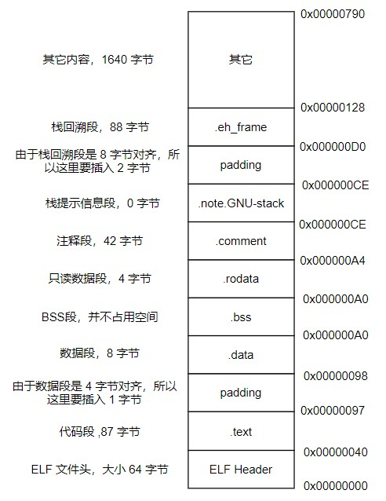
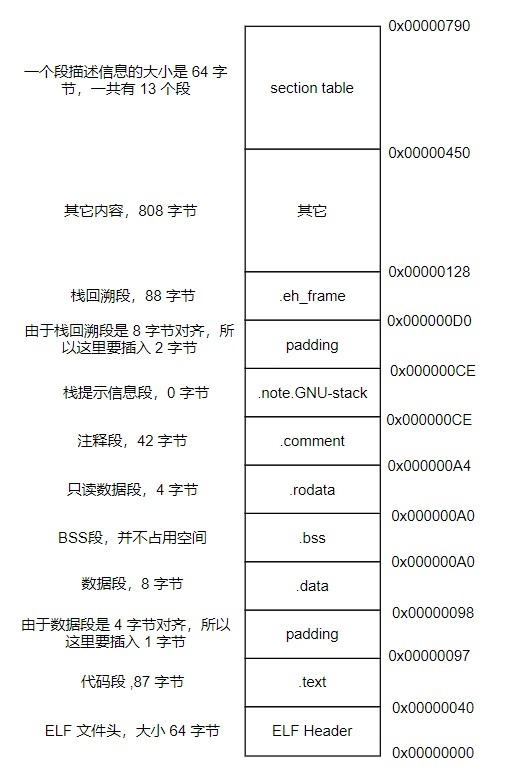
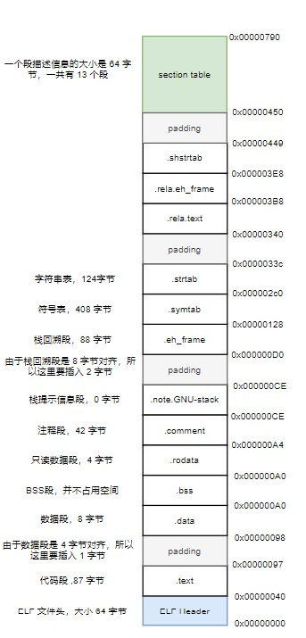

认识目标文件。
<!--more-->

# 目标文件格式概览
PC 平台流行的**可执行文件格式（Executable）** 主要是 Windows 下的 PE(Portable Executable) 和 Linux 的 ELF(Executable Linkable Format)，它们都是 COFF(Common file format)格式的变种。目标文件和可执行文件的格式是一样的，**动态链接库（DLL, Dynamic Linking Library）和静态链接库（Static Linking Library）**都按照可执行文件格式存储。

| ELF文件类型            | 说明      | 实例                        |
|---------------------------------|--------------|
| 可重定位文件(Relocatable File)   | 这类文件包含了代码和数据，可以被用来链接成可执行文件或共享目标文件，静态链接库也可以归为这一类  | Linux 的 .o Windows 的 .obj |
| 可执行文件(Executable File)| 这类文件包含了可以直接执行的程序，它的代表就是ELF可执行文件，一般都没有扩展名 | /bin/bash windows 的 .exe   |
| 共享目标文件(Shared Object File) | 这种文件包含库代码和数据，可以在以下两种情况下使用。一种是链接器可以使用这种文件跟其他的可重定位文件和共享目标文件链接，产生新的目标文件。第二种是动态连接器可以将几个这种共享目标文件与可执行文件结合，作为进程映像的一部分来运行 | Linux 的 .so Windows 的 DLL |
| 核心转储文件(Core Dump File)     | 当进程意外中止时,系统可以将进程的地址空间的内容以及终止时的一些其他信息转储到核心转储文件 | Linux 下的 core dump  |

在linux下可以使用`file`命令查看相应的文件格式。

在目标文件中，除了基本的代码和数据外，还包括了符号表、调试信息、字符串等内容。
这些信息以节（Section）或段（Segment）的形式存储。

分段的好处如下：
1. 数据和指令分别被映射到两个虚存区域，数据区被设置为可读写，指令区被设置为只读,可以防止程序指令被有意或无意的改写。
2. 由于 CPU 的缓存体系，分段有利于提高程序的局部性，提高缓存的命中率。
3. 当系统中运行着多个该程序的副本时，可以共享代码段而区分数据段，节约内存。

# 实例查看目标文件格式
## 查看主要段描述
编译试验代码: `gcc -c SimpleSection.c -o SimpleSection.o`
``` c
  /*
   ,* SimpleSection.c
   ,*
   ,* Linux:
   ,*   gcc -c SimpleSection.c
   ,*
   ,* Windows:
   ,*   cl SimpleSectin.c /c /Za
   ,*/

  int printf(const char * format, ...);

  int global_init_var = 84;
  int global_uninit_var;

  void func1(int i)
  {
    printf("%d\n", i);
  }

  int main(void)
  {
    static int static_var = 85;
    static int static_var2;

    int a = 1;
    int b;

    func1(static_var + static_var2 + a + b);

    return a;
  }
```
查看段表描述: `objdump -h SimpleSection.o`
```shell
SimpleSection.o:     file format elf64-x86-64

Sections:
Idx Name          Size      VMA               LMA               File off  Algn
  0 .text         00000057  0000000000000000  0000000000000000  00000040  2**0
                  CONTENTS, ALLOC, LOAD, RELOC, READONLY, CODE
  1 .data         00000008  0000000000000000  0000000000000000  00000098  2**2
                  CONTENTS, ALLOC, LOAD, DATA
  2 .bss          00000004  0000000000000000  0000000000000000  000000a0  2**2
                  ALLOC
  3 .rodata       00000004  0000000000000000  0000000000000000  000000a0  2**0
                  CONTENTS, ALLOC, LOAD, READONLY, DATA
  4 .comment      0000002a  0000000000000000  0000000000000000  000000a4  2**0
                  CONTENTS, READONLY
  5 .note.GNU-stack 00000000  0000000000000000  0000000000000000  000000ce  2**0
                  CONTENTS, READONLY
  6 .eh_frame     00000058  0000000000000000  0000000000000000  000000d0  2**3
                  CONTENTS, ALLOC, LOAD, RELOC, READONLY, DATA
```
上图中:
- size : 段内容大小
- File off : 段内容**相对于文件起始的偏移**
- 第二行表示段的属性
  + CONTENTS : 该段在后面的文件内容中存在（BSS 段没有此属性，表明它不占用后面的内容仅在段表处表明大小即可）

基于以上描述信息，可以得出此文件的结构如下图:


使用 `size` 查看代码段、数据段、bss段长度:
```shell
  cec@ubuntu:~/exercise/linux/linker_loader$ size SimpleSection.o
     text	   data	    bss	    dec	    hex	filename
      179	      8	      4	    191	     bf	SimpleSection.o
```
- 上面的text其实包含了代码段、只读数段、en_frame段之和
## 段内容

接下来查看反汇编：`objdump -s -d SimpleSection.o`
```shell
SimpleSection.o:     file format elf64-x86-64

Contents of section .text:
 0000 554889e5 4883ec10 897dfc8b 45fc89c6  UH..H....}..E...
 0010 488d3d00 000000b8 00000000 e8000000  H.=.............
 0020 0090c9c3 554889e5 4883ec10 c745f801  ....UH..H....E..
 0030 0000008b 15000000 008b0500 00000001  ................
 0040 c28b45f8 01c28b45 fc01d089 c7e80000  ..E....E........
 0050 00008b45 f8c9c3                      ...E...
Contents of section .data:
 0000 54000000 55000000                    T...U...
Contents of section .rodata:
 0000 25640a00                             %d..
Contents of section .comment:
 0000 00474343 3a202855 62756e74 7520372e  .GCC: (Ubuntu 7.
 0010 352e302d 33756275 6e747531 7e31382e  5.0-3ubuntu1~18.
 0020 30342920 372e352e 3000               04) 7.5.0.
Contents of section .eh_frame:
 0000 14000000 00000000 017a5200 01781001  .........zR..x..
 0010 1b0c0708 90010000 1c000000 1c000000  ................
 0020 00000000 24000000 00410e10 8602430d  ....$....A....C.
 0030 065f0c07 08000000 1c000000 3c000000  ._..........<...
 0040 00000000 33000000 00410e10 8602430d  ....3....A....C.
 0050 066e0c07 08000000                    .n......

Disassembly of section .text:

0000000000000000 <func1>:
   0:   55                      push   %rbp
   1:   48 89 e5                mov    %rsp,%rbp
   4:   48 83 ec 10             sub    $0x10,%rsp
   8:   89 7d fc                mov    %edi,-0x4(%rbp)
   b:   8b 45 fc                mov    -0x4(%rbp),%eax
   e:   89 c6                   mov    %eax,%esi
  10:   48 8d 3d 00 00 00 00    lea    0x0(%rip),%rdi        # 17 <func1+0x17>
  17:   b8 00 00 00 00          mov    $0x0,%eax
  1c:   e8 00 00 00 00          callq  21 <func1+0x21>
  21:   90                      nop
  22:   c9                      leaveq
  23:   c3                      retq

0000000000000024 <main>:
  24:   55                      push   %rbp
  25:   48 89 e5                mov    %rsp,%rbp
  28:   48 83 ec 10             sub    $0x10,%rsp
  2c:   c7 45 f8 01 00 00 00    movl   $0x1,-0x8(%rbp)
  33:   8b 15 00 00 00 00       mov    0x0(%rip),%edx        # 39 <main+0x15>
  39:   8b 05 00 00 00 00       mov    0x0(%rip),%eax        # 3f <main+0x1b>
  3f:   01 c2                   add    %eax,%edx
  41:   8b 45 f8                mov    -0x8(%rbp),%eax
  44:   01 c2                   add    %eax,%edx
  46:   8b 45 fc                mov    -0x4(%rbp),%eax
  49:   01 d0                   add    %edx,%eax
  4b:   89 c7                   mov    %eax,%edi
  4d:   e8 00 00 00 00          callq  52 <main+0x2e>
  52:   8b 45 f8                mov    -0x8(%rbp),%eax
  55:   c9                      leaveq
  56:   c3                      retq
```
从上面输出可以看到：
1. 代码段大小确实为 `0x57`
2. 数据段正好为初始化的全局和局部静态变量 `84,85`（并且从其字节序，也可以知道是小端模式）
3. 只读数据段是printf的字符串 "%d\n"

| 常用的段名  | 说明  |
|-------------|------------------------|
| .text       | 代码段   |
| .data       | 保存已经初始化了的**非零**全局变量和局部静态变量   |
| .rodata     | 只读数据段，比如字符串常量等等，单独设立 .rodata 段有很多好处，不光在语义上支持了 C++ 的 const关键字，而且操作系统在加载的时候可以将.rodata 段属性映射成只读，保证程序安全。 |
| .bss        | 存放未初始化的全局变量和局部静态变量， .bss 段保存数量的值，而不是具体值，在最终的链接过程中会分配bss段的空间 |
| .rodata1    | 只读数据与.rodata一样,比如字符串常量,全局 const变量等。 |
| .comment    | 存放的是编译器版本信息,比如字符串 "GCC:(GUN) 4.2.0" |
| .debug      | 调试信息             |
| .dynamic    | 动态链接信息                 |
| .hash       | 符号哈希表            |
| .line       | 调试时的行号表,即源代码行号与编译后指令的对应表      |
| .note       | 额外的编译器信息,比如版本号等等                   |
| .strtab     | 字符串表,用于存储 ELF 文件中用到的各种字符串    |
| .symtab     | 符号表                 |
| .plt .got   | 动态链接的跳转表和全局入口表              |
| .init .fini | 程序初始化与终结代码段       |

这些段的名字都是由 "." 作为前缀，表示这些表的名字是系统保留的,应用程序也可以使用一些非系统保留的名字作为段名。比如可以在 ELF 文件中插入一个 music 的段，里面存放了一首 MP3 音乐，当 ELF 文件运行起来以后可以读取这个段播放这首 MP3。但是应用程序自定义的段名不能使用 `.` 作为前缀，否则容易跟系统保留段名冲突。一个 ELF 文件也可以拥有几个相同段名的段。
##  自定义段和制作段
### 制作段
```shell
  objcopy -I binary -O elf32-i386  -B i386 <input_file> <output_name>.o
```
将文件转换为 i386 执行文件的格式的目标文件
使用:
``` shell
objdump -ht <name>.o
```
即可查看段的起始地址和结束地址，然后在其他模块中使用。
### 自定义段
GCC 提供了一个扩展机制,可以指定变量或函数所处的段：
``` c
/*
  在全局变量或函数前加上 __attribute__((section("name")))
  就可以把相应的变量或函数放到以 "name" 作为段名的段中
 ,*/
__attribute__((section("FOO")))  int global = 42;

__attribute__((section("BAR"))) void foo()
{
}
```
# 分析ELF结构
| 文件格式             | 简要说明                             |
|----------------------|--------------------------------------|
| ELF Header           | 描述整个文件属性                     |
| .text / .code        | 代码段                               |
| .data                | 数据段，已初始化的全局及局部静态变量 |
| .bss                 | 未初始化的全局及局部静态变量         |
| other sections       |                                      |
| section header table | 描述包含所有段的信息                 |
| String Tables        | 字符串表                             |
| Symbol Tables        | 符号表                               |

## ELF Header
可以使用命令 `readelf -h SimpleSection.o` 来查看 ELF 文件.
``` shell
cec@lab:~/lab/c$ readelf -h SimpleSection.o
ELF Header:
  Magic:   7f 45 4c 46 02 01 01 00 00 00 00 00 00 00 00 00
  Class:                             ELF64
  Data:                              2's complement, little endian
  Version:                           1 (current)
  OS/ABI:                            UNIX - System V
  ABI Version:                       0
  Type:                              REL (Relocatable file)
  Machine:                           Advanced Micro Devices X86-64
  Version:                           0x1
  Entry point address:               0x0
  Start of program headers:          0 (bytes into file)
  Start of section headers:          1104 (bytes into file)
  Flags:                             0x0
  Size of this header:               64 (bytes)
  Size of program headers:           0 (bytes)
  Number of program headers:         0
  Size of section headers:           64 (bytes)
  Number of section headers:         13
  Section header string table index: 12
```
ELF 的文件头中定义了**ELF 魔数**， **文件机器字节长度**，**数据存储方式**，**版本**，**运行平台**，**ABI版本**，**ELF重定位类型**，**硬件平台**，**硬件平台版本**，**入口地址**，**程序头入口和长度**，**段表位置**,**长度及段的数量**。
- 头的大小是64字节，与前面代码段的偏移是0x40正好对应上。
## ELF头的数据结构
ELF 文件头结构及相关常数被定义在 `/usr/include/elf.h` 文件里, 
结构体 `Elf32_Ehdr` 或`Elf64_Ehdr` 对应着 readelf 文件输出.
``` c
  typedef struct
  {
    unsigned char	e_ident[EI_NIDENT];	/* Magic number and other info */
    Elf64_Half	e_type;			/* Object file type */
    Elf64_Half	e_machine;		/* Architecture */
    Elf64_Word	e_version;		/* Object file version */
    Elf64_Addr	e_entry;		/* Entry point virtual address */
    Elf64_Off	e_phoff;		/* Program header table file offset */
    Elf64_Off	e_shoff;		/* Section header table file offset */
    Elf64_Word	e_flags;		/* Processor-specific flags */
    Elf64_Half	e_ehsize;		/* ELF header size in bytes */
    Elf64_Half	e_phentsize;		/* Program header table entry size */
    Elf64_Half	e_phnum;		/* Program header table entry count */
    Elf64_Half	e_shentsize;		/* Section header table entry size */
    Elf64_Half	e_shnum;		/* Section header table entry count */
    Elf64_Half	e_shstrndx;		/* Section header string table index */
  } Elf64_Ehdr;
```
- 魔数:用于操作系统确认是否加载， 16字节正好对应 `e_dent[]` 数组内容， elf 文件头魔数最开始的 4个字节是所有 ELF 文件都必须相同的表示码,分别为 `0x7f,0x45,0x4c,0x46`。
  + 第一个字节对应 ASCII 字符里面的 DEL 控制符， 后面3字节刚好是 ELF 这3个字母的 ASCII 码。这 4 个字节又被称为 ELF 文件的魔数。
  + 接下来的字节分别用来标识 ELF 的文件类型，字节序，主版本号。后面的9个字节ELF标准没有定义，一般填 0，有些平台会使用这 9 个字节作为扩展标志。
- e_type 文件类型 : linux 通过此值来判断 ELF 的真正文件类型,而不是通过文件的扩展名.
| 常量    | 值 | 含义                         |
|--------|----|------------------------------|
| ET_REL  |  1 | 可重定位文件,一般为 .o 文件  |
| ET_EXEC |  2 | 可执行文件                   |
| ET_DYN  |  3 | 共享目标文件,一般为 .so 文件 |
-  e_machine : 表示当前 ELF 文件在哪种机器平台下使用 
## Section Header Table 段表
段表是 ELF 文件中除了文件头以外最重要的结构,它描述了 ELF 的各个段的信息。
ELF 文件的段结构就是由段表决定的，编译器，链接器和装载器都是依靠段表来定位和访问各个段的属性。
段表在 ELF 文件中的位置由 ELF 文件头的 `e_shoff` 成员决定。

从 ELF 头的描述可以进一步得出该文件的结构如下：


使用命令 `readelf -S hello.o` 来显示完整的段表。
``` shell
cec@lab:~/lab/c$ readelf -S SimpleSection.o
There are 13 section headers, starting at offset 0x450:

Section Headers:
  [Nr] Name              Type             Address           Offset
       Size              EntSize          Flags  Link  Info  Align
  [ 0]                   NULL             0000000000000000  00000000
       0000000000000000  0000000000000000           0     0     0
  [ 1] .text             PROGBITS         0000000000000000  00000040
       0000000000000057  0000000000000000  AX       0     0     1
  [ 2] .rela.text        RELA             0000000000000000  00000340
       0000000000000078  0000000000000018   I      10     1     8
  [ 3] .data             PROGBITS         0000000000000000  00000098
       0000000000000008  0000000000000000  WA       0     0     4
  [ 4] .bss              NOBITS           0000000000000000  000000a0
       0000000000000004  0000000000000000  WA       0     0     4
  [ 5] .rodata           PROGBITS         0000000000000000  000000a0
       0000000000000004  0000000000000000   A       0     0     1
  [ 6] .comment          PROGBITS         0000000000000000  000000a4
       000000000000002a  0000000000000001  MS       0     0     1
  [ 7] .note.GNU-stack   PROGBITS         0000000000000000  000000ce
       0000000000000000  0000000000000000           0     0     1
  [ 8] .eh_frame         PROGBITS         0000000000000000  000000d0
       0000000000000058  0000000000000000   A       0     0     8
  [ 9] .rela.eh_frame    RELA             0000000000000000  000003b8
       0000000000000030  0000000000000018   I      10     8     8
  [10] .symtab           SYMTAB           0000000000000000  00000128
       0000000000000198  0000000000000018          11    11     8
  [11] .strtab           STRTAB           0000000000000000  000002c0
       000000000000007c  0000000000000000           0     0     1
  [12] .shstrtab         STRTAB           0000000000000000  000003e8
       0000000000000061  0000000000000000           0     0     1
Key to Flags:
  W (write), A (alloc), X (execute), M (merge), S (strings), I (info),
  L (link order), O (extra OS processing required), G (group), T (TLS),
  C (compressed), x (unknown), o (OS specific), E (exclude),
  l (large), p (processor specific)

```
段表的结构比较简单,它是一个以 `Elf32/64_Shdr` 结构体为元素的数组，数组元素的个数等于段的个数，每个 `Elf32/64_Shdr` 结构对应一个段。所以 `Elf32/64_Shdr` 又被称为段描述符。ELF 段表的这个数组第一个元素是无效的段描述符，它的类型为"NULL"，除此之外每个段描述符都对应一个段。
``` c
  typedef struct
  {
    Elf64_Word	sh_name;		/* Section name (string tbl index) */
    Elf64_Word	sh_type;		/* Section type */
    Elf64_Xword	sh_flags;		/* Section flags */
    Elf64_Addr	sh_addr;		/* Section virtual addr at execution */
    Elf64_Off	sh_offset;		/* Section file offset */
    Elf64_Xword	sh_size;		/* Section size in bytes */
    Elf64_Word	sh_link;		/* Link to another section */
    Elf64_Word	sh_info;		/* Additional section information */
    Elf64_Xword	sh_addralign;		/* Section alignment */
    Elf64_Xword	sh_entsize;		/* Entry size if section holds table */
  } Elf64_Shdr;
```
由此可以得到文件全局视图：

- 文件的大小正好完全吻合

段的名字不能真正的表示段的类型，对于编译器和链接器来说，主要决定段的属性的是段的类型（sh_type）和段的标志位（sh_flags），段的类型相关常量以 `SHT_` 开头。
| 常量         | 值 | 含义                              |
|--------------|----|-----------------------------------|
| SHT_NULL     |  0 | 无效段                            |
| SHT_PROGBITS |  1 | 程序段，代码段，数据段都是这种类型 |
| SHT_SYMTAB   |  2 | 符号表                            |
| SHT_STRTAB   |  3 | 字符串表                          |
| SHT_RELA     |  4 | 重定位表                          |
| SHT_HASH     |  5 | 符号表的哈希表                    |
| SHT_DYNMAIC  |  6 | 动态链接信息                      |
| SHT_NOTE     |  7 | 提示信息                          |
| SHT_NOTEBITS |  8 | 表示该段在文件中没有内容，比如 .bss 段 |
| SHT_REL      |  9 | 重定位信息                            |
| SHT_SHLIB    | 10 | 保留                                  |
| SHT_DNYSYM   | 11 | 动态链接符号表                               |

段的标志位表示该段在进程虚拟地址空间中的属性，比如是否可写，可执行。相关常量以 `SHF_` 开头。
| 常量          | 值 | 含义                                               |
|---------------|----|------------------------|
| SHF_WRITE     |  1 | 可写                     |
| SHF_ALLOC     |  2 | 在进程空间中需要分配空间。比如代码段，数据段，.bss 段 |
| SHF_EXECINSTR |  4 | 可执行，一般指代码段                             |

`sh_link , sh_info` 代表段的链接信息。

| sh_type| sh_link  |   sh_info |
|-----------------------|--------------------|------------------------|
| SHT_DYNAMIC           | 该段所使用的字符串表在段表中的下标   |     0 |
| SHT_HASH              | 该段所使用的符号表在段表中的下标     |      0 |
| SH_REL , SH_RELA      | 该段所使用的相应符号表在段表中的下标 | 该重定位表所作用的段在段表中的下标 |
| SHT_SYMTAB,SHT_DYNSYM | 操作系统相关的      |    操作系统相关的 |
| other     | SHN_UNDEF                            | 0         |
## Relocation Table(重定位表)
链接器在处理目标文件时，需要对目标文件中某些部位进行重定位，即代码段和数据段中哪些绝对地址的引用位置。
这些重定位的信息都记录在 ELF 文件的重定位表里面，对于每个需要重定位的代码段或数据段，都会有一个相应的重定位表。
比如 ".rela.text" 就是针对 ".text" 段的重定位表。
## String Table(字符串表)
代码中的符号（函数名、变量名等）是被集中放到一个表，然后使用字符串在表中的偏移再引用字符串。
通过这种方法，在ELF 文件中引用字符串只需给出数字下标即可，不用考虑字符串长度的问题。
一般字符串表在 ELF 文件中也以段的形式保存，常见的段名为 `.strtab` 或 `.shstrtab `。
这两个字符串表分别为 **字符串表(String Table)** 和 **段表字符串表(Section Header String Table)**。
字符串表用来保存符号表中的字符串，段表字符串用来保存段表中用到的字符串(比如段名)。
- 实际代码中用到的字符串是存放于只读数据段(.rodata)中的!
# 链接的接口--符号
在链接中，目标文件之间的相互拼合实际上是目标文件之间对地址的引用， 即对函数和变量的地址的引用。
在链接中，我们将函数和变量统称为**符号(Symbol)**，函数名和变量名就是**符号名(Symbol Name)**。

我们可以将符号看作是链接中的粘合剂，整个链接过程正是基于符号才能够正确完成。
链接过程中很关键的一部分就是符号的管理，每一个目标文件都会有一个相应的**符号表(Symbol Table)**，这个表里面记录了目标文件中所用到的所有符号。

每个定义的符号有一个对应的值，叫做符号值，对于变量和函数来说，符号值就是它们的地址。

除了函数和变量之外，还存在其他几种不常用到的符号。将符号表中所有的符号进行分类，它们有可能是下面这些类型中的一种：
- 定义在本目标文件的全局符号，可以被其他目标文件引用。比如函数名、全局变量名。
- 在本目标文件中引用的全局符号，却没有定义在本目标文件，这一般叫做**外部符号(External Symbol)**，也就是符号引用。比如外部函数名，外部变量名。
- 段名，这种符号由编译器产生，它的值就是该段的起始地址。
- 局部符号，这类符号只在编译单元内部可见。比如局部变量、内部静态变量、内部全局变量。调试器可以使用这些符号来分析程序或崩溃时的核心转储文件
  + 这些局部符号对于链接过程没有作用，链接器往往也忽略它们。
- 行号信息，即目标文件指令与与源代码中代码行的对应关系，它也是可选的。

链接过程中，最需要关心的就是全局符号的相互粘合， 局部符号、段名、行号等都是次要的，它们 **对于其他目标文件来说是不可见的**，在链接过程中也是无关紧要的。

符号表的查看使用命令 `readelf -s SimpleSection.o`
``` shell
Symbol table '.symtab' contains 17 entries:
   Num:    Value          Size Type    Bind   Vis      Ndx Name
     0: 0000000000000000     0 NOTYPE  LOCAL  DEFAULT  UND
     1: 0000000000000000     0 FILE    LOCAL  DEFAULT  ABS SimpleSection.c
     2: 0000000000000000     0 SECTION LOCAL  DEFAULT    1
     3: 0000000000000000     0 SECTION LOCAL  DEFAULT    3
     4: 0000000000000000     0 SECTION LOCAL  DEFAULT    4
     5: 0000000000000000     0 SECTION LOCAL  DEFAULT    5
     6: 0000000000000004     4 OBJECT  LOCAL  DEFAULT    3 static_var.1802
     7: 0000000000000000     4 OBJECT  LOCAL  DEFAULT    4 static_var2.1803
     8: 0000000000000000     0 SECTION LOCAL  DEFAULT    7
     9: 0000000000000000     0 SECTION LOCAL  DEFAULT    8
    10: 0000000000000000     0 SECTION LOCAL  DEFAULT    6
    11: 0000000000000000     4 OBJECT  GLOBAL DEFAULT    3 global_init_var
    12: 0000000000000004     4 OBJECT  GLOBAL DEFAULT  COM global_uninit_var
    13: 0000000000000000    36 FUNC    GLOBAL DEFAULT    1 func1
    14: 0000000000000000     0 NOTYPE  GLOBAL DEFAULT  UND _GLOBAL_OFFSET_TABLE_
    15: 0000000000000000     0 NOTYPE  GLOBAL DEFAULT  UND printf
    16: 0000000000000024    51 FUNC    GLOBAL DEFAULT    1 main
```
## 符号表的结构
符号表往往是文件中的一个段，段名一般叫`.symtab`,它是由  `Elf32/64_Sym` 结构组成的数组，每个结构对应一个符号。
``` c
  typedef struct
  {
    Elf64_Word	st_name;		/* Symbol name (string tbl index) */
    unsigned char	st_info;		/* Symbol type and binding */
    unsigned char st_other;		/* Symbol visibility */
    Elf64_Section	st_shndx;		/* Section index */
    Elf64_Addr	st_value;		/* Symbol value */
    Elf64_Xword	st_size;		/* Symbol size */
  } 
```
对于此结构的部分元素作说明:
### st_info(符号类型和绑定信息)
低 4 位表示符号类型(Symbol Type)，高 4 位表示符号绑定信息(Symbol Binding)。

- 符号绑定信息
| 宏定义名   | 值 | 说明                              |
|------------|----|-----------------------------------|
| STB_LOCAL  |  0 | 局部符号,对于目标文件的外部不可见 |
| STB_GLOBAL |  1 | 全局符号,外部可见                 |
| STB_WEAK   |  2 | 弱引用                            |

- 符号类型
| 宏定义名    | 值 | 说明                                                                                                           |
|-------------|----|----------------------------------|
| STT_NOTYPE  |  0 | 未知类型符号                           |
| STT_OBJECT  |  1 | 该符号是个数据对象,比如变量,数组等         |
| STT_FUNC    |  2 | 该符号是个函数或其他可执行代码         |
| STT_SECTION |  3 | 该符号表示一个段,这种符号必须是 STB_LOCAL 的     |
| STT_FILE    |  4 | 该符号表示文件名,一般都是该目标文件所对应的源文件名,它一定是 STB_LOCAL 类型的,并且它的 st_shndx 一定是 SHN_ABS |
### st_shndx(符号所在段)
如果符号定义在本目标文件中，那么这个成员表示符号所在的段在段表中的下标。但是如果符号不是定义在本目标文件中，或者对于有些特殊符号，如下所示：

| 宏定义名   |     值 | 说明                                                                               |
|------------|--------|---------------------------|
| SHN_ABS    | 0xfff1 | 表示该符号包含了一个绝对值,比如表示文件名的符号就属于这种类型                      |
| SHN_COMMON | 0xfff2 | 表示该符号是一个 COMMON 块类型的符号,一般来说未初始化的全局符号定义就是这种类型的, |
| SHN_UNDEF  |      0 | 表示该符号未定义,这个符号表示该符号在本目标文件被引用到,但是定义在其他目标文件中   |
### st_value(符号值)
- 在目标文件中，如果是符号的定义并且该符号不是 "COMMON块"类型的，则表示该符号在段中的偏移。
即符号所对应的函数或变量位于由 `st_shndx` 指定的段，偏移 `st_value` 的位置，
- 在目标文件中，如果符号是 "COMMON块"类型的，则 `st_value` 表示该符号的对齐属性。
- 在可执行文件中，表示符号的虚拟地址。
## 特殊符号
有些符号并没有在程序中定义，但是在链接脚本中定义了，所以在程序中依然可以使用。
**这些值在最终链接成可执行文件的时候将解析为正确的值**。
- `__executable_start` 程序的起始地址，**不是入口地址**，是程序最开始的虚拟地址
- `__etext` or `_etext` or `etext`  代码段最末尾的虚拟地址
-` _edata` or `edata` 数据段最末尾的虚拟地址
-` _end` or `end` 程序虚拟结束地址
  

使用如下代码测试:
``` c
  #include <stdio.h>

  extern char __executable_start[];
  extern char etext[], _etext[], __etext[];
  extern char edata[], _edata[];
  extern char end[], _end[];

  int main()
  {
    printf("executable start %p\n", __executable_start);
    printf("text end %p %p %p\n", etext, _etext, __etext);
    printf("data end %p %p\n", edata, _edata);
    printf("executable end %p %p\n", end, _end);

    return 0;
  }
```
``` shell
executable start 0x563831f28000
text end 0x563831f2875d 0x563831f2875d 0x563831f2875d
data end 0x563832129010 0x563832129010
executable end 0x563832129018 0x563832129018
```
## 符号修饰与函数签名
为了避免用户写的代码中符号与库文件中符号名称有所冲突， UNIX下的 C 语言规定，C 语言源代码文件中的所有全局变量和函数经过编译后，相对应的符号名前加上下划线`_`。
而 fortan 语言的源代码经过编译后的符号名前后都要加上下划线 `_`。在现在的 Linux下的 GCC 编译器中，默认情况下已经去掉了C的下划线，但是 Windows 还保持这样的传统。
GCC 编译器可以通过参数选项 `-fleading-underscore` 或 `-fno-leading-underscore` 来打开和关闭是否在 C 语言加下划线。
### C++ 符号修饰
为了支持 C++ 的特性, 发明了**符号修饰(Name Decoration)或符号改编(Name Mangling)**的机制。

函数签名包含了一个函数的信息，包括函数名，它的参数类型，它所在的类和名称空间及其他信息。函数签名用于识别不同的函数,就像签名用于识别不同的人一样，函数的名字只是函数签名的一部分。

在编译器及连接器处理符号时，它们使用某种**名称修饰**的方法，使得函数签名对应一个**修饰后名称(Decorated Name)**。编译器在将 C++ 源代码编译成目标文件时，会将函数和变量的名字
进行修饰，形成符号名，所以不会有重复的名字。

GCC 的基本 C++ 名称修饰方法如下“所有的符号都以 `_Z`开头，对于嵌套的名字，后面紧跟 `N`，然后是各个名称空间和类的名字，每个名字前是名字字符串的长度，再以 `E` 结尾。
比如 N::C::func 经过修饰后就是 `_ZN1N1C4funcE`。 对于一个函数来说，它的参数列表紧跟在 `E` 后面，对于 int 类型来说， 就是字母`i`。所以以整个 N::C::func(int) 函数签名经过修饰为 `_ZN1N1C4funcEi`。binutils 里面提供了一个叫 `c++filt` 的工具可以用来解析被修饰过的名称，比如 `c++filt _ZN1N1C4funcEi`。

签名和名称修饰机制不光被使用到函数上，C++中的全局变量和静态变量也有同样的机制。对于全局变量来说，它跟函数一样都是一个全局可见的名称，它也遵循上面的名称修饰机制。**值得注意的是**，变量的类型并没有被加入到修饰后的名称中，所以不论这个变量是整形还是浮点型甚至是一个全局对象，它的名称都是一样的。名称修饰机制也被用来防止静态变量的名字冲突。

不同的编译器厂商的名称修饰方法可能不同，所以不同的编译器对于同一个函数签名可能对应不同的修饰后名称。
### extern "C"
c++代码中有可能会引用到 c 语言所提供的库函数，如果以 c++ 的规则来修饰函数，那么到最终的链接过程便无法成功链接到 C 的库函数中，导致编译失败。
通过使用 `extern "C"` 关键字用法，提醒编译器以 c 的规则来修饰。同时为了让一个头文件可以同时被 c 和 c++调用,需要使用 `__cplusplus` 宏来区分.
``` C
#ifdef __cplusplus
extern "C" {
#endif
        void *memset(void *, int, size_t);
#ifdef __cplusplus
}
#endif
```
### 弱符号与强符号
当使用强符号时（Strong Symbol），如果多个目标文件含有相同名字的全局符号定义，那么这些目标文件在链接的时候就会出现符号重复定义的错误。

对于c/c++来说，编译器默认函数和初始化了的全局变量为强符号，未初始化的全局变量为弱符号，也可以通过gcc 的`__attribute__((weak))` 来定义一个强符号为弱符号。
``` c
//既不是强符号，也不是弱符号，因为它是外部变量引用
extern int ext;

//弱符号
int weak;
//强符号
int strong = 1;
//弱符号
__attribute__((weak)) weak2 = 2;

//强符号
int main()
{
        return 0;
}
```
链接器按照下面的规则处理与选择被多次定义的全局符号：
- 不允许强符号被多次定义，否则报错
- 如果一个符号在某个目标文件中是强符号，在其他文件中都是弱符号，那么选择强符号
- 如果一个符号在所有目标文件中都是弱符号，那么选择其中占用空间最大的一个。

对外部目标文件的引用在目标文件链接时，如果没有找到符号定义，链接器就会报错，这种被称为 **强引用(Strong Reference)**。

在处理**弱引用(Weak Reference)**时，如果符号没有被定义则不会报错，将其值默认为0。

在gcc中使用 `__attribute__((weakref))` 来声明对一个外部函数的引用为弱引用。
``` c
__attribute__((weakref)) void foo();

int main()
{
        if(foo) foo();
}
```
  这种弱符号和弱引用对于库来说十分有用，比如库定义的弱符号可以被用户定义的强符号所覆盖，从而使得程序可以使用自定义版本的库函数。
  或者程序可以对某些扩展功能模块的引用定义为弱引用，当我们将扩展模块与程序链接在一起时，功能模块就可以正常使用。
  如果我们去掉了某些功能模块，那么程序也可以正常链接，只是缺少了相应的功能，这使得程序的功能更加容易裁剪和组合。
## 调试信息
调试信息包含了源代码与目标代码之间的关系，比如行数，函数，变量的一一对应关系。

在GCC编译时加上 -g 参数就会增加调试信息到目标文件中。目标代码会生成很多 debug 段。

在linux中，使用 `strip` 命令去掉目标代码的调试信息：
``` shell
strip foo
```
